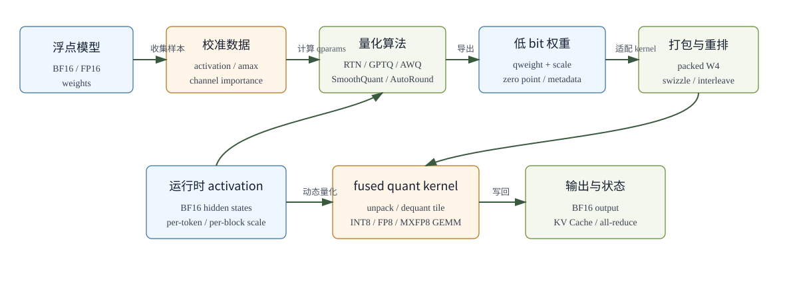

# Quantization

**简体中文** | [English](../../../en/ai-infra-basic/Quantization/README.md)

量化是把模型中的浮点数据换成更低 bit 的表示，并在尽量少损失质量的前提下降低显存、带宽和计算成本。它不只是“把 FP16 变成 INT4”这么简单，还包括 scale/zero point、校准、打包、kernel 布局、KV Cache dtype、activation 动态量化、FP8/MXFP8、MoE expert 权重、tensor parallel 分片等一整套运行时协议。

## 学习顺序

| 顺序 | 文件 | 重点问题 |
|---|---|---|
| 1 | [01-quantization-foundations.md](./01-quantization-foundations.md) | 什么是量化、scale/zero point 怎么来、per-tensor/per-channel/per-group/per-token 有什么区别 |
| 2 | [02-bitwidth-formats-and-packing.md](./02-bitwidth-formats-and-packing.md) | W4A16、W8A8、W4A4C8-MXFP8、FP8、MXFP8、packed W4 到底是什么意思 |
| 3 | [03-weight-quantization-algorithms.md](./03-weight-quantization-algorithms.md) | RTN、GPTQ、AWQ、SmoothQuant、AutoRound、HQQ、NF4/QLoRA 的原理和适用场景 |
| 4 | [04-activation-kv-fp8-quantization.md](./04-activation-kv-fp8-quantization.md) | activation 和 KV Cache 为什么更难量化，动态 scale、FP8、MXFP8 如何落地 |
| 5 | [05-serving-kernel-and-debugging.md](./05-serving-kernel-and-debugging.md) | 从 checkpoint 到 fused GEMM 的数据流、packed tensor 分片、性能与质量排查 |

## 一张总览图

## 先建立几个核心判断

| 问题 | 判断 |
|---|---|
| 量化一定更快吗 | 不一定。只有当硬件和 kernel 能直接消费低 bit 格式，或者 fused dequant 的收益大于额外开销时才会更快。 |
| INT4 权重是不是直接用 4-bit dtype 存 | 通常不是。常见做法是把两个 4-bit 值打包到一个 `uint8`，或把八个 4-bit 值打包到一个 `int32` 容器里。 |
| `W4A4C8` 中的 `C8` 是什么 | 在 msModelSlim 等命名规范中，`C` 表示 KV Cache bit 数，因此 `W4A4C8` 是权重 4-bit、激活 4-bit、KV Cache 8-bit。其他框架若使用不同含义，需要以其 quant config 为准。 |
| `MXFP8` 是不是单独一种普通 FP8 | 不是。MXFP8 是 microscaling FP8：FP8 元素配合局部 block scale，常见 block size 是 32。 |
| 权重量化和 KV Cache 量化哪个更敏感 | 通常 KV Cache 更容易影响长上下文稳定性，因为 decode 每步都会反复读取历史 K/V，误差会持续进入 attention。 |

## 常见量化对象

| 对象 | 常见格式 | 主要收益 | 主要风险 |
|---|---|---|---|
| Weight | INT8、INT4、FP8、FP4、NF4、GPTQ、AWQ | 降低模型常驻显存和权重读取带宽 | 精度下降、loader 和 kernel 强绑定 |
| Activation | INT8、INT4、FP8、MXFP8 | GEMM 输入带宽更低，支持低精度 tensor core | outlier 敏感，需要校准或动态 scale |
| KV Cache | FP8、INT8、MXFP8 | 长上下文显存显著下降 | attention logit 误差累积，prefix cache/transfer dtype 更复杂 |
| MoE experts | W4A16、W4A8、W8A8、MXFP4/MXFP8 | expert 参数巨大，低 bit 收益明显 | expert 路由、padding、EP/TP 分片和 scale 布局复杂 |
| 通信张量 | quant all-reduce、FP8 communication | 多卡通信带宽降低 | all-reduce 前后误差、同步和反量化开销 |
| LoRA base | QLoRA、量化 base + BF16 LoRA | 微调和多 adapter serving 显存下降 | base 与 adapter 的 compute dtype、merge 和保存格式复杂 |

## 参考资料

- [GPTQ: Accurate Post-Training Quantization for Generative Pre-trained Transformers](https://arxiv.org/abs/2210.17323)
- [SmoothQuant: Accurate and Efficient Post-Training Quantization for Large Language Models](https://arxiv.org/abs/2211.10438)
- [AWQ: Activation-aware Weight Quantization for LLM Compression and Acceleration](https://arxiv.org/abs/2306.00978)
- [QLoRA: Efficient Finetuning of Quantized LLMs](https://arxiv.org/abs/2305.14314)
- [AutoRound/SignRound: Optimize Weight Rounding via Signed Gradient Descent](https://arxiv.org/abs/2309.05516)
- [NVIDIA Transformer Engine: MXFP8](https://docs.nvidia.com/deeplearning/transformer-engine/user-guide/features/low_precision_training/mxfp8/mxfp8.html)
- [NVIDIA Transformer Engine Common API: MXFP8BlockScaling](https://docs.nvidia.com/deeplearning/transformer-engine/user-guide/api/common.html)
- [msModelSlim 大模型支持矩阵：量化模式命名规范](https://msmodelslim.readthedocs.io/zh-cn/26.1.0/zh/user_guide/model_support/foundation_model_support_matrix/)
