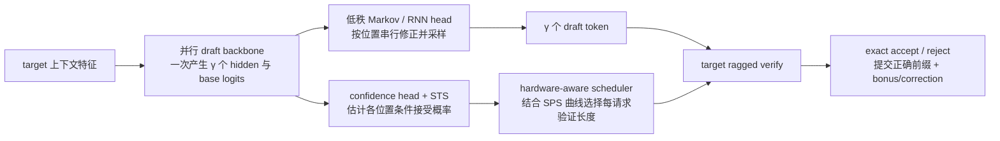
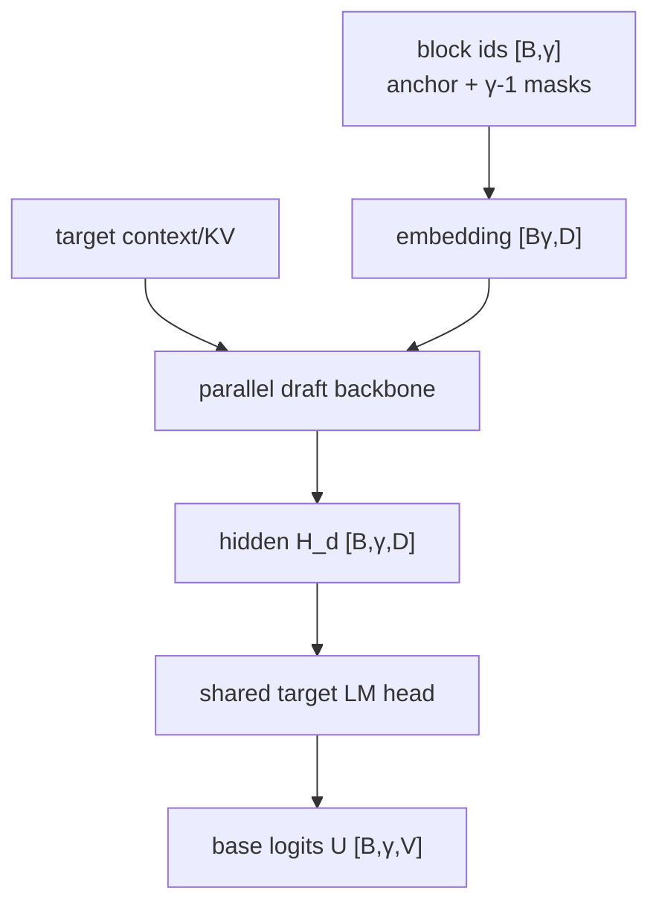
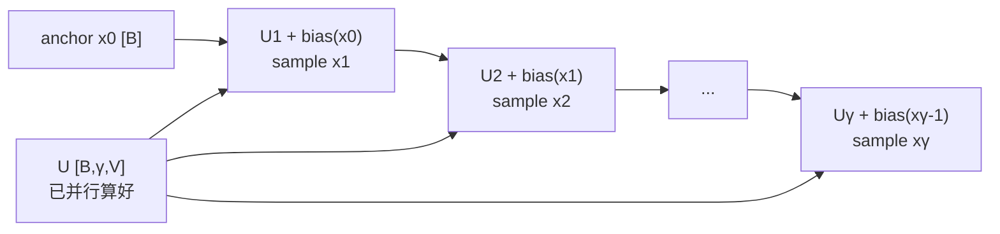
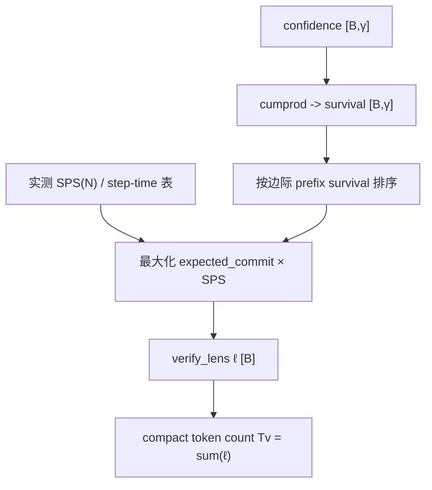
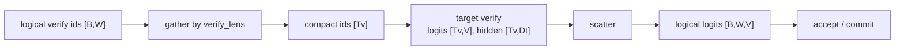

# 05. DSpark 原理：半自回归草稿、置信度调度与硬件感知验证

**简体中文** | [English](../../../en/ai-infra-basic/Speculative_Decoding/05-dspark-principles.md)

> 本讲讨论算法与系统原理，不绑定某一份 SGLang 代码。若要沿真实函数逐行追踪，请继续阅读 [SGLang DSpark 端到端源码走读](../../sglang-source-reading/06-advanced-features/09-dspark-code-walkthrough.md)。

DSpark 的目标不是单纯“让 draft 模型一次猜更多 token”，而是同时解决投机解码的三个瓶颈：

1. 自回归 draft 必须串行执行 `γ` 次，draft 自身可能已经不便宜；
2. 完全并行的 block draft 虽快，但未来位置彼此不知道前面实际采样了什么，候选质量下降；
3. target 总是验证固定长度，会把算力浪费在低置信度、几乎不可能被接受的尾部 token 上。

DSpark 的答案是：**重计算并行、轻依赖串行、验证长度动态化**。



## 1. 先统一符号与边界

| 符号 | 含义 |
|---|---|
| `B` | 当前 decode batch 的请求数 |
| `γ` | 每个请求最多提出的 draft token 数，也称 block size |
| `W=γ+1` | target 的逻辑验证窗口宽度；多出的 1 行是 anchor/current token |
| `S_r` | 请求 `r` 在本轮前已经提交的序列长度 |
| `D` | draft backbone hidden size |
| `D_t` | target hidden/context feature 的宽度 |
| `V` | 词表大小 |
| `r` | Markov 低秩空间宽度，论文常用 `r=256` |
| `h_{r,k}` | 请求 `r` 的第 `k` 个 draft 位置 hidden，形状 `[D]` |
| `U_{r,k}` | 并行 backbone 给出的 base logits，形状 `[V]` |
| `x_{r,k}` | 第 `k` 个实际采样出的 draft token id |
| `c_{r,k}` | 第 `k` 个候选在此前候选已接受条件下继续被接受的概率估计 |
| `a_{r,k}` | draft 前缀长度至少达到 `k` 的生存概率 |
| `ℓ_r` | scheduler 为请求 `r` 选择的 target 验证窗口长度，含 anchor |
| `T_v=Σ_r ℓ_r` | compact/ragged verify 中真正送进 target 的 token 行数 |

最重要的计数区别是：

```text
draft proposal:  x_1, x_2, ..., x_γ                 共 γ 个
target rows:     anchor, x_1, x_2, ..., x_γ         共 γ+1 个
```

为什么需要 anchor 行？target 在 anchor 位置输出 `x_1` 的目标分布；在 `x_1` 位置输出 `x_2` 的分布；最后一个被验证候选的位置还能给出 bonus/correction token。因此，工程代码里“draft token 数”有时指 `γ`，有时指 target verify width `γ+1`，阅读前必须看变量语义。

## 2. 从普通投机解码的成本模型出发

经典线性投机解码一轮包含：

```text
draft 生成 γ 个候选 -> target 一次验证 -> 接受最长前缀 -> 追加 bonus/correction
```

若一轮总耗时是 `T_draft + T_verify`，平均最终提交 `τ` 个 token，则平均每个输出 token 的延迟近似为：

$$
L \approx \frac{T_{draft}+T_{verify}}{\tau}.
$$

所以优化只有三条路：

- 降低 `T_draft`；
- 提高候选质量，从而提高 `τ`；
- 不验证明显无望的尾部，降低有效 `T_verify`。

自回归小模型需要执行 `γ` 次 decode：

$$
T_{draft}^{AR}(\gamma) \approx \sum_{k=1}^{\gamma} T_d(k),
$$

即使模型很小，`γ` 次 kernel launch、KV 访问和同步也可能吃掉收益。完全并行的 block drafter 只 forward 一次，但会近似成：

$$
q(x_{1:\gamma}\mid x_0) \approx \prod_{k=1}^{\gamma}q_k(x_k\mid x_0),
$$

第 `k` 个位置看不到真实采样出的 `x_{<k}`。预测距离越远，这个条件缺失越严重。

DSpark 将两者拆开：

$$
\underbrace{h_{1:\gamma},U_{1:\gamma}=F_{parallel}(x_0,\text{MASK}_{1:\gamma-1},H_{ctx})}_{\text{一次重型并行 forward}}
$$

再用很小的序列头恢复 token 依赖：

$$
q(x_{1:\gamma}\mid x_0)
=\prod_{k=1}^{\gamma}q_k(x_k\mid x_0,x_{<k}).
$$

## 3. 并行 backbone：一次获得整块 base logits

DSpark 复用 DFlash 风格的 block drafter。给定每个请求本轮的 anchor token `x_0`，输入通常是：

```text
[x_0, MASK, MASK, ..., MASK]
```

逻辑 shape 为 `[B, γ]`。某些 checkpoint 采用“不从 anchor 采样”的布局，会多保留一行查询，运行时再去掉 anchor hidden；不要仅凭某个中间 tensor 的行数推断 `γ`。

并行 draft block 允许块内位置彼此交互，并把 target 的上下文特征注入 draft attention。若从 target 的若干层取出特征：

$$
H_{ctx}=\operatorname{RMSNorm}\left(W_c[H^{(l_1)};H^{(l_2)};\ldots;H^{(l_m)}]\right),
$$

其中 `H_ctx` 与已提交上下文对齐。对 draft 第 `i` 层，可将 context 与当前 block 的 K/V 拼接：

$$
K_i=[W_i^K H_{ctx}; W_i^K H_d],\qquad
V_i=[W_i^V H_{ctx}; W_i^V H_d].
$$

这让轻量 draft 不必自己重新编码全部 target 历史。一次 backbone forward 的核心 shape 是：

| 阶段 | Tensor | Shape |
|---|---|---|
| block token id | `draft_block_ids` | `[B, γ]` |
| 展平后的 token id | `input_ids` | `[B·γ]` |
| token embedding | `E` | `[B·γ, D]` |
| draft hidden | `H_d` | `[B, γ, D]` |
| 共享 target LM head 权重 | `W_lm` | `[V, D]`，TP 下按词表切分 |
| base logits | `U=H_d W_lm^T` | `[B, γ, V]` |



共享 target embedding/LM head 有两个好处：词表语义天然一致；base logits 已处于 target 的输出坐标系。它并不意味着 draft 分布与 target 相同，后续仍必须验证。

## 4. 半自回归的核心：低秩 Markov head

并行 backbone 已经一次算出所有 `U_k`。现在只需让第 `k` 个位置知道前一个已采样 token `x_{k-1}`。

最直接的转移偏置需要矩阵：

$$
B\in\mathbb{R}^{V\times V},\qquad B[x_{k-1},:]\in\mathbb{R}^V.
$$

它有 `V²` 个参数，词表十几万时不可接受。DSpark 用低秩分解：

$$
B\approx W_1W_2,
\quad W_1\in\mathbb{R}^{V\times r},
\quad W_2\in\mathbb{R}^{r\times V},
\quad r\ll V.
$$

于是单步只需要：

$$
e_{k-1}=W_1[x_{k-1}]\in\mathbb{R}^{r},
$$

$$
b_k=e_{k-1}W_2\in\mathbb{R}^{V},
$$

$$
z_k=U_k+b_k,\qquad x_k\sim\operatorname{softmax}(z_k/T).
$$

### 4.1 单步与整块 shape

| 对象 | 单请求单步 | Batch 单步 | 整块 |
|---|---:|---:|---:|
| previous token id | `[]` | `[B]` | `[B,γ]` |
| Markov embedding | `[r]` | `[B,r]` | 按步产生 |
| base logits | `[V]` | `[B,V]` | `[B,γ,V]` |
| transition bias | `[V]` | `[B,V]` | 可不持久化 |
| corrected logits | `[V]` | `[B,V]` | 采样模式可能保存 `[B,γ,V]` |
| sampled token | `[]` | `[B]` | `[B,γ]` |

计算依赖是串行的，但串行部分只有 lookup、低秩投影与 sampling；昂贵的 transformer 层仍只运行一次：



这就是“semi-autoregressive”：概率分解仍是自回归的，重型特征计算不是。

### 4.2 Gated 与 RNN 变体

Vanilla Markov 只看 `x_{k-1}`。Gated 变体让当前位置 hidden 决定使用多少转移信息：

$$
g_k=\sigma(W_g[h_k;e_{k-1}]),\qquad
b_k=W_2(g_k\odot e_{k-1}).
$$

RNN 变体维护尺寸为 `r` 的序列状态 `s_k`。一种等价写法为：

$$
u_k=[s_{k-1};e_{k-1};h_k]\in\mathbb{R}^{2r+D},
$$

$$
g_k=\sigma(W_g u_k),\qquad
\tilde{s}_k=\tanh(W_c u_k),
$$

$$
s_k=g_k\odot s_{k-1}+(1-g_k)\odot\tilde{s}_k,
$$

$$
b_k=W_2^T\tanh(W_o u_k).
$$

它能压缩更长的 `x_{<k}` 信息，但每步计算也更复杂。三种 head 都不会取消 target verify；它们只影响 draft 质量和成本。

## 5. 为什么 confidence 预测的是“条件接受概率”

固定验证完整 `γ` 个候选很浪费：一旦第 2 个 token 被拒绝，第 3～`γ` 个即使已算 target logits，也不能沿原链提交。

DSpark confidence head 对每个位置输出：

$$
c_k\approx P(A_k=1\mid A_1=\cdots=A_{k-1}=1,\text{draft state}),
$$

其中 `A_k=1` 表示第 `k` 个候选通过验证。典型输入是 draft hidden 与前一 token 的 Markov embedding：

$$
c_k=\sigma\left(w^T[h_k;W_1[x_{k-1}]]\right).
$$

shape 变化：

```text
draft hidden                  [B,γ,D]
previous-token embeddings     [B,γ,r]
concat                        [B,γ,D+r]
linear raw confidence         [B,γ,1]
squeeze + sigmoid/STS         [B,γ]
```

训练时可以用 draft 与 target 分布的 total variation 距离构造软标签：

$$
c_k^*=1-\frac{1}{2}\lVert q_k-p_k\rVert_1.
$$

因为 `\frac12\|q-p\|_1\in[0,1]`，两者越接近，标签越接近 1。它不是“这个 token 的最大 softmax 概率”，也不是“最终肯定接受”的硬标签。

### 5.1 从条件概率到前缀生存概率

第 `j` 个候选有用的前提是 1 到 `j` 全部通过，所以：

$$
a_j=P(A_1=\cdots=A_j=1)\approx\prod_{i=1}^{j}c_i.
$$

例如：

```text
c = [0.90, 0.80, 0.50, 0.20]
a = [0.90, 0.72, 0.36, 0.072]
```

直接按 `c_k` 排序会错，因为后面的 token 不能越过前面的 token 单独验证；scheduler 应按 prefix survival `a_k` 考虑边际收益。

### 5.2 STS：校准“整条前缀”而不是单点分类

模型的 raw confidence 往往过度自信或保守。Sequential Temperature Scaling 为每个位置学习温度 `T_k`：

$$
\hat c_k=\sigma(z_k/T_k),\qquad
\hat a_j=\prod_{k=1}^{j}\hat c_k.
$$

校准目标是让预测的 prefix survival 与真实接受长度分布匹配。因为 scheduler 消费的是累积乘积，逐位置 accuracy 很高并不等于长度预算正确；尾部的轻微偏差会被连乘放大。

## 6. Hardware-aware scheduler：不是 confidence 大于阈值就验证

假设每个请求至少验证 anchor 行，初始总 token 数为 `B`，每轮至少能提交一个 target token。因此：

$$
N=B,\qquad \mathbb{E}[\text{commit}]=B.
$$

若为请求 `r` 增加第 `j` 个 draft 候选，target token 数加 1，期望提交量增加它的 prefix survival：

$$
N\leftarrow N+1,\qquad
E\leftarrow E+a_{r,j}.
$$

系统真正关心的不是单轮接受数，而是单位时间输出：

$$
\Theta(N)=E(N)\cdot SPS(N),
$$

其中 `SPS(N)` 是 target 在一次处理 `N` 个 verify token 时的实测 steps per second。它包含 graph tier、padding、attention kernel、TP/DP 同步等硬件效应，通常不是光滑函数。

调度器把所有可追加的 `(request, prefix-position)` 按 `a_{r,j}` 排序，逐个扩充预算并寻找 `Θ` 最大点。最终每个请求得到一个前缀长度 `ℓ_r`，绝不能得到中间有洞的集合。

### 6.1 具体例子：`B=3, γ=4`

假设三个请求的条件 confidence 为：

```text
R0: [0.95, 0.80, 0.50, 0.20]
R1: [0.70, 0.60, 0.50, 0.40]
R2: [0.99, 0.95, 0.90, 0.80]
```

对应生存概率：

```text
R0: [0.950, 0.760, 0.380, 0.076]
R1: [0.700, 0.420, 0.210, 0.084]
R2: [0.990, 0.941, 0.847, 0.678]
```

初始每请求只含 anchor：`ℓ=[1,1,1]`、`N=3`、`E=3`。若硬件曲线显示预算 9 最优，则按边际收益加入 6 个候选，可能得到：

```text
选中 R2 的前 4 个、R0 的前 2 个
ℓ = [3, 1, 5]        # 长度含 anchor
N = 3 + 1 + 5 = 9
```

不能仅取全局 top-6 后留下 `R0` 第 2 个却丢掉第 1 个；实现必须强制 prefix closure。



### 6.2 为什么生产实现需要滞后调度

当前轮的 confidence 在 draft forward 结束后才出现。若把它同步回 CPU、立刻决定同一轮的 graph shape，会引入 device-host 同步并破坏流水；更严重的是 overlap scheduler 不能用“未来才得到”的信息决定已经提交的工作。

SGLang 的 production 路径可维护 request generation 与 confidence ring，使用若干步之前的同一请求置信度决定当前预算。这样：

- 避免热路径上的同步；
- 不泄漏未来信息；
- 请求换槽时可用 generation id 避免旧 confidence 污染新请求。

滞后带来的是调度精度与流水效率的交换，不改变 target 的接受规则。

## 7. Ragged verify：把不同长度压成一批

若 `ℓ=[3,1,5]`，固定窗口计算量是 `B·W=3·5=15` 行，compact verify 只需 `T_v=9` 行：

```text
fixed-stride:
R0 [anchor d1 d2 -- --]
R1 [anchor -- -- -- --]
R2 [anchor d1 d2 d3 d4]

front-packed compact:
[R0:a R0:d1 R0:d2 | R1:a | R2:a R2:d1 R2:d2 R2:d3 R2:d4]
```

需要同时构造：

| Metadata | Shape | 用途 |
|---|---:|---|
| `verify_lens` | `[B]` | 每请求实际验证的行数 |
| `cu_seqlens` / offsets | `[B+1]` | 每请求在 compact buffer 中的起止位置 |
| compact token ids | `[T_v]` | target 的实际输入 |
| positions | `[T_v]` | 每行的绝对位置 |
| cache locations | `[T_v]` | 临时 target KV slot |
| scatter index | `[T_v]` | 将 compact 结果映射回逻辑 `[B,W]` |

target forward 后常把 logits/hidden scatter 回固定 stride `[B,W,...]`，这样 greedy/rejection sampling、logprob、grammar 等公共逻辑不必全部理解 ragged layout。



图捕获通常按 `T_v` 向上对齐到已捕获的 tier。即使有效行数是 9，可能 replay 12 或 16 行的图；metadata 标出真正有效的 9 行。DP attention 下各 rank 还要协调最大 tier，避免 collective shape 不一致。

## 8. 三种验证模式

| 模式 | target 实际计算 | 最终最多提交 | 用途 |
|---|---|---|---|
| `static` | 全部 `B·W` 行 | 完整窗口 | 基线、调试、无 confidence checkpoint |
| `compact` | `Σℓ_r` 个有效行，再对齐 graph tier | `ℓ_r` 范围内 | 生产推荐路径 |
| `cap-accept` | 全部 `B·W` 行 | 截断到 `ℓ_r` | 对照实验：隔离“少提交”与“少计算” |

`cap-accept` 不能带来 compact 的 target FLOPs 节省，但它能回答：若只允许相同预算，接受长度会怎样？

## 9. Exactness：加速不能篡改 target 分布

对 greedy decoding，候选从第一个与 target argmax 不同的位置截断，并提交 target 在该位置给出的 token。

对 sampling，第 `k` 个 draft token `x_k` 的接受概率是：

$$
\alpha_k=\min\left(1,\frac{p_k(x_k)}{q_k(x_k)}\right).
$$

若拒绝，则从修正分布采样：

$$
p'_k(x)=\frac{\max(p_k(x)-q_k(x),0)}
{\sum_v\max(p_k(v)-q_k(v),0)}.
$$

只要 target logits 与 draft proposal probability 都正确、按最长前缀验证，并且 scheduler 只裁掉尚未验证的尾部，动态长度就不会改变 target 分布。scheduler 决定“算多少”，acceptor 决定“哪些能提交”，两者职责不能混淆。

对请求 `r`：

```text
correct_len_r = 通过验证的 draft token 数
commit_len_r  = correct_len_r + 1 个 bonus/correction
new_seq_len_r = S_r + commit_len_r
```

若预算把窗口裁到 `ℓ_r`，实现还必须把 commit 限制在已计算的行内，并只提交对应 KV/hidden state。

## 10. 训练目标

训练时通常冻结 target model，并共享/冻结 target embedding 与 LM head，只训练 draft backbone、Markov/RNN head 和 confidence head。

对更远位置可使用衰减权重：

$$
w_k=\exp\left(-\frac{k-1}{\gamma}\right).
$$

token 监督的交叉熵：

$$
\mathcal L_{CE}=-\sum_{k=1}^{\gamma}w_k\log q_k(x_k^*).
$$

逼近 target 分布的 total variation 项：

$$
\mathcal L_{TV}=\sum_{k=1}^{\gamma}w_k\lVert q_k-p_k\rVert_1.
$$

confidence 使用软标签 BCE：

$$
\mathcal L_{conf}=-\sum_k
\left[c_k^*\log c_k+(1-c_k^*)\log(1-c_k)\right].
$$

论文中的组合形式为：

$$
\mathcal L=0.1\mathcal L_{CE}+0.9\mathcal L_{TV}+1.0\mathcal L_{conf}.
$$

TV 权重较高体现了目标：draft 不只是猜中训练 label，而要让整个 proposal distribution 接近 target，才能提高严格 rejection sampling 的接受率。

## 11. 一轮端到端 shape 总表

以下采用最常见的 `sample_from_anchor=True` 语义；特殊 checkpoint 可能让 backbone 多输出一个 anchor hidden，再在采样前切片。

| 顺序 | 阶段 | 输入 shape | 输出 shape |
|---:|---|---|---|
| 1 | 准备 block | bonus/anchor `[B]` | ids `[B,γ]` |
| 2 | draft backbone | ids `[B,γ]`、context cache | hidden `[B,γ,D]` |
| 3 | shared LM head | hidden `[B,γ,D]` | base logits `[B,γ,V]` |
| 4 | Markov sampling | base logits + previous ids | tokens `[B,γ]`；sampling 时可保留 corrected logits `[B,γ,V]` |
| 5 | confidence | hidden + previous embeddings | confidence `[B,γ]` |
| 6 | schedule | confidence `[B,γ]` + SPS table | verify lengths `[B]` |
| 7 | build logical verify | anchor `[B,1]` + tokens `[B,γ]` | ids `[B,γ+1]` |
| 8 | compact | ids + lengths | compact ids `[T_v]` |
| 9 | target verify | compact ids `[T_v]` | logits `[T_v,V]`、hidden `[T_v,D_t]` |
| 10 | scatter/accept | logical logits `[B,γ+1,V]` | commit lengths `[B]`、bonus `[B]`、out tokens |
| 11 | commit state | accepted prefix metadata | new seq lens `[B]`、持久 target/draft KV |

## 12. 性能边界与常见误解

### 12.1 DSpark 不保证任何 batch 都更快

收益取决于：

$$
\text{speedup}\approx
\frac{\text{baseline target step time}\times\text{baseline steps}}
{T_{parallel\ draft}+T_{sequential\ head}+T_{ragged\ verify}+T_{bookkeeping}}.
$$

接受率低、batch 太小、graph tier 填充过多、draft/target 通信昂贵时都可能无收益。论文报告的低序列头开销来自特定模型与硬件，不能当作所有部署的常数。

### 12.2 confidence 不是正确性裁判

confidence 只用于分配 target 计算预算。最终 token 必须由 target verify 与 exact accept 规则决定。即使 confidence 完全失准，也应只损失性能，不应改变输出分布。

### 12.3 `γ` 越大不一定越好

更大的 `γ` 提供更长的理论接受上限，也增大 draft hidden/base logits、采样、confidence 与最大 verify window。尾部 survival 很小时，大 block 只是扩大内存和图规格。

### 12.4 动态长度不等于动态 batch shape 任意变化

CUDA/NPU graph 通常仍需要离散 capture tier。ragged layout 降低的是有效 token 数；实际 replay 可能向上取整。调优应看“有效 `T_v`、capture tier、padding 比例、接受长度、SPS”五者，而不是只看平均 `ℓ`。

## 13. 与 DFlash、EAGLE 的关系

| 维度 | DFlash | DSpark | EAGLE 系列 |
|---|---|---|---|
| 重型 draft 计算 | block 并行 | block 并行 | feature autoregressive / tree expansion，依版本而异 |
| token 间依赖 | 较弱或由 block 建模 | 低秩 Markov/Gated/RNN 显式恢复 | draft feature 链与候选树 |
| verify geometry | 固定 block 为主 | confidence 驱动的 ragged prefix | 动态树为主 |
| target hidden 利用 | context/KV 注入 | 复用 DFlash 注入 | 预测 target feature |
| 调度重点 | draft/verify pipeline | prefix survival × 硬件 SPS | 树宽、深度、节点预算 |

DSpark 不是“DFlash 加一个阈值”，而是把半自回归头、可校准 confidence、硬件成本表、ragged verify 和安全 commit 组合成闭环。

## 14. 自测题

1. 为什么 `γ=7` 时 target 逻辑窗口是 8，而不是 7？
2. 为什么低秩 Markov head 串行执行，却仍能比自回归小模型便宜？
3. 给定 `c=[0.8,0.7,0.5]`，三个 prefix survival 分别是多少？
4. 为什么 scheduler 应优化 `expected commits × SPS`，而不是简单设置 `c_k>0.5`？
5. `compact` 和 `cap-accept` 的 target 计算量有什么本质区别？
6. confidence 预测错误为什么不应改变最终 token 分布？哪些实现 bug 会破坏这个结论？
7. ragged verify 后为什么还要 scatter 回 `[B,W,...]`？

## 15. 资料与下一步

- [DSpark 论文：Confidence-Scheduled Speculative Decoding with Semi-Autoregressive Generation](https://arxiv.org/abs/2607.05147)
- [SGLang 官方 DSpark 介绍](https://www.lmsys.org/blog/2026-07-06-dspark-sglang/)
- [SGLang DSpark 源码目录](https://github.com/sgl-project/sglang/tree/main/python/sglang/srt/speculative/dspark_components)
- [本专题：投机采样拒绝数学](./02-rejection-sampling-math.md)
- [下一讲：SGLang DSpark 端到端源码走读](../../sglang-source-reading/06-advanced-features/09-dspark-code-walkthrough.md)
