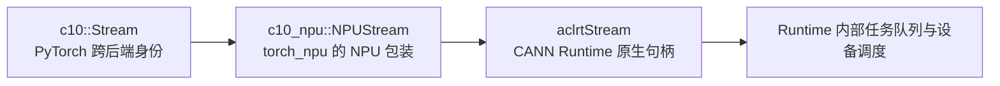
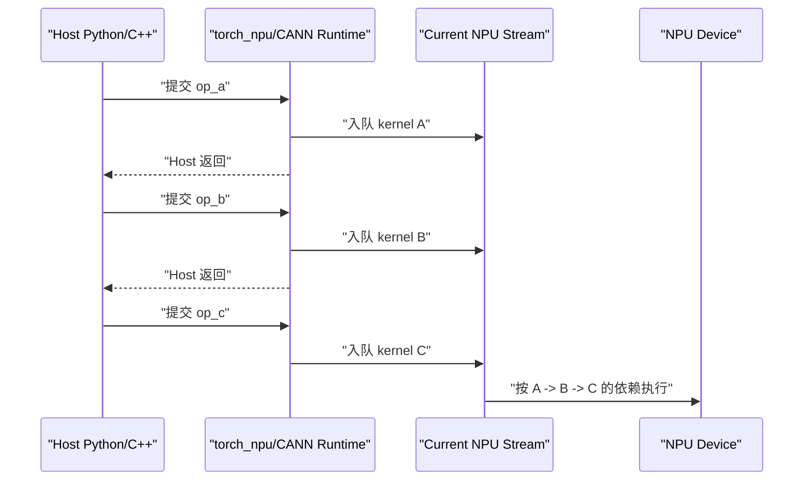
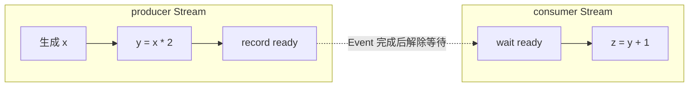
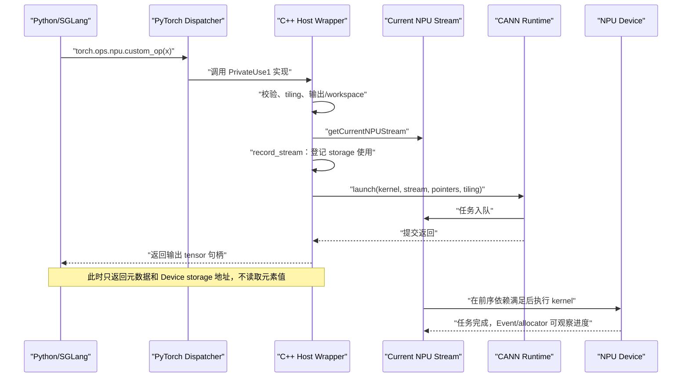

# torch_npu 02：Stream、Event、异步生命周期与计算图

> 本章解决一个贯穿 PyTorch、`torch_npu`、CANN 和 `sgl-kernel-npu` 的问题：Host 调用一个 NPU 算子后，工作如何排队、如何保持先后关系、tensor 的显存何时才能复用，以及这一切为什么不等于“组计算图”。

## 0. 学习目标

读完本章后，你应该能够回答：

1. Stream 是什么，不是什么；
2. “Host 异步提交”和“同一 Stream 内有序”为什么可以同时成立；
3. `c10::Stream`、`c10_npu::NPUStream` 与 `aclrtStream` 分别是什么类型；
4. `getCurrentNPUStream()` 为什么常出现在 Host wrapper；
5. `record_stream`、`wait_stream`、Event 和 `synchronize` 分别解决什么问题；
6. 多 Stream 如何安全地并发；
7. Stream 与 eager execution、autograd graph、NPU graph capture 的关系；
8. 如何沿 `sgl-kernel-npu` 源码识别真实的 Stream 生命周期。

建议先读：

- [基础 03：存储、搬运、队列、同步与流水](../foundations/03-memory-pipeline-and-sync.md)；
- [torch_npu 01：Dispatcher、ACLNN 与 Custom Op 的边界](./01-dispatch-aclnn-and-custom-op-boundaries.md)；
- [sgl-kernel-npu 01：仓库结构与算子生命周期](../sgl-kernel-npu/01-repository-and-op-lifecycle.md)。

---

## 1. 先给出一句准确的定义

**Stream 是 Host/runtime 用来向某个 device 提交异步任务的、有顺序的执行序列。**

这里第一次出现的几个词分别是：

- **Host**：运行 Python、PyTorch 和 C++ wrapper 的 CPU 进程；
- **runtime**：连接 Host 与 NPU 的运行时软件，在本章主要指 `torch_npu` 和 CANN Runtime；
- **device**：实际执行 kernel 的 Ascend NPU；
- **任务**：一次 kernel launch、异步内存拷贝、Event 记录/等待或算子库调用；
- **异步**：Host 把任务提交给 runtime 后通常可以先返回，不必等 NPU 完成；
- **有顺序**：同一 Stream 中，后提交任务观察到前面任务的完成顺序；这也叫 **in-order** 或 FIFO 语义。

因此下面两句话并不矛盾：

```text
对 Host：提交 A 后可以立即继续提交 B，所以是异步的。
对同一 Stream：NPU 必须维持 A -> B 的执行依赖，所以是有序的。
```

把 Stream 暂时想成“有编号的任务车道”：

- Host 是把任务放上车道的调度者；
- 同一车道上的任务不能随意超车；
- 两条车道可能并行，也可能因为争用同一硬件资源而轮流执行；
- Event 像跨车道的信号灯；
- `synchronize` 像 Host 停下来等待某条车道清空。

这个类比只解释顺序。Stream 本身不是物理传送带，也不与某个 AI Core 一一绑定。

### 1.1 软件层面：Stream 是分层的逻辑执行序列

从软件层看，“一条 Stream”不是一个单独的 C++ 容器，而是跨层保持同一身份和顺序的一组 runtime 状态：

```text
Python torch_npu.npu.Stream 对象
  -> C10/torch_npu 的 Stream ID、device ID 与 current-stream 状态
  -> torch_npu 可选的 Host Task Queue
  -> CANN aclrtStream 句柄与 Runtime 任务队列
  -> Driver/Device 调度所看到的有序任务
```

这里的 **Host Task Queue（Host 任务队列）** 是 `torch_npu` 可选的软件提交层。启用 task-queue 模式时，调用线程可以先把“稍后执行哪个 launch callback”封装成队列项，由消费线程继续调用 CANN。它和 CANN Stream 不是同一个对象：

- Host Task Queue 的任务可能是“调用一次 CANN launch API”；
- CANN Stream 中的任务才是 kernel launch、memcpy、Event wait 等 Device 工作；
- 两层异步可以同时存在：Python 线程先于 Host launch 消费线程返回，而 Host launch 又先于 NPU kernel 完成返回；
- 两层都必须保持同一逻辑 Stream 的顺序，否则 PyTorch 的 producer/consumer 语义会断裂。

`sgl-kernel-npu` 的 `EXEC_KERNEL_CMD` 会把 launch lambda 交给 `OpCommand::RunOpApi`。`torch_npu` 在 task queue 开启时把 callback 封装为 `QueueParas` 并调用 `enCurrentNPUStream`；关闭时则直接调用 callback。无论走哪条软件路径，callback 最终都把工作提交给 `aclrtStream`。

### 1.2 硬件层面：没有一块叫“Stream”的计算单元

从硬件层看，Stream 仍不是 AI Core、Vector Core、MTE、寄存器或一段 tensor 内存。更准确的过程是：

1. Host runtime 把 kernel、异步 memcpy、Event record/wait 等调用编码成设备可识别的任务；
2. Runtime/Driver 把这些任务及其 Stream 身份、先后关系提交给设备；
3. Device 的控制与调度机制按依赖取得就绪任务；
4. kernel 任务再依据 `blockDim`、kernel 类型和 tiling 被调度到 AI Core/Vector Core；
5. 搬运任务使用相应的数据搬运引擎；Event 任务更新或等待进度状态。

因此 Stream 对硬件的意义是“这批任务属于哪条有序时间线”，而不是“使用哪一颗核”。一个 kernel 可以动用多个核；同一 Stream 的下一个 kernel 也可以使用不同资源。两条 Stream 只表示 runtime **允许**无依赖任务并行，硬件是否真的重叠仍由资源占用和调度决定。

官方文档把 Stream 描述为“任务队列”是对外可依赖的**语义模型**。具体产品、CANN 版本和 fast-launch 配置可以改变内部队列、共享内存、通知和调度资源的实现，因此不要把 Stream 画成一条固定驻留在某个 AI Core 上的物理 FIFO。

---

## 2. Stream 不是什么

初学者常把名字相近但层次不同的对象混在一起。

| 对象 | 所在层 | 作用 | 是否等于 Stream |
|---|---|---|---|
| CPU thread / 线程 | Host 操作系统 | 执行 Python/C++ 代码 | 否；线程可以向 Stream 提交任务 |
| Process / 进程 | Host 操作系统 | 容纳地址空间和线程 | 否 |
| AI Core / Vector Core | NPU 硬件 | 执行矩阵、向量或搬运指令 | 否；runtime 会调度 Stream 中的任务使用硬件 |
| Kernel | Device 程序 | 完成一次并行计算 | 否；kernel launch 是 Stream 中的一项任务 |
| `TPipe` / `TQue` | Ascend C kernel 内部 | 组织单个 kernel 内的片上搬运—计算流水 | 否；它们位于 Device kernel 内部 |
| Computation Graph / 计算图 | 框架/图执行层 | 表示算子与数据依赖 | 否；图中的工作最终仍需通过 Stream 提交 |
| Event | Runtime 同步对象 | 标记某 Stream 已执行到某个位置 | 否；Event 用来建立 Stream 间依赖 |

最容易混淆的是两种“队列”：

```text
Host/runtime Stream
  管：kernel A -> memcpy B -> kernel C
  跨越多个 kernel launch

Ascend C Device TQue
  管：CopyIn tile 0 -> Compute tile 0 -> CopyOut tile 0
  只存在于某次 kernel 执行内部
```

前者是本章主题；后者见[基础 03](../foundations/03-memory-pipeline-and-sync.md)。

---

## 3. 从 Python 到 CANN：同一个 Stream 的三层表示

### 3.1 `c10::Stream`：PyTorch 的跨后端标识

`c10::Stream` 是 PyTorch C10 层的 C++ 值类型。它携带的核心信息可以理解为：

```text
设备类型 + 设备编号 + Stream 标识
```

它必须保持 backend-neutral，也就是不把 CUDA、NPU 或其他设备的原生句柄直接暴露给通用 PyTorch 代码。它是“某设备上某条 Stream 的身份凭证”，不是任务队列本体，也不是一个 NPU 地址。

### 3.2 `c10_npu::NPUStream`：torch_npu 的 NPU 包装

`c10_npu::NPUStream` 是 `torch_npu` 在 C++ 后端中的 NPU 专用包装。它把 PyTorch 的 Stream 身份映射到 NPU backend，并提供取得 CANN 原生句柄的方法。

真实源码常见：

```cpp
auto npuStream = c10_npu::getCurrentNPUStream();
```

此时：

- `auto` 推导出的类型是 `c10_npu::NPUStream`；
- 它是一个轻量 Host C++ 对象；
- `getCurrentNPUStream()` 是“查询当前 Stream”，不是创建 Stream；
- 查询动作不会启动 kernel。

### 3.3 `aclrtStream`：CANN Runtime 的不透明句柄

需要调用 CANN launch API 时，源码会进一步写：

```cpp
aclrtStream stream = c10_npu::getCurrentNPUStream().stream(false);
```

逐项解释：

- `aclrtStream` 是 CANN Runtime 定义的 **opaque handle（不透明句柄）**；
- “不透明”表示调用者只持有标识，不应依赖其内部结构；
- `.stream(false)` 从 `NPUStream` 包装中取出底层 CANN 句柄；
- 这个句柄会作为 launch 参数告诉 runtime：“把本次工作排进这条 Stream”。

三层关系是：



不要把它理解成三个不同 Stream。它们通常是同一逻辑 Stream 在不同抽象层的表示。

---

## 4. Default Stream 与 Current Stream

### 4.1 Default Stream

**Default Stream（默认 Stream）** 是设备/context 自动具备的固定默认执行序列。没有显式切换 Stream 时，框架工作通常会落到它或框架当前选定的 Stream。

“默认”描述身份，不等于“当前”永远只能是它。

### 4.2 Current Stream

**Current Stream（当前 Stream）** 是框架为当前设备和当前 Host 执行上下文选中的提交目标。大多数 PyTorch NPU 算子不会要求用户显式传 `stream` 参数，而是内部查询 current stream。

Python 中的基本接口是：

```python
import torch_npu

current = torch_npu.npu.current_stream()
default = torch_npu.npu.default_stream()
```

进入 Stream 上下文时，框架临时替换 current stream；退出后恢复：

```python
import torch
import torch_npu

side = torch_npu.npu.Stream()
with torch_npu.npu.stream(side):
    y = torch.ones(1024, device="npu") * 2
```

这段代码中：

1. `torch_npu.npu.Stream()` 创建一条非默认 Stream 的 Python 包装；
2. context manager 把 `side` 设为当前 Stream；
3. `torch.ones` 和乘法产生的 NPU 工作被提交到 `side`；
4. 离开 `with` 后，原先的 current stream 被恢复；
5. 离开 `with` 不代表 `side` 上的 NPU 工作已经完成。

### 4.3 为什么 custom op 必须使用当前 Stream

假设 PyTorch 已在当前 Stream 排入：

```text
producer(x) -> custom_op(x) -> consumer(y)
```

如果 custom wrapper 擅自新建另一条 Stream，却不建立 Event 依赖，那么：

- custom kernel 可能在 `producer` 写完 `x` 前读取；
- `consumer` 可能在 custom kernel 写完 `y` 前读取；
- bug 往往表现为偶发脏数据，而不是稳定报错。

所以 wrapper 常调用 `getCurrentNPUStream()`，让 custom kernel 自然继承 PyTorch 已建立的同 Stream 顺序。

---

## 5. 异步执行到底怎样发生

以三个连续 NPU 算子为例：

```python
a = op_a(x)
b = op_b(a)
c = op_c(b)
```

Eager 模式下可简化为：



Host 侧的 Python 语句已经执行到下一行时，Device 可能仍在运行 A。框架之所以能正确得到 `c`，不是因为每行 Python 都同步，而是因为：

1. B 与 A 在同一 Stream；
2. C 与 B 在同一 Stream；
3. 同 Stream 保证提交次序对应的执行依赖；
4. tensor 对象保存地址、shape、dtype 和 storage 生命周期，结果不需要先拷回 CPU。

“Python 函数返回”通常只表示 launch 已成功提交，不表示输出元素已经全部算好。

---

## 6. 多 Stream：并发不是自动获得的

### 6.1 不同 Stream 没有隐式先后关系

同 Stream的顺序是隐式的；不同 Stream 之间默认没有这样的顺序：

```text
Stream A: kernel A1 -> kernel A2
Stream B: kernel B1 -> kernel B2
```

A1 与 A2 有序，B1 与 B2 有序；A2 与 B1 谁先完成不能仅由提交代码顺序推出。

两条 Stream 是否真正同时占用硬件，还取决于：

- kernel 是否使用相同的 Cube/Vector/MTE 资源；
- 单个 kernel 是否已占满设备；
- 内存带宽是否成为瓶颈；
- runtime 和目标硬件是否支持对应并发；
- 两条 Stream 之间是否存在 Event 依赖。

所以“创建两条 Stream”只创造了并发机会，不保证性能提升。

### 6.2 Event 是什么

**Event（事件）** 是 runtime 中的进度标记。把 Event record 到 Stream A 后，它只有在 A 中排在它前面的任务完成时才变为完成状态。

```text
Stream A: producer(x) -> record event E
Stream B: wait event E -> consumer(x)
```

`wait event E` 通常也是异步入队：Host 不必停住，Stream B 后续任务在设备侧等待 E。

### 6.3 `wait_stream` 是什么

`wait_stream(other)` 表达“本 Stream 后续提交的工作要等待 `other` 当前已经提交的工作”。实现通常可以理解为：

1. 在 `other` 上 record 一个 Event；
2. 在本 Stream 上 enqueue 对该 Event 的 wait。

一个最小的 PyTorch NPU 结构示例：

```python
import torch
import torch_npu

main = torch_npu.npu.current_stream()
side = torch_npu.npu.Stream()
x = torch.ones(1024, device="npu")

# side 读取 x 前，等待 main 上此前产生 x 的任务。
side.wait_stream(main)
with torch_npu.npu.stream(side):
    x.record_stream(side)
    y = x * 2

# main 使用 y 前，等待 side 上此前产生 y 的任务。
main.wait_stream(side)
z = y + 1
```

这里有两类不同保障：

- 两个 `wait_stream` 建立**执行依赖**；
- `x.record_stream(side)` 建立**内存生命周期记录**。

它们不能互相替代。

### 6.4 实践一：用 Event 建立两条 Stream 的依赖

下面是需要 Ascend NPU、PyTorch 和 `torch_npu` 环境的最小可运行例子：

```python
import torch
import torch_npu

device = torch.device("npu:0")
producer = torch_npu.npu.Stream(device=device)
consumer = torch_npu.npu.Stream(device=device)
ready = torch_npu.npu.Event()

with torch_npu.npu.stream(producer):
    x = torch.arange(1024, device=device, dtype=torch.float32)
    y = x * 2
    ready.record()  # 在 producer 当前进度后面插入 Event Record 任务

with torch_npu.npu.stream(consumer):
    consumer.wait_event(ready)  # 插入 Event Wait，不阻塞当前 CPU 线程
    y.record_stream(consumer)   # 只负责 y.storage 的跨 Stream 生命周期
    z = y + 1                   # 排在 wait 后面，故不会提前读取 y

consumer.synchronize()
torch.testing.assert_close(
    z.cpu(),
    torch.arange(1024, dtype=torch.float32) * 2 + 1,
)
```

逐行画成两条设备时间线：



Event 的影响不是“修改 producer 的执行速度”，而是：

1. `ready.record()` 向 producer 插入一个进度标记；
2. 该标记只有在 producer 中它前面的 `x * 2` 完成后才完成；
3. `consumer.wait_event(ready)` 向 consumer 插入等待任务；
4. consumer 中位于 wait 后面的 `y + 1` 暂时不能成为可执行任务；
5. ready 完成后，Device runtime 解除这个依赖，consumer 才能继续；
6. Host 调用 `wait_event` 后仍可继续运行 Python，因此这是 Device 侧依赖，不是 CPU blocking wait。

把 `consumer.wait_event(ready)` 删除后，两条 Stream 没有数据就绪依赖。即使偶尔得到正确值，也只说明某次调度碰巧让 producer 先完成，不构成正确性保证。

### 6.5 实践二：区分 Event query、wait 与 synchronize

```python
import torch
import torch_npu

stream = torch_npu.npu.current_stream()
done = torch_npu.npu.Event()

x = torch.randn((4096, 4096), device="npu")
y = x @ x
done.record(stream)

print("Event complete now?", done.query())
# query() 只读取完成状态，不等待；可能为 True，也可能为 False。

done.synchronize()
# 到这里 CPU 才确认 done 之前的工作已经完成。
print("Event complete after synchronize?", done.query())
```

不要把第一次 `query()` 必须为 `False` 写进测试：NPU 可能在 Host 查询前已经完成。这个实验要观察的是 API 语义，而不是强迫某种调度结果。

---

## 7. `record_stream`：它记录的是 storage 使用，不是计算顺序

### 7.1 先把“对象死亡”和“storage 可复用”分开

PyTorch 使用 **caching allocator（缓存分配器）** 管理 NPU 显存。`at::Tensor`/Python Tensor 是 Host 句柄，**storage** 才是保存元素的底层 Device 内存块。最后一个 Tensor 引用消失，只表示 Host 不再持有这个句柄；Device 上已经提交的任务可能仍在使用 storage。

```text
Host：最后一个 Tensor 引用消失 -> allocator 收到 free 请求
Device：某条 Stream 上的 kernel 仍在读/写同一地址
```

Allocator 不会总把内存立即还给系统，而会缓存后复用。真正的问题不是“Tensor C++ 局部变量是否退出作用域”，而是：

> allocator 准备把地址交给下一次分配时，所有可能使用旧内容的 Stream 是否已经越过最后一次使用点？

### 7.2 `record_stream` 在 torch_npu allocator 中实际做了什么

`tensor.record_stream(S)` 把 `S` 登记到该 allocation block 的 `stream_uses`。下面是 [`NPUCachingAllocator.cpp`](https://gitee.com/ascend/pytorch/blob/e04f000ce9e11177d193a398644d8fcb67a90cef/torch_npu/csrc/core/npu/NPUCachingAllocator.cpp) 的关键逻辑，省略了锁、日志、context 与错误检查：

```cpp
void recordStream(Block* block, c10_npu::NPUStream stream) {
    block->stream_uses.insert(stream);
}

void free(Block* block) {
    if (!block->stream_uses.empty()) {
        insert_events(block);
    } else {
        free_block(block);
    }
}

void insert_events(Block* block) {
    for (auto& stream : block->stream_uses) {
        auto event = create_event_internal(stream.device_index());
        event->record(stream);
        block->event_count++;
        npu_events[stream].emplace_back(std::move(event), block);
    }
}
```

所以它的准确作用是：

1. Tensor 引用归零时先不把 block 放回可复用池；
2. allocator 在记录过的 Stream 上放 Event；
3. Event 完成后递减 `event_count`；
4. 所有相关 Event 完成，block 才重新可分配。

它不启动 kernel、不复制 Tensor、不建立 producer/consumer 顺序、不阻塞 Host，也不构建计算图。

一个容易忽略的实现细节是：上述 NPU allocator 路径没有在 `recordStream` 入口把“使用 Stream 等于 allocation Stream”直接过滤掉。因此，对同一 Stream 调用它在数学正确性上通常没有新增信息，但在实现上不一定是零成本 no-op；block 释放时可能多走 Event 延迟回收路径。

### 7.3 同 Stream 为什么天然安全，跨 Stream 为什么不安全

设 block 在 Stream S 分配，旧 kernel 与复用后的新 kernel 也都提交到 S：

```text
Stream S:
allocate p -> old kernel uses p -> allocator reissues p -> new kernel uses p
```

即使 Host 很早就重新拿到地址 `p`，新 kernel 仍排在旧 kernel 之后，因此不会在 Device 上同时破坏旧数据。Allocator 已经用 block 的 allocation Stream 对内存池分组；这里不需要额外 Event。

跨 Stream 才会失去这条天然顺序：

```text
S0（allocation Stream）: allocate p -----------------> reuse p?
S1（use Stream）:                   kernel still uses p
```

正确方案有两类：

```text
方案 A：p.record_stream(S1)
        allocator 在 S1 完成前不复用 p

方案 B：S1 完成时 record Event E
        S0 wait E
        再允许 p 的 Host 引用消失/在 S0 上复用
```

`record_stream(S1)` 只解决地址寿命。S1 在读取前是否等到 S0 写完，仍要靠 `wait_event`/`wait_stream`：

```text
wait_event：保证数据 ready
record_stream：保证地址 still alive
```

### 7.4 为什么 `sgl-kernel-npu` 只有 `apply_token_bitmask` 显式调用它

#### 7.4.1 先给结论

对最新审计的 `sgl-kernel-npu@fcb5489d` 做静态源码分析后，本章结论比“保守保险”更明确：

> `apply_token_bitmask` 的算法本身没有跨 Stream 需求。Wrapper 没有创建 side Stream；内部产生临时 Tensor 的 ATen 操作、自定义 kernel launch、结果 `copy_`/`index_put_` 都使用同一条 current NPU Stream。对正常、遵守 PyTorch Stream 合同的调用，两个 `record_stream(current)` 在正确性上是冗余的，不是 bitmask 功能所必需。

它们仍能提供一个有限的额外防御：如果调用方传入的是在另一条 Stream 分配的 alias storage，只建立了数据就绪依赖，却准备过早丢掉最后一个引用，那么内部对 current Stream 的登记可保护 `workingLogits`/`workingBitmask` 所指向的 storage。但这不是完整的跨 Stream API 合同，原因后文会说明。

这是基于可见源码的工程判断，不等同于维护者公开声明“这两行可以删除”。真正删除前仍应在支持的 NPU、task queue 与 graph 模式下做压力测试。

#### 7.4.2 整个 wrapper 只有一条 runtime Stream

真实宏 [`torch_helper.h#L120-L134`](https://github.com/sgl-project/sgl-kernel-npu/blob/fcb5489d66702a5bc3d09fa3854231e943d6abe8/csrc/utils/torch_helper.h#L120-L134) 每次都取得 current Stream：

```cpp
#define EXEC_KERNEL_CMD(kernel_name, blockdim, ...)                       \
    do {                                                                  \
        auto acl_stream = c10_npu::getCurrentNPUStream().stream(false);   \
        auto converted_params = TorchNpuHelper::ConvertTypes(__VA_ARGS__);\
        auto acl_call = [acl_stream, blockdim, converted_params]() -> int {\
            /* ACLRT_LAUNCH_KERNEL(...)(blockdim, acl_stream, params...) */\
            return 0;                                                     \
        };                                                                \
        at_npu::native::OpCommand::RunOpApi(#kernel_name, acl_call);       \
    } while (false)
```

`ConvertType(const at::Tensor&)` 确实把 Tensor 变成 `data_ptr()`，`RunOpApi` 在 task queue 开启时也可能先保存 callback。但这仍未创建第二条 Device Stream：callback、后续分配产生的任务以及后续 kernel 都保留 current Stream/软件队列顺序。**裸指针和异步 callback 不是需要 `record_stream` 的充分条件；跨 Stream 使用才是。**

#### 7.4.3 逐分支检查两个 working Tensor

真实 Host 源码见 [`apply_token_bitmask.cpp`](https://github.com/sgl-project/sgl-kernel-npu/blob/fcb5489d66702a5bc3d09fa3854231e943d6abe8/csrc/apply_token_bitmask/op_host/apply_token_bitmask.cpp)。

| 分支 | `workingLogits` 从哪里来 | `workingBitmask` 从哪里来 | 是否离开 current Stream |
|---|---|---|---|
| 无 `indices`、无需 padding | alias `logits` | alias `bitmask` | 否 |
| 无 `indices`、需要 padding | current Stream 上 `zeros + copy_` | alias 或 current Stream 上 `zeros + copy_` | 否 |
| 有 `indices` | current Stream 上 `index/contiguous` 产生 `selectedLogits`，必要时再 padding | current Stream 上 `index/contiguous` 产生 `selectedBitmask`，必要时再 padding | 否 |

Kernel 之后的：

```cpp
auto result = needsPadding
    ? workingLogits.narrow(1, 0, vocabSize)
    : workingLogits;

logits.index_put_({rowIndices}, result);  // hasIndices
logits.copy_(result);                     // needsPadding
```

也提交到同一 current Stream。于是：

- 新建的 working storage：在 current Stream 分配、使用、最后被同一 Stream 后续任务消费；
- alias 的 `workingLogits`：底层通常就是最终返回的 `logits`，返回值继续持有引用；
- alias 的 `workingBitmask`：如果它也在 current Stream 分配，同 Stream 复用已经安全；
- 只有“bitmask 在 S0 分配、算子在 S1 调用、调用后立刻丢掉 bitmask”这种跨 Stream alias 情况，内部记录 S1 才增加生命周期保护。

而且这两行不是完整的“自动接受任意跨 Stream 输入”方案。例如 `rowIndices` 可能 alias 调用方的 `indices`，却没有相同登记；跨 Stream 的数据就绪也仍需调用方 Event。因此更准确的定位是：**局部、非对称的防御性登记，而不是算子语义要求。**

#### 7.4.4 `workingLogits` 与 `workingBitmask` 的必要性并不相同

`workingLogits.record_stream(current)` 更明显地冗余：

- alias `logits` 时，返回的 `logits` 继续持有 storage；
- 新建临时量时，它在 current Stream 创建，kernel 后又被 current Stream 的 copy/scatter 消费。

`workingBitmask.record_stream(current)` 只有在它 alias 一个由别的 Stream 分配、且调用方会过早释放的输入时，才可能提供实际额外保护。对常见默认/current Stream 调用，它同样是冗余的。

### 7.5 其他算子是否偷偷用了“等效方式”

大多数没有；更准确的答案是：**它们没有制造需要补救的跨 Stream 条件，因此不需要等效方式。**

`EXEC_KERNEL_CMD` 宏没有遍历参数并自动 `record_stream`。下面两个源码例子与 `apply_token_bitmask` 一样，会把局部 Tensor 转成裸地址异步提交。

#### 例一：`causal_conv1d` 的局部参数 Tensor 与 workspace

最新源码的 [`causal_conv1d.cpp#L307-L321`](https://github.com/sgl-project/sgl-kernel-npu/blob/fcb5489d66702a5bc3d09fa3854231e943d6abe8/csrc/causal_conv1d/op_host/causal_conv1d.cpp#L307-L321) 和 [`#L396-L403`](https://github.com/sgl-project/sgl-kernel-npu/blob/fcb5489d66702a5bc3d09fa3854231e943d6abe8/csrc/causal_conv1d/op_host/causal_conv1d.cpp#L396-L403)：

```cpp
at::Tensor y = at::empty_like(x);
at::Tensor bias_tensor = hasBias ? bias : at::empty({0}, x.options());
at::Tensor cache_indices_tensor =
    hasCacheIndices
        ? cache_indices.to(at::kLong)
        : at::empty({0}, x.options().dtype(at::kLong));

auto workspaceTensor =
    at::empty(
        {totalWorkspace},
        at::TensorOptions().dtype(at::kByte).device(x.options().device()));

EXEC_KERNEL_CMD(
    causal_conv1d,
    blockDim,
    x,
    weight,
    conv_states,
    bias_tensor,
    query_start_loc_tensor,
    cache_indices_tensor,
    has_initial_state_tensor,
    num_accepted_tokens_tensor,
    y,
    workspaceTensor,
    tilingTensor);

return y;
```

`bias_tensor`、转换后的 index/state Tensor 与 `workspaceTensor` 都可能在函数返回时失去 C++ 引用，但它们在 current Stream 分配并只被 current Stream kernel 使用，所以没有显式记录。

#### 例二：`catlass_matmul_basic` 的局部 workspace

[`catlass_matmul_basic.cpp#L85-L89`](https://github.com/sgl-project/sgl-kernel-npu/blob/fcb5489d66702a5bc3d09fa3854231e943d6abe8/csrc/catlass/op_host/catlass_matmul_basic.cpp#L85-L89)：

```cpp
auto tiling_tensor = get_tiling(m, n, k, formatMode, dTypeMap[aType], blockDim);
auto workspace_tensor = at::empty(
    {1},
    at::TensorOptions().dtype(at::kByte).device(input_a.options().device()));

EXEC_KERNEL_CMD(
    catlass_matmul_basic,
    blockDim,
    input_a,
    input_b,
    output_c,
    workspace_tensor,
    tiling_tensor);
```

这里也没有隐藏的 `record_stream`。它依赖的是同一 current Stream，而不是另一套神秘生命周期 API。

普通 ATen/ACLNN 算子同样会把工作提交到 current Stream。只有真正自行选择 communication/side Stream 的模块，才需要显式使用下面一种方案：

1. producer Event + consumer wait，解决数据就绪；
2. `tensor.record_stream(consumer)`，解决 allocator 生命周期；
3. 保留 Tensor 强引用直到 completion Event，再释放；
4. 让 allocation Stream 反向等待 use Stream 的 completion Event，再允许同 Stream 复用。

SGLang 主仓也有“Event + keepalive”替代 `record_stream` 的真实例子：[`deepseek_v4.py#L2005-L2029`](https://github.com/sgl-project/sglang/blob/ddaf430e6c59a88da0a6cca4c71033cedf102a88/python/sglang/srt/models/deepseek_v4.py#L2005-L2029) 把异步通信输入保存在 `state.combine_keepalive`，等 compute Stream `wait_event` 后才 `pop` 释放。该例使用 CUDA API，但内存所有权原理与 NPU Stream 相同；NPU 版本应使用 `torch.npu.Stream/Event`。

### 7.6 两个可运行实验：验证“冗余”与“跨 Stream 必要”

#### 实验 A：同 Stream A/B 对照

编译两个版本：

- A：保留两次 `record_stream`；
- B：删除两次调用。

在默认 Stream 上循环：

```python
import torch
import torch_npu

for _ in range(10_000):
    logits = torch.randn((8, 32000), device="npu", dtype=torch.float16)
    bitmask = torch.full((8, 1000), -1, device="npu", dtype=torch.int32)
    out = torch.ops.npu.apply_token_bitmask(logits, bitmask)
    pressure = torch.empty_like(bitmask)  # 制造 allocator 复用压力

torch.npu.synchronize()
```

若两版正确性一致，而 B 的 Event/allocator trace 更少，就支持“同 Stream 下冗余”的源码结论。不能只跑一次，也要覆盖 task queue、graph capture、padding、`indices` 和不同 dtype。

#### 实验 B：真正的跨 Stream 输入

```python
producer = torch.npu.Stream()
consumer = torch.npu.Stream()

with torch.npu.stream(producer):
    logits = torch.randn((8, 32000), device="npu", dtype=torch.float16)
    bitmask = torch.full((8, 1000), -1, device="npu", dtype=torch.int32)
    ready = producer.record_event()

with torch.npu.stream(consumer):
    consumer.wait_event(ready)       # 数据就绪
    out = torch.ops.npu.apply_token_bitmask(logits, bitmask)
    bitmask.record_stream(consumer)  # 生命周期；即使算子内部删除登记也安全
```

去掉 `consumer.wait_event(ready)` 是数据竞争；去掉 `bitmask.record_stream(consumer)` 后再立刻释放 bitmask 并在 producer 上施加大量分配压力，才是在测试 allocator early reuse。两类错误不能混成一个实验结论。

### 7.7 最终审计算法

对任意 wrapper 按顺序问：

1. storage 在哪条 Stream 分配？
2. 最后一个异步消费者在哪条 Stream？
3. 两者是否相同？相同则通常不需 `record_stream`。
4. 不同则 producer→consumer 是否有 Event，保证数据 ready？
5. consumer 使用期间，是 `record_stream(consumer)`、强引用 keepalive，还是 allocation Stream 反向 wait completion Event，保证地址 alive？
6. wrapper 是否还有未覆盖的 alias/临时 Tensor？

不要用“算子是异步的”“使用了裸指针”“局部变量会析构”作为单独判据。几乎所有加速器算子都满足这些描述；真正判据始终是 **allocation、last use 与 reuse 是否跨越不同 Stream 时间线**。

---

## 8. 六类同步机制必须分开

| 机制 | 谁等待谁 | Host 是否阻塞 | 主要用途 |
|---|---|---:|---|
| 同一 Stream 顺序 | 后任务等前任务 | 否 | 普通算子依赖 |
| `wait_event` / `wait_stream` | 一条 Stream 等另一条 Stream 的进度 | 否 | 跨 Stream 依赖 |
| `stream.synchronize()` | Host 等某条 Stream | 是 | 调试、读取结果、准确计时 |
| `torch_npu.npu.synchronize()` | Host 等当前设备上已提交工作 | 是 | 全设备边界同步 |
| `query()` | 不等待，只查询完成状态 | 否 | 轮询/状态检查 |
| `record_stream()` | 没有执行者等待 | 否 | allocator 生命周期跟踪 |

### 8.1 为什么不能每个算子后都 `synchronize`

如果写成：

```text
launch A -> CPU 等 A -> launch B -> CPU 等 B -> launch C -> CPU 等 C
```

就破坏了 Host 提前准备后续工作以及 runtime/device 重叠调度的机会。正确做法通常是只在真正跨越异步边界时同步，例如：

- 把 NPU tensor 内容拷回 CPU 并立即读取；
- benchmark 要测量已经完成的 device 时间；
- 调试时需要定位具体失败算子；
- 调用不共享 Stream 语义的外部系统。

生产路径应优先使用同 Stream 顺序或 Event，而不是粗粒度 device synchronize。

---

## 9. 源码精读：`sgl-kernel-npu` 怎样接入当前 Stream

本节基于课程固定的 `sgl-kernel-npu` commit。

### 9.1 `apply_token_bitmask` 的对象与顺序

源码位置：

- [`apply_token_bitmask.cpp#L133-L153`](https://github.com/sgl-project/sgl-kernel-npu/blob/d5630dff41c8108216f835597e63f6d3a7445908/csrc/apply_token_bitmask/op_host/apply_token_bitmask.cpp#L133-L153)

固定 commit 的真实源码摘录：

```cpp
// Prevent NPU storage from being reclaimed before async kernel completes
auto npuStream = c10_npu::getCurrentNPUStream();
workingLogits.record_stream(npuStream);
workingBitmask.record_stream(npuStream);

// ...
if (dtype == at::kFloat) {
    EXEC_KERNEL_CMD(apply_token_bitmask_fp32, blockDim, workingLogits,
                    workingBitmask, numRowsU32, vocabSizeU32,
                    logitsStrideU32, bitmaskStrideU32, baseRows,
                    extraCores, tileLength, blockDim, dtypeSizeU32);
}
```

逐行解释：

1. `workingLogits`、`workingBitmask` 的 C++ 类型是 `at::Tensor`；
2. 它们是 Host 句柄，但底层 storage 位于 NPU GM；
3. `npuStream` 是 `c10_npu::NPUStream`，表示当前 PyTorch NPU Stream；
4. 两次 `record_stream` 把 current Stream 登记进两个 storage 的 allocator `stream_uses`；
5. `EXEC_KERNEL_CMD` 是 Host launch 封装，不是在 CPU 上执行 kernel 数学；
6. launch 被提交到当前 Stream，因此它自然排在该 Stream 先前的 producer 后面；
7. wrapper 可以在 Device 完成前返回，但本 wrapper 的 allocation、kernel 与结果回写都没有离开 current Stream。

源码审计结论是：对正常同 Stream 调用，这两行在正确性上冗余；它们不是 bitmask 算法的必要步骤。它们只会在 working storage alias 另一条 Stream 分配的输入、且调用方可能过早释放引用时增加一层局部生命周期防御。`causal_conv1d` 与 `catlass_matmul_basic` 的局部 workspace/tiling 也经同一宏异步提交，却依靠同 Stream 顺序而不记录。完整逐分支证明见[第 7.4 节](#74-为什么-sgl-kernel-npu-只有-apply_token_bitmask-显式调用它)。

对应算子的完整算法见[Ascend C 实战：apply_token_bitmask](../sgl-kernel-npu/03-ascend-c-apply-token-bitmask.md)。

### 9.2 直接取得 `aclrtStream`

CATLASS Host wrapper 中能看到：

```cpp
aclrtStream stream = c10_npu::getCurrentNPUStream().stream(false);
```

源码位置：

- [`catlass_matmul_fp8.cpp#L56-L65`](https://github.com/sgl-project/sgl-kernel-npu/blob/d5630dff41c8108216f835597e63f6d3a7445908/csrc/catlass/op_host/catlass_matmul_fp8.cpp#L56-L65)

此处发生的是类型桥接：

```text
PyTorch 当前 Stream
  -> torch_npu NPUStream wrapper
  -> CANN aclrtStream handle
  -> CATLASS/CANN launch API
```

这也解释了为什么代码里“看不到一个 Host 进程”：这段 C++ wrapper 本身就运行在当前 Python 服务进程的 Host 线程中。Host 是执行位置和职责，不是必须名为 `host` 的独立进程。

### 9.3 `OpCommand` / ACLNN 也要传 Stream

ACLNN 两段式调用通常先取得 workspace 大小与 executor，再用：

```text
workspace + executor + current aclrtStream
```

提交执行。算法实现可能来自 CANN 算子库，但异步顺序仍由传入的 Stream 承载。详见[torch_npu 01](./01-dispatch-aclnn-and-custom-op-boundaries.md)。

---

## 10. CANN Runtime 层看到的结构

下面是 CANN C/C++ 接口的结构示意，省略错误检查和资源管理细节，不能直接作为生产代码：

```cpp
aclrtStream stream = nullptr;
aclrtCreateStream(&stream);

aclrtMemcpyAsync(dst, dstBytes, src, srcBytes,
                 ACL_MEMCPY_HOST_TO_DEVICE, stream);

// 某个由构建系统生成或声明的 kernel launch 入口：
// aclrtlaunch_my_kernel(blockDim, stream, input, output, tiling);

aclrtSynchronizeStream(stream);
aclrtDestroyStream(stream);
```

关键不是 API 拼写，而是生命周期：

1. Host 创建/取得 Stream；
2. 异步 memcpy 和 launch 都带同一 `aclrtStream`；
3. runtime 维持同 Stream 的顺序；
4. 只有确实需要 Host 看到完成结果时才同步；
5. 使用框架时通常不应绕过 `torch_npu` 随意创建 Stream，否则要自行处理当前设备、依赖、allocator 与销毁时机。

---

## 11. Stream 和计算图是不是一回事

**不是。**

### 11.1 三种经常被简称为“图”的东西

| 名称 | 表示什么 | 与 Stream 的关系 |
|---|---|---|
| Eager execution | Python 执行到一个算子就提交一个算子 | 不需要先组图，但仍使用 Stream |
| Autograd graph | 训练时记录求导所需的算子/张量依赖 DAG | 描述梯度依赖；实际 backward kernel 仍通过 Stream 执行 |
| NPU graph capture / NPUGraph | 捕获一段相对稳定的 launch 序列，之后整体 replay | 捕获和 replay 都依赖 Stream；图不是 Stream |

**DAG（有向无环图）** 是用有方向的边表示先后/数据依赖，并且不存在循环依赖的图结构。

### 11.2 它们回答的问题不同

```text
计算图回答：要执行哪些算子？tensor 之间有什么数据依赖？
Stream 回答：这些 device 任务提交到哪条有序执行序列？何时能与其他任务并发？
```

可以类比为：

- 计算图是菜谱和步骤依赖；
- Stream 是厨房中的加工流水线；
- Event 是两条流水线之间的交接信号；
- graph replay 是把预先记录的一组步骤再次整体提交；
- 菜谱不是流水线，流水线也不决定菜谱内容。

### 11.3 Graph capture 为什么总会提到 Stream

`torch_npu` 的图捕获实现会选择一条 capture stream，在其上下文中执行待捕获区域，然后调用 capture begin/end。这样 runtime 才知道要记录哪条提交序列。

概念流程是：


因此：

- 没有 graph capture，也可以正常使用 Stream；
- graph capture 借助 Stream 记录执行序列；
- replay 后的 device 工作仍要服从 Stream/Event 同步；
- 捕获的图通常要求地址、shape、控制流和资源使用满足实现约束，不能把任意动态 Python 行为都录进去。

本章解释的是通用 torch_npu/runtime 机制。SGLang 如何按 `ShapeKey` 为同一个模型建立多张 NPU 图、把实时 `ForwardBatch` copy 到静态 buffer、更新 attention sequence lengths 并 replay，见[计算图与 SGLang NPU Graph 源码全链路](../../sglang-ascend-npu/source-code-walkthrough/05-npu-graph-and-compilation.md)。

---

## 12. 一条完整的 Host 到 Device 时间线

以 custom Ascend C operator 为例：



注意最后两行可能发生在 Python 已继续运行之后。

### 12.1 计算没完成，为什么可以先返回 tensor

因为返回给 Python 的是 **tensor 句柄和已经分配好的 Device storage**，不是把尚未完成的元素值复制给 CPU。

一个 NPU `torch.Tensor` 可以拆成两部分：

```text
Host 立即可见的元数据：
  shape、stride、dtype、device、storage/data_ptr、requires_grad 等

Device 异步产生的内容：
  storage 地址中最终应出现的元素值
```

Wrapper 返回前，输出 storage 已经分配，kernel launch 也已经进入 current stream。只是 storage 中的最终元素仍处于“由前序任务写入中”的状态。

Python 得到 `y` 后通常会做两类事情。

#### 情况 A：继续提交 NPU 算子，不读取 CPU 值

```python
y = custom_npu_op(x)  # producer 已排进 current stream
z = torch.relu(y)     # consumer 排进同一 current stream
```

时间线是：

```text
Host:   submit producer -> get y handle -> submit relu(y) -> continue
Stream: producer writes y ----------------> relu reads y
```

`relu` 收到的确实是同一个 `y` 句柄/地址，但它的 kernel 排在 producer 后面。NPU 不会让后面的 `relu` 越过前面的写入，所以读取时数据已经就绪。这里不需要 Host 先看到 `y` 的数值。

可以把 `y` 理解为“已经拥有地址且生产任务已排队的 Device 值”，但它不是 Python `Future`：`torch.Tensor` API 没有变成 `await y`，正确性由 Stream 顺序在框架下方实现。

#### 情况 B：Python 真正要求 Host 取得元素值

以下操作会跨越 Device → Host 边界：

```python
scalar = y.item()
cpu_y = y.cpu()
print(y)  # 为显示元素，通常需要取得 Device 数据
```

框架必须在复制/读取所依赖的 Stream 工作完成后，才能把值交给 CPU。这个边界会发生同步等待，或者发起有序异步拷贝后再等待拷贝完成。因此 `item()` 返回时不会把“半写入”的值交给 Python。

仅访问元数据通常不需要等待：

```python
print(y.shape, y.dtype, y.device)
```

### 12.2 哪些情况下真的会读错

异步返回不是无条件安全。下面几种写法会破坏保证：

1. producer 在 Stream A，consumer 在 Stream B，却没有 Event/wait；
2. custom wrapper 把 kernel 投到错误 Stream，脱离 PyTorch current stream；
3. 外部 C/C++ 代码直接解引用或复用 Device 地址，没有遵循 CANN 同步合同；
4. storage 跨 Stream 使用但 allocator 生命周期没有被 `record_stream` 或手工 Event 覆盖；
5. 第三方库使用自己的 Stream，却没有向 PyTorch 暴露依赖。

所以图中“Host wrapper 返回 tensor 句柄”之后还隐含一个重要合同：

> 所有后续消费者必须继续服从同一 Stream 顺序，或显式建立跨 Stream Event；真正的 Host 数据读取必须等待 Device 完成。

### 12.3 用实验观察“句柄已返回、数据仍在计算”

```python
import torch
import torch_npu

stream = torch_npu.npu.current_stream()
finished = torch_npu.npu.Event()

x = torch.randn((4096, 4096), device="npu")
y = x @ x
finished.record(stream)

# 这些是 Host 元数据，访问它们不要求矩阵乘结果已经回到 CPU。
print(y.shape, y.dtype, y.device)
print("finished immediately:", finished.query())

# z 的 kernel 与 matmul 位于同一 Stream，可直接安全排队。
z = torch.relu(y)

# .cpu() 是实际读取边界；返回的 CPU tensor 必须是完成后的值。
cpu_z = z.cpu()
print(cpu_z.shape)
```

`finished.query()` 的结果不固定；它只是帮助看到“Host 已拿到 `y` 对象”和“Device Event 已完成”是两个不同状态。

---

## 13. 常见错误与排查方法

### 13.1 把 Host 返回当成 Device 完成

症状：计时过短、CPU 读取到未完成结果、错误定位落在后续同步点。

排查：在调试或计时边界显式同步；生产代码再改回最小必要依赖。

### 13.2 custom kernel 启动到错误 Stream

症状：单独测试正确，接入模型后偶现错误；加全设备同步后“神奇恢复”。

排查：沿 wrapper 检查是否使用当前设备的 current stream，是否偷偷创建了新 Stream。

### 13.3 把 `record_stream` 当成执行同步

症状：地址没有被复用，但消费者仍读取到 producer 未完成的数据。

排查：跨 Stream 数据依赖必须用 Event/`wait_stream`。

### 13.4 忘记 side stream 上的 storage 生命周期

症状：allocator 压力大或对象很快离开作用域时出现随机数据损坏。

排查：确认 side-stream 使用的 tensor 是否由框架自动跟踪；原生 custom launch 要显式审计 `record_stream`。

### 13.5 到处调用 device synchronize

症状：正确但吞吐下降、Host/Device 时间线出现大空洞、多 Stream 没有重叠。

排查：把全局同步收缩成同 Stream 顺序或精确 Event 依赖。

### 13.6 用 CPU 墙钟直接测异步 kernel

症状：测到的只是 launch 开销。

排查：使用 NPU Event 计时，或在测量区间末尾同步；预热并区分 graph capture、allocator 和编译开销。

---

## 14. 源码阅读清单

阅读任何包含 Stream 的 Host wrapper 时，按以下顺序标注：

1. 当前 device 是谁；
2. Stream 是 default、current 还是显式创建；
3. 变量类型是 `c10::Stream`、`c10_npu::NPUStream` 还是 `aclrtStream`；
4. producer 与 consumer 是否在同一 Stream；
5. 跨 Stream 时 Event/wait 在哪里；
6. tensor storage 的 allocator 生命周期是否被跟踪；
7. Host 在哪里真正阻塞；
8. graph capture 时是否使用专门的 capture stream；
9. launch API 是否收到正确的 Stream 句柄；
10. 是否用不必要的全设备同步掩盖了依赖错误。

---

## 15. 本章检查点与详细答案

### 问题 1：Stream 异步，为什么同一 Stream 中 B 仍能安全读取 A 的输出？

**答案：**“异步”描述 Host 不等待 Device；“有序”描述同一 Stream 中 Device 任务的先后依赖。Host 可以快速提交 A、B，但 runtime 保证 B 不会越过它依赖的 A。二者作用对象不同，因此不冲突。

### 问题 2：为什么 custom wrapper 应取得 current stream，而不是总用 default stream？

**答案：**上层调用者可能已经通过 Stream context/guard 把 current stream 切换到 side stream。producer 和后续 consumer 都排在 current stream。custom op 若强行投到 default stream，就离开了原有顺序链，需要额外 Event 才能正确；若没有 Event，就可能提前读/写。使用 current stream 才能服从调用者的调度语义。

### 问题 3：`record_stream` 与 `wait_stream` 的本质区别是什么？

**答案：**前者面向 allocator，说明 storage 在哪条 Stream 上仍可能被异步访问，防止地址过早复用；后者面向执行依赖，让一条 Stream 的后续任务等待另一条 Stream 已提交任务。一个保证“内存还活着”，另一个保证“数据已经准备好”。

### 问题 4：`c10_npu::getCurrentNPUStream().stream(false)` 每一步得到什么？

**答案：**`getCurrentNPUStream()` 返回 `c10_npu::NPUStream` Host 包装，代表 PyTorch 当前 NPU Stream；`.stream(false)` 取出 CANN 可识别的原生 `aclrtStream` 不透明句柄。前者服务 torch_npu/PyTorch 类型体系，后者用于底层 CANN launch。

### 问题 5：两条 Stream 是否一定比一条快？

**答案：**不一定。多 Stream 只允许没有依赖的任务被 runtime 并发考虑。如果单个 kernel 已占满 AI Core、两者争用内存带宽、存在 Event 依赖或硬件不支持对应重叠，它们仍可能串行，额外 Event 和调度还会增加开销。必须用真实 workload 和 profiler 验证。

### 问题 6：Stream 与计算图最简洁的区别是什么？

**答案：**图描述“有什么计算和数据依赖”，Stream 描述“device 任务提交到哪条有序执行序列”。Eager 没有预先捕获执行图也照样使用 Stream；NPUGraph 捕获时利用 Stream 记录 launch，replay 时仍由 Stream 承载执行。

### 问题 7：为什么 `stream.synchronize()` 能修好某些 bug，却通常不是正确修复？

**答案：**它让 Host 等待该 Stream 完成，把原本并发的时间线强制截断，因此能偶然覆盖错误的跨 Stream 依赖或生命周期问题。但它牺牲重叠和吞吐，而且可能只隐藏根因。正确修复应是使用正确 current stream、精确 Event/wait 与 allocator 记录。

### 问题 8：一条 Stream 是否固定绑定一个 AI Core？

**答案：**不是。Stream 是 runtime 的逻辑提交序列；kernel 的 `blockDim`、tiling、kernel 类型和设备调度决定它使用哪些 AI Core/Vector Core 等资源。多个 kernel 任务可以先后使用不同资源，一条 Stream 不等于一条硬件核。

### 问题 9：为什么只有 `apply_token_bitmask` 写了 `record_stream`，其他算子是不是漏写了？

**答案：**逐分支源码审计表明，`apply_token_bitmask` 没有创建 side Stream：`index/zeros/contiguous`、自定义 kernel、`copy_`/`index_put_` 都在 current Stream。`workingLogits` 要么 alias 最终返回的 `logits`，要么是 current-Stream 临时量；`workingBitmask` 也通常在 current Stream 分配或使用。因此对正常 PyTorch Stream 用法，两次 `record_stream(current)` 在正确性上是冗余的，不是算子功能所必需。它们只对“working storage alias 另一条 Stream 的输入，调用方又可能过早释放引用”提供有限保护，并且仍不解决数据就绪，也没有覆盖所有可能 alias（如 `rowIndices`），所以不能视为完整跨 Stream 支持。其他 wrapper 的 `EXEC_KERNEL_CMD` 没有隐藏等效记录；`causal_conv1d`、`catlass_matmul_basic` 等直接依靠同 allocation/current Stream 顺序。只有真正把 storage 交给 side/communication Stream 时，才需要 `record_stream(consumer)`，或 Event + keepalive/反向 wait 的等效生命周期方案。

### 问题 10：Host 已经返回输出 tensor，为什么 Python 不会读到半成品？

**答案：**返回的是已分配 Device storage 的 Host 句柄，不是把元素值提前复制给 CPU。后续 NPU consumer 通常排进同一 Stream，读取任务天然位于 producer 写入之后；`.item()`、`.cpu()` 等真正要求 Host 值的操作则必须等依赖完成。只有跨 Stream 不建 Event、投错 Stream 或绕过同步合同直接访问地址时才可能读错。

### 问题 11：Event 对 Stream 的影响到底是什么？

**答案：**Event Record 是一条进度标记任务；它在所在 Stream 的前序任务完成后才完成。另一条 Stream 的 Event Wait 是一条依赖任务，使其后续任务暂时不可执行。Event 完成后 runtime 才解除等待。这个过程通常不阻塞 Host，只约束 Device 两条时间线；若要让 CPU 等待，应调用 Event/Stream synchronize。

---

## 16. 官方资料与固定源码

- [PyTorch C++：C10 Streams](https://docs.pytorch.org/cppdocs/api/c10/streams.html)
- [PyTorch：`Tensor.record_stream`](https://docs.pytorch.org/docs/stable/generated/torch.Tensor.record_stream.html)
- [`torch_npu` Stream Python 实现（固定 commit）](https://github.com/Ascend/pytorch/blob/86986b9711ef597e83edc41da1f02c34a03fea7b/torch_npu/npu/streams.py)
- [`torch_npu` current/default stream 与 context manager（固定 commit）](https://github.com/Ascend/pytorch/blob/86986b9711ef597e83edc41da1f02c34a03fea7b/torch_npu/npu/utils.py)
- [`torch_npu` graph capture 实现（固定 commit）](https://github.com/Ascend/pytorch/blob/86986b9711ef597e83edc41da1f02c34a03fea7b/torch_npu/npu/graphs.py)
- [`torch_npu` C++ `NPUStream` 定义（固定 commit）](https://github.com/Ascend/pytorch/blob/86986b9711ef597e83edc41da1f02c34a03fea7b/torch_npu/csrc/core/npu/NPUStream.h)
- [`torch_npu` `OpCommand::RunOpApi` 与 Host task queue（固定 commit）](https://github.com/Ascend/pytorch/blob/86986b9711ef597e83edc41da1f02c34a03fea7b/torch_npu/csrc/framework/OpCommand.cpp)
- [`torch_npu` NPU caching allocator 的 allocation stream 与 `recordStream`](https://gitee.com/ascend/pytorch/blob/e04f000ce9e11177d193a398644d8fcb67a90cef/torch_npu/csrc/core/npu/NPUCachingAllocator.cpp)
- [`sgl-kernel-npu` `EXEC_KERNEL_CMD` 与裸地址转换（固定 commit）](https://github.com/sgl-project/sgl-kernel-npu/blob/d5630dff41c8108216f835597e63f6d3a7445908/csrc/utils/torch_helper.h#L120-L134)
- [CANN：`aclrtRecordEvent` 捕获 Stream 已下发任务，并与 `aclrtStreamWaitEvent` 配合](https://www.hiascend.com/document/detail/zh/canncommercial/850/API/appdevgapi/aclcppdevg_03_0083.html)
- [CANN：同步等待](https://www.hiascend.com/document/detail/zh/CANNCommunityEdition/900/API/appdevgapi/aclcppdevg_03_0093.html)
- [CANN：Stream 管理与单/多 Stream 语义](https://www.hiascend.com/document/detail/zh/CANNCommunityEdition/800alpha001/devguide/appdevg/aclcppdevg/aclcppdevg_000011.html)
- [CANN：`aclrtCreateStream`](https://www.hiascend.com/document/detail/zh/CANNCommunityEdition/900/API/runtimeapi/aclcppdevg_03_0066.html)
