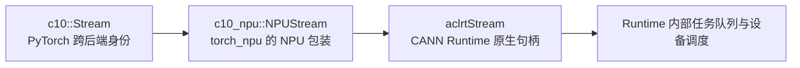
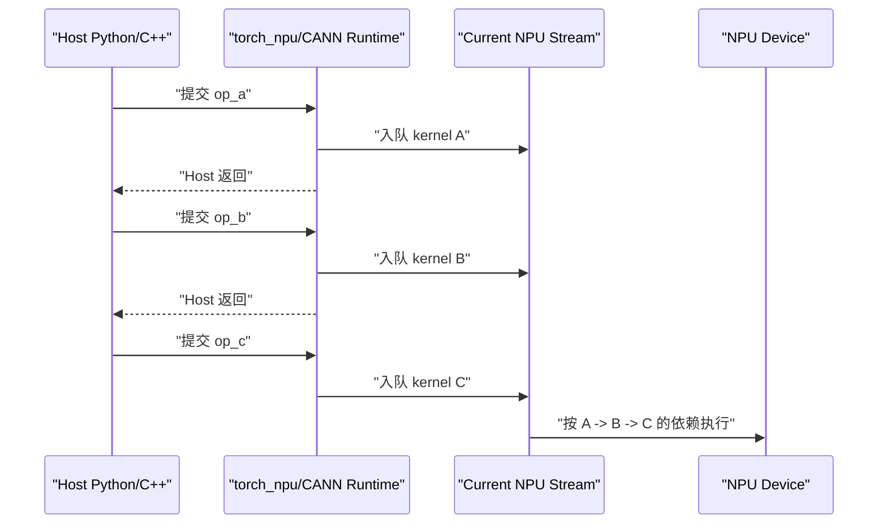
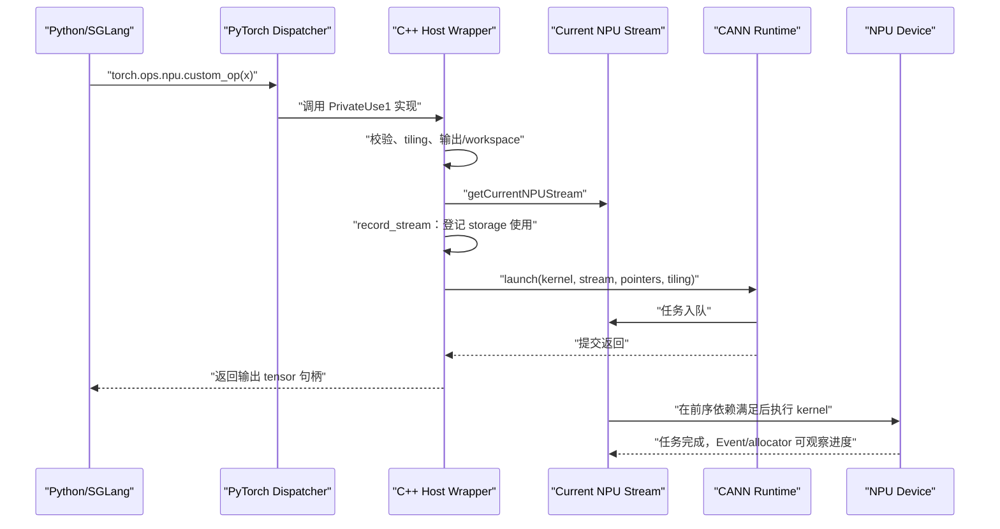

# torch_npu 02：Stream、Event、异步生命周期与计算图

> 本章解决一个贯穿 PyTorch、`torch_npu`、CANN 和 `sgl-kernel-npu` 的问题：Host 调用一个 NPU 算子后，工作如何排队、如何保持先后关系、tensor 的显存何时才能复用，以及这一切为什么不等于“组计算图”。

## 0. 学习目标

读完本章后，你应该能够回答：

1. Stream 是什么，不是什么；
2. “Host 异步提交”和“同一 Stream 内有序”为什么可以同时成立；
3. `c10::Stream`、`c10_npu::NPUStream` 与 `aclrtStream` 分别是什么类型；
4. `getCurrentNPUStream()` 为什么常出现在 Host wrapper；
5. `record_stream`、`wait_stream`、Event 和 `synchronize` 分别解决什么问题；
6. 多 Stream 如何安全地并发；
7. Stream 与 eager execution、autograd graph、NPU graph capture 的关系；
8. 如何沿 `sgl-kernel-npu` 源码识别真实的 Stream 生命周期。

建议先读：

- [基础 03：存储、搬运、队列、同步与流水](../foundations/03-memory-pipeline-and-sync.md)；
- [torch_npu 01：Dispatcher、ACLNN 与 Custom Op 的边界](./01-dispatch-aclnn-and-custom-op-boundaries.md)；
- [sgl-kernel-npu 01：仓库结构与算子生命周期](../sgl-kernel-npu/01-repository-and-op-lifecycle.md)。

---

## 1. 先给出一句准确的定义

**Stream 是 Host/runtime 用来向某个 device 提交异步任务的、有顺序的执行序列。**

这里第一次出现的几个词分别是：

- **Host**：运行 Python、PyTorch 和 C++ wrapper 的 CPU 进程；
- **runtime**：连接 Host 与 NPU 的运行时软件，在本章主要指 `torch_npu` 和 CANN Runtime；
- **device**：实际执行 kernel 的 Ascend NPU；
- **任务**：一次 kernel launch、异步内存拷贝、Event 记录/等待或算子库调用；
- **异步**：Host 把任务提交给 runtime 后通常可以先返回，不必等 NPU 完成；
- **有顺序**：同一 Stream 中，后提交任务观察到前面任务的完成顺序；这也叫 **in-order** 或 FIFO 语义。

因此下面两句话并不矛盾：

```text
对 Host：提交 A 后可以立即继续提交 B，所以是异步的。
对同一 Stream：NPU 必须维持 A -> B 的执行依赖，所以是有序的。
```

把 Stream 暂时想成“有编号的任务车道”：

- Host 是把任务放上车道的调度者；
- 同一车道上的任务不能随意超车；
- 两条车道可能并行，也可能因为争用同一硬件资源而轮流执行；
- Event 像跨车道的信号灯；
- `synchronize` 像 Host 停下来等待某条车道清空。

这个类比只解释顺序。Stream 本身不是物理传送带，也不与某个 AI Core 一一绑定。

### 1.1 软件层面：Stream 是分层的逻辑执行序列

从软件层看，“一条 Stream”不是一个单独的 C++ 容器，而是跨层保持同一身份和顺序的一组 runtime 状态：

```text
Python torch_npu.npu.Stream 对象
  -> C10/torch_npu 的 Stream ID、device ID 与 current-stream 状态
  -> torch_npu 可选的 Host Task Queue
  -> CANN aclrtStream 句柄与 Runtime 任务队列
  -> Driver/Device 调度所看到的有序任务
```

这里的 **Host Task Queue（Host 任务队列）** 是 `torch_npu` 可选的软件提交层。启用 task-queue 模式时，调用线程可以先把“稍后执行哪个 launch callback”封装成队列项，由消费线程继续调用 CANN。它和 CANN Stream 不是同一个对象：

- Host Task Queue 的任务可能是“调用一次 CANN launch API”；
- CANN Stream 中的任务才是 kernel launch、memcpy、Event wait 等 Device 工作；
- 两层异步可以同时存在：Python 线程先于 Host launch 消费线程返回，而 Host launch 又先于 NPU kernel 完成返回；
- 两层都必须保持同一逻辑 Stream 的顺序，否则 PyTorch 的 producer/consumer 语义会断裂。

`sgl-kernel-npu` 的 `EXEC_KERNEL_CMD` 会把 launch lambda 交给 `OpCommand::RunOpApi`。`torch_npu` 在 task queue 开启时把 callback 封装为 `QueueParas` 并调用 `enCurrentNPUStream`；关闭时则直接调用 callback。无论走哪条软件路径，callback 最终都把工作提交给 `aclrtStream`。

### 1.2 硬件层面：没有一块叫“Stream”的计算单元

从硬件层看，Stream 仍不是 AI Core、Vector Core、MTE、寄存器或一段 tensor 内存。更准确的过程是：

1. Host runtime 把 kernel、异步 memcpy、Event record/wait 等调用编码成设备可识别的任务；
2. Runtime/Driver 把这些任务及其 Stream 身份、先后关系提交给设备；
3. Device 的控制与调度机制按依赖取得就绪任务；
4. kernel 任务再依据 `blockDim`、kernel 类型和 tiling 被调度到 AI Core/Vector Core；
5. 搬运任务使用相应的数据搬运引擎；Event 任务更新或等待进度状态。

因此 Stream 对硬件的意义是“这批任务属于哪条有序时间线”，而不是“使用哪一颗核”。一个 kernel 可以动用多个核；同一 Stream 的下一个 kernel 也可以使用不同资源。两条 Stream 只表示 runtime **允许**无依赖任务并行，硬件是否真的重叠仍由资源占用和调度决定。

官方文档把 Stream 描述为“任务队列”是对外可依赖的**语义模型**。具体产品、CANN 版本和 fast-launch 配置可以改变内部队列、共享内存、通知和调度资源的实现，因此不要把 Stream 画成一条固定驻留在某个 AI Core 上的物理 FIFO。

---

## 2. Stream 不是什么

初学者常把名字相近但层次不同的对象混在一起。

| 对象 | 所在层 | 作用 | 是否等于 Stream |
|---|---|---|---|
| CPU thread / 线程 | Host 操作系统 | 执行 Python/C++ 代码 | 否；线程可以向 Stream 提交任务 |
| Process / 进程 | Host 操作系统 | 容纳地址空间和线程 | 否 |
| AI Core / Vector Core | NPU 硬件 | 执行矩阵、向量或搬运指令 | 否；runtime 会调度 Stream 中的任务使用硬件 |
| Kernel | Device 程序 | 完成一次并行计算 | 否；kernel launch 是 Stream 中的一项任务 |
| `TPipe` / `TQue` | Ascend C kernel 内部 | 组织单个 kernel 内的片上搬运—计算流水 | 否；它们位于 Device kernel 内部 |
| Computation Graph / 计算图 | 框架/图执行层 | 表示算子与数据依赖 | 否；图中的工作最终仍需通过 Stream 提交 |
| Event | Runtime 同步对象 | 标记某 Stream 已执行到某个位置 | 否；Event 用来建立 Stream 间依赖 |

最容易混淆的是两种“队列”：

```text
Host/runtime Stream
  管：kernel A -> memcpy B -> kernel C
  跨越多个 kernel launch

Ascend C Device TQue
  管：CopyIn tile 0 -> Compute tile 0 -> CopyOut tile 0
  只存在于某次 kernel 执行内部
```

前者是本章主题；后者见[基础 03](../foundations/03-memory-pipeline-and-sync.md)。

---

## 3. 从 Python 到 CANN：同一个 Stream 的三层表示

### 3.1 `c10::Stream`：PyTorch 的跨后端标识

`c10::Stream` 是 PyTorch C10 层的 C++ 值类型。它携带的核心信息可以理解为：

```text
设备类型 + 设备编号 + Stream 标识
```

它必须保持 backend-neutral，也就是不把 CUDA、NPU 或其他设备的原生句柄直接暴露给通用 PyTorch 代码。它是“某设备上某条 Stream 的身份凭证”，不是任务队列本体，也不是一个 NPU 地址。

### 3.2 `c10_npu::NPUStream`：torch_npu 的 NPU 包装

`c10_npu::NPUStream` 是 `torch_npu` 在 C++ 后端中的 NPU 专用包装。它把 PyTorch 的 Stream 身份映射到 NPU backend，并提供取得 CANN 原生句柄的方法。

真实源码常见：

```cpp
auto npuStream = c10_npu::getCurrentNPUStream();
```

此时：

- `auto` 推导出的类型是 `c10_npu::NPUStream`；
- 它是一个轻量 Host C++ 对象；
- `getCurrentNPUStream()` 是“查询当前 Stream”，不是创建 Stream；
- 查询动作不会启动 kernel。

### 3.3 `aclrtStream`：CANN Runtime 的不透明句柄

需要调用 CANN launch API 时，源码会进一步写：

```cpp
aclrtStream stream = c10_npu::getCurrentNPUStream().stream(false);
```

逐项解释：

- `aclrtStream` 是 CANN Runtime 定义的 **opaque handle（不透明句柄）**；
- “不透明”表示调用者只持有标识，不应依赖其内部结构；
- `.stream(false)` 从 `NPUStream` 包装中取出底层 CANN 句柄；
- 这个句柄会作为 launch 参数告诉 runtime：“把本次工作排进这条 Stream”。

三层关系是：



不要把它理解成三个不同 Stream。它们通常是同一逻辑 Stream 在不同抽象层的表示。

---

## 4. Default Stream 与 Current Stream

### 4.1 Default Stream

**Default Stream（默认 Stream）** 是设备/context 自动具备的固定默认执行序列。没有显式切换 Stream 时，框架工作通常会落到它或框架当前选定的 Stream。

“默认”描述身份，不等于“当前”永远只能是它。

### 4.2 Current Stream

**Current Stream（当前 Stream）** 是框架为当前设备和当前 Host 执行上下文选中的提交目标。大多数 PyTorch NPU 算子不会要求用户显式传 `stream` 参数，而是内部查询 current stream。

Python 中的基本接口是：

```python
import torch_npu

current = torch_npu.npu.current_stream()
default = torch_npu.npu.default_stream()
```

进入 Stream 上下文时，框架临时替换 current stream；退出后恢复：

```python
import torch
import torch_npu

side = torch_npu.npu.Stream()
with torch_npu.npu.stream(side):
    y = torch.ones(1024, device="npu") * 2
```

这段代码中：

1. `torch_npu.npu.Stream()` 创建一条非默认 Stream 的 Python 包装；
2. context manager 把 `side` 设为当前 Stream；
3. `torch.ones` 和乘法产生的 NPU 工作被提交到 `side`；
4. 离开 `with` 后，原先的 current stream 被恢复；
5. 离开 `with` 不代表 `side` 上的 NPU 工作已经完成。

### 4.3 为什么 custom op 必须使用当前 Stream

假设 PyTorch 已在当前 Stream 排入：

```text
producer(x) -> custom_op(x) -> consumer(y)
```

如果 custom wrapper 擅自新建另一条 Stream，却不建立 Event 依赖，那么：

- custom kernel 可能在 `producer` 写完 `x` 前读取；
- `consumer` 可能在 custom kernel 写完 `y` 前读取；
- bug 往往表现为偶发脏数据，而不是稳定报错。

所以 wrapper 常调用 `getCurrentNPUStream()`，让 custom kernel 自然继承 PyTorch 已建立的同 Stream 顺序。

---

## 5. 异步执行到底怎样发生

以三个连续 NPU 算子为例：

```python
a = op_a(x)
b = op_b(a)
c = op_c(b)
```

Eager 模式下可简化为：



Host 侧的 Python 语句已经执行到下一行时，Device 可能仍在运行 A。框架之所以能正确得到 `c`，不是因为每行 Python 都同步，而是因为：

1. B 与 A 在同一 Stream；
2. C 与 B 在同一 Stream；
3. 同 Stream 保证提交次序对应的执行依赖；
4. tensor 对象保存地址、shape、dtype 和 storage 生命周期，结果不需要先拷回 CPU。

“Python 函数返回”通常只表示 launch 已成功提交，不表示输出元素已经全部算好。

---

## 6. 多 Stream：并发不是自动获得的

### 6.1 不同 Stream 没有隐式先后关系

同 Stream的顺序是隐式的；不同 Stream 之间默认没有这样的顺序：

```text
Stream A: kernel A1 -> kernel A2
Stream B: kernel B1 -> kernel B2
```

A1 与 A2 有序，B1 与 B2 有序；A2 与 B1 谁先完成不能仅由提交代码顺序推出。

两条 Stream 是否真正同时占用硬件，还取决于：

- kernel 是否使用相同的 Cube/Vector/MTE 资源；
- 单个 kernel 是否已占满设备；
- 内存带宽是否成为瓶颈；
- runtime 和目标硬件是否支持对应并发；
- 两条 Stream 之间是否存在 Event 依赖。

所以“创建两条 Stream”只创造了并发机会，不保证性能提升。

### 6.2 Event 是什么

**Event（事件）** 是 runtime 中的进度标记。把 Event record 到 Stream A 后，它只有在 A 中排在它前面的任务完成时才变为完成状态。

```text
Stream A: producer(x) -> record event E
Stream B: wait event E -> consumer(x)
```

`wait event E` 通常也是异步入队：Host 不必停住，Stream B 后续任务在设备侧等待 E。

### 6.3 `wait_stream` 是什么

`wait_stream(other)` 表达“本 Stream 后续提交的工作要等待 `other` 当前已经提交的工作”。实现通常可以理解为：

1. 在 `other` 上 record 一个 Event；
2. 在本 Stream 上 enqueue 对该 Event 的 wait。

一个最小的 PyTorch NPU 结构示例：

```python
import torch
import torch_npu

main = torch_npu.npu.current_stream()
side = torch_npu.npu.Stream()
x = torch.ones(1024, device="npu")

# side 读取 x 前，等待 main 上此前产生 x 的任务。
side.wait_stream(main)
with torch_npu.npu.stream(side):
    x.record_stream(side)
    y = x * 2

# main 使用 y 前，等待 side 上此前产生 y 的任务。
main.wait_stream(side)
z = y + 1
```

这里有两类不同保障：

- 两个 `wait_stream` 建立**执行依赖**；
- `x.record_stream(side)` 建立**内存生命周期记录**。

它们不能互相替代。

---

## 7. `record_stream`：它记录的是 storage 使用，不是计算顺序

### 7.1 allocator 为什么需要它

PyTorch 使用 caching allocator（缓存分配器）管理 NPU 显存。tensor Python/C++ 对象销毁后，allocator 通常不是把显存立即还给系统，而是把内存块放进缓存，供后续 tensor 复用。

异步执行带来一个时间差：

```text
Host：tensor 对象已经离开作用域
Device：某条 Stream 上的 kernel 仍在读/写其 storage
```

这里的 **storage** 是 tensor 元素实际占用的底层内存；tensor 对象是持有 shape、stride、dtype、device 与 storage 引用的上层句柄。

如果 allocator 不知道这条 Stream 仍在使用 storage，就可能过早把同一地址分给另一个 tensor，形成 use-after-free/early-reuse 式数据竞争。

### 7.2 `record_stream(stream)` 的准确语义

`tensor.record_stream(stream)` 告诉 caching allocator：

> 这个 tensor 的 storage 已被 `stream` 使用；在该 Stream 已提交的相关工作完成前，不要把这块内存重新分配给别的 tensor。

它：

- 不启动 kernel；
- 不把 tensor “复制到 Stream”；
- 不让 Stream B 等待 Stream A；
- 不阻塞 CPU；
- 不捕获计算图；
- 只补充 allocator 对异步使用关系的认识。

创建 tensor 的 Stream 通常已被 allocator 知道。`record_stream` 最关键的场景是：

- tensor 在另一条 side stream 上被使用；
- custom C++ wrapper 取出原生 `aclrtStream` 后，在非 allocation stream 直接 launch；
- allocator 无法从普通框架算子路径推断这次**跨 Stream**异步使用。

只有 raw-pointer launch、但 storage 始终在 allocation/current stream 上使用，并不足以要求 `record_stream`；同 Stream 的 allocator 顺序通常已经安全。

### 7.3 为什么它不能替代 `wait_stream`

假设 A 产生 `x`，B 消费 `x`：

```text
record_stream(B) 只解决：x 的地址别被过早复用。
wait_stream(A)    才解决：B 别在 A 写完 x 前读取。
```

只调用 `record_stream`，内存地址可能还活着，但其中的数据仍可能没写完。

### 7.4 为什么 `sgl-kernel-npu` 只有 `apply_token_bitmask` 显式调用它

先区分“源码事实”和“可以推出的结论”。

在课程固定的 `sgl-kernel-npu@d5630dff` 中，对非 Markdown 源码全文检索后，显式调用只有：

```cpp
workingLogits.record_stream(npuStream);
workingBitmask.record_stream(npuStream);
```

它不能推出“其他算子不异步”，也不能推出“只有这个算子需要管理生命周期”。绝大多数 kernel launch 都是异步的。是否需要显式 `record_stream`，由 **storage 的 allocation stream 与实际使用 stream 是否相同**决定，而不是由算子名字决定。

#### 情况 A：只在 allocation stream 上使用，通常不需要

Caching allocator 在分配内存块时会记录 **allocation stream（分配 Stream，也称 creation/origin stream）**。如果 tensor 随后只在这条 Stream 上使用：

```text
Stream S: allocate block -> kernel reads/writes block -> block reused -> next kernel uses block
```

即使 Host 看起来已经把同一地址重新分配给新 tensor，未来对该地址的 Device 操作仍排在 S 的旧操作之后。因此 allocator 已有足够信息，显式记录同一个 S 通常不增加新的正确性知识。

这就是大量普通 PyTorch/torch_npu 算子不写 `record_stream` 的主要原因。输入、输出和临时 workspace 通常在 current stream 上产生并在同一 current stream 上使用。

#### 情况 B：storage 被非 allocation stream 使用，需要额外处理

设 storage 在 S0 分配，却在 S1 上使用：

```text
S0: allocate x ----------------------> reuse x's block?
S1:              kernel still uses x
```

Allocator 默认只知道 S0。若 Host 引用消失，它可能按 S0 的时间线复用地址，而 S1 还没结束。此时有两个正确方案：

1. `x.record_stream(S1)`：让 allocator 在回收时为 S1 建立完成检查/Event；
2. 手工 Event：在释放 `x` 前让 S0 等待 S1，使 reuse 回到 allocator 已知的 S0 顺序。

#### `apply_token_bitmask` 为什么选择显式记录

这个 wrapper 有几个值得作者防御的特点：

1. `workingLogits`/`workingBitmask` 可能是 `zeros`、advanced indexing 或 `contiguous` 新建的**局部临时 tensor**；
2. 它们也可能直接 alias（共享 storage）调用方输入；
3. `EXEC_KERNEL_CMD` 的 `ConvertType(const at::Tensor&)` 只保留 `data_ptr()`，launch lambda 捕获的是裸地址而不是 `at::Tensor` 引用；
4. `RunOpApi` 在 torch_npu task queue 开启时还可能先排入 Host 软件队列，之后才真正调用 CANN launch；
5. wrapper 随后发起 `copy_`/`index_put_`，最终返回的是 `logits`，而 working tensor 本身不会返回给调用者。

所以这两行明确表达：“无论 working storage 最初来自哪条 Stream，也无论 raw-pointer launch 何时完成，都把本次 current-stream 使用登记给 allocator。”这是保守、局部且容易审计的做法。

但必须保持严谨：

- 若 working tensor 确实在当前 S 上分配、只在 S 上使用，这次 `record_stream(S)` 很可能是冗余保险；
- `EXEC_KERNEL_CMD` 在可见源码中不会统一对所有 tensor 调用 `record_stream`；
- 其他 wrapper 没写它不等于必然有 bug，因为同 Stream allocator 语义可能已经足够；
- 若其他 wrapper 把 storage 用到非 allocation stream，又既没记录也没用 Event 回接 creation stream，那就应视为需要审计的潜在生命周期 bug；
- “把 tensor 转成裸指针”会让通用 wrapper 更难自动推断使用关系，但裸指针本身不是必须调用 `record_stream` 的充分条件；真正判据仍是 Stream 与生命周期。

可以用下面的决策表审查每一个算子：

| 问题 | 是 | 否 |
|---|---|---|
| storage 只在 allocation/current stream 使用？ | 通常不需额外记录 | 继续检查 |
| tensor 对象被 launch framework 持有到异步使用登记完成？ | 可依赖框架合同 | 继续检查 |
| 非 allocation stream 的使用已 `record_stream`？ | allocator 可延迟复用 | 继续检查 |
| creation stream 在释放前已 Event-wait 使用 stream？ | 可手工保证安全 | 存在潜在 early-reuse 风险 |

最后还要单独检查**数据就绪**：上表只审计地址何时能复用，跨 Stream producer/consumer 仍需 Event/wait。

---

## 8. 六类同步机制必须分开

| 机制 | 谁等待谁 | Host 是否阻塞 | 主要用途 |
|---|---|---:|---|
| 同一 Stream 顺序 | 后任务等前任务 | 否 | 普通算子依赖 |
| `wait_event` / `wait_stream` | 一条 Stream 等另一条 Stream 的进度 | 否 | 跨 Stream 依赖 |
| `stream.synchronize()` | Host 等某条 Stream | 是 | 调试、读取结果、准确计时 |
| `torch_npu.npu.synchronize()` | Host 等当前设备上已提交工作 | 是 | 全设备边界同步 |
| `query()` | 不等待，只查询完成状态 | 否 | 轮询/状态检查 |
| `record_stream()` | 没有执行者等待 | 否 | allocator 生命周期跟踪 |

### 8.1 为什么不能每个算子后都 `synchronize`

如果写成：

```text
launch A -> CPU 等 A -> launch B -> CPU 等 B -> launch C -> CPU 等 C
```

就破坏了 Host 提前准备后续工作以及 runtime/device 重叠调度的机会。正确做法通常是只在真正跨越异步边界时同步，例如：

- 把 NPU tensor 内容拷回 CPU 并立即读取；
- benchmark 要测量已经完成的 device 时间；
- 调试时需要定位具体失败算子；
- 调用不共享 Stream 语义的外部系统。

生产路径应优先使用同 Stream 顺序或 Event，而不是粗粒度 device synchronize。

---

## 9. 源码精读：`sgl-kernel-npu` 怎样接入当前 Stream

本节基于课程固定的 `sgl-kernel-npu` commit。

### 9.1 `apply_token_bitmask` 的对象与顺序

源码位置：

- [`apply_token_bitmask.cpp#L133-L153`](https://github.com/sgl-project/sgl-kernel-npu/blob/d5630dff41c8108216f835597e63f6d3a7445908/csrc/apply_token_bitmask/op_host/apply_token_bitmask.cpp#L133-L153)

固定 commit 的真实源码摘录：

```cpp
// Prevent NPU storage from being reclaimed before async kernel completes
auto npuStream = c10_npu::getCurrentNPUStream();
workingLogits.record_stream(npuStream);
workingBitmask.record_stream(npuStream);

// ...
if (dtype == at::kFloat) {
    EXEC_KERNEL_CMD(apply_token_bitmask_fp32, blockDim, workingLogits,
                    workingBitmask, numRowsU32, vocabSizeU32,
                    logitsStrideU32, bitmaskStrideU32, baseRows,
                    extraCores, tileLength, blockDim, dtypeSizeU32);
}
```

逐行解释：

1. `workingLogits`、`workingBitmask` 的 C++ 类型是 `at::Tensor`；
2. 它们是 Host 句柄，但底层 storage 位于 NPU GM；
3. `npuStream` 是 `c10_npu::NPUStream`，表示当前 PyTorch NPU Stream；
4. 两次 `record_stream` 告知 allocator：异步 kernel 完成前不要复用这些 storage；
5. `EXEC_KERNEL_CMD` 是 Host launch 封装，不是在 CPU 上执行 kernel 数学；
6. launch 被提交到当前 Stream，因此它自然排在该 Stream 先前的 producer 后面；
7. wrapper 可以在 Device 完成前返回，因而必须正确维护 storage 生命周期。

这里不应读成“每个 raw-pointer launch 都必须逐 tensor 调用 `record_stream`”。这两行是本 wrapper 对 working tensor 的显式防御；同 allocation/current stream 的普通 tensor 通常已由 caching allocator 正确管理。完整判据见[第 7.4 节](#74-为什么-sgl-kernel-npu-只有-apply_token_bitmask-显式调用它)。

对应算子的完整算法见[Ascend C 实战：apply_token_bitmask](../sgl-kernel-npu/03-ascend-c-apply-token-bitmask.md)。

### 9.2 直接取得 `aclrtStream`

CATLASS Host wrapper 中能看到：

```cpp
aclrtStream stream = c10_npu::getCurrentNPUStream().stream(false);
```

源码位置：

- [`catlass_matmul_fp8.cpp#L56-L65`](https://github.com/sgl-project/sgl-kernel-npu/blob/d5630dff41c8108216f835597e63f6d3a7445908/csrc/catlass/op_host/catlass_matmul_fp8.cpp#L56-L65)

此处发生的是类型桥接：

```text
PyTorch 当前 Stream
  -> torch_npu NPUStream wrapper
  -> CANN aclrtStream handle
  -> CATLASS/CANN launch API
```

这也解释了为什么代码里“看不到一个 Host 进程”：这段 C++ wrapper 本身就运行在当前 Python 服务进程的 Host 线程中。Host 是执行位置和职责，不是必须名为 `host` 的独立进程。

### 9.3 `OpCommand` / ACLNN 也要传 Stream

ACLNN 两段式调用通常先取得 workspace 大小与 executor，再用：

```text
workspace + executor + current aclrtStream
```

提交执行。算法实现可能来自 CANN 算子库，但异步顺序仍由传入的 Stream 承载。详见[torch_npu 01](./01-dispatch-aclnn-and-custom-op-boundaries.md)。

---

## 10. CANN Runtime 层看到的结构

下面是 CANN C/C++ 接口的结构示意，省略错误检查和资源管理细节，不能直接作为生产代码：

```cpp
aclrtStream stream = nullptr;
aclrtCreateStream(&stream);

aclrtMemcpyAsync(dst, dstBytes, src, srcBytes,
                 ACL_MEMCPY_HOST_TO_DEVICE, stream);

// 某个由构建系统生成或声明的 kernel launch 入口：
// aclrtlaunch_my_kernel(blockDim, stream, input, output, tiling);

aclrtSynchronizeStream(stream);
aclrtDestroyStream(stream);
```

关键不是 API 拼写，而是生命周期：

1. Host 创建/取得 Stream；
2. 异步 memcpy 和 launch 都带同一 `aclrtStream`；
3. runtime 维持同 Stream 的顺序；
4. 只有确实需要 Host 看到完成结果时才同步；
5. 使用框架时通常不应绕过 `torch_npu` 随意创建 Stream，否则要自行处理当前设备、依赖、allocator 与销毁时机。

---

## 11. Stream 和计算图是不是一回事

**不是。**

### 11.1 三种经常被简称为“图”的东西

| 名称 | 表示什么 | 与 Stream 的关系 |
|---|---|---|
| Eager execution | Python 执行到一个算子就提交一个算子 | 不需要先组图，但仍使用 Stream |
| Autograd graph | 训练时记录求导所需的算子/张量依赖 DAG | 描述梯度依赖；实际 backward kernel 仍通过 Stream 执行 |
| NPU graph capture / NPUGraph | 捕获一段相对稳定的 launch 序列，之后整体 replay | 捕获和 replay 都依赖 Stream；图不是 Stream |

**DAG（有向无环图）** 是用有方向的边表示先后/数据依赖，并且不存在循环依赖的图结构。

### 11.2 它们回答的问题不同

```text
计算图回答：要执行哪些算子？tensor 之间有什么数据依赖？
Stream 回答：这些 device 任务提交到哪条有序执行序列？何时能与其他任务并发？
```

可以类比为：

- 计算图是菜谱和步骤依赖；
- Stream 是厨房中的加工流水线；
- Event 是两条流水线之间的交接信号；
- graph replay 是把预先记录的一组步骤再次整体提交；
- 菜谱不是流水线，流水线也不决定菜谱内容。

### 11.3 Graph capture 为什么总会提到 Stream

`torch_npu` 的图捕获实现会选择一条 capture stream，在其上下文中执行待捕获区域，然后调用 capture begin/end。这样 runtime 才知道要记录哪条提交序列。

概念流程是：


因此：

- 没有 graph capture，也可以正常使用 Stream；
- graph capture 借助 Stream 记录执行序列；
- replay 后的 device 工作仍要服从 Stream/Event 同步；
- 捕获的图通常要求地址、shape、控制流和资源使用满足实现约束，不能把任意动态 Python 行为都录进去。

---

## 12. 一条完整的 Host 到 Device 时间线

以 custom Ascend C operator 为例：



注意最后两行可能发生在 Python 已继续运行之后。

---

## 13. 常见错误与排查方法

### 13.1 把 Host 返回当成 Device 完成

症状：计时过短、CPU 读取到未完成结果、错误定位落在后续同步点。

排查：在调试或计时边界显式同步；生产代码再改回最小必要依赖。

### 13.2 custom kernel 启动到错误 Stream

症状：单独测试正确，接入模型后偶现错误；加全设备同步后“神奇恢复”。

排查：沿 wrapper 检查是否使用当前设备的 current stream，是否偷偷创建了新 Stream。

### 13.3 把 `record_stream` 当成执行同步

症状：地址没有被复用，但消费者仍读取到 producer 未完成的数据。

排查：跨 Stream 数据依赖必须用 Event/`wait_stream`。

### 13.4 忘记 side stream 上的 storage 生命周期

症状：allocator 压力大或对象很快离开作用域时出现随机数据损坏。

排查：确认 side-stream 使用的 tensor 是否由框架自动跟踪；原生 custom launch 要显式审计 `record_stream`。

### 13.5 到处调用 device synchronize

症状：正确但吞吐下降、Host/Device 时间线出现大空洞、多 Stream 没有重叠。

排查：把全局同步收缩成同 Stream 顺序或精确 Event 依赖。

### 13.6 用 CPU 墙钟直接测异步 kernel

症状：测到的只是 launch 开销。

排查：使用 NPU Event 计时，或在测量区间末尾同步；预热并区分 graph capture、allocator 和编译开销。

---

## 14. 源码阅读清单

阅读任何包含 Stream 的 Host wrapper 时，按以下顺序标注：

1. 当前 device 是谁；
2. Stream 是 default、current 还是显式创建；
3. 变量类型是 `c10::Stream`、`c10_npu::NPUStream` 还是 `aclrtStream`；
4. producer 与 consumer 是否在同一 Stream；
5. 跨 Stream 时 Event/wait 在哪里；
6. tensor storage 的 allocator 生命周期是否被跟踪；
7. Host 在哪里真正阻塞；
8. graph capture 时是否使用专门的 capture stream；
9. launch API 是否收到正确的 Stream 句柄；
10. 是否用不必要的全设备同步掩盖了依赖错误。

---

## 15. 本章检查点与详细答案

### 问题 1：Stream 异步，为什么同一 Stream 中 B 仍能安全读取 A 的输出？

**答案：**“异步”描述 Host 不等待 Device；“有序”描述同一 Stream 中 Device 任务的先后依赖。Host 可以快速提交 A、B，但 runtime 保证 B 不会越过它依赖的 A。二者作用对象不同，因此不冲突。

### 问题 2：为什么 custom wrapper 应取得 current stream，而不是总用 default stream？

**答案：**上层调用者可能已经通过 Stream context/guard 把 current stream 切换到 side stream。producer 和后续 consumer 都排在 current stream。custom op 若强行投到 default stream，就离开了原有顺序链，需要额外 Event 才能正确；若没有 Event，就可能提前读/写。使用 current stream 才能服从调用者的调度语义。

### 问题 3：`record_stream` 与 `wait_stream` 的本质区别是什么？

**答案：**前者面向 allocator，说明 storage 在哪条 Stream 上仍可能被异步访问，防止地址过早复用；后者面向执行依赖，让一条 Stream 的后续任务等待另一条 Stream 已提交任务。一个保证“内存还活着”，另一个保证“数据已经准备好”。

### 问题 4：`c10_npu::getCurrentNPUStream().stream(false)` 每一步得到什么？

**答案：**`getCurrentNPUStream()` 返回 `c10_npu::NPUStream` Host 包装，代表 PyTorch 当前 NPU Stream；`.stream(false)` 取出 CANN 可识别的原生 `aclrtStream` 不透明句柄。前者服务 torch_npu/PyTorch 类型体系，后者用于底层 CANN launch。

### 问题 5：两条 Stream 是否一定比一条快？

**答案：**不一定。多 Stream 只允许没有依赖的任务被 runtime 并发考虑。如果单个 kernel 已占满 AI Core、两者争用内存带宽、存在 Event 依赖或硬件不支持对应重叠，它们仍可能串行，额外 Event 和调度还会增加开销。必须用真实 workload 和 profiler 验证。

### 问题 6：Stream 与计算图最简洁的区别是什么？

**答案：**图描述“有什么计算和数据依赖”，Stream 描述“device 任务提交到哪条有序执行序列”。Eager 没有预先捕获执行图也照样使用 Stream；NPUGraph 捕获时利用 Stream 记录 launch，replay 时仍由 Stream 承载执行。

### 问题 7：为什么 `stream.synchronize()` 能修好某些 bug，却通常不是正确修复？

**答案：**它让 Host 等待该 Stream 完成，把原本并发的时间线强制截断，因此能偶然覆盖错误的跨 Stream 依赖或生命周期问题。但它牺牲重叠和吞吐，而且可能只隐藏根因。正确修复应是使用正确 current stream、精确 Event/wait 与 allocator 记录。

### 问题 8：一条 Stream 是否固定绑定一个 AI Core？

**答案：**不是。Stream 是 runtime 的逻辑提交序列；kernel 的 `blockDim`、tiling、kernel 类型和设备调度决定它使用哪些 AI Core/Vector Core 等资源。多个 kernel 任务可以先后使用不同资源，一条 Stream 不等于一条硬件核。

### 问题 9：为什么只有 `apply_token_bitmask` 写了 `record_stream`，其他算子是不是漏写了？

**答案：**不能按出现次数判断。Allocator 已知道 storage 的 allocation stream，只在该 Stream 上使用时通常无需再次记录。`apply_token_bitmask` 对可能新建或 alias 的局部 working tensor、裸指针 callback 和异步 task-queue 路径做了显式保守登记；如果 working tensor 的 allocation stream 就是 current stream，这个调用可能只是冗余保险。其他算子若始终遵守同 Stream 使用或用 Event 把非 creation-stream 使用同步回去，可以安全地不写；若确实跨 Stream 又没有任何记录/同步，才是需要修复的风险。必须逐条追踪 allocation、use、deallocation 三条时间线，不能从文件里有没有这一行直接下结论。

---

## 16. 官方资料与固定源码

- [PyTorch C++：C10 Streams](https://docs.pytorch.org/cppdocs/api/c10/streams.html)
- [PyTorch：`Tensor.record_stream`](https://docs.pytorch.org/docs/stable/generated/torch.Tensor.record_stream.html)
- [`torch_npu` Stream Python 实现（固定 commit）](https://github.com/Ascend/pytorch/blob/86986b9711ef597e83edc41da1f02c34a03fea7b/torch_npu/npu/streams.py)
- [`torch_npu` current/default stream 与 context manager（固定 commit）](https://github.com/Ascend/pytorch/blob/86986b9711ef597e83edc41da1f02c34a03fea7b/torch_npu/npu/utils.py)
- [`torch_npu` graph capture 实现（固定 commit）](https://github.com/Ascend/pytorch/blob/86986b9711ef597e83edc41da1f02c34a03fea7b/torch_npu/npu/graphs.py)
- [`torch_npu` C++ `NPUStream` 定义（固定 commit）](https://github.com/Ascend/pytorch/blob/86986b9711ef597e83edc41da1f02c34a03fea7b/torch_npu/csrc/core/npu/NPUStream.h)
- [`torch_npu` `OpCommand::RunOpApi` 与 Host task queue（固定 commit）](https://github.com/Ascend/pytorch/blob/86986b9711ef597e83edc41da1f02c34a03fea7b/torch_npu/csrc/framework/OpCommand.cpp)
- [`torch_npu` NPU caching allocator 的 allocation stream 与 `recordStream`](https://gitee.com/ascend/pytorch/blob/e04f000ce9e11177d193a398644d8fcb67a90cef/torch_npu/csrc/core/npu/NPUCachingAllocator.cpp)
- [`sgl-kernel-npu` `EXEC_KERNEL_CMD` 与裸地址转换（固定 commit）](https://github.com/sgl-project/sgl-kernel-npu/blob/d5630dff41c8108216f835597e63f6d3a7445908/csrc/utils/torch_helper.h#L120-L134)
- [CANN：同步等待](https://www.hiascend.com/document/detail/zh/CANNCommunityEdition/900/API/appdevgapi/aclcppdevg_03_0093.html)
- [CANN：Stream 管理与单/多 Stream 语义](https://www.hiascend.com/document/detail/zh/CANNCommunityEdition/800alpha001/devguide/appdevg/aclcppdevg/aclcppdevg_000011.html)
- [CANN：`aclrtCreateStream`](https://www.hiascend.com/document/detail/zh/CANNCommunityEdition/900/API/runtimeapi/aclcppdevg_03_0066.html)
