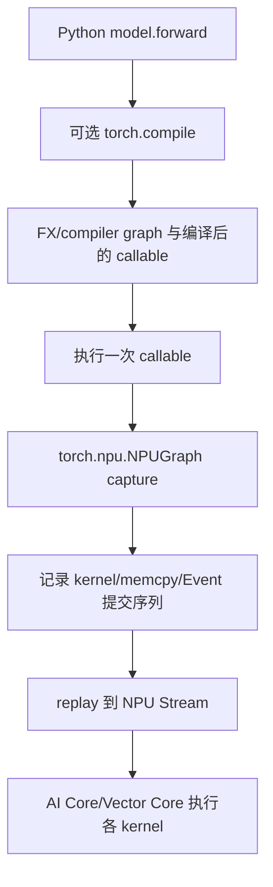
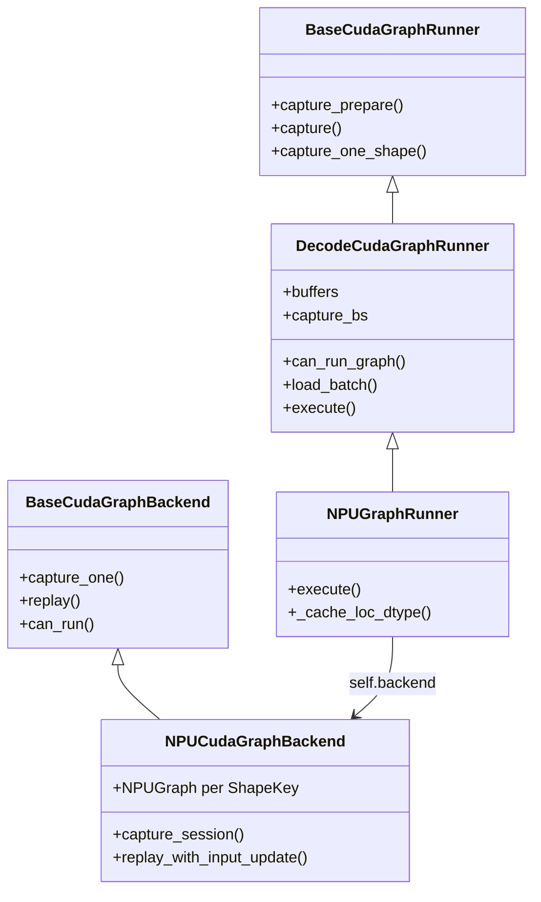
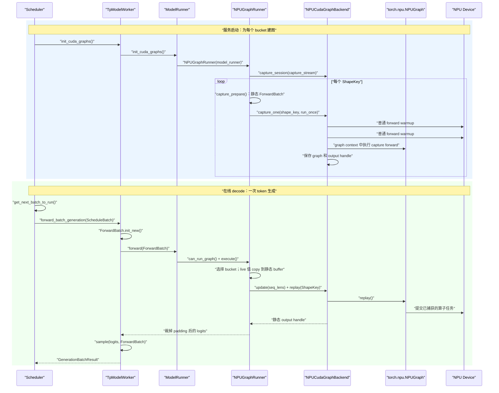

# 05：计算图、torch.compile 与 SGLang NPU Graph 源码全链路

> 本章基于 `SGLang@9a03bebf13996b628f8335628a691dcb3aa8400b`，回答四个问题：计算图到底是什么；一个模型是不是只有一张图；warmup 与 capture 有什么区别和关系；SGLang 如何从调度器一路进入 `torch.npu.NPUGraph` 的 capture/replay。

## 0. 先建立四个不同的“图”

“计算图”不是一个精确到只有一种实现的词。源码阅读时至少要区分：

| 名称 | 节点/边表示什么 | 何时产生 | 本章是否重点 |
|---|---|---|---|
| 概念上的模型计算图 | linear、attention、MoE 等数学运算及 tensor 依赖 | 描述模型结构时 | 是基础 |
| Autograd graph | 为反向传播保存的 operation 与梯度依赖 | 训练 forward 运行时动态建立 | 不是推理重点 |
| FX/Compiler graph | `torch.compile` 从 Python 程序提取的 IR 图 | 编译/guard 命中时 | 是 |
| NPUGraph launch graph | 一次执行中已经确定的 kernel、memcpy、Event 等 Device 提交序列 | capture 时 | 是核心 |

**IR（Intermediate Representation，中间表示）** 是编译器用于分析和改写程序的内部结构。

**Guard（守卫条件）** 是编译器对 dtype、shape、对象属性等前提做的运行时检查；不满足时可能重新编译或 fallback。
**Launch graph（启动图）** 关心的是“提交哪些设备任务”，不等于数学公式本身。

最重要的分层是：



`torch.compile` 和 NPUGraph 可以叠加，也可以只用其中一个。前者尝试优化“程序/算子图”，后者复用“运行时 launch 序列”。

---

## 1. 一个模型有一张专门的图吗

### 1.1 图功能是通用的

`torch.npu.NPUGraph()` 是 torch_npu 提供的通用 runtime capture/replay 能力。它不知道“这是 GLM、DeepSeek 还是 Qwen”，只观察 capture 区间里向 NPU 提交了什么工作。

SGLang 的 `NPUGraphRunner` 也是通用 runner。它调用具体模型的 `forward`，而不是为每个 Hugging Face architecture 手写完整图。

### 1.2 捕获产物又是高度专用的

虽然功能通用，每次产生的 graph artifact（图产物）却依赖：

- 当前模型及其实际 forward 分支；
- 当前 TP/PP rank 的权重和通信调用；
- NPU device/context；
- 输入、输出、workspace 的 Device 地址；
- batch/token 捕获规格；
- decode、target verify 等 forward mode；
- attention backend 与 metadata 结构；
- LoRA variant、PDMux Stream 等可进入 `ShapeKey` 的维度；
- torch、torch_npu、CANN 和 kernel 版本。

因此准确说法是：

> 模型不会随权重文件附带一张永久通用的 NPUGraph；SGLang 在服务进程初始化/首次捕获时，利用通用机制为当前执行环境建立一族专用图实例。

### 1.3 同一个模型为什么需要多张图

当前 `DecodeCudaGraphRunner` 构造 `capture_bs`，并通过 backend 保存：

```python
self._graphs: Dict[Any, Any] = {}
self._outputs: Dict[Any, Any] = {}
```

NPU backend 的 key 是 `ShapeKey`。通用 runner 中：

```python
def _make_graph_key(self, size, stream_idx=None, variant_label=None):
    return ShapeKey(
        size=size,
        stream_idx=stream_idx,
        variant_label=variant_label,
    )
```

所以一个简化例子可能是：

```text
GLM-4.7-Flash / rank 0 / NPU 0
  ShapeKey(size=1)  -> NPUGraph A
  ShapeKey(size=2)  -> NPUGraph B
  ShapeKey(size=4)  -> NPUGraph C
  ShapeKey(size=8)  -> NPUGraph D
  ShapeKey(size=8, variant_label="lora") -> NPUGraph E
```

每个 TP rank 都有自己的模型分片和地址，通常各自 capture。它们不是共享一个 Python graph 对象。

---

## 2. 为什么推理要用 launch graph

LLM decode 每轮通常只为每个请求生成一个或少量 token。单轮计算比 prefill 小，但要重复很多次：

```text
Python 调度
  -> dispatcher
  -> wrapper/tiling/workspace
  -> kernel launch 1
  -> kernel launch 2
  -> ...
  -> 下一轮 decode 再来一次
```

当 kernel 本身较短时，Host dispatch、Python、runtime launch 和小 kernel 之间的空隙占比会变大。

NPUGraph capture 一次稳定序列，replay 时让 runtime 复用它：

```text
首次：准备静态输入 -> warmup -> capture 完整 launch 序列
后续：把新数据 copy 到静态地址 -> replay -> 取静态输出 view
```

它主要降低重复 launch/control overhead，不会：

- 改变模型数学公式；
- 自动把所有 kernel 融成一个 mega kernel；
- 自动减少每个 kernel 内的 GM 搬运；
- 让动态 Python 控制流任意变化；
- 取代 Stream 和 Event。

---

## 3. 静态地址为什么是核心

假设 capture 时 kernel 记录输入地址 `0x1000`、输出地址 `0x2000`。Replay 复用的是这条已经准备好的 launch，因此不能只把 Python 变量 `x` 改成指向 `0x3000`，就期待图自动认识新地址。

常见结构是：

```python
static_x = torch.empty_like(example_x)
graph = torch.npu.NPUGraph()

with torch.npu.graph(graph):
    static_y = model(static_x)

def run(live_x):
    static_x.copy_(live_x)
    graph.replay()
    return static_y
```

这段展示的是真实 API 语法，但省略了 warmup、capture Stream、memory pool、错误检查和模型兼容条件。关键点是：

- `static_x` 的地址不变，内容每轮更新；
- `static_y` 的地址也不变；
- `graph.replay()` 异步重写 `static_y` 的内容；
- 返回的是同一个 output tensor handle；
- 若要跨下一次 replay 长期保存旧结果，需要在正确 Stream 上 clone/copy。

这也直接解释了“计算没完成为什么能返回 tensor”：返回的是静态 storage 句柄，后续同 Stream 消费者会排在 replay 后面；真正 `.cpu()`/`.item()` 时框架才等待 Device 数据。

---

## 4. SGLang 从哪里选择 NPU Graph

### 4.1 初始化

固定源码：

- [`model_runner.py#L909-L916`](https://github.com/sgl-project/sglang/blob/9a03bebf13996b628f8335628a691dcb3aa8400b/python/sglang/srt/model_executor/model_runner.py#L909-L916)

```python
def init_cuda_graphs(self, capture_decode_cuda_graph: bool = True):
    capture = capture_cuda_graphs(
        model_runner=self, capture_decode_cuda_graph=capture_decode_cuda_graph
    )
    self.eager_runner = capture.eager_runner
    self.prefill_cuda_graph_runner = capture.prefill_runner
    self.decode_cuda_graph_runner = capture.decode.runner
```

名字保留 `cuda_graph` 是跨平台历史接口，不证明 NPU 使用 CUDA。工厂根据 device 选择 NPU runner/backend。

### 4.2 每轮 forward 的分支

固定源码：

- [`model_runner.py#L1479-L1516`](https://github.com/sgl-project/sglang/blob/9a03bebf13996b628f8335628a691dcb3aa8400b/python/sglang/srt/model_executor/model_runner.py#L1479-L1516)

核心真实语法：

```python
can_run_graph = bool(
    mode_check()
    and self.decode_cuda_graph_runner
    and self.decode_cuda_graph_runner.can_run_graph(forward_batch)
)

if can_run_graph:
    ret = self.decode_cuda_graph_runner.execute(
        forward_batch,
        pp_proxy_tensors=pp_proxy_tensors,
    )
    return ModelRunnerOutput(logits_output=ret, can_run_graph=can_run_graph)
```

三个条件分别问：

1. 当前 `ForwardMode` 是否允许 graph；
2. runner 是否已初始化；
3. 当前 batch 是否能映射到已 capture 的 `ShapeKey`。

不满足就走 eager 或其他 prefill 路径。Graph 是优化 fast path，不是模型正确性的唯一实现。

---

## 5. 通用 runner 与 NPU backend 的继承关系



名称里的 CUDA 表示通用框架最初来自 CUDA Graph。NPU 子类复用 shape bucket、buffer、ForwardBatch 等平台无关逻辑，再把设备 graph backend 换成 `NPUCudaGraphBackend`。

[`resolve_decode_backend()`](https://github.com/sgl-project/sglang/blob/9a03bebf13996b628f8335628a691dcb3aa8400b/python/sglang/srt/model_executor/runner_backend/utils.py#L52-L73) 明确写了：

```python
if model_runner.device == "npu":
    from sglang.srt.hardware_backend.npu.graph_runner.npu_cudagraph_backend import (
        NPUCudaGraphBackend,
    )
    return NPUCudaGraphBackend(...)
```

---

## 6. Capture：一张图怎样生成

### 6.1 选择 bucket

这里必须把 **batch size** 和 **bucket** 分开：

- **Batch size** 是一次 forward 中的请求/序列数量，源码常缩写为 `bs`。
- **Batch-size bucket** 是预先选择的某个可复用执行规格；这个规格以一个离散的 batch size 作为键。
- `capture_bs` 是“需要捕获的 batch size 列表”，例如 `[1, 2, 4, 8]`。列表中的每个值对应一张普通 decode 图。

所以 `bs` 的展开是 **batch size**，不是 `bucket size`。在 `for bs in capture_bs` 里，同一个整数同时扮演两个角色：

```text
bs = 8
  语义 1：这次图按 batch size 8 执行
  语义 2：用数值 8 查找“batch-size=8”这个 bucket/ShapeKey
```

更精确的例子是：

```text
live batch:
  raw_bs = 5                 # 线上真实请求数

captured batch-size buckets:
  capture_bs = [1, 2, 4, 8]

选择结果:
  bs = 8                     # 捕获/补齐后的 batch size
  graph_key = ShapeKey(size=8)
```

真实 batch 5 被 padding 到 captured batch size 8，然后复用以 `8` 为键的图。“bucket”不是另外装着 8 个 batch 的容器，“bucket size”也不是 8 个 batch；这里的 8 就是这张图支持的 batch size。

`get_batch_sizes_to_capture()` 会读取 graph 配置、最大请求数、TP 对齐要求和 compile 上限，生成 `capture_bs` 与 `compile_bs`。

捕获多张图的代价是：

- 启动时间增加；
- graph 和静态 buffer 占用更多 Device memory；
- 覆盖更多 shape，eager fallback 减少。

### 6.2 创建最大静态 buffer

`DecodeCudaGraphRunner` 持有 `DecodeInputBuffers`，最大尺寸覆盖 `max(capture_bs)`。里面包括：

- `input_ids`；
- `positions`；
- `req_pool_indices`；
- `seq_lens`；
- `out_cache_loc`；
- attention/page-table metadata；
- speculative decoding 相关 buffer。

捕获 size=1/2/4 时通常使用这些 buffer 的前缀 view，因此地址稳定。

### 6.3 warmup 为什么在 capture 前

#### 6.3.1 先给出严格定义

**Warmup（预热）** 是在正式计时、正式 capture 或正式服务前，使用与目标路径相同或足够相似的输入，实际执行若干次 forward，让“第一次才会发生”的工作提前发生。

这里的“第一次工作”可能包括：

- Python 模块的惰性初始化；
- `torch.compile`/Dynamo/编译 backend 第一次生成可执行代码；
- kernel 或算子二进制加载；
- 算子选择、autotune、workspace 查询与分配；
- allocator 建立缓存；
- 通信器、attention backend metadata 或运行时资源初始化。

**Capture（捕获）** 则是在 `torch.npu.graph(...)` 上下文中真正执行一次 forward，由 runtime 记录这次执行提交的 Device 任务、依赖和内存合同，最终生成可 `replay()` 的 `NPUGraph`。

因此：

| 比较项 | warmup | capture |
|---|---|---|
| 是否真的执行 forward | 是 | 是 |
| 是否保存可 replay 的图 | 否 | 是 |
| 输出是否作为正式 capture 输出句柄保存 | 否，通常丢弃 | 是，保存到 `_outputs[shape_key]` |
| 主要目标 | 清掉首次运行副作用，逼近稳态 | 记录稳态 launch 序列 |
| 是否位于 `torch.npu.graph(...)` 内 | 否 | 是 |
| 对每个 shape 是否都要做 | 当前 NPU full-graph backend 会做 | 每个被捕获的 `ShapeKey` 都做 |

最重要的关系是：

```text
warmup 不是 capture 的另一种叫法
warmup 也不会“先录一张临时图”

同一个静态 shape：
  普通执行 warmup #1
    -> 普通执行 warmup #2
      -> 在 graph context 中执行 capture forward
        -> 以后只 replay
```

Capture API 从抽象语义上并不规定“物理定律般必须先跑两遍”；这是 SGLang NPU backend 为了稳定性采用的工程策略。如果首次编译、分配或通信初始化落入 capture 区间，轻则 capture 时间异常长，重则把一次性工作错误地固化进图，或遇到 runtime 不支持捕获的操作。

#### 6.3.2 SGLang 中其实有三种 warmup

看到源码中的 `warmup`，必须先问“谁在 warmup、warmup 哪一层”。

**第一种：通用 runner 的 kernel/autotune warmup。**

[`DecodeCudaGraphRunner.capture()`](https://github.com/sgl-project/sglang/blob/9a03bebf13996b628f8335628a691dcb3aa8400b/python/sglang/srt/model_executor/runner/decode_cuda_graph_runner.py#L825-L857) 开头调用：

```python
self.warmup()
```

但 [`BaseRunner.warmup()`](https://github.com/sgl-project/sglang/blob/9a03bebf13996b628f8335628a691dcb3aa8400b/python/sglang/srt/model_executor/runner/base_runner.py#L210-L240) 有一个关键分支：

```python
if getattr(mr, "_kernel_warmed_up", False):
    return
mr._kernel_warmed_up = True

if mr.device != "cuda":
    return
```

所以在当前 NPU 路径中，它只设置“一次性调用过”的标记，随后立即返回；后面的 FlashInfer workspace、autotune、DeepGEMM warmup 都是 CUDA 专用逻辑。**不能因为调用名是 `self.warmup()`，就误以为这里已经执行了两次 NPU 模型 forward。**

**第二种：NPU backend 针对每个 shape 的 capture 前 warmup。**

真正的 NPU 两遍 forward 位于 [`NPUCudaGraphBackend.capture_one()`](https://github.com/sgl-project/sglang/blob/9a03bebf13996b628f8335628a691dcb3aa8400b/python/sglang/srt/hardware_backend/npu/graph_runner/npu_cudagraph_backend.py#L78-L127)：

```python
for _ in range(2):
    self._device_module.synchronize()
    self._tp_group.barrier()
    forward_fn()
    if post_warmup_hook is not None:
        post_warmup_hook()
```

逐句解释：

- `self._device_module.synchronize()`：让 Host 等待此前 NPU 工作完成。第一次循环得到较干净的起点；第二次循环开始前保证第一遍 warmup 已完成。
- `self._tp_group.barrier()`：让所有 Tensor Parallel rank 在每遍 warmup 前对齐，避免某个 rank 已进入 collective、另一个 rank 仍在初始化。
- `forward_fn()`：零参数 Python 闭包。它捕获了该 bucket 的静态 `ForwardBatch`、静态 buffer view、attention backend 和模型 `forward`，真正执行一遍模型。
- `post_warmup_hook()`：让 attention backend 清理或复位 warmup 改动的内部状态，避免 capture 从脏状态开始。调用方从 `attn_backend.on_after_cuda_graph_warmup` 取得它。

这里没有使用 warmup 的返回值：它返回的 tensor handle 会被丢弃，也不会放进 `_outputs`。随后 capture forward 重新执行，并把 capture 上下文中得到的 `out` 保存成这张图的静态输出句柄。

为什么是两遍？源码注释给出的意图是“让 kernel 被加载并在 capture 前支付一次性设置”。第一遍最容易触发惰性初始化；第二遍更接近以后重复执行的稳态路径，也能暴露“第二次执行和第一次执行路径不同”的问题。**两遍是当前实现选择，不是所有 NPU 程序都固定需要两遍。**

**第三种：`torch.compile` 的编译 warmup。**

先不要把它理解成“把 Python 文件编译成一个二进制”。这里真正发生的是：PyTorch 先从这一次 `forward` 中提取一张**算子语义图**，再把图交给 Ascend 的 TorchAir backend 转换成 NPU 可执行路径。

完整入口要从 `compile_bs` 开始看。

##### 第一步：哪些 bucket 会启用 compile

[`get_batch_sizes_to_capture()`](https://github.com/sgl-project/sglang/blob/9a03bebf13996b628f8335628a691dcb3aa8400b/python/sglang/srt/model_executor/runner/base_cuda_graph_runner.py#L58-L103) 返回两个列表：

```python
capture_bs = ...  # 需要建立 NPUGraph 的全部 batch-size buckets
compile_bs = (
    [bs for bs in capture_bs if bs <= server_args.torch_compile_max_bs]
    if get_flags().capture.enable_torch_compile
    else []
)
```

例如：

```text
capture_bs = [1, 2, 4, 8, 16]
torch_compile_max_bs = 8
enable_torch_compile = True

得到 compile_bs = [1, 2, 4, 8]
```

这意味着 size 1/2/4/8 的 capture forward 先经过 `torch.compile`，size 16 仍直接调用原始 `model.forward`；但五个 bucket 最后都可以被外层 NPUGraph capture。**`compile_bs` 决定是否使用 compiler，`capture_bs` 决定是否建立 launch graph，它们不是同一个集合概念。**

##### 第二步：NPU runner 把通用 patch 函数换成 NPU 版本

[`NPUGraphRunner.__init__()`](https://github.com/sgl-project/sglang/blob/9a03bebf13996b628f8335628a691dcb3aa8400b/python/sglang/srt/hardware_backend/npu/graph_runner/npu_graph_runner.py#L87-L108) 在进入父类 capture 逻辑前执行：

```python
from sglang.srt.compilation import torch_compile_decoration

torch_compile_decoration.patch_model = patch_model_npu
super().__init__(model_runner, ...)
```

这是一次 Python **monkey patch（猴子补丁）**：运行时把模块属性指向另一个函数。通用 decode runner 仍调用统一名字 `torch_compile_decoration.patch_model`，但 NPU 实际进入 `patch_model_npu`。

##### 第三步：遍历 bucket 时决定返回哪一种 callable

[`_capture_one_stream()`](https://github.com/sgl-project/sglang/blob/9a03bebf13996b628f8335628a691dcb3aa8400b/python/sglang/srt/model_executor/runner/decode_cuda_graph_runner.py#L875-L912)：

```python
for bs in reversed(self.capture_bs):
    with torch_compile_decoration.patch_model(
        self.model_runner.model,
        bs in self.compile_bs,
        num_tokens=bs * self.captured_req_width,
        tp_group=self.model_runner.tp_group,
    ) as forward:
        self.capture_one_shape(bs, forward, ...)
```

变量逐项解释：

| 变量 | 类型 | 含义 |
|---|---|---|
| `bs` | Python `int` | 当前图的 captured batch size；同时作为 batch-size bucket 的键 |
| `self.compile_bs` | `list[int]` | 允许经过 `torch.compile` 的 buckets |
| `bs in self.compile_bs` | Python `bool` | 传给 `enable_compile` |
| `self.model_runner.model` | `torch.nn.Module` | 已加载权重的 SGLang 模型对象 |
| `forward` | Python callable | 原始 bound method，或 `torch.compile` 返回的优化 callable |

`patch_model_npu` 是一个 `@contextmanager`。源码中的 `yield` 不是计算结果，而是把 callable 暂时交给 `with ... as forward`：

```python
@contextmanager
def patch_model_npu(model, enable_compile, num_tokens, tp_group):
    if enable_compile:
        backend = get_compiler_backend("npugraph_ex")
        yield torch.compile(
            torch.no_grad()(model.forward),
            fullgraph=True,
            dynamic=False,
            backend=backend,
        )
    else:
        yield model.forward
```

其中：

- `model.forward` 是 Python **bound method（绑定方法）**，已经绑定到当前模型实例；
- `torch.no_grad()` 关闭 autograd 反向图记录，符合推理路径；
- `torch.compile(...)` 返回一个可调用包装器；执行到这一行时并不等于已经用真实输入完成全部编译；
- `fullgraph=True` 要求 Dynamo 尽量把该调用形成一个完整 compiler graph，不能随意 graph break 后悄悄退回 Python；
- `dynamic=False` 针对当前静态规格特化，这与按 bucket 捕获相匹配；
- `num_tokens` 与 `tp_group` 是为了满足通用 patch 接口而保留的参数，当前 `patch_model_npu` 函数体没有使用它们。

若 `enable_compile=False`，这里直接 `yield model.forward`。后面仍会执行两次 NPU warmup 和一次 NPUGraph capture，只是少了 compiler graph 这一层。

##### 第四步：`npugraph_ex` backend 到底是什么

[`get_compiler_backend("npugraph_ex")`](https://github.com/sgl-project/sglang/blob/9a03bebf13996b628f8335628a691dcb3aa8400b/python/sglang/srt/utils/common.py#L969-L995) 在 NPU 环境中并不返回字符串 `"npugraph_ex"`，而是构造 TorchAir backend callable：

```python
compiler_config = CompilerConfig()
compiler_config.mode = "reduce-overhead"
compiler_config.debug.run_eagerly = True
npu_backend = torchair.get_npu_backend(compiler_config=compiler_config)
return npu_backend
```

**TorchAir** 是连接 PyTorch compiler graph 与昇腾图/算子执行栈的编译适配层。`torchair.get_npu_backend(...)` 返回一个符合 `torch.compile` backend 协议的函数。按照 TorchAir 的接口，这个 backend 会接收：

```text
gm: torch.fx.GraphModule
example_inputs: 当前这次调用的示例输入
```

**FX GraphModule** 是“图节点 + 模块属性”的 Python 对象：节点描述 `linear`、attention、reshape 等算子及其数据依赖，不是 NPU Stream 上的任务队列。TorchAir backend 再执行 decomposition/AOT 处理，将 FX 图转换成 NPU concrete graph/可执行 callable。官方 TorchAir 的 [`npu_fx_compiler.py`](https://gitee.com/ascend/torchair/blob/2640db9816afa31fa933cd32e8e51ba94cdeaf87/python/torchair/npu_fx_compiler.py#L831-L928) 可以看到 `GraphModule + example_inputs -> NpuGraphConverter -> inference callable` 这条主线。

配置项的含义：

- `mode="reduce-overhead"`：目标偏向减少重复 Host/launch 开销，适合与图执行路径配合；
- `debug.run_eagerly=True`：TorchAir 上游将它描述为在 graph compiler 执行前先 eager 执行 FX graph。这里的 eager 指 TorchAir 对 FX 图的预执行/调试路径，**不是** SGLang 的 `EagerRunner` fallback，也不等于关闭 `torch.compile`。

##### 第五步：为什么说“编译发生在第一次 warmup 调用”

`capture_one_shape()` 中的 `run_once()` 最终执行：

```python
out = forward(
    forward_batch.input_ids,
    forward_batch.positions,
    forward_batch,
)
```

当 `forward` 是 compiled callable 时，时间线是：

```text
创建 compiled callable
  torch.compile(model.forward, ...)
  # 此时还没有调用真实的静态 ForwardBatch

warmup #1 第一次调用 forward(...)
  -> TorchDynamo 观察 Python bytecode 和 tensor 操作
  -> 为当前输入建立 FX GraphModule
  -> 建立 guard
  -> 调用 TorchAir backend(gm, example_inputs)
  -> TorchAir 转换/准备 NPU callable
  -> 执行并得到本次 warmup 输出

warmup #2 再次调用同一个 forward(...)
  -> 输入满足 guard
  -> 通常复用已生成的 compiler artifact
  -> 支付仍残留的 kernel load、allocator/workspace 等首次开销

capture forward 第三次调用
  -> 在 torch.npu.graph(...) 内执行趋于稳态的 compiled callable
  -> NPUGraph 记录它产生的 Device 任务提交
```

**Guard（守卫条件）** 是 compiled artifact 的适用条件，例如 tensor 类型、维度/shape、某些模块状态是否与编译时一致。若条件不满足，`torch.compile` 可能重编译或失效；SGLang 用固定 bucket、静态 view 和 `dynamic=False`，就是尽量让 capture 时命中同一份 artifact。

因此“编译 warmup”的本质不是预热 NPUGraph，而是：**在进入 NPUGraph capture 前，先调用 compiled callable，让 Dynamo/TorchAir 的抽图、转换、编译和首次执行成本发生在 graph context 外。**

三者可以画成：

```text
DecodeCudaGraphRunner.capture()
  |
  +-- BaseRunner.warmup()
  |     `-- NPU: 当前版本立即返回，不执行 CUDA 专用 autotune
  |
  `-- 对每个 ShapeKey
        `-- NPUCudaGraphBackend.capture_one()
              +-- forward_fn()        # warmup 1；可能触发 torch.compile
              +-- forward_fn()        # warmup 2；接近稳态
              `-- torch.npu.graph(...)
                    `-- forward_fn()  # capture run
```

#### 6.3.3 为什么 warmup 必须使用同一条目标路径

假设 warmup 用 batch size 1、eager forward，而 capture 用 batch size 8、compiled forward，那么 size=8 的编译、kernel 选择和 workspace 分配仍可能第一次出现在 capture 内。有效 warmup 至少应尽量匹配：

- 相同的 `ShapeKey`/bucket；
- 相同的静态 buffer view 和地址合同；
- 相同的模型分支与 attention backend；
- 相同的 TP rank 集合与 collective 次序；
- capture 时是否启用 `torch.compile`。

当前实现正是在 `capture_one_shape()` 先构造一次 `run_once()`，再把同一个闭包交给 NPU backend 做两遍 warmup 和一遍 capture：

```python
def run_once():
    attn_backend.init_forward_metadata_in_graph(forward_batch)
    return forward(
        forward_batch.input_ids,
        forward_batch.positions,
        forward_batch,
    )

self.backend.capture_one(
    shape_key,
    run_once,
    capture_inputs=None,
    post_warmup_hook=post_warmup_hook,
)
```

这里的 `forward_batch` 不是线上请求的 live `ForwardBatch`，而是 `capture_prepare()` 基于 `DecodeInputBuffers` 前缀 view 构造的静态捕获批次。这样 warmup、capture 和未来 replay 看到的是同一套输入/metadata storage 地址合同；capture 产生的输出句柄则单独保存。

### 6.4 真正 capture

固定源码的核心是：

```python
graph = torch.npu.NPUGraph()

with torch.npu.graph(
    graph,
    pool=self._pool,
    stream=self._capture_stream,
    auto_dispatch_capture=True,
):
    out = forward_fn()

self._graphs[shape_key] = graph
self._outputs[shape_key] = out
```

对象含义：

| 变量 | 类型/含义 |
|---|---|
| `graph` | `torch.npu.NPUGraph`，保存捕获后的 runtime 图 |
| `self._pool` | graph memory pool handle，使多张图可管理/复用稳定内存 |
| `self._capture_stream` | capture 期间任务被记录的 NPU Stream |
| `forward_fn` | 使用静态 buffer view 执行一次模型 forward 的闭包 |
| `out` | capture 时建立的静态输出 tensor handle |
| `shape_key` | 查找这张图的捕获规格 |

Capture context 并不把 Python 源码字符串存起来。Python 的 `forward_fn()` 真正执行一次；它产生的 NPU launch 被 runtime 捕获。

---

## 7. Replay：新请求如何喂给旧图

### 7.1 `can_run_graph`

[`DecodeCudaGraphRunner.can_run_graph()`](https://github.com/sgl-project/sglang/blob/9a03bebf13996b628f8335628a691dcb3aa8400b/python/sglang/srt/model_executor/runner/decode_cuda_graph_runner.py#L502-L553) 会排除不兼容输入，并计算 graph key。

例如 `replace_embeds` 是每请求动态覆盖 embedding 的路径，源码直接返回 `False`。这体现了原则：无法映射到已捕获静态合同的动态行为应走 eager。

### 7.2 padding 到捕获规格

假设：

```text
raw_bs = 5
capture_bs = [1, 2, 4, 8]
```

`_pad_to_bucket` 选择 `bs=8`。Runner：

1. 保存 `raw_bs=5`；
2. 将 5 条有效请求 copy 到静态 buffer 前 5 行；
3. 填充后 3 行的 input/metadata；
4. 用 `ShapeKey(size=8)` replay；
5. 输出只取前 5 行。

Padding 改变执行规格，不改变有效请求数。

### 7.3 `replay_with_input_update`：动态 seq_lens 到底怎样更新

先给出结论：

> `replay_with_input_update` 是 **SGLang NPU backend 自己封装的方法**，不是 `torch.npu.NPUGraph` 原生同名 API。它先把新的 Host 侧 attention 长度属性交给 `NPUGraph.update(...)`，再 replay 同一张已经捕获的图。它不创建新图，也不重新执行完整 Python `model.forward`。

#### 7.3.1 为什么 `seq_lens` 不能全部固定在 capture 时

`seq_lens` 表示 batch 中每条请求当前已经拥有的序列/KV 长度。例如：

```text
第 1 个 decode step: [10, 25, 7]
第 2 个 decode step: [11, 26, 8]
```

Batch size 可以一直是 3，但每生成一个 token，attention 可读取的 KV 范围就会增长。这个长度会影响：

- 每条请求应该读取多少 KV cache；
- fused attention 的有效计算区间；
- attention 算子的 tiling/dispatch 参数；
- padding slot 是否应被视为无效。

这里要区分两种“动态输入”：

| 动态内容 | 常见载体 | 更新方式 |
|---|---|---|
| `input_ids`、`positions` 等 Device tensor 内容 | 固定地址的 NPU tensor | 写入静态 buffer |
| `actual_seq_lengths_kv` 等算子 keyword/Host 属性 | Python `list[int]` 或 CPU tensor | `NPUGraph.update(cpu_update_input=...)` |

对 fused attention 来说，长度不一定只是某个固定 Device tensor 地址中的内容；它还可能作为算子调用的 Host 侧 keyword 被固化进捕获记录。只更新 `DecodeInputBuffers.seq_lens`，并不自动改写已记录 attention task 中那份 Host 属性。

#### 7.3.2 它和普通 `replay()` 有什么区别

NPU backend 的普通 [`replay()`](https://github.com/sgl-project/sglang/blob/9a03bebf13996b628f8335628a691dcb3aa8400b/python/sglang/srt/hardware_backend/npu/graph_runner/npu_cudagraph_backend.py#L136-L143) 非常短：

```python
def replay(self, shape_key, static_forward_batch, **kwargs):
    self._graphs[shape_key].replay()
    return self._outputs[shape_key]
```

`static_forward_batch` 是通用 backend 接口参数；当前 NPU 实现甚至没有读取它。普通 replay 直接复用 capture 时记录的 task 及其 Host 属性。

[`replay_with_input_update()`](https://github.com/sgl-project/sglang/blob/9a03bebf13996b628f8335628a691dcb3aa8400b/python/sglang/srt/hardware_backend/npu/graph_runner/npu_cudagraph_backend.py#L145-L177) 则多了一次“更新特定捕获 task 参数”的过程：

| 对比项 | `replay()` | `replay_with_input_update()` |
|---|---|---|
| 是否使用同一张 `NPUGraph` | 是 | 是 |
| 是否 recapture | 否 | 否 |
| 是否更新静态 Device tensor | 由 runner 在调用前处理 | 同样由 runner 处理 |
| 是否修改捕获 task 的 Host keyword | 否 | 是，先调用 `graph.update(...)` |
| 典型用途 | task 参数完全可复用的图 | FIA 的实际 KV 长度每轮变化 |
| 额外机制 | 直接 replay | Host thread、update Stream、ExternalEvent |

所以方法名中的 “input update” 容易误导。它不是“把所有模型输入 tensor 换掉”，而是把 torch_npu 明确支持更新的 captured operator kwargs 重新绑定到新值。

#### 7.3.3 调用方怎样生成新的长度

标准 NPU decode 路径见 [`NPUGraphRunner.execute()`](https://github.com/sgl-project/sglang/blob/9a03bebf13996b628f8335628a691dcb3aa8400b/python/sglang/srt/hardware_backend/npu/graph_runner/npu_graph_runner.py#L209-L280)：

```python
if forward_batch.forward_mode.is_target_verify():
    seq_lens_cpu = forward_batch.seq_lens.cpu() + self.captured_req_width
    seq_lens = seq_lens_cpu.tolist() + [0] * (self.bs - self.raw_bs)
else:
    seq_lens = forward_batch.seq_lens.cpu().tolist() + [0] * (
        self.bs - self.raw_bs
    )

output = self.backend.replay_with_input_update(
    graph_key,
    seq_lens=seq_lens,
    attr_name=self._get_update_attr_name(),
    attr_type=self._get_update_attr_type(),
)
```

逐项解释：

- `forward_batch.seq_lens`：live `ForwardBatch` 中的长度 tensor；
- `.cpu().tolist()`：把长度物化成 Host Python list，因为后续走的是 `cpu_update_input`；
- `raw_bs`：真实请求数；
- `self.bs`：padding 后、与图匹配的 captured batch size；
- `[0] * (self.bs - self.raw_bs)`：给虚构 padding slots 补 0；
- target verify 分支再加 `captured_req_width`：源码把一次验证覆盖的 token 宽度计入传给 attention 的长度。

例子：

```text
raw_bs = 3
self.bs = 4
live seq_lens = [10, 25, 7]

普通 decode:
  seq_lens = [10, 25, 7, 0]

若 target verify 且 captured_req_width = 4:
  seq_lens = [14, 29, 11, 0]
```

最后的 0 对应 padding 出来的第 4 个假请求，不是某条真实请求长度为 0。

#### 7.3.4 `attr_name` 和 `attr_type` 是什么

[`NPUGraphRunner._init_arch_map()`](https://github.com/sgl-project/sglang/blob/9a03bebf13996b628f8335628a691dcb3aa8400b/python/sglang/srt/hardware_backend/npu/graph_runner/npu_graph_runner.py#L120-L168) 声明了不同 attention 合同使用的 keyword：

| 场景 | `attr_name` | 传给算子的含义 |
|---|---|---|
| MLA | `actual_seq_lengths_kv` | 每条请求实际可用的 KV 长度 |
| MHA | `context_lens` | 每条请求的上下文长度 |
| TARGET_VERIFY | `actual_seq_kvlen` | 验证 attention 使用的实际 KV 长度 |

当前 `_get_update_attr_name()` 对指定 v2 架构选择 `TARGET_VERIFY` 名字，其余这条路径选择 MLA 名字；表中 MHA 映射是 runner 预留/复用合同的一部分。不要只看字典存在，就推断当前所有模型都会走到三个分支。

`attr_type` 这个名字也容易误解。它不是 `torch.dtype`，而是一个“目标表示形式的标记”：

```python
self.attr_type = {
    AttentionArch.MLA: [],
    AttentionArch.MHA: torch.Tensor(),
    "TARGET_VERIFY": [],
}
```

Backend 中：

```python
if isinstance(attr_type, torch.Tensor):
    seq_lens = torch.from_numpy(np.array(seq_lens).astype(np.int32))
```

- 标记是 `[]`：保留 `list[int]`；
- 标记是 `torch.Tensor()`：转换成 CPU `torch.int32` tensor；
- 它不把数据搬到 NPU；最终仍叫 `cpu_update_input`。

#### 7.3.5 `cpu_update_input` 的数据结构

普通调用先被转换为：

```python
cpu_update_input = [{attr_name: seq_lens}]
```

类型可以写成：

```text
list[dict[str, list[int] | torch.Tensor]]
```

例如 MLA：

```python
[
    {
        "actual_seq_lengths_kv": [10, 25, 7, 0],
    }
]
```

外层为什么是 list？因为一张捕获图里可能记录多个可更新的 fused-attention task。一个 dict 表示“给一个 captured task 更新哪些 keyword”。当前 torch_npu 实现若只收到一个 dict，会为所有已记录的可更新 task 复制这份字典，因此普通 decode 可以用同一组 batch 长度更新每一层 attention。

另一种调用方式是直接传多个 dict。EAGLE draft 路径会为多个 speculative step 构造不同长度：

```python
seq_lens_for_each_draft_step = [
    [11, 26, 8, 0],
    [12, 27, 9, 0],
    [13, 28, 10, 0],
]
cpu_update_input = [
    {attr_name: step_seq_lens}
    for step_seq_lens in seq_lens_for_each_draft_step
]

self.backend.replay_with_input_update(
    shape_key,
    seq_lens=None,
    cpu_update_input=cpu_update_input,
)
```

这就是 backend docstring 所说的两种调用合同：

1. `seq_lens + attr_name + attr_type`：backend 包装成单元素 list；
2. 直接给 `cpu_update_input`：调用方明确提供多份 task/step 更新值。

#### 7.3.6 为什么 capture 时必须设置 `auto_dispatch_capture=True`

SGLang capture 的真实代码是：

```python
with torch.npu.graph(
    graph,
    pool=self._pool,
    stream=self._capture_stream,
    auto_dispatch_capture=True,
):
    out = forward_fn()
```

`auto_dispatch_capture=True` 不是普通装饰选项。torch_npu 的 [`graphs.py`](https://gitee.com/ascend/pytorch/blob/master/torch_npu/npu/graphs.py#L630-L898) 会因此进入 `_GraphDispatchMode`。当前实现只特殊拦截：

```text
npu_fused_infer_attention_score
npu_fused_infer_attention_score.out
```

其他算子直接正常执行。这说明 `NPUGraph.update` 当前不是“任意修改图中任意算子”的通用编辑器，核心支持对象是被 auto-dispatch 记录的 fused infer attention task。

Capture 每遇到一个受支持的 FIA 调用，大致执行：

```text
1. 选择/转换为 out 版本
2. 预先准备最大 workspace 与固定 output
3. 创建 ExternalEvent
4. graph_task_group_begin(stream)
5. 调用 FIA
6. graph_task_group_end(stream) -> 得到 task-group handle
7. 保存 _GraphDispatchRecord
```

`_GraphDispatchRecord` 中保存：

| 字段 | 含义 |
|---|---|
| `handle` | runtime 中这组可更新 graph tasks 的句柄 |
| `args`/`kwargs` | capture 时 FIA 的参数记录 |
| `op_cache_entry` | 之后用于重新下发/更新该 FIA task 的 callable |
| `event` | update Stream 与 replay Stream 之间的依赖 |

Tensor 参数用 weak reference 保存，非 Tensor keyword 通常 deepcopy；这也解释了为什么 capture 后必须显式更新 `actual_seq_lengths_kv` 这类 Host list。

如果 capture 时没有启用 `auto_dispatch_capture=True`，[`NPUGraph.update()`](https://gitee.com/ascend/pytorch/blob/master/torch_npu/npu/graphs.py#L1075-L1087) 会直接报错，而不是悄悄完成更新。

#### 7.3.7 `graph.update()` 在 torch_npu 内部做了什么

SGLang 调用：

```python
graph.update(cpu_update_input=cpu_update_input)
```

Python `NPUGraph.update()` 会进入 `_GraphDispatchMode.update_capture_record()`。对每条 captured FIA record，核心顺序是：

```text
进入专用 update_stream
  -> graph_task_update_begin(update_stream, record.handle)
  -> 用新字典覆盖 record.kwargs 中指定的 key
  -> 使用原 args + 新 kwargs 调用 record.op_cache_entry(...)
  -> graph_task_update_end(update_stream)
  -> record.event.record(update_stream)
```

这里再次调用 `op_cache_entry` 的目标，是在 runtime 的 `graph_task_update_begin/end` 区间内重建/修补该 captured task group；它不是重新运行完整模型 Python forward，也不会重新生成 `ShapeKey -> NPUGraph`。

可以把图内一个 attention task 想成：

```text
capture 后:
  FIA task handle H
  kwargs.actual_seq_lengths_kv = capture-time lengths

update 后:
  仍是 handle H / 同一张 NPUGraph
  kwargs.actual_seq_lengths_kv = current-request lengths
```

图拓扑、模型权重、bucket 和静态 tensor 地址合同没有因此任意变化；被更新的是 runtime 明确允许更新的 task 参数。

#### 7.3.8 为什么要“开 Host 线程后立刻 replay”

SGLang backend：

```python
graph = self._graphs[shape_key]

def _update():
    self._device_module.set_device(self._device_id)
    graph.update(cpu_update_input=cpu_update_input)

thread = threading.Thread(target=_update)
thread.start()
graph.replay()
thread.join()
return self._outputs[shape_key]
```

逐行解释：

- 新 Python thread 不应假设继承主线程的 current NPU device，所以 `_update()` 先 `set_device(self._device_id)`；
- `graph.update()` 在 torch_npu 的专用 `update_stream` 上更新 FIA task；
- 主线程不先 `join()`，而是立即调用 `graph.replay()`；
- capture 时插入的 `ExternalEvent` 让 replay 中相应 FIA task 等待 update Stream 完成；
- update 完成后在 `update_stream` 上 `event.record(...)`，等待才能解除；
- `thread.join()` 保证 Host 更新线程在方法返回前结束。

因此正确的依赖关系不是“Python 代码先 update 完，再 replay”：

```text
Host update thread:
  graph.update()
      -> update_stream 修改 FIA task
      -> record ExternalEvent

Host main thread:
  graph.replay()
      -> replay stream 到达 Event wait
      -> 等 update_stream record
      -> 使用新长度执行 FIA
```

`threading.Thread` 只负责并发发起 Host API；真正约束两个 NPU Stream 先后关系的是 capture 时建立的 `ExternalEvent`。

#### 7.3.9 哪些路径不会调用它

当前标准 `NPUGraphRunner.execute()` 对 DeepSeek DSA 或 DeepSeek v4 配置走普通 `backend.replay(...)`，其他所示路径才调用 `replay_with_input_update(...)`。这只说明这些模型路径采用了不同的已捕获输入/attention 合同，不能反推为“它们没有动态长度”。

同样，不是所有 NPU 算子都需要或支持此方法。只有当某个随请求变化的值被捕获成受支持 operator task 的 Host 参数、并且 torch_npu auto-dispatch 为它保存了更新记录时，才应该使用 `NPUGraph.update`。

### 7.4 为什么 replay 返回旧的 `self._outputs[shape_key]`

```python
self._graphs[shape_key].replay()
return self._outputs[shape_key]
```

返回的不是上一次的错误数值，而是 capture 时保存的**静态输出句柄**。Replay 重新执行写这个 storage 的任务。

```text
同一个 tensor handle / 同一个 storage 地址
第 1 次 replay -> 写入 batch 1 的输出
第 2 次 replay -> 覆盖为 batch 2 的输出
```

同 Stream 下游 consumer 会在 replay 后读取正确的新内容。若 Python 要保存第 1 次结果跨越下一次 replay，就必须在下一次覆盖前 clone/copy。

---

## 8. Event 在 Graph 中做什么

Graph 不替代 Stream/Event：

- capture 发生在 capture Stream；
- graph 内可记录 runtime 支持捕获的 Event/多 Stream 依赖；
- replay 是一次异步 Device 工作提交；
- replay 前的输入 copy 要与 replay 有顺序；
- replay 后的消费者也要与 replay 有顺序；
- Host 真正读取输出时仍需同步。

把单 Stream replay 画成：

```text
current Stream:
  update static input
  -> graph replay
       -> kernel A
       -> kernel B
       -> kernel C
  -> sampling kernel
```

若第三方通信在 side Stream 产生输入：

```text
communication Stream: all-reduce -> record ready
graph Stream:                       wait ready -> replay
```

Event 将跨 Stream 数据依赖接到 graph replay 前。没有 Event，graph 只知道自己捕获的提交序列，不会凭 tensor 名字推断外部 Stream 的 producer。

---

## 9. torch.compile 与 NPUGraph 的关系

NPU runner 的 [`patch_model_npu()`](https://github.com/sgl-project/sglang/blob/9a03bebf13996b628f8335628a691dcb3aa8400b/python/sglang/srt/hardware_backend/npu/graph_runner/npu_graph_runner.py#L67-L84)：

```python
backend = get_compiler_backend("npugraph_ex")
yield torch.compile(
    torch.no_grad()(model.forward),
    fullgraph=True,
    dynamic=False,
    backend=backend,
)
```

逐项解释：

- `torch.no_grad()`：推理时不建立 autograd backward graph；
- `torch.compile`：让 Dynamo/编译后端提取并优化 forward；
- `fullgraph=True`：希望整个区域形成单一 compiler graph，遇到 graph break 通常报错而不是静默拆分；
- `dynamic=False`：按静态规格优化；
- `backend="npugraph_ex"`：选择 NPU 编译 backend；
- 外层 NPUGraph capture：执行编译后的 callable，并记录它产生的 launch。

所以可能的栈是：

```text
SGLang Python control flow
  -> compiled model forward
  -> optimized NPU operators/kernels
  -> NPUGraph records their launch sequence
  -> replay submits the sequence
```

Compiler graph 与 runtime graph 优化的开销层级不同，不能互换名称。

---

## 10. Piecewise graph 是什么

[`NPUPiecewiseBackend`](https://github.com/sgl-project/sglang/blob/9a03bebf13996b628f8335628a691dcb3aa8400b/python/sglang/srt/compilation/npu_piecewise_backend.py) 接收 `torch.fx.GraphModule`，说明它位于 compiler/FX 分片路径。

核心流程：

1. 从参数中的 symbolic runtime shape 选择 `concrete_size_entries`；
2. 未配置的 shape 走 `compiled_graph_for_general_shape`；
3. 第一次运行 warmup；
4. 第二次为该 piece 创建 `torch.npu.NPUGraph`；
5. capture `entry.runnable(*args)`；
6. 保存 weak-ref output 和 graph；
7. replay 时可在 debug 模式检查输入 `data_ptr()` 是否完全一致。

真实源码：

```python
new_input_addresses = [
    x.data_ptr() for x in args if isinstance(x, torch.Tensor)
]
assert new_input_addresses == entry.input_addresses

entry.cudagraph.replay()
return entry.output
```

变量名 `cudagraph` 沿用公共实现，在 NPU backend 中对象实际是 `NPUGraph`。

Piecewise 的优势是缩小捕获区域、允许图片段之间保留部分动态逻辑；代价是片段边界和 launch 数更多，内存引用管理也更复杂。不能假设一定比 full graph 快。

---

## 11. 哪些动态内容可以变化

| 内容 | 通常处理方式 |
|---|---|
| token ID 数值 | copy 到固定 `input_ids` buffer |
| position 数值 | copy 到固定 `positions` buffer |
| request/KV page 索引 | 更新固定 metadata buffer |
| raw batch 小于 bucket | padding 到已捕获 batch size |
| 部分 seq length 属性 | `NPUGraph.update` |
| 超过最大 bucket | eager/fallback 或新增 capture |
| tensor 地址变化 | 通常不允许；copy 到静态 buffer |
| capture 中的 Python data-dependent branch | capture 时路径被固定，通常不允许 replay 任意切换 |
| kernel launch 数随数据变化 | 通常不适合原样 capture |

“固定 shape”不表示所有数值固定；它表示任务拓扑和资源合同足够稳定，动态值通过预定义输入通道更新。

---

## 12. 图的生命周期与失效

图通常在当前服务进程内有效，而不是模型权重的一部分。以下变化可能需要重新 capture：

- capture hidden mode 改变；
- graph 配置/bucket 改变；
- 模型或 LoRA 执行变体改变；
- Device storage 地址重新分配；
- attention backend 或 kernel 路径变化；
- TP/PP 拓扑变化；
- torch_npu/CANN 版本变化。

当前 runner 在需要的 hidden mode 改变时会：

```python
self.backend.cleanup()
self.capture()
```

这说明图是运行时缓存/优化产物，不是模型语义的唯一真相。Eager forward 仍是正确性基线。

---

## 13. 从服务启动到一次 token 生成的完整源码链路

这里的“端到端”边界是：Scheduler 收到请求并形成可运行批次，直到 graph replay 的 logits 被 sampler 消费。HTTP 协议、tokenizer 和 detokenizer 属于更外层的 serving 链路；本节聚焦决定 NPU Graph 是否执行的完整进程内路径。

### 13.1 启动阶段：谁触发 capture

入口是 [`Scheduler.init_model_worker()`](https://github.com/sgl-project/sglang/blob/9a03bebf13996b628f8335628a691dcb3aa8400b/python/sglang/srt/managers/scheduler.py#L901-L910)：

```python
def init_model_worker(self):
    self.init_tp_model_worker()          # 加载模型
    self.maybe_init_draft_worker()
    self.init_memory_pools()             # KV cache/request pool
    self.init_all_attention_backends()   # attention backend 必须先就绪
    self.init_all_cuda_graphs()          # 名称沿用 CUDA，NPU 也从这里进入
```

顺序不能随意交换。Capture forward 会访问模型权重、KV cache pool 和 attention backend，因此这些对象必须先建立。

`init_all_cuda_graphs()` 依次调用：

```text
Scheduler
  -> TpModelWorker.init_cuda_graphs()
    -> ModelRunner.init_cuda_graphs()
      -> capture_cuda_graphs(model_runner=...)
```

[`capture_cuda_graphs()`](https://github.com/sgl-project/sglang/blob/9a03bebf13996b628f8335628a691dcb3aa8400b/python/sglang/srt/model_executor/model_runner_components/cuda_graph_setup.py#L73-L135) 做三件事：

1. 创建共享的 graph 输出/静态资源；
2. 先建立 `EagerRunner`，作为 graph 不可用时的正确性 fallback；
3. 分别准备 prefill runner 和 decode graph runner。

Decode 分支进入 [`capture_decode_graph()`](https://github.com/sgl-project/sglang/blob/9a03bebf13996b628f8335628a691dcb3aa8400b/python/sglang/srt/model_executor/model_runner_components/cuda_graph_setup.py#L285-L352)。当 `model_runner.device == "npu"` 时：

```python
graph_runners = {
    "cpu": CPUGraphRunner,
    "npu": NPUGraphRunner,
    "xpu": XPUGraphRunner,
}
runner = graph_runners[model_runner.device](model_runner)
```

构造 `NPUGraphRunner` 本身就会触发 capture，而不是等第一个线上请求再捕获：

```text
NPUGraphRunner.__init__()
  -> 将通用 patch_model 替换为 patch_model_npu
  -> DecodeCudaGraphRunner.__init__()
       -> 分配最大 DecodeInputBuffers
       -> resolve_decode_backend(self)
            -> NPUCudaGraphBackend
       -> with model_capture_mode():
            self.capture()
```

[`resolve_decode_backend()`](https://github.com/sgl-project/sglang/blob/9a03bebf13996b628f8335628a691dcb3aa8400b/python/sglang/srt/model_executor/runner_backend/utils.py#L52-L73) 说明当前 NPU decode 无论配置中的通用 backend 名称如何，都返回 full-style 的 `NPUCudaGraphBackend`。

### 13.2 每个 bucket 如何完成 warmup 与 capture

[`DecodeCudaGraphRunner.capture()`](https://github.com/sgl-project/sglang/blob/9a03bebf13996b628f8335628a691dcb3aa8400b/python/sglang/srt/model_executor/runner/decode_cuda_graph_runner.py#L825-L867) 打开 capture stream/session，然后从大 bucket 到小 bucket 遍历。先捕获大图有利于后续小图共享 memory pool：

```text
capture()
  -> graph_capture() 创建/选择 capture Stream
  -> backend.capture_session(stream) 建立 graph memory pool
  -> _capture_one_stream()
       -> for bs in reversed(capture_bs)
            -> patch_model(..., enable_compile = bs in compile_bs)
            -> capture_one_shape(bs, forward)
```

`capture_one_shape()` 的关键数据流是：

```text
size/bucket
  -> capture_prepare(size)
       -> 从 DecodeInputBuffers 取得 size 对应的前缀 view
       -> 构造静态 ForwardBatch
       -> 选择 attention backend
  -> init_forward_metadata_out_graph(...)
  -> 定义 run_once() 闭包
  -> backend.capture_one(shape_key, run_once, post_warmup_hook=...)
```

涉及的对象不是模糊的“输入”：

| 对象 | 类型/职责 |
|---|---|
| `size`/`bs` | Python `int`，普通 decode 中表示当前图的 captured batch size，并作为 bucket key |
| `DecodeInputBuffers` | 一组最大尺寸 `torch.Tensor`，提供稳定 Device storage |
| `forward_batch` | `ForwardBatch`，字段指向上述静态 tensor view |
| `forward` | `model.forward` 或 `torch.compile` 后的 callable |
| `run_once` | 零参数 Python closure，把前三者封装成一次完整模型调用 |
| `ShapeKey` | 可哈希规格键，至少包含 size，还可包含 stream/LoRA variant |
| `post_warmup_hook` | 可选 callable，用于复位 attention warmup 状态 |

随后 NPU backend 对**同一个 `run_once`**执行：

```text
普通 forward #1 -> post hook
  -> 普通 forward #2 -> post hook
    -> torch.npu.graph(...) 内的 capture forward
      -> 保存 ShapeKey -> NPUGraph
      -> 保存 ShapeKey -> 静态输出 tensor handle
```

注意总共是三次模型执行，不是“两次 warmup 中第二次顺便被保存成图”。只有第三次位于 graph context 中。

### 13.3 在线阶段：从请求批次进入 graph fast path

正常调度循环见 [`Scheduler.event_loop_normal()`](https://github.com/sgl-project/sglang/blob/9a03bebf13996b628f8335628a691dcb3aa8400b/python/sglang/srt/managers/scheduler.py#L1580-L1609)：

```python
recv_reqs = self.request_receiver.recv_requests()
self.process_input_requests(recv_reqs)
plan = self.get_next_batch_to_run(...)
batch = plan.batch_to_run
result = self.run_batch(batch)
self.process_batch_result(batch, result)
```

此处的 `batch` 是 `ScheduleBatch`：它服务于 Scheduler，保存请求对象、调度状态和较多 CPU 侧信息。`Scheduler.run_batch()` 最终调用 `model_worker.forward_batch_generation(batch)`。

[`TpModelWorker.forward_batch_generation()`](https://github.com/sgl-project/sglang/blob/9a03bebf13996b628f8335628a691dcb3aa8400b/python/sglang/srt/managers/tp_worker.py#L532-L621) 完成关键的数据结构转换：

```python
forward_batch = ForwardBatch.init_new(
    batch,
    self.model_runner,
    capture_hidden_mode=capture_hidden_mode,
)
out = self.model_runner.forward(forward_batch)
```

`ForwardBatch` 不是第二份模型输入值的随意包装，而是面向模型执行层的低级合同：它包含 `input_ids`、`positions`、`seq_lens`、request/KV pool 索引、sampling/attention/speculative metadata 等，绝大多数核心数据是 Device tensor。

[`ModelRunner.forward()`](https://github.com/sgl-project/sglang/blob/9a03bebf13996b628f8335628a691dcb3aa8400b/python/sglang/srt/model_executor/model_runner.py#L1335-L1385) 建立 profiling、canary、专家统计等上下文，再调用 `_forward_raw()`。真正的 graph 分流在 [`_forward_raw()`](https://github.com/sgl-project/sglang/blob/9a03bebf13996b628f8335628a691dcb3aa8400b/python/sglang/srt/model_executor/model_runner.py#L1479-L1524)：

```python
can_run_graph = bool(
    forward_batch.forward_mode.is_cuda_graph()
    and self.decode_cuda_graph_runner
    and self.decode_cuda_graph_runner.can_run_graph(forward_batch)
)

if can_run_graph:
    ret = self.decode_cuda_graph_runner.execute(forward_batch, ...)
    return ModelRunnerOutput(logits_output=ret, can_run_graph=True)
```

三道门分别表示：

1. 当前 forward mode 是允许走 launch graph 的 decode/verify 模式；
2. 启动时确实构造成功了 decode runner；
3. live batch 的 shape、动态特性和 variant 能映射到已捕获的 `ShapeKey`。

任一失败都会继续走 prefill graph 或 `EagerRunner`，而不是强行 replay 一张不兼容的图。

### 13.4 `NPUGraphRunner.execute()` 内部发生什么

NPU 覆盖的 [`execute()`](https://github.com/sgl-project/sglang/blob/9a03bebf13996b628f8335628a691dcb3aa8400b/python/sglang/srt/hardware_backend/npu/graph_runner/npu_graph_runner.py#L209-L280) 可以拆成五步。

**第一步：选择 bucket。**

继承的 `load_batch()` 用 `_pad_to_bucket(raw_bs, capture_bs)` 得到 `bs`。例如 live batch 为 5、已捕获 `[1, 2, 4, 8]`，则 `raw_bs=5`、`bs=8`、graph key 为 size 8。

**第二步：把 live 值写入静态地址。**

`buffer_registry.fill_from(...)` 把 live `ForwardBatch` 的值复制到 capture 时使用的 `DecodeInputBuffers`；padding 区也按合同准备。这里改变的是 storage 中的内容，不是 graph 绑定的地址。

**第三步：重建 graph 外的 attention metadata。**

`attn_backend.init_forward_metadata_out_graph(fb_view)` 处理 replay 前可以动态准备、但不应成为捕获任务的 metadata。`fb_view` 指向静态 buffer，并记录 `raw_bs` 与 padded `bs`。

**第四步：更新 NPU 图属性并 replay。**

MLA/MHA 等路径的真实 KV 长度每轮变化。`NPUGraphRunner` 根据架构选择属性名，例如 `actual_seq_lengths_kv` 或 `context_lens`，然后：

```python
output = self.backend.replay_with_input_update(
    graph_key,
    seq_lens=seq_lens,
    attr_name=self._get_update_attr_name(),
    attr_type=self._get_update_attr_type(),
)
```

Backend 创建 Host `threading.Thread` 调用 `graph.update(...)`，主线程调用 `graph.replay()`，最后 `join()`。这里不是依赖一个含糊的“内部保证”：如 7.3.6～7.3.8 所示，`auto_dispatch_capture` 在捕获 FIA task 时让 replay Stream 记录 `ExternalEvent.wait()`，而 `graph.update()` 在专用 update Stream 修补 task 后执行 `event.record()`。因此 replay 可以先被 Host 发起，但运行到该 Event wait 时必须等待更新完成；最后的 `thread.join()` 只保证 Host 更新线程在函数返回前结束，它本身不负责排序 NPU task。

**第五步：裁掉 padding 并交给 sampler。**

Graph 返回静态 `LogitsProcessorOutput` handle。Runner 用 `[:raw_num_token]` 只保留有效部分。回到 `TpModelWorker.forward_batch_generation()` 后：

```python
batch_result.next_token_ids = self.model_runner.sample(
    logits_output,
    forward_batch,
)
```

Sampler 作为同一执行流水中的后续 consumer 读取 replay 刚写入的 logits；需要返回 CPU 的结果再由调度层安排 D2H copy/Event 同步。

### 13.5 把两条链合在一张图中



这张图也回答了“实际运行时怎么进到 sgl kernel”：Python 并不会寻找一个名为 Host 的独立进程。Scheduler、`TpModelWorker`、`ModelRunner`、runner/backend 都是 Host 侧软件层；capture forward 执行模型算子时，PyTorch/torch_npu dispatcher 进入相应 operator 实现。由 sgl-kernel-npu 提供的算子会继续进入它的 C++/NPU wrapper，再提交底层 kernel；其他算子则可能由 torch_npu/CANN 等实现。NPUGraph 记录这些 Device 提交，在线 replay 时不再逐个重跑原来的 Python operator 调用。

---

## 14. 源码阅读顺序

1. `scheduler.py`：启动 capture 的入口以及在线 `run_batch`；
2. `tp_worker.py`：`ScheduleBatch -> ForwardBatch -> ModelRunner`；
3. `forward_batch_info.py`：模型执行层的 batch 合同；
4. `model_runner.py`：graph fast path 在哪里被选择；
5. `decode_cuda_graph_runner.py`：bucket、静态 buffer、warmup/capture 与 replay；
6. `runner_backend/utils.py`：NPU backend 工厂；
7. `npu_cudagraph_backend.py`：真正创建、保存和 replay `NPUGraph`；
8. `npu_graph_runner.py`：NPU seq lengths update 与输出裁剪；
9. `npu_piecewise_backend.py`：FX/compiler piecewise graph。

---

## 15. 本章检查点与详细答案

### 1. 每个模型是否只有一张计算图？

不是。“计算图”能力是通用机制，捕获产物按具体模型执行路径、rank、地址、shape bucket、Stream/LoRA variant 等条件专用。同一模型进程通常缓存多张 `ShapeKey -> NPUGraph`。

### 2. NPUGraph 是否保存 Python `forward` 源码？

不是。Capture 时 Python forward 真正运行一次，runtime 记录这次运行产生的 NPU task submission。Replay 复用任务序列，不重新解释全部 Python 控制流。

### 3. `self._outputs[shape_key]` 为什么不会返回上一次结果？

它是固定输出 storage 的句柄。每次 replay 都重新写该 storage；同 Stream consumer 位于 replay 之后，读取的是新内容。只有在下一次 replay 覆盖之前想长期保留旧结果时才需要 clone/copy。

### 4. Event 与 graph 是什么关系？

Event 表达 Stream 进度依赖。Graph capture/replay 仍通过 Stream 执行；外部 side-stream producer 必须用 Event 接到 replay 前，Host 读取也仍需等待。Graph 不会自动从 tensor 名字推断跨 Stream 依赖。

### 5. `torch.compile` 与 `NPUGraph` 是一回事吗？

不是。`torch.compile` 提取并优化程序/IR 图；NPUGraph 捕获优化后 callable 实际产生的 runtime launch。二者可以叠加。

### 6. 为什么 graph 更常用于 decode？

Decode 单轮 token 数小、调用频繁，重复 Host/runtime launch 开销占比高；shape 也更容易 bucket 化。Prefill shape 更动态且单轮计算更大，capture 收益和兼容性需单独评估。

### 7. 为什么每个 TP rank 通常各自 capture？

各 rank 持有不同权重分片、Device context、storage 地址和通信参与身份。NPUGraph 绑定这些运行时资源，不能把 rank 0 的 Python graph 对象直接当成 rank 1 的图。

### 8. Warmup 与 capture 最本质的区别是什么？

Warmup 是普通执行，目的在于让惰性初始化、编译、kernel 加载、workspace 分配等一次性行为提前发生；它不产生可 replay 的图。Capture 是在 `torch.npu.graph(...)` 中执行并记录 Device 提交序列，会生成 `NPUGraph` 和静态输出句柄。当前每个 NPU shape 的完整顺序是“两次普通 warmup forward + 一次 capture forward”。

### 9. `DecodeCudaGraphRunner.capture()` 调用 `self.warmup()`，是否就是 NPU 的两遍 forward？

不是。当前 `BaseRunner.warmup()` 对非 CUDA device 会在设置 `_kernel_warmed_up` 后立即返回。NPU 的两遍模型 forward 位于 `NPUCudaGraphBackend.capture_one()`，并且对每个 `ShapeKey` 分别执行。两个地方都用了 warmup 这个词，但层级和行为不同。

### 10. 第一个线上请求会不会触发完整 capture？

标准初始化路径不会。Scheduler 加载模型、建立 memory pool 和 attention backend 后，就调用 `init_all_cuda_graphs()`；构造 `NPUGraphRunner` 时已经遍历 buckets 完成 warmup/capture。线上请求只做资格检查、live-to-static copy、必要的图属性 update 和 replay。隐藏状态 capture mode 等合同变化时，运行中仍可能触发 cleanup/recapture。

### 11. `bs` 是 batch size 还是 bucket size？

是 batch size。Bucket 是以某个离散 batch size 为键的捕获规格。`raw_bs=5` 映射到 `bs=8` 时，含义是“把 5 个真实请求补齐到 captured batch size 8，并选择 batch-size=8 的图”，不是“桶里装了 8 个 batch”。

### 12. `replay_with_input_update` 与 `replay` 的本质区别是什么？

二者 replay 的是同一张已捕获 `NPUGraph`，都不会重新 capture。普通 `replay` 原样复用 captured task；`replay_with_input_update` 先调用 `NPUGraph.update`，把新的 `actual_seq_lengths_kv` 等 Host keyword 修补进 torch_npu auto-dispatch 记录的 FIA task，再 replay。

### 13. 为什么 update 线程启动后可以立刻 replay，而不是先 `join()`？

因为 torch_npu 在 capture FIA task 时插入了 `ExternalEvent` wait。更新线程在专用 update Stream 修补 task 后 record 该 Event；主线程发起的 replay 到达 wait 时会等待更新完成。Python thread 只是并发调用 Host API，真正的 NPU 顺序由 Event 建立。最后 `join()` 保证 Host 更新线程退出。

### 14. `NPUGraph.update` 能否修改图中任意参数、shape 或算子？

不能。当前 `auto_dispatch_capture` 源码主要特殊记录 `npu_fused_infer_attention_score` 及其 out 版本，并保存可更新 task handle。Update 只能修改这些 runtime 明确记录和支持的 operator kwargs，不能把固定图变成任意动态图，也不能随意更换图拓扑、模型权重地址或 bucket。

---

## 16. 与其他课程的关系

- Stream、Event、异步 tensor 句柄：[ascend-kernel-infra / torch_npu 02](../../ascend-kernel-infra/torch_npu/02-stream-events-and-graph-capture.md)
- `ForwardBatch` 和静态输入：[foundation 05](./foundation/05-model-runner-forward-batch-and-input-buffers.md)
- GLM-4.7-Flash graph replay：[端到端样例第 13 节](./examples/00-glm-4.7-flash-end-to-end.md#13-npu-graph-开启后的-decode-路径)
- 高层配置与排错：[06：NPU Graph 与 Piecewise Compilation](../06-npu-graph-compilation.md)
