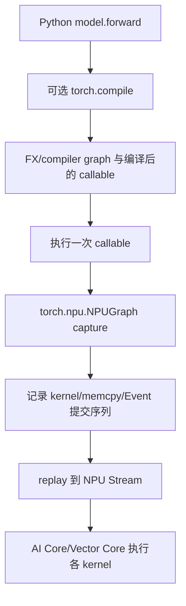
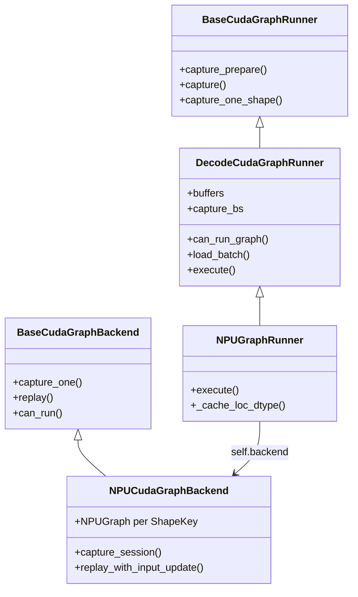
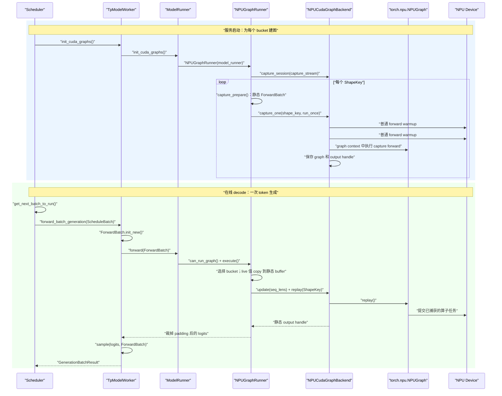

# 05：计算图、torch.compile 与 SGLang NPU Graph 源码全链路

> 本章基于 `SGLang@9a03bebf13996b628f8335628a691dcb3aa8400b`，回答四个问题：计算图到底是什么；一个模型是不是只有一张图；warmup 与 capture 有什么区别和关系；SGLang 如何从调度器一路进入 `torch.npu.NPUGraph` 的 capture/replay。

## 0. 先建立四个不同的“图”

“计算图”不是一个精确到只有一种实现的词。源码阅读时至少要区分：

| 名称 | 节点/边表示什么 | 何时产生 | 本章是否重点 |
|---|---|---|---|
| 概念上的模型计算图 | linear、attention、MoE 等数学运算及 tensor 依赖 | 描述模型结构时 | 是基础 |
| Autograd graph | 为反向传播保存的 operation 与梯度依赖 | 训练 forward 运行时动态建立 | 不是推理重点 |
| FX/Compiler graph | `torch.compile` 从 Python 程序提取的 IR 图 | 编译/guard 命中时 | 是 |
| NPUGraph launch graph | 一次执行中已经确定的 kernel、memcpy、Event 等 Device 提交序列 | capture 时 | 是核心 |

**IR（Intermediate Representation，中间表示）** 是编译器用于分析和改写程序的内部结构。

**Guard（守卫条件）** 是编译器对 dtype、shape、对象属性等前提做的运行时检查；不满足时可能重新编译或 fallback。
**Launch graph（启动图）** 关心的是“提交哪些设备任务”，不等于数学公式本身。

最重要的分层是：



`torch.compile` 和 NPUGraph 可以叠加，也可以只用其中一个。前者尝试优化“程序/算子图”，后者复用“运行时 launch 序列”。

---

## 1. 一个模型有一张专门的图吗

### 1.1 图功能是通用的

`torch.npu.NPUGraph()` 是 torch_npu 提供的通用 runtime capture/replay 能力。它不知道“这是 GLM、DeepSeek 还是 Qwen”，只观察 capture 区间里向 NPU 提交了什么工作。

SGLang 的 `NPUGraphRunner` 也是通用 runner。它调用具体模型的 `forward`，而不是为每个 Hugging Face architecture 手写完整图。

### 1.2 捕获产物又是高度专用的

虽然功能通用，每次产生的 graph artifact（图产物）却依赖：

- 当前模型及其实际 forward 分支；
- 当前 TP/PP rank 的权重和通信调用；
- NPU device/context；
- 输入、输出、workspace 的 Device 地址；
- batch/token 捕获规格；
- decode、target verify 等 forward mode；
- attention backend 与 metadata 结构；
- LoRA variant、PDMux Stream 等可进入 `ShapeKey` 的维度；
- torch、torch_npu、CANN 和 kernel 版本。

因此准确说法是：

> 模型不会随权重文件附带一张永久通用的 NPUGraph；SGLang 在服务进程初始化/首次捕获时，利用通用机制为当前执行环境建立一族专用图实例。

### 1.3 同一个模型为什么需要多张图

当前 `DecodeCudaGraphRunner` 构造 `capture_bs`，并通过 backend 保存：

```python
self._graphs: Dict[Any, Any] = {}
self._outputs: Dict[Any, Any] = {}
```

NPU backend 的 key 是 `ShapeKey`。通用 runner 中：

```python
def _make_graph_key(self, size, stream_idx=None, variant_label=None):
    return ShapeKey(
        size=size,
        stream_idx=stream_idx,
        variant_label=variant_label,
    )
```

所以一个简化例子可能是：

```text
GLM-4.7-Flash / rank 0 / NPU 0
  ShapeKey(size=1)  -> NPUGraph A
  ShapeKey(size=2)  -> NPUGraph B
  ShapeKey(size=4)  -> NPUGraph C
  ShapeKey(size=8)  -> NPUGraph D
  ShapeKey(size=8, variant_label="lora") -> NPUGraph E
```

每个 TP rank 都有自己的模型分片和地址，通常各自 capture。它们不是共享一个 Python graph 对象。

---

## 2. 为什么推理要用 launch graph

LLM decode 每轮通常只为每个请求生成一个或少量 token。单轮计算比 prefill 小，但要重复很多次：

```text
Python 调度
  -> dispatcher
  -> wrapper/tiling/workspace
  -> kernel launch 1
  -> kernel launch 2
  -> ...
  -> 下一轮 decode 再来一次
```

当 kernel 本身较短时，Host dispatch、Python、runtime launch 和小 kernel 之间的空隙占比会变大。

NPUGraph capture 一次稳定序列，replay 时让 runtime 复用它：

```text
首次：准备静态输入 -> warmup -> capture 完整 launch 序列
后续：把新数据 copy 到静态地址 -> replay -> 取静态输出 view
```

它主要降低重复 launch/control overhead，不会：

- 改变模型数学公式；
- 自动把所有 kernel 融成一个 mega kernel；
- 自动减少每个 kernel 内的 GM 搬运；
- 让动态 Python 控制流任意变化；
- 取代 Stream 和 Event。

---

## 3. 静态地址为什么是核心

假设 capture 时 kernel 记录输入地址 `0x1000`、输出地址 `0x2000`。Replay 复用的是这条已经准备好的 launch，因此不能只把 Python 变量 `x` 改成指向 `0x3000`，就期待图自动认识新地址。

常见结构是：

```python
static_x = torch.empty_like(example_x)
graph = torch.npu.NPUGraph()

with torch.npu.graph(graph):
    static_y = model(static_x)

def run(live_x):
    static_x.copy_(live_x)
    graph.replay()
    return static_y
```

这段展示的是真实 API 语法，但省略了 warmup、capture Stream、memory pool、错误检查和模型兼容条件。关键点是：

- `static_x` 的地址不变，内容每轮更新；
- `static_y` 的地址也不变；
- `graph.replay()` 异步重写 `static_y` 的内容；
- 返回的是同一个 output tensor handle；
- 若要跨下一次 replay 长期保存旧结果，需要在正确 Stream 上 clone/copy。

这也直接解释了“计算没完成为什么能返回 tensor”：返回的是静态 storage 句柄，后续同 Stream 消费者会排在 replay 后面；真正 `.cpu()`/`.item()` 时框架才等待 Device 数据。

---

## 4. SGLang 从哪里选择 NPU Graph

### 4.1 初始化

固定源码：

- [`model_runner.py#L909-L916`](https://github.com/sgl-project/sglang/blob/9a03bebf13996b628f8335628a691dcb3aa8400b/python/sglang/srt/model_executor/model_runner.py#L909-L916)

```python
def init_cuda_graphs(self, capture_decode_cuda_graph: bool = True):
    capture = capture_cuda_graphs(
        model_runner=self, capture_decode_cuda_graph=capture_decode_cuda_graph
    )
    self.eager_runner = capture.eager_runner
    self.prefill_cuda_graph_runner = capture.prefill_runner
    self.decode_cuda_graph_runner = capture.decode.runner
```

名字保留 `cuda_graph` 是跨平台历史接口，不证明 NPU 使用 CUDA。工厂根据 device 选择 NPU runner/backend。

### 4.2 每轮 forward 的分支

固定源码：

- [`model_runner.py#L1479-L1516`](https://github.com/sgl-project/sglang/blob/9a03bebf13996b628f8335628a691dcb3aa8400b/python/sglang/srt/model_executor/model_runner.py#L1479-L1516)

核心真实语法：

```python
can_run_graph = bool(
    mode_check()
    and self.decode_cuda_graph_runner
    and self.decode_cuda_graph_runner.can_run_graph(forward_batch)
)

if can_run_graph:
    ret = self.decode_cuda_graph_runner.execute(
        forward_batch,
        pp_proxy_tensors=pp_proxy_tensors,
    )
    return ModelRunnerOutput(logits_output=ret, can_run_graph=can_run_graph)
```

三个条件分别问：

1. 当前 `ForwardMode` 是否允许 graph；
2. runner 是否已初始化；
3. 当前 batch 是否能映射到已 capture 的 `ShapeKey`。

不满足就走 eager 或其他 prefill 路径。Graph 是优化 fast path，不是模型正确性的唯一实现。

---

## 5. 通用 runner 与 NPU backend 的继承关系



名称里的 CUDA 表示通用框架最初来自 CUDA Graph。NPU 子类复用 shape bucket、buffer、ForwardBatch 等平台无关逻辑，再把设备 graph backend 换成 `NPUCudaGraphBackend`。

[`resolve_decode_backend()`](https://github.com/sgl-project/sglang/blob/9a03bebf13996b628f8335628a691dcb3aa8400b/python/sglang/srt/model_executor/runner_backend/utils.py#L52-L73) 明确写了：

```python
if model_runner.device == "npu":
    from sglang.srt.hardware_backend.npu.graph_runner.npu_cudagraph_backend import (
        NPUCudaGraphBackend,
    )
    return NPUCudaGraphBackend(...)
```

### 5.1 这里同时存在“继承”与“组合”

用户最容易混淆的是：`NPUGraphRunner` 与 `NPUCudaGraphBackend` 不是平级的两个 graph runner，也不是父子类。

```text
继承（is-a）：
NPUGraphRunner
  是一种 DecodeCudaGraphRunner
  因此继承 capture()、capture_one_shape()、load_batch() 等模型级流程

组合（has-a）：
NPUGraphRunner
  持有 self.backend
  在 NPU 上 self.backend 是 NPUCudaGraphBackend
```

[`NPUGraphRunner.__init__()`](https://github.com/sgl-project/sglang/blob/9a03bebf13996b628f8335628a691dcb3aa8400b/python/sglang/srt/hardware_backend/npu/graph_runner/npu_graph_runner.py#L87-L116) 自己没有直接写：

```python
self.backend = NPUCudaGraphBackend(...)
```

它调用 `super().__init__(...)`，进入 `DecodeCudaGraphRunner.__init__()`；父类完成 buffer、bucket、attention backend 等初始化后，才执行：

```python
self.backend = resolve_decode_backend(self)
```

工厂检查 `model_runner.device == "npu"` 后返回：

```python
NPUCudaGraphBackend(cuda_graph_runner=self, ...)
```

所以运行时对象关系可以写成：

```python
runner: NPUGraphRunner
runner.backend: NPUCudaGraphBackend
```

Backend 构造函数又从 runner 取得 `device_module`、TP group、compile 开关等运行时依赖，但它不拥有模型语义、bucket padding 规则或如何构造 `ForwardBatch` 的知识。

| 层 | 知道什么 | 不应该负责什么 |
|---|---|---|
| `NPUGraphRunner`/`DecodeCudaGraphRunner` | 模型、batch/bucket、静态输入 buffer、attention metadata、LoRA/PP/speculative 状态 | 不直接实现某种设备 runtime 图的 capture API |
| `NPUCudaGraphBackend` | `torch.npu.NPUGraph`、capture stream、graph pool、`ShapeKey -> graph/output` 字典、update/replay | 不解析模型层，不决定 `input_ids`、KV pool 与 `ForwardBatch` 怎样组织 |

这种分层让同一套 decode runner 能组合不同的 Device backend：CUDA 可以选择 full/breakable backend，NPU 则由工厂组合 `NPUCudaGraphBackend`。

固定提交的 `NPUGraphRunner` 里还保留 `_create_device_graph()`、`_capture_graph()`、`_update_inputs()` 等 helper。对该提交做仓库内引用搜索时，只能看到这些定义，当前 decode 主链没有调用它们；主链走的是 `self.backend.capture_one()` 和 `self.backend.replay*()`。阅读时不要把这些残留 helper 与当前 backend 接口混成第二条执行路径。

### 5.2 `capture_one_shape()` 与 `capture_one()` 是上下游，不是重复实现

`capture_one_shape()` 是从 `DecodeCudaGraphRunner` 继承来的**模型/shape 层方法**。它回答：

> “要为 batch-size bucket 4 建图时，这一次完整模型调用究竟需要哪些静态对象？”

[`capture_one_shape()`](https://github.com/sgl-project/sglang/blob/9a03bebf13996b628f8335628a691dcb3aa8400b/python/sglang/srt/model_executor/runner/decode_cuda_graph_runner.py#L913-L1020) 主要完成：

1. 把 `size` 换算成 `bs`、`num_tokens` 和 `ShapeKey`；
2. `capture_prepare()` 构造静态 `ForwardBatch`、attention backend 和 PP tensor；
3. 准备 LoRA、TBO、DeepEP 与 graph 外 attention metadata；
4. 定义零参数闭包 `run_once()`；
5. 在闭包里调用完整 `forward(input_ids, positions, forward_batch, ...)`；
6. 把 `ShapeKey + run_once + post_warmup_hook` 交给 backend。

最后一行才跨入 Device graph 层：

```python
self.backend.capture_one(
    shape_key,
    run_once,
    capture_inputs=None,
    post_warmup_hook=post_warmup_hook,
)
```

`NPUCudaGraphBackend.capture_one()` 是**设备 runtime 层方法**。它不关心 `run_once()` 内部是 GLM、DeepSeek 还是 Qwen，只要求“调用这个 callable 会提交目标 Device 工作”。它负责：

```python
for _ in range(2):
    forward_fn()                 # 两次普通 warmup

graph = torch.npu.NPUGraph()
with torch.npu.graph(graph, ...):
    out = forward_fn()           # 第三次执行并 capture

self._graphs[shape_key] = graph
self._outputs[shape_key] = out
```

两者的输入输出边界是：

```text
capture_one_shape(size=4, forward)
  -> 构造静态 ForwardBatch
  -> 构造 run_once
  -> 构造 ShapeKey
  -> backend.capture_one(ShapeKey, run_once)
       -> warmup
       -> torch.npu.graph capture
       -> 保存 NPUGraph/output handle
```

所以方法名中的差别很有意义：

- `capture_one_shape`：准备“某个 shape 下该跑什么”；
- `capture_one`：把已经准备好的 callable“怎样记录成某种 Device graph”。

如果把二者塞进一个类，通用 runner 就会同时耦合模型输入合同与 NPU runtime API，CUDA/NPU/backend 变体之间难以复用。

---

## 6. Capture：一张图怎样生成

### 6.1 选择 bucket

这里必须把 **batch size** 和 **bucket** 分开：

- **Batch size** 是一次 forward 中的请求/序列数量，源码常缩写为 `bs`。
- **Batch-size bucket** 是预先选择的某个可复用执行规格；这个规格以一个离散的 batch size 作为键。
- `capture_bs` 是“需要捕获的 batch size 列表”，例如 `[1, 2, 4, 8]`。列表中的每个值对应一张普通 decode 图。

所以 `bs` 的展开是 **batch size**，不是 `bucket size`。在 `for bs in capture_bs` 里，同一个整数同时扮演两个角色：

```text
bs = 8
  语义 1：这次图按 batch size 8 执行
  语义 2：用数值 8 查找“batch-size=8”这个 bucket/ShapeKey
```

更精确的例子是：

```text
live batch:
  raw_bs = 5                 # 线上真实请求数

captured batch-size buckets:
  capture_bs = [1, 2, 4, 8]

选择结果:
  bs = 8                     # 捕获/补齐后的 batch size
  graph_key = ShapeKey(size=8)
```

真实 batch 5 被 padding 到 captured batch size 8，然后复用以 `8` 为键的图。“bucket”不是另外装着 8 个 batch 的容器，“bucket size”也不是 8 个 batch；这里的 8 就是这张图支持的 batch size。

`get_batch_sizes_to_capture()` 会读取 graph 配置、最大请求数、TP 对齐要求和 compile 上限，生成 `capture_bs` 与 `compile_bs`。

捕获多张图的代价是：

- 启动时间增加；
- graph 和静态 buffer 占用更多 Device memory；
- 覆盖更多 shape，eager fallback 减少。

### 6.2 创建最大静态 buffer

`DecodeCudaGraphRunner` 持有 `DecodeInputBuffers`，最大尺寸覆盖 `max(capture_bs)`。里面包括：

- `input_ids`；
- `positions`；
- `req_pool_indices`；
- `seq_lens`；
- `out_cache_loc`；
- attention/page-table metadata；
- speculative decoding 相关 buffer。

捕获 size=1/2/4 时通常使用这些 buffer 的前缀 view，因此地址稳定。

### 6.3 warmup 为什么在 capture 前

这一节改用一个具体例子贯穿始终：当前正在为 `bs=4` 的普通 decode bucket 建图，且 `4 in self.compile_bs`，所以这个 bucket 开启 `torch.compile`。先不要记 Dynamo、FX、TorchAir 这些名字，先认清调用链里真正存在的五个对象：

| 名字 | 运行时类型 | 谁创建它 | 它是不是一张图 |
|---|---|---|---|
| `model.forward` | Python bound method（绑定了模型实例的方法） | 模型类 | 不是 |
| `forward` | Python callable；可能是原始 `model.forward`，也可能是 Dynamo 包装器 | `patch_model_npu()` | 不是；包装器内部以后会查找 compiler graph |
| `forward_batch` | `ForwardBatch` Python 对象；其字段引用静态 NPU tensor view 和 Host metadata | `capture_prepare(4)` | 不是 |
| `run_once` | 不接收参数的 Python closure（闭包） | `capture_one_shape()` | 不是 |
| `graph` | `torch.npu.NPUGraph` runtime 对象 | `NPUCudaGraphBackend.capture_one()` | 是最终可以 replay 的设备任务图 |

**Bound method（绑定方法）**表示函数已经记住 `self` 是哪个模型实例；调用 `model.forward(a, b, c)` 时，Python 会把 `model` 隐式作为第一个参数传给类中定义的 `forward(self, a, b, c)`。

**Callable（可调用对象）**表示可以写成 `forward(...)` 的 Python 对象。它不保证是普通函数，也不保证已经编译；`torch.compile` 返回的包装器也是 callable。

**Closure（闭包）**表示函数保存了定义它时所在作用域里的对象引用。这里的 `run_once()` 虽然没有形参，但已经记住当前 bucket 的 `forward_batch`、`forward`、`attn_backend` 和 `num_tokens`。

固定源码的骨架不是抽象伪代码，而是下面这条真实调用关系：

```python
# DecodeCudaGraphRunner._capture_one_stream()
with torch_compile_decoration.patch_model(
    self.model_runner.model,
    bs in self.compile_bs,                 # 本例为 True
    num_tokens=bs * self.captured_req_width,
    tp_group=self.model_runner.tp_group,
) as forward:
    self.capture_one_shape(bs, forward, ...)

# DecodeCudaGraphRunner.capture_one_shape()
forward_batch, attn_backend, pp_proxy_tensors = self.capture_prepare(bs, ...)

def run_once():
    attn_backend.init_forward_metadata_in_graph(forward_batch)
    ...
    return forward(
        forward_batch.input_ids,
        forward_batch.positions,
        forward_batch,
    )

self.backend.capture_one(shape_key, run_once, ...)
```

因此“两次 warmup 加一次 capture”并不是三次凭空调用 `model.forward`，而是 `NPUCudaGraphBackend` **连续三次调用同一个 `run_once` 闭包**：

```text
run_once 调用 1：普通执行，warmup #1
run_once 调用 2：普通执行，warmup #2
run_once 调用 3：位于 torch.npu.graph(...) 内，capture forward
```

三次调用看到的是同一个 `ForwardBatch` 对象和同一组静态 storage 地址；区别只在于第三次调用时 NPU runtime 已进入 capture 状态。后文所有 Dynamo、FX 和 TorchAir 细节都挂在这条主干上。

#### 6.3.1 先给出严格定义

**Warmup（预热）** 是在正式计时、正式 capture 或正式服务前，使用与目标路径相同或足够相似的输入，实际执行若干次 forward，让“第一次才会发生”的工作提前发生。

这里的“第一次工作”可能包括：

- Python 模块的惰性初始化；
- `torch.compile`/Dynamo/编译 backend 第一次生成可执行代码；
- kernel 或算子二进制加载；
- 算子选择、autotune、workspace 查询与分配；
- allocator 建立缓存；
- 通信器、attention backend metadata 或运行时资源初始化。

**Capture（捕获）** 则是在 `torch.npu.graph(...)` 上下文中真正执行一次 forward，由 runtime 记录这次执行提交的 Device 任务、依赖和内存合同，最终生成可 `replay()` 的 `NPUGraph`。

因此：

| 比较项 | warmup | capture |
|---|---|---|
| 是否真的执行 forward | 是 | 是 |
| 是否保存可 replay 的图 | 否 | 是 |
| 输出是否作为正式 capture 输出句柄保存 | 否，通常丢弃 | 是，保存到 `_outputs[shape_key]` |
| 主要目标 | 清掉首次运行副作用，逼近稳态 | 记录稳态 launch 序列 |
| 是否位于 `torch.npu.graph(...)` 内 | 否 | 是 |
| 对每个 shape 是否都要做 | 当前 NPU full-graph backend 会做 | 每个被捕获的 `ShapeKey` 都做 |

最重要的关系是：

```text
warmup 不是 capture 的另一种叫法
warmup 也不会“先录一张临时图”

同一个静态 shape：
  普通执行 warmup #1
    -> 普通执行 warmup #2
      -> 在 graph context 中执行 capture forward
        -> 以后只 replay
```

Capture API 从抽象语义上并不规定“物理定律般必须先跑两遍”；这是 SGLang NPU backend 为了稳定性采用的工程策略。如果首次编译、分配或通信初始化落入 capture 区间，轻则 capture 时间异常长，重则把一次性工作错误地固化进图，或遇到 runtime 不支持捕获的操作。

#### 6.3.2 SGLang 中其实有三种 warmup

看到源码中的 `warmup`，必须先问“谁在 warmup、warmup 哪一层”。

**第一种：通用 runner 的 kernel/autotune warmup。**

[`DecodeCudaGraphRunner.capture()`](https://github.com/sgl-project/sglang/blob/9a03bebf13996b628f8335628a691dcb3aa8400b/python/sglang/srt/model_executor/runner/decode_cuda_graph_runner.py#L825-L857) 开头调用：

```python
self.warmup()
```

但 [`BaseRunner.warmup()`](https://github.com/sgl-project/sglang/blob/9a03bebf13996b628f8335628a691dcb3aa8400b/python/sglang/srt/model_executor/runner/base_runner.py#L210-L240) 有一个关键分支：

```python
if getattr(mr, "_kernel_warmed_up", False):
    return
mr._kernel_warmed_up = True

if mr.device != "cuda":
    return
```

所以在当前 NPU 路径中，它只设置“一次性调用过”的标记，随后立即返回；后面的 FlashInfer workspace、autotune、DeepGEMM warmup 都是 CUDA 专用逻辑。**不能因为调用名是 `self.warmup()`，就误以为这里已经执行了两次 NPU 模型 forward。**

**第二种：NPU backend 针对每个 shape 的 capture 前 warmup。**

真正的 NPU 两遍 forward 位于 [`NPUCudaGraphBackend.capture_one()`](https://github.com/sgl-project/sglang/blob/9a03bebf13996b628f8335628a691dcb3aa8400b/python/sglang/srt/hardware_backend/npu/graph_runner/npu_cudagraph_backend.py#L78-L127)：

```python
for _ in range(2):
    self._device_module.synchronize()
    self._tp_group.barrier()
    forward_fn()
    if post_warmup_hook is not None:
        post_warmup_hook()
```

逐句解释：

- `self._device_module.synchronize()`：让 Host 等待此前 NPU 工作完成。第一次循环得到较干净的起点；第二次循环开始前保证第一遍 warmup 已完成。
- `self._tp_group.barrier()`：让所有 Tensor Parallel rank 在每遍 warmup 前对齐，避免某个 rank 已进入 collective、另一个 rank 仍在初始化。
- `forward_fn()`：零参数 Python 闭包。它捕获了该 bucket 的静态 `ForwardBatch`、静态 buffer view、attention backend 和模型 `forward`，真正执行一遍模型。
- `post_warmup_hook()`：让 attention backend 清理或复位 warmup 改动的内部状态，避免 capture 从脏状态开始。调用方从 `attn_backend.on_after_cuda_graph_warmup` 取得它。

这里没有使用 warmup 的返回值：它返回的 tensor handle 会被丢弃，也不会放进 `_outputs`。随后 capture forward 重新执行，并把 capture 上下文中得到的 `out` 保存成这张图的静态输出句柄。

为什么是两遍？源码注释给出的意图是“让 kernel 被加载并在 capture 前支付一次性设置”。第一遍最容易触发惰性初始化；第二遍更接近以后重复执行的稳态路径，也能暴露“第二次执行和第一次执行路径不同”的问题。**两遍是当前实现选择，不是所有 NPU 程序都固定需要两遍。**

**第三种：`torch.compile` 的编译 warmup。**

先不要把它理解成“把 Python 文件编译成一个二进制”。这里真正发生的是：PyTorch 从第一次 `forward` 中提取**算子语义图**并建立 guard，再把 FX 图交给 Ascend 的 TorchAir backend 处理。backend 最终返回什么，取决于 TorchAir 配置：本章固定版本的 `npugraph_ex` 设置了 `run_eagerly=True`，所以它完成 AOT/decomposition/FX 准备后返回 eager FX runner，**不会在这条路径中生成 TorchAir GE/ACL 可执行图**；真正被复用的 Device task 序列随后由外层 NPUGraph capture。

完整入口要从 `compile_bs` 开始看。

##### 第一步：哪些 bucket 会启用 compile

[`get_batch_sizes_to_capture()`](https://github.com/sgl-project/sglang/blob/9a03bebf13996b628f8335628a691dcb3aa8400b/python/sglang/srt/model_executor/runner/base_cuda_graph_runner.py#L58-L103) 返回两个列表：

```python
capture_bs = ...  # 需要建立 NPUGraph 的全部 batch-size buckets
compile_bs = (
    [bs for bs in capture_bs if bs <= server_args.torch_compile_max_bs]
    if get_flags().capture.enable_torch_compile
    else []
)
```

例如：

```text
capture_bs = [1, 2, 4, 8, 16]
torch_compile_max_bs = 8
enable_torch_compile = True

得到 compile_bs = [1, 2, 4, 8]
```

这意味着 size 1/2/4/8 的 capture forward 先经过 `torch.compile`，size 16 仍直接调用原始 `model.forward`；但五个 bucket 最后都可以被外层 NPUGraph capture。**`compile_bs` 决定是否使用 compiler，`capture_bs` 决定是否建立 launch graph，它们不是同一个集合概念。**

##### 第二步：NPU runner 把通用 patch 函数换成 NPU 版本

[`NPUGraphRunner.__init__()`](https://github.com/sgl-project/sglang/blob/9a03bebf13996b628f8335628a691dcb3aa8400b/python/sglang/srt/hardware_backend/npu/graph_runner/npu_graph_runner.py#L87-L108) 在进入父类 capture 逻辑前执行：

```python
from sglang.srt.compilation import torch_compile_decoration

torch_compile_decoration.patch_model = patch_model_npu
super().__init__(model_runner, ...)
```

这是一次 Python **monkey patch（猴子补丁）**：运行时把模块属性指向另一个函数。通用 decode runner 仍调用统一名字 `torch_compile_decoration.patch_model`，但 NPU 实际进入 `patch_model_npu`。

##### 第三步：遍历 bucket 时决定返回哪一种 callable

[`_capture_one_stream()`](https://github.com/sgl-project/sglang/blob/9a03bebf13996b628f8335628a691dcb3aa8400b/python/sglang/srt/model_executor/runner/decode_cuda_graph_runner.py#L875-L912)：

```python
for bs in reversed(self.capture_bs):
    with torch_compile_decoration.patch_model(
        self.model_runner.model,
        bs in self.compile_bs,
        num_tokens=bs * self.captured_req_width,
        tp_group=self.model_runner.tp_group,
    ) as forward:
        self.capture_one_shape(bs, forward, ...)
```

变量逐项解释：

| 变量 | 类型 | 含义 |
|---|---|---|
| `bs` | Python `int` | 当前图的 captured batch size；同时作为 batch-size bucket 的键 |
| `self.compile_bs` | `list[int]` | 允许经过 `torch.compile` 的 buckets |
| `bs in self.compile_bs` | Python `bool` | 传给 `enable_compile` |
| `self.model_runner.model` | `torch.nn.Module` | 已加载权重的 SGLang 模型对象 |
| `forward` | Python callable | 原始 bound method，或 `torch.compile` 返回的优化 callable |

`patch_model_npu` 是一个 `@contextmanager`。源码中的 `yield` 不是计算结果，而是把 callable 暂时交给 `with ... as forward`：

```python
@contextmanager
def patch_model_npu(model, enable_compile, num_tokens, tp_group):
    if enable_compile:
        backend = get_compiler_backend("npugraph_ex")
        yield torch.compile(
            torch.no_grad()(model.forward),
            fullgraph=True,
            dynamic=False,
            backend=backend,
        )
    else:
        yield model.forward
```

其中：

- `model.forward` 是 Python **bound method（绑定方法）**，已经绑定到当前模型实例；
- `torch.no_grad()` 关闭 autograd 反向图记录，符合推理路径；
- `torch.compile(...)` 返回一个可调用包装器；执行到这一行时并不等于已经用真实输入完成全部编译；
- `fullgraph=True` 要求 Dynamo 尽量把该调用形成一个完整 compiler graph，不能随意 graph break 后悄悄退回 Python；
- `dynamic=False` 针对当前静态规格特化，这与按 bucket 捕获相匹配；
- `num_tokens` 与 `tp_group` 是为了满足通用 patch 接口而保留的参数，当前 `patch_model_npu` 函数体没有使用它们。

若 `enable_compile=False`，这里直接 `yield model.forward`。后面仍会执行两次 NPU warmup 和一次 NPUGraph capture，只是少了 compiler graph 这一层。

##### 第四步：`npugraph_ex` backend 到底是什么

[`get_compiler_backend("npugraph_ex")`](https://github.com/sgl-project/sglang/blob/9a03bebf13996b628f8335628a691dcb3aa8400b/python/sglang/srt/utils/common.py#L969-L995) 在 NPU 环境中并不返回字符串 `"npugraph_ex"`，而是构造 TorchAir backend callable：

```python
compiler_config = CompilerConfig()
compiler_config.mode = "reduce-overhead"
compiler_config.debug.run_eagerly = True
npu_backend = torchair.get_npu_backend(compiler_config=compiler_config)
return npu_backend
```

**TorchAir** 是连接 PyTorch compiler graph 与昇腾图/算子执行栈的适配层。`torchair.get_npu_backend(...)` 返回一个符合 `torch.compile` backend 协议的函数。backend 的输入不是最外层那三个实参原样组成的 tuple，而是 Dynamo/AOT 处理后交出的：

```text
gm: torch.fx.GraphModule
example_inputs: 为 FX placeholder 提供规格和示例值的扁平化输入列表
```

**FX GraphModule** 是“FX 节点图 + 被引用的模块属性”的 Python 对象。PyTorch 官方通常直接使用名称 `torch.fx`，这里不强行为 `FX` 扩写一个并不稳定的全称。节点常见的 `op` 包括 `placeholder`、`call_function`、`get_attr` 和 `output`；它表达算子依赖，不是 NPU Stream 上已经排好的 task 队列。

这里尤其不要把 `example_inputs` 误认成：

```python
[input_ids, positions, forward_batch]
```

`ForwardBatch` 是复杂 Python 对象，不是一块能直接交给编译器的 Device tensor。Dynamo 会追踪 Python 对它的字段访问：实际参加 tensor 计算的字段可能被提升成 FX placeholder；编译期可确定的 Python 值可能被特化并由 guard 保护；完全不参与图的字段不会成为 backend 输入。因此 TorchAir 收到的 `example_inputs` 数量和次序是 compiler graph 的内部接口，不等于用户函数签名。

配置项的含义：

- `mode="reduce-overhead"`：目标偏向减少重复 Host/launch 开销，适合与图执行路径配合；
- `debug.run_eagerly=True`：**跳过 TorchAir 的 NPU graph compiler，返回 FX graph 的 eager runner。**

第二条是理解当前 SGLang 路径的关键。它不是“先 eager 跑一次，然后仍然生成 GE/ACL compiled graph”。官方 TorchAir 固定源码在 [`_NpuFxCompiler._gen_compiled_gm()`](https://gitee.com/ascend/torchair/blob/b9255d87ebcd54c9ea325f700fcb65deddd8b501/python/torchair/npu_fx_compiler.py#L491-L498) 明确执行：

```python
if self.config.debug.run_eagerly:
    ...
    return graph.fx_graph

return concrete_graph
```

也就是说，当前 `npugraph_ex` 组合仍使用 `torch.compile` 的 Dynamo/fullgraph/guard 以及 TorchAir backend 的 AOT/decomposition/FX 准备流程，但最终让 FX GraphModule 以 eager operator dispatch 方式运行；真正记录重复 Device task 的是外层 SGLang `torch.npu.NPUGraph`。它不会在这里再嵌套一张 TorchAir GE/ACL 执行图。

TorchAir 是随 CANN/PyTorch-NPU 环境配套演进的组件，内部类名会随版本变化；本章使用上述固定源码解释 `run_eagerly` 的稳定语义。部署其他版本时应以安装包中的 `npu_fx_compiler.py` 为准。

##### 第五步：为什么说“编译发生在第一次 warmup 调用”

先纠正一句容易产生误解的话：这里的“编译 warmup”不一定生成一个 TorchAir GE/ACL 二进制。对当前 `npugraph_ex + run_eagerly=True` 配置，更准确的说法是：

> 第一次 warmup 触发 Dynamo 抽图、guard 建立、AOT/TorchAir backend 准备和 FX runner 的第一次真实执行；TorchAir NPU compiler 被 `run_eagerly=True` 跳过，最终 Device task 仍来自 FX 图中的 eager NPU operator dispatch。

下面逐层进入这次调用。

###### 5.1 `torch.compile(...)` 这一行只创建包装器

PyTorch 2.10 固定源码中，[`torch.compile()`](https://github.com/pytorch/pytorch/blob/v2.10.0/torch/__init__.py#L2505-L2512) 最后做的是：

```python
return torch._dynamo.optimize(
    backend=backend,
    nopython=fullgraph,
    dynamic=dynamic,
    disable=disable,
    guard_filter_fn=guard_filter_fn,
)(model)
```

这段代码把 callable 交给 Dynamo 的 `OptimizeContext`，返回一个会安装 frame-evaluation hook 的包装器。此时尚未出现下面这些对象：

- 本 bucket 的 `ForwardBatch`；
- 由本次输入特化出来的 FX `GraphModule`；
- 与这个 GraphModule 配套的 guards；
- TorchAir backend 返回的 runner。

所以不要把：

```python
forward = torch.compile(...)
```

理解成 C/C++ 的“编译函数执行完毕并返回机器码地址”。它更像是“登记：这个 Python callable 第一次真正被调用时，先让 Dynamo 接管”。

###### 5.2 warmup #1 先从 `capture_one()` 进入 `run_once()`

[`NPUCudaGraphBackend.capture_one()`](https://github.com/sgl-project/sglang/blob/9a03bebf13996b628f8335628a691dcb3aa8400b/python/sglang/srt/hardware_backend/npu/graph_runner/npu_cudagraph_backend.py#L78-L127) 第一次循环实际执行：

```python
self._device_module.synchronize()
self._tp_group.barrier()
forward_fn()                         # forward_fn 就是 run_once
if post_warmup_hook is not None:
    post_warmup_hook()
```

这里有两个不同范围的同步：

- `synchronize()` 是 Device 同步：当前 Host 线程等待这个 NPU device 上此前异步提交的工作完成；
- `barrier()` 是进程/rank 同步：每个 TP rank 都到达此处才一起继续。

随后进入 `capture_one_shape()` 中定义的真实 `run_once()`。固定源码比“调用 forward”多做了几件事：

```python
def run_once():
    attn_backend.init_forward_metadata_in_graph(forward_batch)

    forward_batch.dp_local_start_pos = None
    forward_batch.dp_local_num_tokens = None
    set_dp_buffer_len(
        forward_batch.global_dp_buffer_len,
        num_tokens,
        forward_batch.dp_padding_mode.is_max_len(),
        forward_batch.global_num_tokens_cpu,
    )
    set_is_extend_in_batch(False)

    out = forward(
        forward_batch.input_ids,
        forward_batch.positions,
        forward_batch,
        **kwargs,
    )
    for capture_hook in self.model_runner.capture_tail_hooks:
        capture_hook(self, out, forward_batch, num_tokens)
    return out
```

逐项看：

- `init_forward_metadata_in_graph()` 准备必须作为 Device task 出现在图内的 attention metadata 操作；虽然函数名含 `in_graph`，warmup 时 runtime 尚未 capture，它仍作为普通操作执行；
- `dp_local_start_pos` 等字段赋值是 Host 上的 Python 对象状态修改；
- `set_dp_buffer_len()` 更新 data-parallel 相关长度状态；
- `set_is_extend_in_batch(False)` 把这次路径固定为普通 decode，而不是 extend；
- `forward(...)` 才进入模型；
- `capture_tail_hooks` 是模型 forward 后仍需纳入相同执行合同的尾部 hook。

因此 warmup 的目标路径不只是 `model.forward`，而是完整的 `run_once`：attention 图内 metadata 准备、DP 状态、模型 forward 和 tail hook 都必须与第三次 capture 一致。

###### 5.3 第一次进入 compiled `forward` 时，Dynamo 做什么

Python 调用：

```python
forward(
    forward_batch.input_ids,     # torch.Tensor，NPU 上的静态 input-id view
    forward_batch.positions,     # torch.Tensor，NPU 上的静态 position view
    forward_batch,               # ForwardBatch Python 对象
)
```

进入的 `forward` 是 5.1 中尚未为本输入生成图的 Dynamo 包装器。Dynamo 使用 Python frame evaluation 机制接管 `model.forward` 的 bytecode（字节码）。

**Bytecode（字节码）** 是 CPython 执行 `LOAD_ATTR`、`CALL`、条件跳转等操作的中间指令，不是 NPU 指令。Dynamo 的 symbolic interpreter（符号解释器）沿 bytecode 解释：

- 遇到 `forward_batch.forward_mode` 之类的 Python 属性读取时，记录这条 Python 路径及其特化条件；
- 遇到 tensor 算子时，不立即把每个数学操作都作为本轮模型结果发到 NPU，而是建立 FX proxy/node；
- 使用 FakeTensor/示例元数据传播 shape、dtype、device 等信息；
- 把模型 parameter、buffer 和真正需要运行时变化的 tensor 值变成 graph 输入或属性。

**FakeTensor（伪张量）**保存 shape、stride、dtype、device 等元数据，但不保存真实大块数据。它让编译器能推导 `matmul` 输出 shape，而不必在抽图阶段真的完成整次矩阵乘。

`fullgraph=True` 在 `torch.compile` 内映射为 `nopython=True`。若 Dynamo 无法把这次调用形成允许的完整图，通常会报 graph break 错误，而不是悄悄把中间一段退回普通 Python。

**Graph break（断图）**表示 Dynamo 无法继续把某段 Python 行为表示成当前 FX graph，只能结束当前图并回到 Python；本路径要求 full graph，所以它是需要修复的兼容性问题。

###### 5.4 FX GraphModule 和 guards 分别保存什么

完成符号追踪后会得到两类不同产物：

```text
FX GraphModule
  保存：placeholder、get_attr、call_function、output 等节点及数据依赖

guards
  保存：这份 GraphModule 在什么条件下仍然有效
```

例如某个简化的 guard 可能约束：

```text
input_ids 是 NPU Tensor
input_ids.dtype == torch.int64
input_ids.shape == [4]
positions.shape == [4]
模型处于 eval/no_grad 路径
ForwardBatch 中决定分支的某个 Python 枚举仍是 DECODE
```

这里的示例只用于理解，实际 guard 由 Dynamo 根据访问到的对象生成，数量和形式会更多。`dynamic=False` 让 shape 更倾向于按当前 bucket 特化；因此 size-4 与 size-8 往往对应不同 compiler variant。

guard 不参与矩阵乘，它运行在 Host 上，用来回答：“这次调用能不能安全地跳进之前生成的 callable？”若 guard 失败，Dynamo 可能为同一 Python code object 新建另一个 variant，或者达到重编译限制后 fallback。

###### 5.5 Dynamo 怎样真正调用 TorchAir backend

Dynamo 在 `OutputGraph` 中构造 `gm` 和 `example_inputs` 后，会调用用户 backend。PyTorch 固定源码的关键语义是：

```python
compiled_fn = compiler_fn(gm, example_inputs)
assert callable(compiled_fn)
```

这里：

- `compiler_fn` 是 SGLang 传入的 TorchAir backend；
- `gm` 的类型是 `torch.fx.GraphModule`；
- `example_inputs` 是与 FX placeholders 对应的示例值；
- backend 的返回值必须仍然是 callable，Dynamo 才能把它装进生成后的 Python bytecode。

TorchAir 的 [`_npu_backend()`](https://gitee.com/ascend/torchair/blob/b9255d87ebcd54c9ea325f700fcb65deddd8b501/python/torchair/npu_fx_compiler.py#L595-L629) 不是直接对每个 FX node 调一次 CANN API，它先进入 AOTAutograd/functionalization/decomposition 管线：

- **AOTAutograd** 是 PyTorch 用于在 ahead-of-time 图处理中建立前向/反向或推理图的基础设施；本章是 `no_grad` 推理，关注 inference/forward graph；
- **Functionalization（函数化）**把部分原地修改语义转换成更适合图分析的函数式表达，同时保留必要的输入 mutation 合同；
- **Decomposition（分解）**把某些高层复合算子改写为 backend 更容易支持的一组基础算子。

这些词描述的是 compiler graph 的变换，不表示此时已经有 `NPUGraph`。

随后 `_NpuFxCompiler` 会准备目标 concrete-graph 对象和 FX runner。但当前配置命中：

```python
if self.config.debug.run_eagerly:
    return graph.fx_graph
```

所以本路径返回给 Dynamo 的 `compiled_fn` 本质上是经过 AOT/TorchAir 准备的 FX GraphModule runner，而不是完成 GE/ACL 编译的 executable。

###### 5.6 warmup #1 的“真实执行”发生在哪里

backend 返回 callable 后，Dynamo 会把对原始 `model.forward` 的调用改写为对该 callable 的调用，并在**同一次 warmup #1** 中继续执行它。

因为当前返回的是 FX GraphModule runner，FX 节点中的 ATen/torch_npu/custom op 会走正常 dispatcher：

```text
FX call_function node
  -> PyTorch dispatcher
  -> NPU implementation / torch_npu / custom op wrapper
  -> CANN runtime 提交 Device task 到当前 NPU stream
```

这些提交仍是异步的：Host 得到输出 tensor handle，不代表所有 NPU 算术已经结束。`capture_one()` 第二次循环开头的下一次 `self._device_module.synchronize()` 会等待 warmup #1 提交的 Device 工作完成。

warmup #1 返回的 `out` 没有被 `capture_one()` 保存。它只完成了：

- 首次 Dynamo tracing 与 guard/variant 建立；
- 首次 TorchAir backend/AOT/FX runner 准备；
- 首次沿该 FX runner 提交整条模型 Device 工作；
- 可能触发的算子注册、kernel load、workspace/allocator 等惰性工作。

###### 5.7 warmup #2 为什么仍然执行完整模型

第二次循环不是“检查一下缓存就返回”。源码仍完整调用：

```python
self._device_module.synchronize()  # 明确等待 warmup #1 的 Device 工作
self._tp_group.barrier()
forward_fn()                       # 再次进入同一个 run_once
post_warmup_hook()
```

compiled `forward` 首先运行 guards。若 size、dtype、Python 分支状态等都匹配：

```text
guard hit
  -> 直接选择 warmup #1 建立的 compiled callable
  -> 不再重新解释整份 model.forward bytecode
  -> 不再重新调用 TorchAir backend
  -> 仍然完整执行 FX graph，重新提交本轮所有 NPU Device task
```

因此“复用 artifact”只表示省掉抽图和 backend 准备，不表示省掉模型计算。warmup #2 仍会重新计算 47 层、MLA、MoE 和 logits，只是 Host compiler 路径更接近稳态。

第二次循环结束后，源码片段里没有额外写一行独立的 `synchronize()`；不能凭空声称该 `for` 循环末尾显式等待了 warmup #2。之后进入 graph context 时的 stream/capture runtime 会建立合法顺序。阅读源码时应区分“此处明确同步”与“后续 context/runtime 保证有序”。

###### 5.8 第三次调用才是 capture forward

两次普通执行结束后，backend 创建：

```python
graph = torch.npu.NPUGraph()
```

若开启 `torch.compile`，它还建立：

```python
skip_guard_context = torch.compiler.set_stance(
    skip_guard_eval_unsafe=True
)
```

`skip_guard_eval_unsafe` 不是“把 guard 永久删除”。[PyTorch 2.10 文档](https://docs.pytorch.org/docs/2.10/generated/torch.compiler.set_stance.html)将其定义为只运行区分已存在 variant 所需的 guards、减少完整 guard evaluation 开销；它之所以标记 `unsafe`，是因为调用者必须保证 warmup 已覆盖需要的 variant，后面不再需要重编译。SGLang 已按 bucket 固定 shape、地址和分支，正是在用这一合同换取 capture/稳态开销下降。

然后才进入：

```python
with (
    skip_guard_context,
    torch.npu.graph(
        graph,
        pool=self._pool,
        stream=self._capture_stream,
        auto_dispatch_capture=True,
    ),
):
    out = forward_fn()     # 第三次完整 run_once
```

第三次 `forward_fn()` 仍会走 `run_once -> compiled forward -> FX runner -> NPU dispatcher`，但这一次 runtime 正处于 capture context，所以 FX runner 发出的 Device task、task 间依赖和地址绑定被记录进 `graph`。

NPUGraph **不会记录**：

- Dynamo 正在解释哪条 Python bytecode；
- FX GraphModule 的 Python 对象结构；
- `ForwardBatch` 这个 Python 对象本身；
- 原始模型源码中 `for layer in layers` 这样的 Python 循环对象。

需要更精确地区分 compiled 与 raw 两条路径：raw `model.forward` 会在第三次调用中重新执行原始 Python 控制流；compiled 路径则通常已在第一次 Dynamo tracing 时把固定层循环展开为 FX 节点，第三次调用执行的是 Dynamo 包装器和生成后的 FX runner，不必重新逐层解释原始循环。两条路径都会在 Host 上完成各自的 dispatcher 调用；NPUGraph 只保存这些调用最终产生的 Device task 提交结果。

###### 5.9 三次调用结束后，各自留下什么

| 调用 | 是否在 graph context | 是否执行模型 Device 工作 | 持久留下的东西 |
|---|---|---|---|
| warmup #1 | 否 | 是 | Dynamo variant、guards、backend/FX runner cache，以及各种首次运行状态 |
| warmup #2 | 否 | 是 | 进一步稳定 kernel/runtime/allocator 状态；返回值仍丢弃 |
| capture forward | 是 | 是 | `NPUGraph` 和与 capture storage 绑定的输出 handle |

所以本路径准确的时间线是：

```text
创建 compiled callable
  torch.compile(model.forward, ...)
  -> 返回 Dynamo 包装器
  -> 尚无本 bucket 的 FX graph/guards

warmup #1 第一次调用 forward(...)
  -> Dynamo 解释 bytecode，用 FakeTensor/Proxy 建 FX GraphModule
  -> 建立 guards
  -> TorchAir backend 经过 AOT/decomposition/FX 准备
  -> run_eagerly=True 返回 FX GraphModule runner，跳过 NPU graph compiler
  -> FX runner 通过 dispatcher 提交真实 NPU task
  -> warmup 输出 handle 被丢弃

warmup #2 再次调用同一个 forward(...)
  -> guard 命中同一 variant，不重新抽图
  -> 再次完整执行 FX runner 和模型 Device 工作
  -> warmup 输出 handle 再次被丢弃

capture forward 第三次调用
  -> 进入 torch.npu.graph(...)
  -> 第三次完整执行同一个 run_once
  -> NPUGraph 记录 FX eager dispatch 最终产生的 Device task
  -> 保存 graph 与 capture output handle
```

因此“编译 warmup”的本质不是预热一个已经存在的 NPUGraph，而是：**在 NPUGraph 尚未开始记录时，先把 Dynamo/TorchAir/dispatcher/runtime 的首次路径跑通。**

##### 第六步：如果 `run_eagerly=False`，时间线哪里不同

不要把当前 SGLang 特例推广成“所有 TorchAir 都不编译”。官方 TorchAir `_NpuFxCompiler._gen_compiled_gm()` 在 `run_eagerly=False` 时返回 `concrete_graph`：

- `mode="max-autotune"` 通常构造 `GeConcreteGraph`；其 [`__call__()`](https://gitee.com/ascend/torchair/blob/b9255d87ebcd54c9ea325f700fcb65deddd8b501/python/torchair/_ge_concrete_graph/fx2ge_converter.py#L643-L706) 第一次执行会处理 runtime 输入、load/compile GE graph，再运行 graph；
- `mode="reduce-overhead"` 构造 `AclConcreteGraph`；其 callable 管理自己的 ACL graph compile/capture/replay。

此时时间线才可以写成：

```text
Dynamo FX graph
  -> TorchAir concrete graph
  -> 首次 concrete_graph(...) 完成内部 load/compile/capture
  -> 后续调用复用 TorchAir graph runner
```

而本章固定 SGLang 设置 `run_eagerly=True`，就是下面这条不同的组合：

```text
Dynamo/TorchAir 准备后的 FX runner
  -> 以 eager op dispatch 产生 NPU task
  -> 外层 SGLang NPUGraph 捕获这些 task
```

两条路径不能混写成“先由 TorchAir 生成一张 GE/ACL 图，再由 SGLang 必然捕获同一张图”。

把三层 warmup/capture 入口重新汇总为：

```text
DecodeCudaGraphRunner.capture()
  |
  +-- BaseRunner.warmup()
  |     `-- NPU: 当前版本立即返回，不执行 CUDA 专用 autotune
  |
  `-- 对每个 ShapeKey
        `-- NPUCudaGraphBackend.capture_one()
              +-- forward_fn()        # warmup 1；可能触发 torch.compile
              +-- forward_fn()        # warmup 2；接近稳态
              `-- torch.npu.graph(...)
                    `-- forward_fn()  # capture run
```

#### 6.3.3 为什么 warmup 必须使用同一条目标路径

假设 warmup 用 batch size 1、eager forward，而 capture 用 batch size 8、compiled forward，那么 size=8 的编译、kernel 选择和 workspace 分配仍可能第一次出现在 capture 内。有效 warmup 至少应尽量匹配：

- 相同的 `ShapeKey`/bucket；
- 相同的静态 buffer view 和地址合同；
- 相同的模型分支与 attention backend；
- 相同的 TP rank 集合与 collective 次序；
- capture 时是否启用 `torch.compile`。

当前实现正是在 `capture_one_shape()` 先构造一次 `run_once()`，再把同一个闭包交给 NPU backend 做两遍 warmup 和一遍 capture：

```python
def run_once():
    attn_backend.init_forward_metadata_in_graph(forward_batch)
    return forward(
        forward_batch.input_ids,
        forward_batch.positions,
        forward_batch,
    )

self.backend.capture_one(
    shape_key,
    run_once,
    capture_inputs=None,
    post_warmup_hook=post_warmup_hook,
)
```

这里的 `forward_batch` 不是线上请求的 live `ForwardBatch`，而是 `capture_prepare()` 基于 `DecodeInputBuffers` 前缀 view 构造的静态捕获批次。这样 warmup、capture 和未来 replay 看到的是同一套输入/metadata storage 地址合同；capture 产生的输出句柄则单独保存。

### 6.4 真正 capture

#### 6.4.1 capture Stream 和 graph pool 从哪里来

进入单个 bucket 之前，`DecodeCudaGraphRunner.capture()` 已经建立 capture session：

```python
with graph_capture() as graph_capture_context, profile_context as prof:
    self.stream = graph_capture_context.stream
    with self.backend.capture_session(self.stream):
        self._capture_one_stream()
```

NPU backend 的 `capture_session()` 再保存 pool 与 stream：

```python
if self._pool is None:
    self._pool = self._device_module.graph_pool_handle()
set_graph_pool_id(self._pool)
self._capture_stream = stream
try:
    yield
finally:
    self._capture_stream = None
```

- `graph_pool_handle()` 返回 runtime graph memory pool 的 handle。它不是装着若干 Python tensor 的 `list`，而是 runtime 用来协调图内稳定分配、让多个 bucket 图复用内存规划的标识；
- `set_graph_pool_id()` 把 graph-pool 标识通知给相关 allocator/通信分配路径；
- `_capture_stream` 是第三次 forward 提交 Device task 时使用的 NPU Stream；
- `yield` 把控制权交还给 `_capture_one_stream()`，后者会按从大到小的顺序捕获多个 bucket；
- `finally` 只清掉 backend 对当前 capture stream 的临时引用，不会删除已经捕获的图。

因此每个 bucket 有自己的 `NPUGraph`，但同一 capture session 中的 bucket 可以共享 graph-pool 规划和 capture stream。

#### 6.4.2 `capture_one()` 的完整 capture 分支

两次 warmup 之后的固定源码是：

```python
graph = torch.npu.NPUGraph()

if self._enable_torch_compile:
    skip_guard_context = torch.compiler.set_stance(
        skip_guard_eval_unsafe=True
    )
else:
    skip_guard_context = empty_context()

if self._memory_saver_adapter is not None and self._memory_saver_adapter.enabled:
    graph_ctx = partial(
        self._memory_saver_adapter.cuda_graph,
        tag=GPU_MEMORY_TYPE_CUDA_GRAPH,
    )
else:
    graph_ctx = torch.npu.graph

with (
    skip_guard_context,
    graph_ctx(
        graph,
        pool=self._pool,
        stream=self._capture_stream,
        auto_dispatch_capture=True,
    ),
):
    out = forward_fn()

self._graphs[shape_key] = graph
self._outputs[shape_key] = out
```

`empty_context()` 是不做任何事的 context manager，让 compile 开关的两个分支保持同一种 `with` 结构。`graph_ctx` 默认是 `torch.npu.graph`；开启 memory saver 后会换成 adapter，但仍负责建立 NPU graph capture context。

#### 6.4.3 `with torch.npu.graph(...)` 前、中、后分别发生什么

Python context manager 有进入和退出两个边界。这里可以读成：

```text
进入 with 之前
  graph 只是新建的 NPUGraph 容器
  第三次 forward 还没有被记录

进入 graph_ctx
  runtime 把指定 stream 切入 capture 状态
  绑定 graph、pool 和 auto-dispatch capture 选项

执行 with 主体
  Host 执行完整 run_once()
  model/FX 节点经 dispatcher 提交 NPU task
  runtime 记录可捕获 task、依赖和地址合同

退出 graph_ctx
  runtime 结束并固化本次 capture
  graph 变成可 replay 的 runtime 图
```

`with` 捕获的是动态执行期间真正发生的提交，不是扫描 `forward_fn` 的 Python 源码：

- 第三次 forward 没有执行到的分支不会凭空进入图；
- Python `if` 的判断过程通常不是 NPUGraph 节点，被选分支发出的 Device task 才是捕获对象；
- `fullgraph=True` 约束 Dynamo compiler graph，`torch.npu.graph` 约束 Device launch capture，两者仍是不同层次。

#### 6.4.4 capture 后每个对象保存了什么

| 对象 | 类型/内容 | capture 后的作用 |
|---|---|---|
| `graph` | `torch.npu.NPUGraph` | 保存该 `ShapeKey` 的 Device task、依赖和地址绑定，可 `replay()` |
| `self._pool` | graph memory-pool handle | 管理捕获图需要的稳定内存规划 |
| `self._capture_stream` | NPU Stream | 决定 capture 时观察哪条任务提交序列 |
| `forward_fn` | `run_once` Python closure | 只在 warmup/capture 阶段由 Host 执行；线上 replay 不重新调用 |
| `out` | Tensor 或 `LogitsProcessorOutput` 等输出树 | 引用 capture-time 输出 storage；replay 后相同 storage 被新结果覆盖 |
| `shape_key` | `ShapeKey` | 区分 batch size、stream/variant 等图规格 |
| `_graphs` | `dict[ShapeKey, NPUGraph]` | 线上按规格查找图 |
| `_outputs` | `dict[ShapeKey, Any]` | 返回与图输出 storage 绑定的已有 handle |

`out` 不是“以后永远返回 capture 时那批数值”的快照。它是输出 storage 的 Python 引用；未来 `graph.replay()` 重跑 Device task 后，相同 storage 的内容会更新。

#### 6.4.5 一行源码分别对应什么 Host/Device 行为

| 源码 | Host 做什么 | Device/runtime 做什么 |
|---|---|---|
| `graph = torch.npu.NPUGraph()` | 创建 Python/runtime handle | 尚未执行模型 |
| 进入 `graph_ctx(...)` | 调用 context manager 入口 | 指定 stream 开始 capture，绑定 pool |
| `out = forward_fn()` | 执行 metadata 准备、Python 模型路径和 dispatcher 调用 | 算子 task 被提交并被 runtime 记录 |
| 退出 `graph_ctx` | 调用 context manager 退出逻辑 | 结束 capture，形成可 replay 图 |
| `_graphs[key] = graph` | 把 handle 放进 Python 字典 | 不重新执行 Device 计算 |
| `_outputs[key] = out` | 保存输出 storage 的 Python handle | 不复制一份输出数值快照 |

这也解释了 warmup #2 为什么不能“顺便成为图”：它调用 `forward_fn()` 时位于 `graph_ctx` 外，runtime 没有处在 capture 状态，第三次必须重新执行完整 forward。

最后，默认路径把 `graph` 保存在当前进程的 `_graphs` 字典，不会把整张 NPUGraph 自动序列化到模型目录。“从磁盘加载 kernel/编译 cache”和“加载这张 runtime NPUGraph”仍然是两回事。

### 6.5 为什么 AttentionBackend 里还有 `forward_decode_graph()`

先纠正一个非常关键的调用链误解：

> **线上命中 graph fast path 时，`NPUGraphRunner.execute()` 不会再调用 Python `model.forward()`。**

`model.forward()` 只在启动 capture 时，通过 `capture_one_shape()` 定义的 `run_once()` 执行。线上请求进入 [`ModelRunner._forward_raw()`](https://github.com/sgl-project/sglang/blob/9a03bebf13996b628f8335628a691dcb3aa8400b/python/sglang/srt/model_executor/model_runner.py#L1479-L1524) 后，如果 `can_run_graph=True`，会提前返回：

```python
ret = self.decode_cuda_graph_runner.execute(forward_batch, ...)
return ModelRunnerOutput(logits_output=ret, can_run_graph=True)
```

而 [`NPUGraphRunner.execute()`](https://github.com/sgl-project/sglang/blob/9a03bebf13996b628f8335628a691dcb3aa8400b/python/sglang/srt/hardware_backend/npu/graph_runner/npu_graph_runner.py#L209-L280) 的在线主线是：

```text
load_batch()/copy_ 静态输入
  -> graph_key = ...
  -> backend.replay_with_input_update(...) 或 backend.replay(...)
  -> 裁掉 padding 后返回静态输出 handle
```

这里没有 `model.forward(...)`。必须把两个时间阶段分开。

#### 6.5.1 启动 capture 阶段：Python 模型与 attention 方法都真正执行

```text
NPUGraphRunner 初始化
  -> DecodeCudaGraphRunner.capture()
  -> capture_one_shape()
  -> 定义并调用 run_once()
  -> model.forward(...)
  -> 模型中的 attention layer
  -> AttentionBackend.forward(...)
  -> AscendAttnBackend.forward_decode(...)
  -> 必要时 forward_decode_graph(...)
  -> 这些 attention Device task 被外层 NPUGraph 捕获
```

[`AttentionBackend.forward()`](https://github.com/sgl-project/sglang/blob/9a03bebf13996b628f8335628a691dcb3aa8400b/python/sglang/srt/layers/attention/base_attn_backend.py#L195-L245) 是每个 attention layer 使用的算子级分发入口。它根据 `ForwardMode` 选择 `forward_decode()`、`forward_extend()` 等。它不是另一个模型 runner。

Ascend backend 在 [`forward_decode()`](https://github.com/sgl-project/sglang/blob/9a03bebf13996b628f8335628a691dcb3aa8400b/python/sglang/srt/hardware_backend/npu/attention/ascend_backend.py#L2440-L2484) 中还有一层判断：

```python
if self.graph_mode and (not self.enable_torch_compile):
    return self.forward_decode_graph(...)
```

这里的 `graph_mode` 不是“AttentionBackend 自己又创建了一张图”。它是一个 Python 状态标记，表示当前 `self.forward_metadata` 已切换到 graph 专用的静态 metadata。调用链是：

```python
attn_backend.init_forward_metadata_out_graph(forward_batch, in_capture=True)
    -> _init_cuda_graph_metadata(...)
    -> _apply_cuda_graph_metadata(...)
         -> self.forward_metadata = metadata
         -> self.graph_mode = True
```

`forward_decode_graph()` 的职责只是为 attention 这一小段选择**适合被外层图捕获的实现**，例如：

- 使用按 bucket 预先建立的 `block_tables`、SWA mask 和 padding metadata；
- 在固定 shape 下写 KV cache；
- 调用 `npu_fused_infer_attention_score.out` 等可被捕获及后续 update 的 FIA 入口；
- 避开普通 eager 路径中依赖 live shape、动态裁切或动态 metadata 构造的部分。

它产生的仍然只是整个模型 `run_once()` 中的一组 NPU task：

```text
整张模型 NPUGraph
  = embedding task
  + 第 0 层 attention task（由 forward_decode_graph 发出）
  + 第 0 层 MLP/MoE task
  + ...
  + logits task
```

因此 `forward_decode_graph()` 不是第二张 graph，不会嵌套保存一个 attention graph，也不负责 graph 生命周期。

#### 6.5.2 在线 replay 阶段：不再调用这个 Python 方法

启动时 capture 完成后，`forward_decode_graph()` 发出的 task 已成为 `NPUGraph` 的一部分。线上执行是：

```text
ModelRunner._forward_raw()
  -> NPUGraphRunner.execute()
       -> load_batch()
            -> init_forward_metadata_out_graph(fb_view)
               # 在 graph 外把本轮动态值写进静态 metadata storage
       -> NPUCudaGraphBackend.replay*()
            -> torch.npu.NPUGraph.replay()
               # Device 自动重放已记录 attention task
```

线上 Python 不再依次进入每一层，也不再调用 `AttentionBackend.forward()` 或 `forward_decode_graph()`。不过 replay 前仍会调用 `init_forward_metadata_out_graph()`，因为 block table、sequence length 等**值**要更新，而 graph 绑定的 storage 地址保持不变。这是“更新图的输入/metadata”与“重新执行 Python attention forward”的区别。

#### 6.5.3 为什么开启 `torch.compile` 时反而不进 `forward_decode_graph()`

最重要的一句话是：

> `forward_decode_graph()` 不是“开始编译/开始建图”的函数；它只是“没有 `torch.compile` 时，为 raw NPUGraph capture 手工准备的 attention forward 实现”。

如果重新命名，它更接近：

```text
forward_decode_for_raw_npugraph_capture()
```

而不是：

```text
compile_and_capture_attention_graph()
```

这里存在两条互相独立的轴：

| 轴 | 开关/入口 | 产物 |
|---|---|---|
| compiler graph | `torch.compile(...)`、Dynamo、FX、TorchAir backend | FX variant、guards 与 backend 返回的 callable |
| runtime launch graph | `with torch.npu.graph(...)` | `torch.npu.NPUGraph` 中的 Device task 序列 |

外层 runtime capture 不依赖 `forward_decode_graph()` 才能开始。无论当前 `forward` 是原始方法还是 Dynamo callable，最终都进入相同的 backend 代码：

```python
# 上游只决定 forward 是哪一种 callable
with patch_model_npu(model, enable_compile=...) as forward:
    capture_one_shape(bs, forward)

# 下游无条件负责 NPUGraph capture
graph = torch.npu.NPUGraph()
with torch.npu.graph(graph, ...):
    out = forward_fn()
```

所以两种情况都是：

```text
未开 torch.compile：
  raw model.forward
    -> 可选 forward_decode_graph 手工专用分支
    -> 提交 attention task
    -> 外层 torch.npu.graph 捕获

开启 torch.compile：
  Dynamo callable / FX runner
    -> 通用 forward_decode 被跟踪或执行
    -> 提交 attention task
    -> 外层 torch.npu.graph 捕获
```

`torch.compile` 建立 FX compiler graph 的方式是接管普通 Python `forward` 的 bytecode 与 tensor operation；它不需要、也不会通过搜索函数名中是否有 `_graph` 来建图。

为什么未编译路径需要一个手工专用函数？因为没有 compiler 替这条 raw Python 路径做图级准备，Ascend backend 需要自己明确写出一条适合 runtime capture 的 attention 实现。固定源码中的 `forward_decode_graph()` 手工处理了：

- graph 专用的静态 `ForwardMetadata`、block table 与 padding；
- FIA workspace 查询和固定 output 分配；
- `npu_fused_infer_attention_score.out` 这样的显式 out 入口；
- capture 后可由 `NPUGraph.update()` 修补的 Host length keyword。

开启 compile 后，工程选择是把**通用 `forward_decode()`**改造成 Dynamo/TorchAir 能处理的输入语义，让 compiler 从通用模型代码抽取 FX 图；随后依然由外层 NPUGraph 记录它产生的 Device task。这样不会再套用早于 compile 支持就存在的 raw-capture 专用分支。

这不是理论上“开启 compiler 绝对不能调用 `forward_decode_graph()`”，而是当前 SGLang 的实现分工。历史提交也能证明这一点：引入 NPU `torch.compile` 支持时，源码把：

```python
if self.graph_mode:
    return self.forward_decode_graph(...)
```

改成：

```python
if self.graph_mode and (not self.enable_torch_compile):
    return self.forward_decode_graph(...)
```

并同时补齐通用 `forward_decode()` 的 FIA length 处理。[对应的 TorchAir compile 支持 PR](https://github.com/sgl-project/sglang/pull/13410)也把目标描述为让 host-value tiling 的 NPU kernel 支持 NPUGraph、静态输入与 compiled forward 工作流。也就是说，`forward_decode_graph()` 是旧的手工 raw-graph 路线，通用 `forward_decode()` 才被选作 compiler 路线。

固定源码的条件明确包含：

```python
not self.enable_torch_compile
```

所以有三种情况：

| 场景 | `graph_mode` | `enable_torch_compile` | Python capture 时的 attention 路径 |
|---|---:|---:|---|
| 普通 eager | `False` | 任意 | 通用 `forward_decode()` |
| NPUGraph、未开 compile | `True` | `False` | `forward_decode_graph()` |
| NPUGraph + `torch.compile` | `True` | `True` | 继续执行/追踪通用 `forward_decode()` |

这里的 `AscendAttnBackend.enable_torch_compile` 是全局 capture 开关，不是“当前 bucket 是否在 `compile_bs`”的逐 bucket 标记。只要全局开关为真，attention 条件就不会进入 `forward_decode_graph()`：

- 当前 bucket 在 `compile_bs`：Dynamo/TorchAir 跟踪通用 `forward_decode()`；
- 当前 bucket 不在 `compile_bs`：原始 Python `model.forward` 仍执行通用 `forward_decode()`，但最终 task 依旧由外层 NPUGraph capture。

支持 TorchAir compile 的提交同时加入了这个 `not self.enable_torch_compile` 条件，并补齐通用 `forward_decode()` 中 FIA 的长度处理。这说明 compiled 路径刻意让 Dynamo/TorchAir 处理通用 attention forward，而不是进入原先为 raw graph capture 准备的专用函数。

但“没有调用 `forward_decode_graph()`”不等于“attention 没进 NPUGraph”。Compiled `forward_decode()`/FX runner 最终提交的 attention NPU task，仍然在第三次 `run_once()` 时被外层 `torch.npu.graph(...)` 捕获。

把三种名字放在一起就不容易混淆：

| 名字 | 层级 | 作用 |
|---|---|---|
| `NPUGraphRunner.execute()` | 整个模型/线上请求 | 准备静态输入并 replay 整张模型图 |
| `NPUCudaGraphBackend.replay*()` | Device runtime | 调用 `NPUGraph.update/replay` |
| `AttentionBackend.forward_decode_graph()` | 单个 attention layer/建图期 | 发出适合捕获的 attention task，不创建独立 graph |

---

## 7. Replay：新请求如何喂给旧图

### 7.1 `can_run_graph`

[`DecodeCudaGraphRunner.can_run_graph()`](https://github.com/sgl-project/sglang/blob/9a03bebf13996b628f8335628a691dcb3aa8400b/python/sglang/srt/model_executor/runner/decode_cuda_graph_runner.py#L502-L553) 会排除不兼容输入，并计算 graph key。

例如 `replace_embeds` 是每请求动态覆盖 embedding 的路径，源码直接返回 `False`。这体现了原则：无法映射到已捕获静态合同的动态行为应走 eager。

### 7.2 padding 到捕获规格

假设：

```text
raw_bs = 5
capture_bs = [1, 2, 4, 8]
```

`_pad_to_bucket` 选择 `bs=8`。Runner：

1. 保存 `raw_bs=5`；
2. 将 5 条有效请求 copy 到静态 buffer 前 5 行；
3. 填充后 3 行的 input/metadata；
4. 用 `ShapeKey(size=8)` replay；
5. 输出只取前 5 行。

Padding 改变执行规格，不改变有效请求数。

### 7.3 `replay_with_input_update`：动态 seq_lens 到底怎样更新

先给出结论：

> `replay_with_input_update` 是 **SGLang NPU backend 自己封装的方法**，不是 `torch.npu.NPUGraph` 原生同名 API。它先把新的 Host 侧 attention 长度属性交给 `NPUGraph.update(...)`，再 replay 同一张已经捕获的图。它不创建新图，也不重新执行完整 Python `model.forward`。

#### 7.3.1 为什么 `seq_lens` 不能全部固定在 capture 时

`seq_lens` 表示 batch 中每条请求当前已经拥有的序列/KV 长度。例如：

```text
第 1 个 decode step: [10, 25, 7]
第 2 个 decode step: [11, 26, 8]
```

Batch size 可以一直是 3，但每生成一个 token，attention 可读取的 KV 范围就会增长。这个长度会影响：

- 每条请求应该读取多少 KV cache；
- fused attention 的有效计算区间；
- attention 算子的 tiling/dispatch 参数；
- padding slot 是否应被视为无效。

这里要区分两种“动态输入”：

| 动态内容 | 常见载体 | 更新方式 |
|---|---|---|
| `input_ids`、`positions` 等 Device tensor 内容 | 固定地址的 NPU tensor | 写入静态 buffer |
| `actual_seq_lengths_kv` 等算子 keyword/Host 属性 | Python `list[int]` 或 CPU tensor | `NPUGraph.update(cpu_update_input=...)` |

对 fused attention 来说，长度不一定只是某个固定 Device tensor 地址中的内容；它还可能作为算子调用的 Host 侧 keyword 被固化进捕获记录。只更新 `DecodeInputBuffers.seq_lens`，并不自动改写已记录 attention task 中那份 Host 属性。

#### 7.3.2 它和普通 `replay()` 有什么区别

NPU backend 的普通 [`replay()`](https://github.com/sgl-project/sglang/blob/9a03bebf13996b628f8335628a691dcb3aa8400b/python/sglang/srt/hardware_backend/npu/graph_runner/npu_cudagraph_backend.py#L136-L143) 非常短：

```python
def replay(self, shape_key, static_forward_batch, **kwargs):
    self._graphs[shape_key].replay()
    return self._outputs[shape_key]
```

`static_forward_batch` 是通用 backend 接口参数；当前 NPU 实现甚至没有读取它。普通 replay 直接复用 capture 时记录的 task 及其 Host 属性。

[`replay_with_input_update()`](https://github.com/sgl-project/sglang/blob/9a03bebf13996b628f8335628a691dcb3aa8400b/python/sglang/srt/hardware_backend/npu/graph_runner/npu_cudagraph_backend.py#L145-L177) 则多了一次“更新特定捕获 task 参数”的过程：

| 对比项 | `replay()` | `replay_with_input_update()` |
|---|---|---|
| 是否使用同一张 `NPUGraph` | 是 | 是 |
| 是否 recapture | 否 | 否 |
| 是否更新静态 Device tensor | 由 runner 在调用前处理 | 同样由 runner 处理 |
| 是否修改捕获 task 的 Host keyword | 否 | 是，先调用 `graph.update(...)` |
| 典型用途 | task 参数完全可复用的图 | FIA 的实际 KV 长度每轮变化 |
| 额外机制 | 直接 replay | Host thread、update Stream、ExternalEvent |

所以方法名中的 “input update” 容易误导。它不是“把所有模型输入 tensor 换掉”，而是把 torch_npu 明确支持更新的 captured operator kwargs 重新绑定到新值。

为什么不能永远只保留 `replay()`？用一次具体 decode 看：

```text
capture 时：
  input_ids storage 地址 = 0x1000
  captured FIA Host keyword actual_seq_lengths_kv = [8, 16]

下一轮 replay 前：
  新 input_ids 写进同一个 0x1000
  新序列长度应为 [9, 17]
```

对于 `input_ids`，普通 `copy_()` 足够，因为 graph 读取的是地址 `0x1000`，里面的值已经变了。但 `actual_seq_lengths_kv=[8,16]` 可能是捕获 FIA task 时复制保存的 Host 参数，并不位于 `0x1000` 这样的固定 Device storage 中。若此时只调用：

```python
graph.replay()
```

attention task 仍可能按旧长度 `[8,16]` 执行。`replay_with_input_update()` 就是在 replay 前把这一份受支持的 captured Host 参数修补为 `[9,17]`。

真实实现完整展示了两种输入合同：

```python
def replay_with_input_update(
    self,
    shape_key,
    seq_lens,
    attr_name=None,
    attr_type=None,
    cpu_update_input=None,
):
    if cpu_update_input is None:
        if isinstance(attr_type, torch.Tensor):
            seq_lens = torch.from_numpy(
                np.array(seq_lens).astype(np.int32)
            )
        cpu_update_input = [{attr_name: seq_lens}]

    graph = self._graphs[shape_key]

    def _update():
        self._device_module.set_device(self._device_id)
        graph.update(cpu_update_input=cpu_update_input)

    thread = threading.Thread(target=_update)
    thread.start()
    graph.replay()
    thread.join()
    return self._outputs[shape_key]
```

因此拆成两个方法还有两个工程原因：

1. `replay()` 是所有 `BaseCudaGraphBackend` 都必须实现的最小公共接口；NPU 特有的可更新 FIA Host 参数不是所有 backend 都有。
2. `graph.update()`、线程、Event 与 task patch 都有额外合同和开销。没有被捕获 Host keyword 需要更新的模型，应走更简单的 `replay()`，而不是无条件做一次空 update。

当前标准 `NPUGraphRunner.execute()` 用模型配置显式选择：

```python
if not (
    is_deepseek_dsa(hf_config)
    or is_deepseek_v4(hf_config)
):
    output = self.backend.replay_with_input_update(...)
else:
    output = self.backend.replay(...)
```

这个条件只说明 DSA/v4 的 attention graph 使用另一套动态输入合同。例如固定源码中的 DSV4 metadata 把 `actual_seq_lengths_kv` 维护为 NPU tensor 并用 `copy_()` 更新；它不需要走这里面向 auto-dispatch FIA Host keyword 的通用 update wrapper。不能反推为 DSA/v4 的长度永远不变。

#### 7.3.3 调用方怎样生成新的长度

标准 NPU decode 路径见 [`NPUGraphRunner.execute()`](https://github.com/sgl-project/sglang/blob/9a03bebf13996b628f8335628a691dcb3aa8400b/python/sglang/srt/hardware_backend/npu/graph_runner/npu_graph_runner.py#L209-L280)：

```python
if forward_batch.forward_mode.is_target_verify():
    seq_lens_cpu = forward_batch.seq_lens.cpu() + self.captured_req_width
    seq_lens = seq_lens_cpu.tolist() + [0] * (self.bs - self.raw_bs)
else:
    seq_lens = forward_batch.seq_lens.cpu().tolist() + [0] * (
        self.bs - self.raw_bs
    )

output = self.backend.replay_with_input_update(
    graph_key,
    seq_lens=seq_lens,
    attr_name=self._get_update_attr_name(),
    attr_type=self._get_update_attr_type(),
)
```

逐项解释：

- `forward_batch.seq_lens`：live `ForwardBatch` 中的长度 tensor；
- `.cpu().tolist()`：把长度物化成 Host Python list，因为后续走的是 `cpu_update_input`；
- `raw_bs`：真实请求数；
- `self.bs`：padding 后、与图匹配的 captured batch size；
- `[0] * (self.bs - self.raw_bs)`：给虚构 padding slots 补 0；
- target verify 分支再加 `captured_req_width`：源码把一次验证覆盖的 token 宽度计入传给 attention 的长度。

例子：

```text
raw_bs = 3
self.bs = 4
live seq_lens = [10, 25, 7]

普通 decode:
  seq_lens = [10, 25, 7, 0]

若 target verify 且 captured_req_width = 4:
  seq_lens = [14, 29, 11, 0]
```

最后的 0 对应 padding 出来的第 4 个假请求，不是某条真实请求长度为 0。

#### 7.3.4 `attr_name` 和 `attr_type` 是什么

[`NPUGraphRunner._init_arch_map()`](https://github.com/sgl-project/sglang/blob/9a03bebf13996b628f8335628a691dcb3aa8400b/python/sglang/srt/hardware_backend/npu/graph_runner/npu_graph_runner.py#L120-L168) 声明了不同 attention 合同使用的 keyword：

| 场景 | `attr_name` | 传给算子的含义 |
|---|---|---|
| MLA | `actual_seq_lengths_kv` | 每条请求实际可用的 KV 长度 |
| MHA | `context_lens` | 每条请求的上下文长度 |
| TARGET_VERIFY | `actual_seq_kvlen` | 验证 attention 使用的实际 KV 长度 |

当前 `_get_update_attr_name()` 对指定 v2 架构选择 `TARGET_VERIFY` 名字，其余这条路径选择 MLA 名字；表中 MHA 映射是 runner 预留/复用合同的一部分。不要只看字典存在，就推断当前所有模型都会走到三个分支。

`attr_type` 这个名字也容易误解。它不是 `torch.dtype`，而是一个“目标表示形式的标记”：

```python
self.attr_type = {
    AttentionArch.MLA: [],
    AttentionArch.MHA: torch.Tensor(),
    "TARGET_VERIFY": [],
}
```

Backend 中：

```python
if isinstance(attr_type, torch.Tensor):
    seq_lens = torch.from_numpy(np.array(seq_lens).astype(np.int32))
```

- 标记是 `[]`：保留 `list[int]`；
- 标记是 `torch.Tensor()`：转换成 CPU `torch.int32` tensor；
- 它不把数据搬到 NPU；最终仍叫 `cpu_update_input`。

#### 7.3.5 `cpu_update_input` 的数据结构

普通调用先被转换为：

```python
cpu_update_input = [{attr_name: seq_lens}]
```

类型可以写成：

```text
list[dict[str, list[int] | torch.Tensor]]
```

例如 MLA：

```python
[
    {
        "actual_seq_lengths_kv": [10, 25, 7, 0],
    }
]
```

外层为什么是 list？因为一张捕获图里可能记录多个可更新的 fused-attention task。一个 dict 表示“给一个 captured task 更新哪些 keyword”。当前 torch_npu 实现若只收到一个 dict，会为所有已记录的可更新 task 复制这份字典，因此普通 decode 可以用同一组 batch 长度更新每一层 attention。

另一种调用方式是直接传多个 dict。EAGLE draft 路径会为多个 speculative step 构造不同长度：

```python
seq_lens_for_each_draft_step = [
    [11, 26, 8, 0],
    [12, 27, 9, 0],
    [13, 28, 10, 0],
]
cpu_update_input = [
    {attr_name: step_seq_lens}
    for step_seq_lens in seq_lens_for_each_draft_step
]

self.backend.replay_with_input_update(
    shape_key,
    seq_lens=None,
    cpu_update_input=cpu_update_input,
)
```

这就是 backend docstring 所说的两种调用合同：

1. `seq_lens + attr_name + attr_type`：backend 包装成单元素 list；
2. 直接给 `cpu_update_input`：调用方明确提供多份 task/step 更新值。

#### 7.3.6 为什么 capture 时必须设置 `auto_dispatch_capture=True`

SGLang capture 的真实代码是：

```python
with torch.npu.graph(
    graph,
    pool=self._pool,
    stream=self._capture_stream,
    auto_dispatch_capture=True,
):
    out = forward_fn()
```

`auto_dispatch_capture=True` 不是普通装饰选项。torch_npu 的 [`graphs.py`](https://gitee.com/ascend/pytorch/blob/master/torch_npu/npu/graphs.py#L630-L898) 会因此进入 `_GraphDispatchMode`。当前实现只特殊拦截：

```text
npu_fused_infer_attention_score
npu_fused_infer_attention_score.out
```

其他算子直接正常执行。这说明 `NPUGraph.update` 当前不是“任意修改图中任意算子”的通用编辑器，核心支持对象是被 auto-dispatch 记录的 fused infer attention task。

Capture 每遇到一个受支持的 FIA 调用，大致执行：

```text
1. 选择/转换为 out 版本
2. 预先准备最大 workspace 与固定 output
3. 创建 ExternalEvent
4. graph_task_group_begin(stream)
5. 调用 FIA
6. graph_task_group_end(stream) -> 得到 task-group handle
7. 保存 _GraphDispatchRecord
```

`_GraphDispatchRecord` 中保存：

| 字段 | 含义 |
|---|---|
| `handle` | runtime 中这组可更新 graph tasks 的句柄 |
| `args`/`kwargs` | capture 时 FIA 的参数记录 |
| `op_cache_entry` | 之后用于重新下发/更新该 FIA task 的 callable |
| `event` | update Stream 与 replay Stream 之间的依赖 |

Tensor 参数用 weak reference 保存，非 Tensor keyword 通常 deepcopy；这也解释了为什么 capture 后必须显式更新 `actual_seq_lengths_kv` 这类 Host list。

如果 capture 时没有启用 `auto_dispatch_capture=True`，[`NPUGraph.update()`](https://gitee.com/ascend/pytorch/blob/master/torch_npu/npu/graphs.py#L1075-L1087) 会直接报错，而不是悄悄完成更新。

#### 7.3.7 `graph.update()` 在 torch_npu 内部做了什么

SGLang 调用：

```python
graph.update(cpu_update_input=cpu_update_input)
```

Python `NPUGraph.update()` 会进入 `_GraphDispatchMode.update_capture_record()`。对每条 captured FIA record，核心顺序是：

```text
进入专用 update_stream
  -> graph_task_update_begin(update_stream, record.handle)
  -> 用新字典覆盖 record.kwargs 中指定的 key
  -> 使用原 args + 新 kwargs 调用 record.op_cache_entry(...)
  -> graph_task_update_end(update_stream)
  -> record.event.record(update_stream)
```

这里再次调用 `op_cache_entry` 的目标，是在 runtime 的 `graph_task_update_begin/end` 区间内重建/修补该 captured task group；它不是重新运行完整模型 Python forward，也不会重新生成 `ShapeKey -> NPUGraph`。

可以把图内一个 attention task 想成：

```text
capture 后:
  FIA task handle H
  kwargs.actual_seq_lengths_kv = capture-time lengths

update 后:
  仍是 handle H / 同一张 NPUGraph
  kwargs.actual_seq_lengths_kv = current-request lengths
```

图拓扑、模型权重、bucket 和静态 tensor 地址合同没有因此任意变化；被更新的是 runtime 明确允许更新的 task 参数。

#### 7.3.8 为什么要“开 Host 线程后立刻 replay”

SGLang backend：

```python
graph = self._graphs[shape_key]

def _update():
    self._device_module.set_device(self._device_id)
    graph.update(cpu_update_input=cpu_update_input)

thread = threading.Thread(target=_update)
thread.start()
graph.replay()
thread.join()
return self._outputs[shape_key]
```

逐行解释：

- 新 Python thread 不应假设继承主线程的 current NPU device，所以 `_update()` 先 `set_device(self._device_id)`；
- `graph.update()` 在 torch_npu 的专用 `update_stream` 上更新 FIA task；
- 主线程不先 `join()`，而是立即调用 `graph.replay()`；
- capture 时插入的 `ExternalEvent` 让 replay 中相应 FIA task 等待 update Stream 完成；
- update 完成后在 `update_stream` 上 `event.record(...)`，等待才能解除；
- `thread.join()` 保证 Host 更新线程在方法返回前结束。

因此正确的依赖关系不是“Python 代码先 update 完，再 replay”：

```text
Host update thread:
  graph.update()
      -> update_stream 修改 FIA task
      -> record ExternalEvent

Host main thread:
  graph.replay()
      -> replay stream 到达 Event wait
      -> 等 update_stream record
      -> 使用新长度执行 FIA
```

`threading.Thread` 只负责并发发起 Host API；真正约束两个 NPU Stream 先后关系的是 capture 时建立的 `ExternalEvent`。

#### 7.3.9 哪些路径不会调用它

当前标准 `NPUGraphRunner.execute()` 对 DeepSeek DSA 或 DeepSeek v4 配置走普通 `backend.replay(...)`，其他所示路径才调用 `replay_with_input_update(...)`。这只说明这些模型路径采用了不同的已捕获输入/attention 合同，不能反推为“它们没有动态长度”。

同样，不是所有 NPU 算子都需要或支持此方法。只有当某个随请求变化的值被捕获成受支持 operator task 的 Host 参数、并且 torch_npu auto-dispatch 为它保存了更新记录时，才应该使用 `NPUGraph.update`。

### 7.4 为什么 replay 返回旧的 `self._outputs[shape_key]`

```python
self._graphs[shape_key].replay()
return self._outputs[shape_key]
```

返回的不是上一次的错误数值，而是 capture 时保存的**静态输出句柄**。Replay 重新执行写这个 storage 的任务。

```text
同一个 tensor handle / 同一个 storage 地址
第 1 次 replay -> 写入 batch 1 的输出
第 2 次 replay -> 覆盖为 batch 2 的输出
```

同 Stream 下游 consumer 会在 replay 后读取正确的新内容。若 Python 要保存第 1 次结果跨越下一次 replay，就必须在下一次覆盖前 clone/copy。

---

## 8. Event 在 Graph 中做什么

Graph 不替代 Stream/Event：

- capture 发生在 capture Stream；
- graph 内可记录 runtime 支持捕获的 Event/多 Stream 依赖；
- replay 是一次异步 Device 工作提交；
- replay 前的输入 copy 要与 replay 有顺序；
- replay 后的消费者也要与 replay 有顺序；
- Host 真正读取输出时仍需同步。

把单 Stream replay 画成：

```text
current Stream:
  update static input
  -> graph replay
       -> kernel A
       -> kernel B
       -> kernel C
  -> sampling kernel
```

若第三方通信在 side Stream 产生输入：

```text
communication Stream: all-reduce -> record ready
graph Stream:                       wait ready -> replay
```

Event 将跨 Stream 数据依赖接到 graph replay 前。没有 Event，graph 只知道自己捕获的提交序列，不会凭 tensor 名字推断外部 Stream 的 producer。

---

## 9. torch.compile 与 NPUGraph 的关系

NPU runner 的 [`patch_model_npu()`](https://github.com/sgl-project/sglang/blob/9a03bebf13996b628f8335628a691dcb3aa8400b/python/sglang/srt/hardware_backend/npu/graph_runner/npu_graph_runner.py#L67-L84)：

```python
backend = get_compiler_backend("npugraph_ex")
yield torch.compile(
    torch.no_grad()(model.forward),
    fullgraph=True,
    dynamic=False,
    backend=backend,
)
```

逐项解释：

- `torch.no_grad()`：推理时不建立 autograd backward graph；
- `torch.compile`：返回一个 Dynamo 包装 callable；第一次收到真实 bucket 输入时才抽取 FX 图、建立 guard 并调用 backend；
- `fullgraph=True`：希望整个区域形成单一 compiler graph，遇到 graph break 通常报错而不是静默拆分；
- `dynamic=False`：按静态规格建立专用 variant；不同 bucket 通常各有与自身规格匹配的 variant；
- `backend="npugraph_ex"`：取得 TorchAir backend callable，不是把字符串直接交给 NPU；
- 当前固定源码还设置 `compiler_config.debug.run_eagerly=True`：TorchAir 做 AOT/decomposition/FX 准备，但跳过自己的 NPU graph compiler，返回 eager FX runner；
- 外层 NPUGraph capture：第三次执行相同 `run_once`，记录 FX runner 通过 NPU dispatcher 产生的 Device task。

所以本章固定版本的准确调用栈是：

```text
SGLang Python control flow
  -> Dynamo 包装 callable（guard 选择已准备好的 FX variant）
  -> TorchAir 返回的 eager FX runner
  -> PyTorch dispatcher / torch_npu / 自定义算子提交 NPU task
  -> 外层 NPUGraph 记录 task 与依赖
  -> replay submits the sequence
```

因此，这里的“compiled callable”不等于“已经生成 TorchAir GE/ACL 二进制”。`torch.compile` 这一层仍负责 Python 图抽取、guard 和 FX/AOT 处理；`NPUGraph` 负责记录运行时提交。只有改为 `run_eagerly=False` 时，TorchAir 才会沿本章 6.3.2 第六步所述的 `GeConcreteGraph`/`AclConcreteGraph` 分支建立自己的 concrete graph。Compiler graph 与 runtime graph 优化的开销层级不同，不能互换名称。

### 9.1 “图下沉”是上述哪一张图

先给出结论：

> “通过图引擎在编译期统一处理算子依赖、中间内存和调度，再把整图加载到 Device 侧执行”最接近 CANN/GE 的**整图下沉或模型下沉**。它不是 NPUGraph；也不等于 `torch.compile` 抽出的 FX 图本身。FX 图是编译输入，经过 TorchAir 转换、GE 编译后形成的 Ascend Graph/可执行模型，才是被下沉执行的对象。

这里的**下沉（sinking）**是“把执行控制权从 Host 逐算子调度转移给 Device 侧已加载的模型任务”的意思，不是把一个 Python `fx.GraphModule` 对象原封不动地复制到 NPU。Host 仍要加载模型、准备输入、触发一次模型执行并处理输出；省掉的是模型内部每个算子都回到 Host 再下发一次的往返。

[CANN 的 GE 文档](https://www.hiascend.com/document/redirect/CannCommunityAscendGraph)把 GE 定义为计算图编译和运行的控制中心：框架图先转换成 Ascend IR，GE 再做图优化、多流并行、内存复用和模型下沉。[TorchAir 官方说明](https://gitee.com/ascend/torchair/blob/master/README.md)则给出了 PyTorch 入口：TorchAir 承接 Dynamo，负责把 FX 图转换成 GE 图并提供 GE 图在 NPU 上的编译和执行能力。

#### 9.1.1 三者处在不同层级

| 名称 | 图里主要保存什么 | 怎样产生 | 主要解决什么 |
|---|---|---|---|
| Dynamo/FX graph | `aten`/高层算子的输入、输出和数据依赖，以及与输入规格对应的 guard | `torch.compile` 包装后的 callable 首次遇到真实输入时，由 Dynamo 抽取 | 给 backend 一份可分析、变换和 lowering 的算子语义 IR |
| GE/Ascend Graph 与模型下沉 | Ascend IR 节点以及 GE 编译后确定的执行计划；在满足条件的整图路径中包含中间 tensor 生命周期/内存复用、Stream 与 task 调度、算子 tiling 等结果 | TorchAir converter 将 FX 节点转换成 GE 节点，GE 再优化、编译并加载模型 | 利用全图语义做融合、内存规划和调度，让一次 Host 触发驱动模型内部任务 |
| NPUGraph | capture 期间某个 Stream 上实际产生的 NPU work/task 及其运行时依赖 | callable 真实执行一次时由 `torch.npu.graph(...)` 捕获 | replay 已有任务序列，减少 Python、dispatcher 和逐算子 launch 开销 |

“内存全部固化”也需要更精确地理解。GE 能在编译期分析**中间 tensor**的生命周期，让不同时存活的 tensor 复用 storage，并安排 workspace；这不意味着权重、输入、输出以及所有动态临时需求都从此不再由 runtime 管理。“一次性下发”通常也是先加载编译模型，随后每轮推理仍由 Host 发起一次模型执行，而不是程序启动后 Host 永远消失。

#### 9.1.2 `torch.compile` 为什么既有关，又不能与图下沉画等号

在 TorchAir 正常 GE 编译路径中，调用链可以写成：

```text
Python model.forward
  -> TorchDynamo 抽取 FX GraphModule
  -> TorchAir converter：FX/ATen node -> Ascend IR/GE node
  -> GE 做图优化、内存规划、tiling 和调度编排
  -> 生成并加载 GE concrete graph / 可执行模型
  -> Host 每轮触发一次模型执行
  -> Device 按已编排的 task/Stream 关系完成整图
```

所以 `torch.compile` 是**进入编译链的前端 API 和调度器**，FX graph 是**前端编译器 IR**，GE 下沉图是某个 Ascend backend 产生的**后端执行产物**。换成 Inductor、其他 backend，或者让 backend 返回 eager FX runner，同一个 `torch.compile` 调用就不会产生 GE 模型下沉。把三者统称为“`torch.compile` 的图”在口头交流中很常见，但读源码时必须继续追问“是哪一个 backend、返回了什么 callable”。

#### 9.1.3 NPUGraph 为什么看起来很像，却不是同一机制

NPUGraph 的路径更像这样：

```text
Python/eager FX callable 真实执行
  -> dispatcher、torch_npu、CANN/custom op 逐步提交 Device work
  -> NPUGraph 在 capture Stream 上记录已经产生的 work
  -> 后续 NPUGraph.replay() 重放记录
```

两者都能让在线阶段的 Host 调用从“逐算子”变粗，因此现象上都像“一次调用跑完整段模型”。本质区别是：

- GE 在执行前持有算子语义图，能够据此做整图编译优化、内存生命周期分析与执行编排；
- NPUGraph 从一次真实执行中捕获较低层的运行时任务；capture 本身不会因为看到了这些任务，就重新获得完整 FX/Ascend IR 语义并替代 GE 的编译优化；
- GE 模型执行的核心是“执行预先编译的模型计划”，NPUGraph 的核心是“重放捕获过的运行时 work”。

torch_npu 的 [`NPUGraph`](https://gitee.com/ascend/pytorch/blob/master/torch_npu/npu/graphs.py) 接口也直接体现了这个模型：`capture_begin()` 开始记录当前 Stream 的 NPU work，`capture_end()` 结束捕获，`replay()` 重放捕获的 work。

#### 9.1.4 当前 SGLang 固定版本到底是哪一种

本章源码基线的实际组合是：

```text
torch.compile / Dynamo FX
  -> TorchAir AOT/decomposition/FX 准备
  -> run_eagerly=True：返回 eager FX runner，不生成 GE concrete graph
  -> eager operator dispatch
  -> 外层 torch.npu.NPUGraph capture/replay
```

因此，**当前这条 SGLang `npugraph_ex` 路径使用了 `torch.compile`，也使用了 NPUGraph，但没有完成上面所说的 GE 模型下沉**。`npugraph_ex` 这个名字不能作为已经下沉 GE 图的证据；决定性证据是 backend 的 `run_eagerly=True` 分支返回了 eager FX runner。

如果改成 `run_eagerly=False` 并走 TorchAir 的 `GeConcreteGraph` 路径，才会出现：

```text
FX graph -> TorchAir lowering -> GE graph/compile -> GE model execution
```

至于是否还能在最外层再 capture 某个 GE launch，要看 backend/runtime 的支持与收益；即使可以，NPUGraph 也只是捕获这个粗粒度 launch，不会变成 GE 图本身。不要默认所有版本都会或都应该把两种机制嵌套。

#### 9.1.5 “整图下沉”也有成立条件

资料中“整个模型全部固化”的说法通常隐含了**静态 shape、算子都可入图、控制流可静态表达、没有不兼容 Host callback/fallback**等条件。动态 shape、数据依赖的 Python 分支、不支持入图的算子或必须由 Host 执行的逻辑，都可能导致多份专用图、子图切分、fallback 或 Host 调度，而不是一张万能整图。

还要区分**整图/模型下沉**与 **Tiling 下沉**。[CANN 的 Tiling 下沉文档](https://www.hiascend.com/document/detail/zh/canncommercial/82RC1/opdevg/Ascendcopdevg/atlas_ascendc_10_00014.html)说明：整图已经位于 Device 侧时，如果某个算子的 tiling 参数依赖运行时输入值，可以进一步把 tiling 计算放到 Device 的 AI CPU 上。后者只是解决“运行时 tiling 仍需 Host 参与”的局部问题，不是另一张等价于 FX/NPUGraph 的模型图。

一个便于记忆、但仍然准确的压缩说法是：

> FX graph 描述“要算什么”，GE 编译/下沉决定“整图怎样在 Ascend 上组织和执行”，NPUGraph 记住“这次实际提交了哪些 Device work，以后照着重放”。

---

## 10. Piecewise graph 是什么

[`NPUPiecewiseBackend`](https://github.com/sgl-project/sglang/blob/9a03bebf13996b628f8335628a691dcb3aa8400b/python/sglang/srt/compilation/npu_piecewise_backend.py) 接收 `torch.fx.GraphModule`，说明它位于 compiler/FX 分片路径。

核心流程：

1. 从参数中的 symbolic runtime shape 选择 `concrete_size_entries`；
2. 未配置的 shape 走 `compiled_graph_for_general_shape`；
3. 第一次运行 warmup；
4. 第二次为该 piece 创建 `torch.npu.NPUGraph`；
5. capture `entry.runnable(*args)`；
6. 保存 weak-ref output 和 graph；
7. replay 时可在 debug 模式检查输入 `data_ptr()` 是否完全一致。

真实源码：

```python
new_input_addresses = [
    x.data_ptr() for x in args if isinstance(x, torch.Tensor)
]
assert new_input_addresses == entry.input_addresses

entry.cudagraph.replay()
return entry.output
```

变量名 `cudagraph` 沿用公共实现，在 NPU backend 中对象实际是 `NPUGraph`。

Piecewise 的优势是缩小捕获区域、允许图片段之间保留部分动态逻辑；代价是片段边界和 launch 数更多，内存引用管理也更复杂。不能假设一定比 full graph 快。

---

## 11. 哪些动态内容可以变化

| 内容 | 通常处理方式 |
|---|---|
| token ID 数值 | copy 到固定 `input_ids` buffer |
| position 数值 | copy 到固定 `positions` buffer |
| request/KV page 索引 | 更新固定 metadata buffer |
| raw batch 小于 bucket | padding 到已捕获 batch size |
| 部分 seq length 属性 | `NPUGraph.update` |
| 超过最大 bucket | eager/fallback 或新增 capture |
| tensor 地址变化 | 通常不允许；copy 到静态 buffer |
| capture 中的 Python data-dependent branch | capture 时路径被固定，通常不允许 replay 任意切换 |
| kernel launch 数随数据变化 | 通常不适合原样 capture |

“固定 shape”不表示所有数值固定；它表示任务拓扑和资源合同足够稳定，动态值通过预定义输入通道更新。

---

## 12. 图的生命周期与失效

图通常在当前服务进程内有效，而不是模型权重的一部分。以下变化可能需要重新 capture：

- capture hidden mode 改变；
- graph 配置/bucket 改变；
- 模型或 LoRA 执行变体改变；
- Device storage 地址重新分配；
- attention backend 或 kernel 路径变化；
- TP/PP 拓扑变化；
- torch_npu/CANN 版本变化。

当前 runner 在需要的 hidden mode 改变时会：

```python
self.backend.cleanup()
self.capture()
```

这说明图是运行时缓存/优化产物，不是模型语义的唯一真相。Eager forward 仍是正确性基线。

---

## 13. 从服务启动到一次 token 生成的完整源码链路

这里的“端到端”边界是：Scheduler 收到请求并形成可运行批次，直到 graph replay 的 logits 被 sampler 消费。HTTP 协议、tokenizer 和 detokenizer 属于更外层的 serving 链路；本节聚焦决定 NPU Graph 是否执行的完整进程内路径。

### 13.1 启动阶段：谁触发 capture

入口是 [`Scheduler.init_model_worker()`](https://github.com/sgl-project/sglang/blob/9a03bebf13996b628f8335628a691dcb3aa8400b/python/sglang/srt/managers/scheduler.py#L901-L910)：

```python
def init_model_worker(self):
    self.init_tp_model_worker()          # 加载模型
    self.maybe_init_draft_worker()
    self.init_memory_pools()             # KV cache/request pool
    self.init_all_attention_backends()   # attention backend 必须先就绪
    self.init_all_cuda_graphs()          # 名称沿用 CUDA，NPU 也从这里进入
```

顺序不能随意交换。Capture forward 会访问模型权重、KV cache pool 和 attention backend，因此这些对象必须先建立。

`init_all_cuda_graphs()` 依次调用：

```text
Scheduler
  -> TpModelWorker.init_cuda_graphs()
    -> ModelRunner.init_cuda_graphs()
      -> capture_cuda_graphs(model_runner=...)
```

[`capture_cuda_graphs()`](https://github.com/sgl-project/sglang/blob/9a03bebf13996b628f8335628a691dcb3aa8400b/python/sglang/srt/model_executor/model_runner_components/cuda_graph_setup.py#L73-L135) 做三件事：

1. 创建共享的 graph 输出/静态资源；
2. 先建立 `EagerRunner`，作为 graph 不可用时的正确性 fallback；
3. 分别准备 prefill runner 和 decode graph runner。

Decode 分支进入 [`capture_decode_graph()`](https://github.com/sgl-project/sglang/blob/9a03bebf13996b628f8335628a691dcb3aa8400b/python/sglang/srt/model_executor/model_runner_components/cuda_graph_setup.py#L285-L352)。当 `model_runner.device == "npu"` 时：

```python
graph_runners = {
    "cpu": CPUGraphRunner,
    "npu": NPUGraphRunner,
    "xpu": XPUGraphRunner,
}
runner = graph_runners[model_runner.device](model_runner)
```

构造 `NPUGraphRunner` 本身就会触发 capture，而不是等第一个线上请求再捕获：

```text
NPUGraphRunner.__init__()
  -> 将通用 patch_model 替换为 patch_model_npu
  -> DecodeCudaGraphRunner.__init__()
       -> 分配最大 DecodeInputBuffers
       -> resolve_decode_backend(self)
            -> NPUCudaGraphBackend
       -> with model_capture_mode():
            self.capture()
```

[`resolve_decode_backend()`](https://github.com/sgl-project/sglang/blob/9a03bebf13996b628f8335628a691dcb3aa8400b/python/sglang/srt/model_executor/runner_backend/utils.py#L52-L73) 说明当前 NPU decode 无论配置中的通用 backend 名称如何，都返回 full-style 的 `NPUCudaGraphBackend`。

### 13.2 每个 bucket 如何完成 warmup 与 capture

[`DecodeCudaGraphRunner.capture()`](https://github.com/sgl-project/sglang/blob/9a03bebf13996b628f8335628a691dcb3aa8400b/python/sglang/srt/model_executor/runner/decode_cuda_graph_runner.py#L825-L867) 打开 capture stream/session，然后从大 bucket 到小 bucket 遍历。先捕获大图有利于后续小图共享 memory pool：

```text
capture()
  -> graph_capture() 创建/选择 capture Stream
  -> backend.capture_session(stream) 建立 graph memory pool
  -> _capture_one_stream()
       -> for bs in reversed(capture_bs)
            -> patch_model(..., enable_compile = bs in compile_bs)
            -> capture_one_shape(bs, forward)
```

`capture_one_shape()` 的关键数据流是：

```text
size/bucket
  -> capture_prepare(size)
       -> 从 DecodeInputBuffers 取得 size 对应的前缀 view
       -> 构造静态 ForwardBatch
       -> 选择 attention backend
  -> init_forward_metadata_out_graph(...)
  -> 定义 run_once() 闭包
  -> backend.capture_one(shape_key, run_once, post_warmup_hook=...)
```

涉及的对象不是模糊的“输入”：

| 对象 | 类型/职责 |
|---|---|
| `size`/`bs` | Python `int`，普通 decode 中表示当前图的 captured batch size，并作为 bucket key |
| `DecodeInputBuffers` | 一组最大尺寸 `torch.Tensor`，提供稳定 Device storage |
| `forward_batch` | `ForwardBatch`，字段指向上述静态 tensor view |
| `forward` | `model.forward` 或 `torch.compile` 返回的 Dynamo callable；后者在当前 `run_eagerly=True` 配置中命中并执行 eager FX runner |
| `run_once` | 零参数 Python closure，把前三者封装成一次完整模型调用 |
| `ShapeKey` | 可哈希规格键，至少包含 size，还可包含 stream/LoRA variant |
| `post_warmup_hook` | 可选 callable，用于复位 attention warmup 状态 |

随后 NPU backend 对**同一个 `run_once`**执行：

```text
普通 forward #1 -> post hook
  -> 普通 forward #2 -> post hook
    -> torch.npu.graph(...) 内的 capture forward
      -> 保存 ShapeKey -> NPUGraph
      -> 保存 ShapeKey -> 静态输出 tensor handle
```

注意总共是三次模型执行，不是“两次 warmup 中第二次顺便被保存成图”。只有第三次位于 graph context 中。

### 13.3 在线阶段：从请求批次进入 graph fast path

正常调度循环见 [`Scheduler.event_loop_normal()`](https://github.com/sgl-project/sglang/blob/9a03bebf13996b628f8335628a691dcb3aa8400b/python/sglang/srt/managers/scheduler.py#L1580-L1609)：

```python
recv_reqs = self.request_receiver.recv_requests()
self.process_input_requests(recv_reqs)
plan = self.get_next_batch_to_run(...)
batch = plan.batch_to_run
result = self.run_batch(batch)
self.process_batch_result(batch, result)
```

此处的 `batch` 是 `ScheduleBatch`：它服务于 Scheduler，保存请求对象、调度状态和较多 CPU 侧信息。`Scheduler.run_batch()` 最终调用 `model_worker.forward_batch_generation(batch)`。

[`TpModelWorker.forward_batch_generation()`](https://github.com/sgl-project/sglang/blob/9a03bebf13996b628f8335628a691dcb3aa8400b/python/sglang/srt/managers/tp_worker.py#L532-L621) 完成关键的数据结构转换：

```python
forward_batch = ForwardBatch.init_new(
    batch,
    self.model_runner,
    capture_hidden_mode=capture_hidden_mode,
)
out = self.model_runner.forward(forward_batch)
```

`ForwardBatch` 不是第二份模型输入值的随意包装，而是面向模型执行层的低级合同：它包含 `input_ids`、`positions`、`seq_lens`、request/KV pool 索引、sampling/attention/speculative metadata 等，绝大多数核心数据是 Device tensor。

[`ModelRunner.forward()`](https://github.com/sgl-project/sglang/blob/9a03bebf13996b628f8335628a691dcb3aa8400b/python/sglang/srt/model_executor/model_runner.py#L1335-L1385) 建立 profiling、canary、专家统计等上下文，再调用 `_forward_raw()`。真正的 graph 分流在 [`_forward_raw()`](https://github.com/sgl-project/sglang/blob/9a03bebf13996b628f8335628a691dcb3aa8400b/python/sglang/srt/model_executor/model_runner.py#L1479-L1524)：

```python
can_run_graph = bool(
    forward_batch.forward_mode.is_cuda_graph()
    and self.decode_cuda_graph_runner
    and self.decode_cuda_graph_runner.can_run_graph(forward_batch)
)

if can_run_graph:
    ret = self.decode_cuda_graph_runner.execute(forward_batch, ...)
    return ModelRunnerOutput(logits_output=ret, can_run_graph=True)
```

三道门分别表示：

1. 当前 forward mode 是允许走 launch graph 的 decode/verify 模式；
2. 启动时确实构造成功了 decode runner；
3. live batch 的 shape、动态特性和 variant 能映射到已捕获的 `ShapeKey`。

任一失败都会继续走 prefill graph 或 `EagerRunner`，而不是强行 replay 一张不兼容的图。

注意 `if can_run_graph` 分支在调用 `execute()` 后立刻 `return`。这意味着 online decode 不会继续落入本函数后面的 eager `model.forward()` 路径。`decode_cuda_graph_runner.execute()` 也不会替它再调用一次模型；它只准备静态 buffer/metadata 并进入 backend replay。模型 Python forward、每层循环和 `forward_decode_graph()` 已经在启动 capture 时执行过。

### 13.4 `NPUGraphRunner.execute()` 内部发生什么

NPU 覆盖的 [`execute()`](https://github.com/sgl-project/sglang/blob/9a03bebf13996b628f8335628a691dcb3aa8400b/python/sglang/srt/hardware_backend/npu/graph_runner/npu_graph_runner.py#L209-L280) 可以拆成五步。

**第一步：选择 bucket。**

继承的 `load_batch()` 用 `_pad_to_bucket(raw_bs, capture_bs)` 得到 `bs`。例如 live batch 为 5、已捕获 `[1, 2, 4, 8]`，则 `raw_bs=5`、`bs=8`、graph key 为 size 8。

**第二步：把 live 值写入静态地址。**

`buffer_registry.fill_from(...)` 把 live `ForwardBatch` 的值复制到 capture 时使用的 `DecodeInputBuffers`；padding 区也按合同准备。这里改变的是 storage 中的内容，不是 graph 绑定的地址。

**第三步：重建 graph 外的 attention metadata。**

`attn_backend.init_forward_metadata_out_graph(fb_view)` 处理 replay 前可以动态准备、但不应成为捕获任务的 metadata。`fb_view` 指向静态 buffer，并记录 `raw_bs` 与 padded `bs`。

**第四步：更新 NPU 图属性并 replay。**

MLA/MHA 等路径的真实 KV 长度每轮变化。`NPUGraphRunner` 根据架构选择属性名，例如 `actual_seq_lengths_kv` 或 `context_lens`，然后：

```python
output = self.backend.replay_with_input_update(
    graph_key,
    seq_lens=seq_lens,
    attr_name=self._get_update_attr_name(),
    attr_type=self._get_update_attr_type(),
)
```

Backend 创建 Host `threading.Thread` 调用 `graph.update(...)`，主线程调用 `graph.replay()`，最后 `join()`。这里不是依赖一个含糊的“内部保证”：如 7.3.6～7.3.8 所示，`auto_dispatch_capture` 在捕获 FIA task 时让 replay Stream 记录 `ExternalEvent.wait()`，而 `graph.update()` 在专用 update Stream 修补 task 后执行 `event.record()`。因此 replay 可以先被 Host 发起，但运行到该 Event wait 时必须等待更新完成；最后的 `thread.join()` 只保证 Host 更新线程在函数返回前结束，它本身不负责排序 NPU task。

这一步是线上真正触发模型 Device 计算的位置，但它触发的是**已记录 task 的重放**，不是 Python：

```text
没有：NPUGraphRunner.execute() -> model.forward() -> 每层 attention
实际：NPUGraphRunner.execute() -> NPUGraph.replay() -> Device 重放所有层 task
```

**第五步：裁掉 padding 并交给 sampler。**

Graph 返回静态 `LogitsProcessorOutput` handle。Runner 用 `[:raw_num_token]` 只保留有效部分。回到 `TpModelWorker.forward_batch_generation()` 后：

```python
batch_result.next_token_ids = self.model_runner.sample(
    logits_output,
    forward_batch,
)
```

Sampler 作为同一执行流水中的后续 consumer 读取 replay 刚写入的 logits；需要返回 CPU 的结果再由调度层安排 D2H copy/Event 同步。

### 13.5 把两条链合在一张图中



这张图也回答了“实际运行时怎么进到 sgl kernel”：Python 并不会寻找一个名为 Host 的独立进程。Scheduler、`TpModelWorker`、`ModelRunner`、runner/backend 都是 Host 侧软件层；capture forward 执行模型算子时，PyTorch/torch_npu dispatcher 进入相应 operator 实现。由 sgl-kernel-npu 提供的算子会继续进入它的 C++/NPU wrapper，再提交底层 kernel；其他算子则可能由 torch_npu/CANN 等实现。NPUGraph 记录这些 Device 提交，在线 replay 时不再逐个重跑原来的 Python operator 调用。

---

## 14. 源码阅读顺序

1. `scheduler.py`：启动 capture 的入口以及在线 `run_batch`；
2. `tp_worker.py`：`ScheduleBatch -> ForwardBatch -> ModelRunner`；
3. `forward_batch_info.py`：模型执行层的 batch 合同；
4. `model_runner.py`：graph fast path 在哪里被选择；
5. `decode_cuda_graph_runner.py`：bucket、静态 buffer、warmup/capture 与 replay；
6. `runner_backend/utils.py`：NPU backend 工厂；
7. `npu_cudagraph_backend.py`：真正创建、保存和 replay `NPUGraph`；
8. `npu_graph_runner.py`：NPU seq lengths update 与输出裁剪；
9. `base_attn_backend.py` 与 NPU `ascend_backend.py`：模型每层怎样选择 graph-compatible attention 路径；
10. `npu_piecewise_backend.py`：FX/compiler piecewise graph。

---

## 15. 本章检查点与详细答案

### 1. 每个模型是否只有一张计算图？

不是。“计算图”能力是通用机制，捕获产物按具体模型执行路径、rank、地址、shape bucket、Stream/LoRA variant 等条件专用。同一模型进程通常缓存多张 `ShapeKey -> NPUGraph`。

### 2. NPUGraph 是否保存 Python `forward` 源码？

不是。Capture 时 Python forward 真正运行一次，runtime 记录这次运行产生的 NPU task submission。Replay 复用任务序列，不重新解释全部 Python 控制流。

### 3. `self._outputs[shape_key]` 为什么不会返回上一次结果？

它是固定输出 storage 的句柄。每次 replay 都重新写该 storage；同 Stream consumer 位于 replay 之后，读取的是新内容。只有在下一次 replay 覆盖之前想长期保留旧结果时才需要 clone/copy。

### 4. Event 与 graph 是什么关系？

Event 表达 Stream 进度依赖。Graph capture/replay 仍通过 Stream 执行；外部 side-stream producer 必须用 Event 接到 replay 前，Host 读取也仍需等待。Graph 不会自动从 tensor 名字推断跨 Stream 依赖。

### 5. `torch.compile` 与 `NPUGraph` 是一回事吗？

不是。`torch.compile` 负责 Dynamo 抽图、guard 选择以及 backend/AOT/FX 准备；NPUGraph 捕获 callable 实际产生的 runtime Device task。在本章固定的 `run_eagerly=True` 路径里，TorchAir 自己的 NPU graph compiler 被跳过，但上述 `torch.compile` 工作仍然发生，随后外层 NPUGraph 捕获 eager FX runner 的 Device 提交。二者可以叠加，却不是同一张图。

### 6. 为什么 graph 更常用于 decode？

Decode 单轮 token 数小、调用频繁，重复 Host/runtime launch 开销占比高；shape 也更容易 bucket 化。Prefill shape 更动态且单轮计算更大，capture 收益和兼容性需单独评估。

### 7. 为什么每个 TP rank 通常各自 capture？

各 rank 持有不同权重分片、Device context、storage 地址和通信参与身份。NPUGraph 绑定这些运行时资源，不能把 rank 0 的 Python graph 对象直接当成 rank 1 的图。

### 8. Warmup 与 capture 最本质的区别是什么？

Warmup 是普通执行，目的在于让惰性初始化、编译、kernel 加载、workspace 分配等一次性行为提前发生；它不产生可 replay 的图。Capture 是在 `torch.npu.graph(...)` 中执行并记录 Device 提交序列，会生成 `NPUGraph` 和静态输出句柄。当前每个 NPU shape 的完整顺序是“两次普通 warmup forward + 一次 capture forward”。

### 9. `DecodeCudaGraphRunner.capture()` 调用 `self.warmup()`，是否就是 NPU 的两遍 forward？

不是。当前 `BaseRunner.warmup()` 对非 CUDA device 会在设置 `_kernel_warmed_up` 后立即返回。NPU 的两遍模型 forward 位于 `NPUCudaGraphBackend.capture_one()`，并且对每个 `ShapeKey` 分别执行。两个地方都用了 warmup 这个词，但层级和行为不同。

### 10. 第一个线上请求会不会触发完整 capture？

标准初始化路径不会。Scheduler 加载模型、建立 memory pool 和 attention backend 后，就调用 `init_all_cuda_graphs()`；构造 `NPUGraphRunner` 时已经遍历 buckets 完成 warmup/capture。线上请求只做资格检查、live-to-static copy、必要的图属性 update 和 replay。隐藏状态 capture mode 等合同变化时，运行中仍可能触发 cleanup/recapture。

### 11. `bs` 是 batch size 还是 bucket size？

是 batch size。Bucket 是以某个离散 batch size 为键的捕获规格。`raw_bs=5` 映射到 `bs=8` 时，含义是“把 5 个真实请求补齐到 captured batch size 8，并选择 batch-size=8 的图”，不是“桶里装了 8 个 batch”。

### 12. `replay_with_input_update` 与 `replay` 的本质区别是什么？

二者 replay 的是同一张已捕获 `NPUGraph`，都不会重新 capture。普通 `replay` 原样复用 captured task；`replay_with_input_update` 先调用 `NPUGraph.update`，把新的 `actual_seq_lengths_kv` 等 Host keyword 修补进 torch_npu auto-dispatch 记录的 FIA task，再 replay。

### 13. 为什么 update 线程启动后可以立刻 replay，而不是先 `join()`？

因为 torch_npu 在 capture FIA task 时插入了 `ExternalEvent` wait。更新线程在专用 update Stream 修补 task 后 record 该 Event；主线程发起的 replay 到达 wait 时会等待更新完成。Python thread 只是并发调用 Host API，真正的 NPU 顺序由 Event 建立。最后 `join()` 保证 Host 更新线程退出。

### 14. `NPUGraph.update` 能否修改图中任意参数、shape 或算子？

不能。当前 `auto_dispatch_capture` 源码主要特殊记录 `npu_fused_infer_attention_score` 及其 out 版本，并保存可更新 task handle。Update 只能修改这些 runtime 明确记录和支持的 operator kwargs，不能把固定图变成任意动态图，也不能随意更换图拓扑、模型权重地址或 bucket。

### 15. `NPUGraphRunner` 与 `NPUCudaGraphBackend` 是什么关系？

同时是“runner 继承 + backend 组合”。`NPUGraphRunner` 继承 `DecodeCudaGraphRunner`，拥有模型、bucket、静态 buffer、`ForwardBatch` 和完整 capture/replay 编排；父类通过 `resolve_decode_backend(self)` 给它组合一个 `NPUCudaGraphBackend`。Backend 只管理 `torch.npu.NPUGraph`、pool、stream、`ShapeKey -> graph/output` 与 update/replay。换言之，runner 决定“这一遍模型是什么”，backend 决定“怎样把 callable 记录/重放成 NPU runtime graph”。

### 16. `capture_one_shape()` 与 `capture_one()` 为什么分开？

`capture_one_shape()` 是上游模型/shape 层：根据一个 bucket 构造静态 `ForwardBatch`、attention metadata、`ShapeKey` 和完整 `run_once()`。随后它调用 `self.backend.capture_one(shape_key, run_once, ...)`。`capture_one()` 是下游 Device runtime 层：两次 warmup、进入 `torch.npu.graph` 执行第三次、保存 `NPUGraph` 和输出 handle。它们通过 closure 相接，不是两套重复 capture。

### 17. 线上 graph fast path 会不会调用 `model.forward()` 或 `forward_decode_graph()`？

不会。启动 capture 时 `run_once -> model.forward -> AttentionBackend.forward -> forward_decode_graph`（仅未开 compile 的 graph 分支）真正执行并产生待捕获 task。线上 `_forward_raw -> NPUGraphRunner.execute -> backend.replay* -> NPUGraph.replay` 直接重放这些 task，不重新进入模型层循环或 attention Python forward。Replay 前的 `init_forward_metadata_out_graph()` 只是刷新静态 metadata storage 的值，不等于重新计算 attention。

### 18. 图下沉、`torch.compile` FX graph 和 NPUGraph 是同一张图吗？

不是。FX graph 是 Dynamo 抽出的算子语义 IR；它只有经过 TorchAir lowering 和 GE 编译，形成可执行 Ascend Graph/模型后，才可能进入 GE 整图或模型下沉。NPUGraph 则捕获一次真实执行产生的较低层 Device work 并 replay。三者可以出现在一条系统链路中，但表示层级、生成时机和优化职责都不同。当前固定 SGLang 的 `run_eagerly=True` 跳过 GE concrete graph 生成，所以实际是“FX 准备 + eager dispatch + 外层 NPUGraph”，不是 GE 模型下沉。

---

## 16. 与其他课程的关系

- Stream、Event、异步 tensor 句柄：[ascend-kernel-infra / torch_npu 02](../../ascend-kernel-infra/torch_npu/02-stream-events-and-graph-capture.md)
- `ForwardBatch` 和静态输入：[foundation 05](./foundation/05-model-runner-forward-batch-and-input-buffers.md)
- GLM-4.7-Flash graph replay：[端到端样例第 13 节](./examples/00-glm-4.7-flash-end-to-end.md#13-npu-graph-开启后的-decode-路径)
- 高层配置与排错：[06：NPU Graph 与 Piecewise Compilation](../06-npu-graph-compilation.md)
