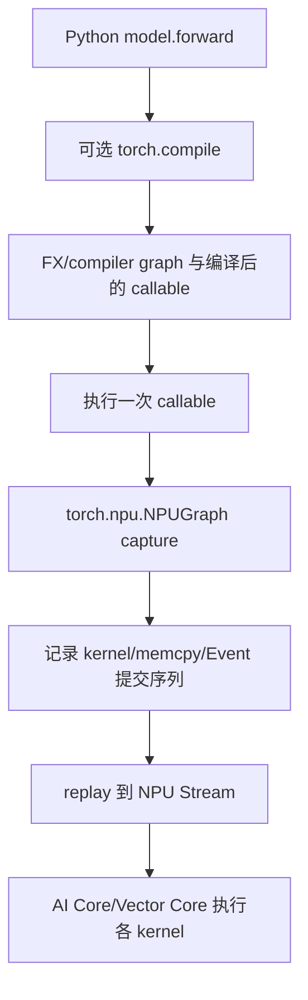
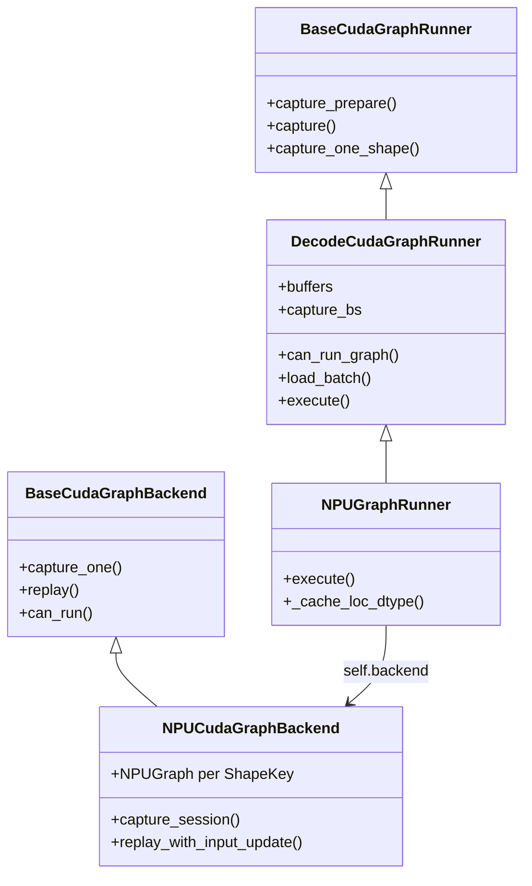
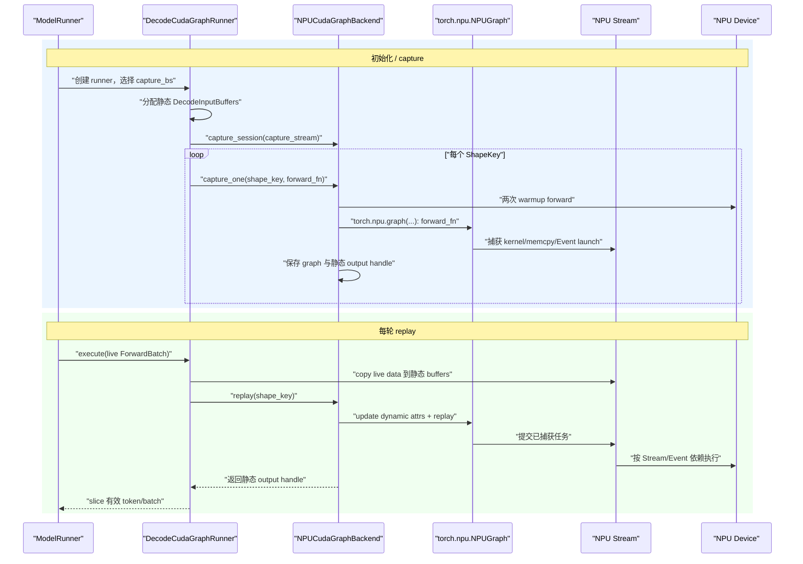

# 05：计算图、torch.compile 与 SGLang NPU Graph 源码全链路

> 本章基于 `SGLang@ddaf430e6c59a88da0a6cca4c71033cedf102a88`，回答三个问题：计算图到底是什么；一个模型是不是只有一张图；SGLang 如何把真实 `ForwardBatch` 更新到静态 buffer，再通过 `torch.npu.NPUGraph` capture/replay。

## 0. 先建立四个不同的“图”

“计算图”不是一个精确到只有一种实现的词。源码阅读时至少要区分：

| 名称 | 节点/边表示什么 | 何时产生 | 本章是否重点 |
|---|---|---|---|
| 概念上的模型计算图 | linear、attention、MoE 等数学运算及 tensor 依赖 | 描述模型结构时 | 是基础 |
| Autograd graph | 为反向传播保存的 operation 与梯度依赖 | 训练 forward 运行时动态建立 | 不是推理重点 |
| FX/Compiler graph | `torch.compile` 从 Python 程序提取的 IR 图 | 编译/guard 命中时 | 是 |
| NPUGraph launch graph | 一次执行中已经确定的 kernel、memcpy、Event 等 Device 提交序列 | capture 时 | 是核心 |

**IR（Intermediate Representation，中间表示）** 是编译器用于分析和改写程序的内部结构。

**Guard（守卫条件）** 是编译器对 dtype、shape、对象属性等前提做的运行时检查；不满足时可能重新编译或 fallback。
**Launch graph（启动图）** 关心的是“提交哪些设备任务”，不等于数学公式本身。

最重要的分层是：



`torch.compile` 和 NPUGraph 可以叠加，也可以只用其中一个。前者尝试优化“程序/算子图”，后者复用“运行时 launch 序列”。

---

## 1. 一个模型有一张专门的图吗

### 1.1 图功能是通用的

`torch.npu.NPUGraph()` 是 torch_npu 提供的通用 runtime capture/replay 能力。它不知道“这是 GLM、DeepSeek 还是 Qwen”，只观察 capture 区间里向 NPU 提交了什么工作。

SGLang 的 `NPUGraphRunner` 也是通用 runner。它调用具体模型的 `forward`，而不是为每个 Hugging Face architecture 手写完整图。

### 1.2 捕获产物又是高度专用的

虽然功能通用，每次产生的 graph artifact（图产物）却依赖：

- 当前模型及其实际 forward 分支；
- 当前 TP/PP rank 的权重和通信调用；
- NPU device/context；
- 输入、输出、workspace 的 Device 地址；
- batch/token 捕获规格；
- decode、target verify 等 forward mode；
- attention backend 与 metadata 结构；
- LoRA variant、PDMux Stream 等可进入 `ShapeKey` 的维度；
- torch、torch_npu、CANN 和 kernel 版本。

因此准确说法是：

> 模型不会随权重文件附带一张永久通用的 NPUGraph；SGLang 在服务进程初始化/首次捕获时，利用通用机制为当前执行环境建立一族专用图实例。

### 1.3 同一个模型为什么需要多张图

当前 `DecodeCudaGraphRunner` 构造 `capture_bs`，并通过 backend 保存：

```python
self._graphs: Dict[Any, Any] = {}
self._outputs: Dict[Any, Any] = {}
```

NPU backend 的 key 是 `ShapeKey`。通用 runner 中：

```python
def _make_graph_key(self, size, stream_idx=None, variant_label=None):
    return ShapeKey(
        size=size,
        stream_idx=stream_idx,
        variant_label=variant_label,
    )
```

所以一个简化例子可能是：

```text
GLM-4.7-Flash / rank 0 / NPU 0
  ShapeKey(size=1)  -> NPUGraph A
  ShapeKey(size=2)  -> NPUGraph B
  ShapeKey(size=4)  -> NPUGraph C
  ShapeKey(size=8)  -> NPUGraph D
  ShapeKey(size=8, variant_label="lora") -> NPUGraph E
```

每个 TP rank 都有自己的模型分片和地址，通常各自 capture。它们不是共享一个 Python graph 对象。

---

## 2. 为什么推理要用 launch graph

LLM decode 每轮通常只为每个请求生成一个或少量 token。单轮计算比 prefill 小，但要重复很多次：

```text
Python 调度
  -> dispatcher
  -> wrapper/tiling/workspace
  -> kernel launch 1
  -> kernel launch 2
  -> ...
  -> 下一轮 decode 再来一次
```

当 kernel 本身较短时，Host dispatch、Python、runtime launch 和小 kernel 之间的空隙占比会变大。

NPUGraph capture 一次稳定序列，replay 时让 runtime 复用它：

```text
首次：准备静态输入 -> warmup -> capture 完整 launch 序列
后续：把新数据 copy 到静态地址 -> replay -> 取静态输出 view
```

它主要降低重复 launch/control overhead，不会：

- 改变模型数学公式；
- 自动把所有 kernel 融成一个 mega kernel；
- 自动减少每个 kernel 内的 GM 搬运；
- 让动态 Python 控制流任意变化；
- 取代 Stream 和 Event。

---

## 3. 静态地址为什么是核心

假设 capture 时 kernel 记录输入地址 `0x1000`、输出地址 `0x2000`。Replay 复用的是这条已经准备好的 launch，因此不能只把 Python 变量 `x` 改成指向 `0x3000`，就期待图自动认识新地址。

常见结构是：

```python
static_x = torch.empty_like(example_x)
graph = torch.npu.NPUGraph()

with torch.npu.graph(graph):
    static_y = model(static_x)

def run(live_x):
    static_x.copy_(live_x)
    graph.replay()
    return static_y
```

这段展示的是真实 API 语法，但省略了 warmup、capture Stream、memory pool、错误检查和模型兼容条件。关键点是：

- `static_x` 的地址不变，内容每轮更新；
- `static_y` 的地址也不变；
- `graph.replay()` 异步重写 `static_y` 的内容；
- 返回的是同一个 output tensor handle；
- 若要跨下一次 replay 长期保存旧结果，需要在正确 Stream 上 clone/copy。

这也直接解释了“计算没完成为什么能返回 tensor”：返回的是静态 storage 句柄，后续同 Stream 消费者会排在 replay 后面；真正 `.cpu()`/`.item()` 时框架才等待 Device 数据。

---

## 4. SGLang 从哪里选择 NPU Graph

### 4.1 初始化

固定源码：

- [`model_runner.py#L859-L866`](https://github.com/sgl-project/sglang/blob/ddaf430e6c59a88da0a6cca4c71033cedf102a88/python/sglang/srt/model_executor/model_runner.py#L859-L866)

```python
def init_cuda_graphs(self, capture_decode_cuda_graph: bool = True):
    capture = capture_cuda_graphs(
        model_runner=self, capture_decode_cuda_graph=capture_decode_cuda_graph
    )
    self.eager_runner = capture.eager_runner
    self.prefill_cuda_graph_runner = capture.prefill_runner
    self.decode_cuda_graph_runner = capture.decode.runner
```

名字保留 `cuda_graph` 是跨平台历史接口，不证明 NPU 使用 CUDA。工厂根据 device 选择 NPU runner/backend。

### 4.2 每轮 forward 的分支

固定源码：

- [`model_runner.py#L1417-L1450`](https://github.com/sgl-project/sglang/blob/ddaf430e6c59a88da0a6cca4c71033cedf102a88/python/sglang/srt/model_executor/model_runner.py#L1417-L1450)

核心真实语法：

```python
can_run_graph = bool(
    mode_check()
    and self.decode_cuda_graph_runner
    and self.decode_cuda_graph_runner.can_run_graph(forward_batch)
)

if can_run_graph:
    ret = self.decode_cuda_graph_runner.execute(
        forward_batch,
        pp_proxy_tensors=pp_proxy_tensors,
    )
    return ModelRunnerOutput(logits_output=ret, can_run_graph=can_run_graph)
```

三个条件分别问：

1. 当前 `ForwardMode` 是否允许 graph；
2. runner 是否已初始化；
3. 当前 batch 是否能映射到已 capture 的 `ShapeKey`。

不满足就走 eager 或其他 prefill 路径。Graph 是优化 fast path，不是模型正确性的唯一实现。

---

## 5. 通用 runner 与 NPU backend 的继承关系



名称里的 CUDA 表示通用框架最初来自 CUDA Graph。NPU 子类复用 shape bucket、buffer、ForwardBatch 等平台无关逻辑，再把设备 graph backend 换成 `NPUCudaGraphBackend`。

[`resolve_decode_backend()`](https://github.com/sgl-project/sglang/blob/ddaf430e6c59a88da0a6cca4c71033cedf102a88/python/sglang/srt/model_executor/runner_backend/utils.py#L52-L76) 明确写了：

```python
if model_runner.device == "npu":
    from sglang.srt.hardware_backend.npu.graph_runner.npu_cudagraph_backend import (
        NPUCudaGraphBackend,
    )
    return NPUCudaGraphBackend(...)
```

---

## 6. Capture：一张图怎样生成

### 6.1 选择 bucket

**Bucket（桶）** 是预先选择的捕获规格。例如 capture batch sizes 为 `[1, 2, 4, 8]`，真实 batch 5 可以 padding 到 8，使用 size=8 的图。

`get_batch_sizes_to_capture()` 会读取 graph 配置、最大请求数、TP 对齐要求和 compile 上限，生成 `capture_bs` 与 `compile_bs`。

捕获多张图的代价是：

- 启动时间增加；
- graph 和静态 buffer 占用更多 Device memory；
- 覆盖更多 shape，eager fallback 减少。

### 6.2 创建最大静态 buffer

`DecodeCudaGraphRunner` 持有 `DecodeInputBuffers`，最大尺寸覆盖 `max(capture_bs)`。里面包括：

- `input_ids`；
- `positions`；
- `req_pool_indices`；
- `seq_lens`；
- `out_cache_loc`；
- attention/page-table metadata；
- speculative decoding 相关 buffer。

捕获 size=1/2/4 时通常使用这些 buffer 的前缀 view，因此地址稳定。

### 6.3 warmup 为什么在 capture 前

[`NPUCudaGraphBackend.capture_one()`](https://github.com/sgl-project/sglang/blob/ddaf430e6c59a88da0a6cca4c71033cedf102a88/python/sglang/srt/hardware_backend/npu/graph_runner/npu_cudagraph_backend.py#L72-L127) 先执行两次：

```python
for _ in range(2):
    self._device_module.synchronize()
    self._tp_group.barrier()
    forward_fn()
```

Warmup 用来提前支付：

- kernel/module load；
- lazy initialization；
- autotune/compile；
- 通信初始化；
- 一次性内存分配。

这些行为若首次发生在 capture 内，可能不可捕获、让 capture 极慢或使图包含不想重复的初始化任务。

### 6.4 真正 capture

固定源码的核心是：

```python
graph = torch.npu.NPUGraph()

with torch.npu.graph(
    graph,
    pool=self._pool,
    stream=self._capture_stream,
    auto_dispatch_capture=True,
):
    out = forward_fn()

self._graphs[shape_key] = graph
self._outputs[shape_key] = out
```

对象含义：

| 变量 | 类型/含义 |
|---|---|
| `graph` | `torch.npu.NPUGraph`，保存捕获后的 runtime 图 |
| `self._pool` | graph memory pool handle，使多张图可管理/复用稳定内存 |
| `self._capture_stream` | capture 期间任务被记录的 NPU Stream |
| `forward_fn` | 使用静态 buffer view 执行一次模型 forward 的闭包 |
| `out` | capture 时建立的静态输出 tensor handle |
| `shape_key` | 查找这张图的捕获规格 |

Capture context 并不把 Python 源码字符串存起来。Python 的 `forward_fn()` 真正执行一次；它产生的 NPU launch 被 runtime 捕获。

---

## 7. Replay：新请求如何喂给旧图

### 7.1 `can_run_graph`

[`DecodeCudaGraphRunner.can_run_graph()`](https://github.com/sgl-project/sglang/blob/ddaf430e6c59a88da0a6cca4c71033cedf102a88/python/sglang/srt/model_executor/runner/decode_cuda_graph_runner.py#L502-L553) 会排除不兼容输入，并计算 graph key。

例如 `replace_embeds` 是每请求动态覆盖 embedding 的路径，源码直接返回 `False`。这体现了原则：无法映射到已捕获静态合同的动态行为应走 eager。

### 7.2 padding 到捕获规格

假设：

```text
raw_bs = 5
capture_bs = [1, 2, 4, 8]
```

`_pad_to_bucket` 选择 `bs=8`。Runner：

1. 保存 `raw_bs=5`；
2. 将 5 条有效请求 copy 到静态 buffer 前 5 行；
3. 填充后 3 行的 input/metadata；
4. 用 `ShapeKey(size=8)` replay；
5. 输出只取前 5 行。

Padding 改变执行规格，不改变有效请求数。

### 7.3 为什么 `copy_` 后立刻 replay 是安全的

```python
self.buffers.input_ids[: self.raw_num_token].copy_(forward_batch.input_ids)
output = self.backend.replay(graph_key, forward_batch)
```

这两个调用通常提交到同一 current Stream：

```text
copy live input -> static buffer
  -> NPUGraph replay reads static buffer
  -> downstream sampling reads static output
```

Host 不需要在中间同步。同 Stream 顺序保证 graph 读取时 copy 已完成。这正是 Stream 专章所讲的“返回句柄但保持正确”的实际应用。

### 7.4 NPU 特有的动态 seq_lens 更新

固定源码：

- [`npu_graph_runner.py#L209-L284`](https://github.com/sgl-project/sglang/blob/ddaf430e6c59a88da0a6cca4c71033cedf102a88/python/sglang/srt/hardware_backend/npu/graph_runner/npu_graph_runner.py#L209-L284)
- [`npu_cudagraph_backend.py#L144-L175`](https://github.com/sgl-project/sglang/blob/ddaf430e6c59a88da0a6cca4c71033cedf102a88/python/sglang/srt/hardware_backend/npu/graph_runner/npu_cudagraph_backend.py#L144-L175)

某些 attention 调用的 `actual_seq_lengths_kv`/`context_lens` 每轮变化。SGLang 不为每组长度重新 capture，而是：

```python
output = self.backend.replay_with_input_update(
    graph_key,
    seq_lens=seq_lens,
    attr_name=self._get_update_attr_name(),
    attr_type=self._get_update_attr_type(),
)
```

Backend 中：

```python
graph = self._graphs[shape_key]

def _update():
    graph.update(cpu_update_input=cpu_update_input)

thread = threading.Thread(target=_update)
thread.start()
graph.replay()
thread.join()
return self._outputs[shape_key]
```

这里的 `threading.Thread` 是 Host 线程，用来调用 NPUGraph 的 input update API；它不是 NPU Stream，也不执行 attention 数学。`graph.update` 能更新哪些属性由 torch_npu/CANN 图合同决定，不代表任意 shape、地址和控制流都能修改。

### 7.5 为什么 replay 返回旧的 `self._outputs[shape_key]`

```python
self._graphs[shape_key].replay()
return self._outputs[shape_key]
```

返回的不是上一次的错误数值，而是 capture 时保存的**静态输出句柄**。Replay 重新执行写这个 storage 的任务。

```text
同一个 tensor handle / 同一个 storage 地址
第 1 次 replay -> 写入 batch 1 的输出
第 2 次 replay -> 覆盖为 batch 2 的输出
```

同 Stream 下游 consumer 会在 replay 后读取正确的新内容。若 Python 要保存第 1 次结果跨越下一次 replay，就必须在下一次覆盖前 clone/copy。

---

## 8. Event 在 Graph 中做什么

Graph 不替代 Stream/Event：

- capture 发生在 capture Stream；
- graph 内可记录 runtime 支持捕获的 Event/多 Stream 依赖；
- replay 是一次异步 Device 工作提交；
- replay 前的输入 copy 要与 replay 有顺序；
- replay 后的消费者也要与 replay 有顺序；
- Host 真正读取输出时仍需同步。

把单 Stream replay 画成：

```text
current Stream:
  update static input
  -> graph replay
       -> kernel A
       -> kernel B
       -> kernel C
  -> sampling kernel
```

若第三方通信在 side Stream 产生输入：

```text
communication Stream: all-reduce -> record ready
graph Stream:                       wait ready -> replay
```

Event 将跨 Stream 数据依赖接到 graph replay 前。没有 Event，graph 只知道自己捕获的提交序列，不会凭 tensor 名字推断外部 Stream 的 producer。

---

## 9. torch.compile 与 NPUGraph 的关系

NPU runner 的 [`patch_model_npu()`](https://github.com/sgl-project/sglang/blob/ddaf430e6c59a88da0a6cca4c71033cedf102a88/python/sglang/srt/hardware_backend/npu/graph_runner/npu_graph_runner.py#L67-L84)：

```python
backend = get_compiler_backend("npugraph_ex")
yield torch.compile(
    torch.no_grad()(model.forward),
    fullgraph=True,
    dynamic=False,
    backend=backend,
)
```

逐项解释：

- `torch.no_grad()`：推理时不建立 autograd backward graph；
- `torch.compile`：让 Dynamo/编译后端提取并优化 forward；
- `fullgraph=True`：希望整个区域形成单一 compiler graph，遇到 graph break 通常报错而不是静默拆分；
- `dynamic=False`：按静态规格优化；
- `backend="npugraph_ex"`：选择 NPU 编译 backend；
- 外层 NPUGraph capture：执行编译后的 callable，并记录它产生的 launch。

所以可能的栈是：

```text
SGLang Python control flow
  -> compiled model forward
  -> optimized NPU operators/kernels
  -> NPUGraph records their launch sequence
  -> replay submits the sequence
```

Compiler graph 与 runtime graph 优化的开销层级不同，不能互换名称。

---

## 10. Piecewise graph 是什么

[`NPUPiecewiseBackend`](https://github.com/sgl-project/sglang/blob/ddaf430e6c59a88da0a6cca4c71033cedf102a88/python/sglang/srt/compilation/npu_piecewise_backend.py) 接收 `torch.fx.GraphModule`，说明它位于 compiler/FX 分片路径。

核心流程：

1. 从参数中的 symbolic runtime shape 选择 `concrete_size_entries`；
2. 未配置的 shape 走 `compiled_graph_for_general_shape`；
3. 第一次运行 warmup；
4. 第二次为该 piece 创建 `torch.npu.NPUGraph`；
5. capture `entry.runnable(*args)`；
6. 保存 weak-ref output 和 graph；
7. replay 时可在 debug 模式检查输入 `data_ptr()` 是否完全一致。

真实源码：

```python
new_input_addresses = [
    x.data_ptr() for x in args if isinstance(x, torch.Tensor)
]
assert new_input_addresses == entry.input_addresses

entry.cudagraph.replay()
return entry.output
```

变量名 `cudagraph` 沿用公共实现，在 NPU backend 中对象实际是 `NPUGraph`。

Piecewise 的优势是缩小捕获区域、允许图片段之间保留部分动态逻辑；代价是片段边界和 launch 数更多，内存引用管理也更复杂。不能假设一定比 full graph 快。

---

## 11. 哪些动态内容可以变化

| 内容 | 通常处理方式 |
|---|---|
| token ID 数值 | copy 到固定 `input_ids` buffer |
| position 数值 | copy 到固定 `positions` buffer |
| request/KV page 索引 | 更新固定 metadata buffer |
| raw batch 小于 bucket | padding 到已捕获 batch size |
| 部分 seq length 属性 | `NPUGraph.update` |
| 超过最大 bucket | eager/fallback 或新增 capture |
| tensor 地址变化 | 通常不允许；copy 到静态 buffer |
| capture 中的 Python data-dependent branch | capture 时路径被固定，通常不允许 replay 任意切换 |
| kernel launch 数随数据变化 | 通常不适合原样 capture |

“固定 shape”不表示所有数值固定；它表示任务拓扑和资源合同足够稳定，动态值通过预定义输入通道更新。

---

## 12. 图的生命周期与失效

图通常在当前服务进程内有效，而不是模型权重的一部分。以下变化可能需要重新 capture：

- capture hidden mode 改变；
- graph 配置/bucket 改变；
- 模型或 LoRA 执行变体改变；
- Device storage 地址重新分配；
- attention backend 或 kernel 路径变化；
- TP/PP 拓扑变化；
- torch_npu/CANN 版本变化。

当前 runner 在需要的 hidden mode 改变时会：

```python
self.backend.cleanup()
self.capture()
```

这说明图是运行时缓存/优化产物，不是模型语义的唯一真相。Eager forward 仍是正确性基线。

---

## 13. 完整时序



---

## 14. 源码阅读顺序

1. `model_runner.py`：graph fast path 在哪里被选择；
2. `base_cuda_graph_runner.py`：通用 runner 合同；
3. `decode_cuda_graph_runner.py`：bucket、静态 buffer、capture 与 replay；
4. `runner_backend/utils.py`：NPU backend 工厂；
5. `npu_cudagraph_backend.py`：真正创建、保存和 replay `NPUGraph`；
6. `npu_graph_runner.py`：NPU seq lengths update 与输出裁剪；
7. `npu_piecewise_backend.py`：FX/compiler piecewise graph。

---

## 15. 本章检查点与详细答案

### 1. 每个模型是否只有一张计算图？

不是。“计算图”能力是通用机制，捕获产物按具体模型执行路径、rank、地址、shape bucket、Stream/LoRA variant 等条件专用。同一模型进程通常缓存多张 `ShapeKey -> NPUGraph`。

### 2. NPUGraph 是否保存 Python `forward` 源码？

不是。Capture 时 Python forward 真正运行一次，runtime 记录这次运行产生的 NPU task submission。Replay 复用任务序列，不重新解释全部 Python 控制流。

### 3. 为什么 replay 前是 `copy_`，不是把 graph 输入变量换成新 tensor？

图中的 launch 通常绑定 capture 时的 Device 地址。`copy_` 更新固定地址中的内容，不改变地址；重新绑定 Python 变量只改变 Host 引用，图仍可能读取旧地址。

### 4. `self._outputs[shape_key]` 为什么不会返回上一次结果？

它是固定输出 storage 的句柄。每次 replay 都重新写该 storage；同 Stream consumer 位于 replay 之后，读取的是新内容。只有在下一次 replay 覆盖之前想长期保留旧结果时才需要 clone/copy。

### 5. Event 与 graph 是什么关系？

Event 表达 Stream 进度依赖。Graph capture/replay 仍通过 Stream 执行；外部 side-stream producer 必须用 Event 接到 replay 前，Host 读取也仍需等待。Graph 不会自动从 tensor 名字推断跨 Stream 依赖。

### 6. `torch.compile` 与 `NPUGraph` 是一回事吗？

不是。`torch.compile` 提取并优化程序/IR 图；NPUGraph 捕获优化后 callable 实际产生的 runtime launch。二者可以叠加。

### 7. 为什么 graph 更常用于 decode？

Decode 单轮 token 数小、调用频繁，重复 Host/runtime launch 开销占比高；shape 也更容易 bucket 化。Prefill shape 更动态且单轮计算更大，capture 收益和兼容性需单独评估。

### 8. 为什么每个 TP rank 通常各自 capture？

各 rank 持有不同权重分片、Device context、storage 地址和通信参与身份。NPUGraph 绑定这些运行时资源，不能把 rank 0 的 Python graph 对象直接当成 rank 1 的图。

---

## 16. 与其他课程的关系

- Stream、Event、异步 tensor 句柄：[ascend-kernel-infra / torch_npu 02](../../ascend-kernel-infra/torch_npu/02-stream-events-and-graph-capture.md)
- `ForwardBatch` 和静态输入：[foundation 05](./foundation/05-model-runner-forward-batch-and-input-buffers.md)
- GLM-4.7-Flash graph replay：[端到端样例第 13 节](./examples/00-glm-4.7-flash-end-to-end.md#13-npu-graph-开启后的-decode-路径)
- 高层配置与排错：[06：NPU Graph 与 Piecewise Compilation](../06-npu-graph-compilation.md)
