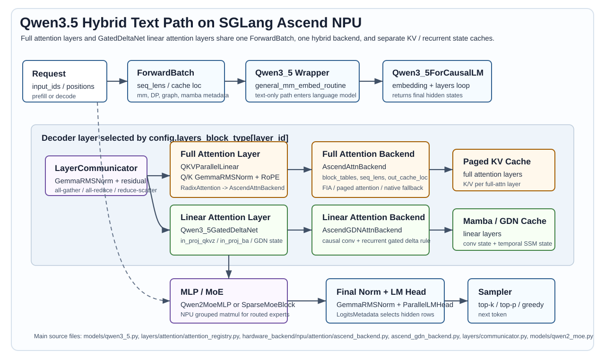

# 端到端样例：Qwen3.5 Hybrid 在 SGLang Ascend NPU 中的完整执行路径

本讲以 Qwen3.5 系列在 SGLang-NPU 上的文本推理路径为主线，拆解一个请求从 `ForwardBatch` 进入模型，到 full attention、linear attention/GatedDeltaNet、MoE、KV/state cache、logits 与采样的完整流程。

Qwen3.5 与 GLM-4.7-Flash 的最大区别是：GLM-4.7-Flash 的主线围绕 MLA 与压缩 KV cache 展开；Qwen3.5 的主线围绕 hybrid layer 展开。模型层由 `config.layers_block_type[layer_id]` 决定是普通 full attention，还是 linear attention/GatedDeltaNet。两类层共享一条 residual/MLP/MoE 结构，但进入不同的 NPU backend，并维护不同的 cache。



## 1. 阅读范围与基线场景

### 1.1 本讲覆盖哪些 Qwen3.5 形态

SGLang 的 `python/sglang/srt/models/qwen3_5.py` 同时覆盖几类 Qwen3.5 形态：

| 形态 | 入口类 | 语言主干 | 本讲如何处理 |
|---|---|---|---|
| Qwen3.5 dense text/VL | `Qwen3_5ForConditionalGeneration` | `Qwen3_5ForCausalLM` | 重点讲语言主干；无图片输入时 wrapper 会走纯文本路径 |
| Qwen3.5 MoE text/VL | `Qwen3_5MoeForConditionalGeneration` | `Qwen3_5MoeForCausalLM` | 重点讲 MoE 层如何进入 NPU routed expert |
| Qwen3.5 MTP | `Qwen3_5ForCausalLMMTP` | `Qwen3_5ForCausalLM` 的 draft 变体 | 作为 speculative 变体补充，不作为基线 |

源码文件末尾的 `EntryClass` 是：

```python
EntryClass = [Qwen3_5MoeForConditionalGeneration, Qwen3_5ForConditionalGeneration]
```

因此初学者可能会疑惑：为什么没有直接把 `Qwen3_5ForCausalLM` 放在 `EntryClass` 里？原因是 Qwen3.5 复用了 Qwen3-VL 的外层 wrapper。对于纯文本请求，`general_mm_embed_routine()` 不会进入视觉编码器，而是直接拿 token embedding 调用语言模型：

```text
Qwen3_5ForConditionalGeneration.forward
  -> general_mm_embed_routine(...)
  -> language_model = Qwen3_5ForCausalLM / Qwen3_5MoeForCausalLM
  -> language_model.forward(...)
  -> logits_processor(...)
```

如果请求中包含图像或视频，外层 wrapper 会先把多模态输入编码成 embedding，再把这些 embedding 替换到文本 token 序列里。本文主线先固定纯文本请求，避免把视觉 encoder、M-RoPE 和 deepstack embedding 混入第一条阅读路径。

### 1.2 基线启动方式

本讲使用如下基线：

| 项目 | 取值 |
|---|---|
| 模型 | Qwen3.5 或 Qwen3.5-MoE checkpoint，以实际 `config.json` 为准 |
| 模型路径 | `/home/{myspace}/models/Qwen3.5` |
| 设备 | Ascend NPU |
| 并行 | 单机 TP=4，PP=1，DP=1 |
| 请求 | 文本在线请求，单请求，首轮无 prefix cache 命中 |
| 执行 | 先关闭 NPU Graph，观察 eager 调用链 |
| attention backend | `ascend` |
| sampling backend | `ascend` |
| dtype | 以 checkpoint/config 为准，常见为 BF16 或量化格式 |

启动命令示例：

```bash
sglang serve \
  --model-path /home/{myspace}/models/Qwen3.5 \
  --device npu \
  --tp-size 4 \
  --attention-backend ascend \
  --sampling-backend ascend \
  --disable-cuda-graph \
  --served-model-name qwen3.5 \
  --host 0.0.0.0 \
  --port 8000
```

`--disable-cuda-graph` 在 SGLang 参数名中沿用了 CUDA 命名，在 NPU 上表示先不要进入 `NPUGraphRunner` replay。先看 eager 分支更容易把 Python 调用链、metadata 和 NPU 算子对应起来。

### 1.3 阅读前记录版本

Qwen3.5、SGLang 和 `sgl-kernel-npu` 都在快速变化，必须先记录：

```text
SGLang commit:
sgl-kernel-npu commit:
Qwen3.5 model revision:
torch / torch_npu / CANN version:
NPU 型号与卡数:
启动参数:
```

本文所有源码路径以当前仓库为准。真实模型的层数、hidden size、head 数、MoE expert 数、full attention 间隔，都应以对应 checkpoint 的 `config.json` 为准。

## 2. Qwen3.5 模型架构先看清

### 2.1 配置字段决定模型结构

Qwen3.5 的文本配置类是 `Qwen3_5TextConfig`，它继承自 `Qwen3NextConfig`。源码位置：

```text
python/sglang/srt/configs/qwen3_5.py
python/sglang/srt/configs/qwen3_next.py
```

最关键的字段如下：

| 字段 | 含义 | 影响的源码分支 |
|---|---|---|
| `model_type` | `qwen3_5_text` 或 `qwen3_5_moe_text` | 决定 decoder layer 内部使用 dense MLP 还是 sparse MoE |
| `num_hidden_layers` | decoder layer 总数 | `make_layers()` 创建多少层 |
| `layers_block_type` | 每层是 `attention` 还是 `linear_attention` | 决定创建 `Qwen3_5AttentionDecoderLayer` 还是 `Qwen3_5LinearDecoderLayer` |
| `full_attention_interval` | 每隔多少层插入 full attention | `Qwen3NextConfig.layers_block_type` 由它推导 |
| `hidden_size` | 主干 hidden 宽度 `D` | embedding、norm、MLP、LM head |
| `num_attention_heads` | full attention 的 Q head 总数 `H` | `Qwen3_5AttentionDecoderLayer` |
| `num_key_value_heads` | full attention 的 K/V head 总数 `Hkv` | GQA/MQA 分支 |
| `head_dim` | full attention 每个 head 的维度 `Dh` | Q/K/V shape 与 RoPE |
| `partial_rotary_factor` | Q/K 中参与 RoPE 的比例 | `split_qkvgate_gemma_rmsnorm_rope` 和 RoPE |
| `attn_output_gate` | full attention 是否有 output gate | 决定 `qkv_proj` 是否同时输出 gate |
| `linear_key_head_dim` | GatedDeltaNet 的 key/query head dim | linear attention projection 与 state |
| `linear_value_head_dim` | GatedDeltaNet 的 value head dim | linear attention output 与 `RMSNormGated` |
| `linear_num_key_heads` | GatedDeltaNet 的 key/query head 数 | `RadixLinearAttention` |
| `linear_num_value_heads` | GatedDeltaNet 的 value head 数 | `RadixLinearAttention` 与 recurrent state |
| `linear_conv_kernel_dim` | linear attention 前 causal conv 的窗口 | mamba/GDN conv state 长度 |
| `intermediate_size` | dense MLP 中间维度 | `Qwen2MoeMLP` |
| `num_experts` | routed experts 数 | `Qwen2MoeSparseMoeBlock` |
| `num_experts_per_tok` | 每个 token 选几个 expert | TopK 与 MoE dispatch |
| `moe_intermediate_size` | routed expert 中间维度 | grouped matmul 的 expert weight |
| `shared_expert_intermediate_size` | shared expert 中间维度 | shared expert 或 fused shared expert |
| `norm_topk_prob` | top-k 权重是否归一化 | router 输出语义 |

`layers_block_type` 是一个属性，不是手写在模型类里的固定列表：

```python
for l in range(self.num_hidden_layers):
    if (l + 1) % self.full_attention_interval == 0:
        layer_type_list.append("attention")
    else:
        layer_type_list.append("linear_attention")
```

所以 Qwen3.5 的层序不是“所有层都 full attention”，而是：

```text
Layer 0      -> linear_attention
...
Layer k-2    -> linear_attention
Layer k-1    -> attention      # 若 full_attention_interval = k
Layer k      -> linear_attention
...
```

实际哪些层是 full attention，可以直接看：

```python
config.full_attention_layer_ids
config.linear_layer_ids
```

### 2.2 统一维度符号

本讲不用固定某个 checkpoint 的数值，而是用配置字段表达 shape：

| 符号 | 来源 | 含义 |
|---|---|---|
| `N` | 运行时 | 本轮真实 token 行数；prefill/extend 时常写作 `T`，decode 时常写作 `B` |
| `B` | 运行时 | decode batch size |
| `D` | `hidden_size` | 主干 hidden 宽度 |
| `L` | `num_hidden_layers` | decoder 层数 |
| `V` | `vocab_size` | 全局词表大小 |
| `TP` | 启动参数 | tensor parallel 并行度 |
| `H` | `num_attention_heads` | full attention Q head 总数 |
| `Htp` | `H / TP` | 当前 rank 的 Q head 数 |
| `Hkv` | `num_key_value_heads` | full attention K/V head 总数 |
| `Hkv_tp` | `max(1, Hkv / TP)` | 当前 rank 的 K/V head 数，若 `Hkv < TP` 则按实现复制 |
| `Dh` | `head_dim` | full attention 每个 head 的 Q/K/V 维度 |
| `Rrot` | `int(Dh * partial_rotary_factor)` | 每个 head 中参与 RoPE 的维度 |
| `Lk` | `linear_key_head_dim` | GDN key/query head dim |
| `Lv` | `linear_value_head_dim` | GDN value head dim |
| `Lkh` | `linear_num_key_heads` | GDN key/query head 总数 |
| `Lvh` | `linear_num_value_heads` | GDN value head 总数 |
| `Kconv` | `linear_conv_kernel_dim` | GDN causal conv 窗口大小 |
| `E` | `num_experts` | routed experts 数 |
| `K` | `num_experts_per_tok` | 每个 token 选择的 experts 数 |

常用 shape：

```text
hidden_states                         [N, D]

full attention local q                [N, Htp * Dh]
full attention local k/v              [N, Hkv_tp * Dh]
full attention q by head              [N, Htp, Dh]
full attention k/v by head            [N, Hkv_tp, Dh]

linear attention key_dim global       Lkh * Lk
linear attention value_dim global     Lvh * Lv
linear attention key_dim local        (Lkh * Lk) / TP
linear attention value_dim local      (Lvh * Lv) / TP
```

## 3. 从请求到模型入口

### 3.1 ModelRunner 的主链路

Qwen3.5 和 GLM 一样，先由 Scheduler 组织 batch，再进入 ModelRunner：

```text
Scheduler
  -> ScheduleBatch
  -> TpModelWorker.forward_batch_generation()
  -> ForwardBatch.init_new(schedule_batch, model_runner)
  -> ModelRunner._forward_raw()
  -> forward_extend() / forward_decode()
  -> attn_backend.init_forward_metadata(forward_batch)
  -> self.model.forward(input_ids, positions, forward_batch)
```

`ForwardBatch` 仍然是贯穿全链路的 metadata 主体。对于 Qwen3.5，除了普通 attention 的 `seq_lens`、`req_pool_indices`、`out_cache_loc`，还要额外关注 linear attention state 相关字段：

| `ForwardBatch` 字段 | Qwen3.5 中的用途 |
|---|---|
| `input_ids` | embedding 输入；同时用于判断 token 数 |
| `positions` / `mrope_positions` | full attention RoPE；VL/M-RoPE 分支可能替换 positions |
| `forward_mode` | 判断 prefill/decode/verify/idle，决定 full attention 和 GDN backend 分支 |
| `req_pool_indices` | full attention 查 KV page；linear attention 查 mamba/GDN state slot |
| `seq_lens` / `seq_lens_cpu` | full attention 历史长度；graph padding 判断 |
| `extend_seq_lens` / `extend_start_loc` | GDN prefill 构造 `query_start_loc` |
| `extend_prefix_lens` | full attention prefix cache；GDN 判断是否有初始 state |
| `out_cache_loc` | full attention 新 K/V 写入位置 |
| `mamba_track_indices` / `mamba_track_mask` / `mamba_track_seqlens` | GDN prefix cache/state tracking |
| `spec_info` | MTP/EAGLE verify 时构造 tree、draft token 和 GDN state 索引 |
| `num_token_non_padded_cpu` | graph/padding 下裁剪真实 token |

这些 metadata 不写在 `hidden_states` 里。`hidden_states [N,D]` 只保存激活值；请求长度、KV page、GDN recurrent state slot、是否 target verify 都由 `ForwardBatch` 和 backend 派生 metadata 表达。

### 3.2 attention backend 会被包装成 hybrid backend

在 `layers/attention/attention_registry.py` 中，NPU 上如果 `runner.mambaish_config` 命中 Qwen3.5，就会构造 hybrid backend：

```text
create_attention_backend(...)
  -> full_attn_backend = AscendAttnBackend(...)
  -> runner.mambaish_config 命中 Qwen3.5
  -> linear_attn_backend = AscendGDNAttnBackend(runner)
  -> AscendHybridLinearAttnBackend(
       full_attn_backend,
       linear_attn_backend,
       full_attn_layers=config.full_attention_layer_ids,
     )
```

`ModelRunner.forward_extend()` / `forward_decode()` 只调用一次：

```python
self.attn_backend.init_forward_metadata(forward_batch)
```

但此时 `self.attn_backend` 已经是 hybrid backend。它会同时初始化两套 metadata：

```text
HybridLinearAttnBackend.init_forward_metadata
  -> AscendAttnBackend.init_forward_metadata(forward_batch)
  -> AscendGDNAttnBackend.init_forward_metadata(forward_batch)
```

执行某一层时再按 layer 类型分发：

| layer 对象 | backend 分支 | cache |
|---|---|---|
| `RadixAttention` | full attention backend | paged K/V cache |
| `RadixLinearAttention` | linear attention backend | mamba/GDN conv state + temporal SSM state |

所以 Qwen3.5 是“一个模型、两套 attention 后端、两类 cache、同一个 `ForwardBatch`”。

## 4. 模型类初始化

### 4.1 外层 wrapper 与语言模型

Qwen3.5 的外层 wrapper 继承自 Qwen3-VL：

```text
Qwen3_5ForConditionalGeneration
  -> Qwen3VLForConditionalGeneration.__init__(..., language_model_cls=Qwen3_5ForCausalLM)

Qwen3_5MoeForConditionalGeneration
  -> Qwen3VLForConditionalGeneration.__init__(..., language_model_cls=Qwen3_5MoeForCausalLM)
```

外层负责：

1. 创建视觉模型 `self.visual`；
2. 创建语言模型 `self.model`；
3. 创建 `lm_head`、`LogitsProcessor`、pooler；
4. 在 forward 中调用 `general_mm_embed_routine()`；
5. 最后一个 PP rank 上进入 logits。

纯文本推理时，视觉模型虽然存在于 wrapper 中，但不会处理输入。`general_mm_embed_routine()` 看到 `forward_batch.contains_mm_inputs()` 为假，会直接调用语言模型 embedding。

### 4.2 语言模型的 layer 构造

`Qwen3_5ForCausalLM.__init__()` 的关键结构是：

```python
if self.pp_group.is_first_rank:
    self.embed_tokens = VocabParallelEmbedding(...)

def get_layer(idx: int, prefix: str):
    layer_type = config.layers_block_type[idx]
    layer_class = ALL_DECODER_LAYER_TYPES[layer_type]
    if layer_type == "attention":
        prefix = add_prefix("self_attn", prefix)
    else:
        prefix = add_prefix("linear_attn", prefix)
    return layer_class(...)

self.layers, self._start_layer, self._end_layer = make_layers(...)

if self.pp_group.is_last_rank:
    self.norm = GemmaRMSNorm(...)
```

layer 类型映射是：

```python
ALL_DECODER_LAYER_TYPES = {
    "attention": Qwen3_5AttentionDecoderLayer,
    "linear_attention": Qwen3_5LinearDecoderLayer,
}
```

每个 decoder layer 都会创建：

| 组件 | full attention layer | linear attention layer |
|---|---|---|
| attention 主体 | `Qwen3_5AttentionDecoderLayer.self_attention()` | `Qwen3_5GatedDeltaNet` |
| attention backend 对象 | `RadixAttention` | `RadixLinearAttention` |
| MLP/MoE | `Qwen2MoeMLP` 或 `Qwen2MoeSparseMoeBlock` | 同左 |
| norm | `GemmaRMSNorm` | `GemmaRMSNorm` |
| 通信 | `LayerCommunicator` | `LayerCommunicator` |

## 5. 权重加载：哪些 checkpoint 名字会被合入

Qwen3.5 的 `packed_modules_mapping` 是：

```python
packed_modules_mapping = {
    "qkv_proj": ["q_proj", "k_proj", "v_proj"],
    "gate_up_proj": ["gate_proj", "up_proj"],
    "in_proj_qkvz": ["in_proj_qkv", "in_proj_z"],
    "in_proj_ba": ["in_proj_b", "in_proj_a"],
}
```

这里的“合入”指的是：checkpoint 中多个逻辑权重文件，加载后写入 SGLang 中一个融合后的参数对象，计算时一次 projection 得到多段结果。

| checkpoint 侧 | SGLang 参数 | 为什么合入 | forward 中如何使用 |
|---|---|---|---|
| `q_proj`、`k_proj`、`v_proj` | `qkv_proj` | full attention 一次矩阵乘得到 Q/K/V；若启用 output gate，还会带 Q gate 段 | `qkv, _ = self.qkv_proj(hidden_states)` |
| `gate_proj`、`up_proj` | `gate_up_proj` | SwiGLU 需要 gate 和 up 两段，合并后一次 column parallel linear | `gate_up, _ = self.gate_up_proj(x)` |
| `in_proj_qkv`、`in_proj_z` | `in_proj_qkvz` | GDN linear attention 同时需要 q/k/v 和 z gate | `projected_states_qkvz, _ = self.in_proj_qkvz(hidden_states)` |
| `in_proj_b`、`in_proj_a` | `in_proj_ba` | GDN recurrent update 需要 b/a 两个门控参数 | `projected_states_ba, _ = self.in_proj_ba(hidden_states)` |

### 5.1 full attention 的 qkv 合入

full attention layer 中：

```python
self.qkv_proj = QKVParallelLinear(
    config.hidden_size,
    self.head_dim,
    self.total_num_heads * (1 + self.attn_output_gate),
    self.total_num_kv_heads,
    ...
)
```

若 `attn_output_gate=True`，本地 `qkv_proj` 输出会被切成：

```text
q_gate [N, 2 * Htp * Dh]
k      [N, Hkv_tp * Dh]
v      [N, Hkv_tp * Dh]
```

随后：

```python
q_gate = q_gate.view(..., self.num_heads, -1)
q, gate = torch.chunk(q_gate, 2, dim=-1)
```

所以 output gate 不是单独一层 attention 后处理权重，而是在 Q projection 的输出维度中额外打包出一段 `gate [N,Htp,Dh]`。attention core 输出后再执行：

```python
gate = torch.sigmoid(gate)
attn_output = attn_output * gate
```

### 5.2 GDN 的 in_proj 合入

`Qwen3_5GatedDeltaNet` 有两组 merged projection：

```python
in_proj_qkvz: output_sizes=[key_dim, key_dim, value_dim, value_dim]
in_proj_ba:   output_sizes=[num_v_heads, num_v_heads]
```

加载时：

```text
in_proj_qkv + in_proj_z -> in_proj_qkvz
in_proj_b   + in_proj_a -> in_proj_ba
```

forward 中拆成：

```text
query [N, key_dim/TP]
key   [N, key_dim/TP]
value [N, value_dim/TP]
z     [N, value_dim/TP]
b     [N, linear_num_value_heads/TP]
a     [N, linear_num_value_heads/TP]
```

然后：

```text
mixed_qkv = cat(query, key, value)       [N, 2*key_dim/TP + value_dim/TP]
z         = reshape to heads             [N, Lvh/TP, Lv]
a, b      = contiguous gate vectors      [N, Lvh/TP]
```

`mixed_qkv` 交给 `RadixLinearAttention`，`z` 交给 `RMSNormGated` 做输出门控归一化。

### 5.3 MoE expert 加载

对于 Qwen3.5-MoE，`Qwen3_5MoeForCausalLM.load_weights()` 会额外处理 expert 权重：

```python
expert_params_mapping = FusedMoE.make_expert_params_mapping(
    ckpt_gate_proj_name="gate_proj",
    ckpt_down_proj_name="down_proj",
    ckpt_up_proj_name="up_proj",
    num_experts=self.config.num_experts,
)
```

普通 expert 权重会写入 fused MoE 参数；有些 checkpoint 可能已经把 `experts.gate_up_proj` 做成融合格式，源码用 `fused_expert_params_mapping` 拆回 `w1/w3/w2` 语义。NPU 执行阶段会把 expert 权重交给 grouped matmul，而不是 Python 循环逐 expert 调 GEMM。

## 6. 顶层 forward：embedding、逐层循环、final norm

语言主干 `Qwen3_5ForCausalLM.forward()` 的核心逻辑：

```python
if self.pp_group.is_first_rank:
    hidden_states = self.embed_tokens(input_ids) if input_embeds is None else input_embeds
    residual = None
else:
    hidden_states = pp_proxy_tensors["hidden_states"]
    residual = pp_proxy_tensors["residual"]

for layer_idx in range(self.start_layer, self.end_layer):
    layer = self.layers[layer_idx]
    hidden_states, residual = layer(
        positions=positions,
        hidden_states=hidden_states,
        residual=residual,
        forward_batch=forward_batch,
        captured_last_layer_outputs=...,
    )

hidden_states, _ = self.norm(hidden_states, residual)
return hidden_states
```

这里仍然沿用 SGLang 的 pair 语义：

| 变量 | 语义 |
|---|---|
| `hidden_states` | 当前 block 产生的增量，或下一步 attention/MLP 的输入 |
| `residual` | 已累计的 residual 基底 |
| `forward_batch` | 当前请求、cache、mode、DP/CP/graph/spec/GDN state 的 metadata |

final norm 使用 `GemmaRMSNorm`。在 NPU 上：

| 情况 | NPU 入口 |
|---|---|
| 无 residual | `torch_npu.npu_gemma_rms_norm` |
| 有 residual | `add_gemma_rms_norm(...)`，内部执行 NPU fused add + Gemma RMSNorm |

## 7. LayerCommunicator：两类 layer 共用的边界状态机

full attention layer 和 linear attention layer 都创建：

```python
self.layer_communicator = LayerCommunicator(
    layer_scatter_modes=self.layer_scatter_modes,
    input_layernorm=self.input_layernorm,
    post_attention_layernorm=self.post_attention_layernorm,
    allow_reduce_scatter=True,
    is_last_layer=(layer_id == config.num_hidden_layers - 1),
)
```

forward 中边界顺序完全一致：

```text
prepare_attn_and_capture_last_layer_outputs
  -> attention 或 linear attention
prepare_mlp
  -> dense MLP 或 sparse MoE
postprocess_layer 或 _sglang_needs_allreduce_fusion 标记
```

`prepare_attn_and_capture_last_layer_outputs()` 相比普通 `prepare_attn()` 多了一个能力：如果当前层被 DFLASH/EAGLE 等 speculative 逻辑指定为 auxiliary hidden capture 层，它会在 norm/通信边界上保存上一层输出。对普通推理来说，可以先把它理解成：

```text
hidden_states, residual
  -> residual add + GemmaRMSNorm
  -> 必要的 all-gather / reduce-scatter
  -> attention 输入
```

`should_allreduce_fusion` 的语义与 GLM 一致：如果返回 `True`，本层 MLP/MoE 会把：

```python
hidden_states._sglang_needs_allreduce_fusion = True
```

挂到当前 `torch.Tensor` Python 对象上。下一层 `prepare_attn()` 检测这个临时属性，先完成欠下的 TP all-reduce，再做 input norm。这个标记不是 NPU tensor 内置 metadata，只是跨相邻 layer 的 Python 层临时状态。

## 8. Full attention layer：QKV、Q/K norm、RoPE、paged attention

### 8.1 full attention layer 的源码结构

full attention layer 对应：

```text
models/qwen3_5.py
  Qwen3_5AttentionDecoderLayer
    -> qkv_proj
    -> q_norm / k_norm
    -> rotary_emb
    -> RadixAttention
    -> o_proj
```

构造期关键字段：

```python
self.num_heads = config.num_attention_heads // attn_tp_size
self.num_kv_heads = max(1, config.num_key_value_heads // attn_tp_size)
self.head_dim = config.head_dim or (config.hidden_size // self.num_heads)
self.q_size = self.num_heads * self.head_dim
self.kv_size = self.num_kv_heads * self.head_dim
```

这里 `self.num_heads` 和 `self.num_kv_heads` 已经是当前 attention TP rank 的 local head 数。`QKVParallelLinear` 根据 TP 处理权重切分或 K/V 复制。

### 8.2 prefill/extend：NPU 上默认先走 native prepare

full attention 的 prepare 分支：

```python
if (
    not _is_npu
    or forward_batch.forward_mode.is_extend_or_draft_extend_or_mixed()
    or not self.attn_output_gate
):
    q, k, v, gate = self.forward_prepare_native(...)
else:
    q, k, v, gate = self.forward_prepare_npu(...)
```

这意味着：NPU 的 prefill/extend 基线通常走 `forward_prepare_native()`，即：

```text
qkv_proj(hidden_states)
  -> split q / k / v / gate
  -> q_norm(q), k_norm(k)
  -> rotary_emb(positions, q, k)
  -> RadixAttention(q, k, v, forward_batch)
```

虽然叫 native prepare，但这些 tensor 在 NPU 上，`qkv_proj` 的 `F.linear`、`GemmaRMSNorm`、RoPE 中的张量操作都会由 `torch_npu` 或 SGLang NPU op 执行。这里只是没有使用 `split_qkvgate_gemma_rmsnorm_rope` 这个 fused prepare op。

然后进入：

```text
RadixAttention.forward
  -> get_attn_backend().forward(...)
  -> HybridLinearAttnBackend.forward_extend(...)
  -> AscendAttnBackend.forward_extend(...)
```

`AscendAttnBackend.forward_extend()` 会根据 `forward_batch` 派生的 metadata 决定 attention kernel：

| 条件 | 常见 NPU 路径 |
|---|---|
| `ASCEND_USE_FIA=1` 且 shape/backend 支持 | `torch_npu.npu_fused_infer_attention_score` 或 v2 |
| 非 FIA 且满足 qlens flash attention 条件 | `torch_npu._npu_flash_attention_qlens` |
| shape 或场景不满足 fused 条件 | `native_attn.run_sdpa_forward_extend(...)` |

full attention 的 K/V 会写入 paged KV cache：

```python
self.token_to_kv_pool.set_kv_buffer(layer, forward_batch.out_cache_loc, k, v)
```

`block_tables`、`seq_lens`、`extend_seq_lens` 等 metadata 来自 `AscendAttnBackend.init_forward_metadata(forward_batch)`。

### 8.3 decode：NPU fused prepare 更关键

decode 时 `forward_mode.is_extend_or_draft_extend_or_mixed()` 为假，且若 `attn_output_gate=True`，会进入：

```python
q, k, v, gate = self.forward_prepare_npu(...)
```

NPU fused prepare 调用：

```python
split_qkvgate_gemma_rmsnorm_rope(
    qkv,
    self.rotary_emb.position_sin,
    self.rotary_emb.position_cos,
    self.q_size,
    self.kv_size,
    self.head_dim,
    int(self.head_dim * self.partial_rotary_factor),
    eps=self.q_norm.variance_epsilon,
    q_weight=self.q_norm.weight,
    k_weight=self.k_norm.weight,
)
```

这个 op 一次完成：

1. 从 `qkv` 中切出 Q、K、V、gate；
2. 对 Q/K 分 head 做 GemmaRMSNorm；
3. 对 Q/K 的 rotary 维度应用 RoPE；
4. 返回 attention backend 需要的 `q/k/v/gate`。

decode full attention core 进入：

```text
HybridLinearAttnBackend.forward_decode
  -> AscendAttnBackend.forward_decode
  -> 写入本轮 K/V
  -> 读取 paged KV cache
  -> _npu_paged_attention / FIA / native fallback
```

常见 paged attention 调用形态：

```python
torch_npu._npu_paged_attention(
    query=query,
    key_cache=k_cache,
    value_cache=v_cache,
    num_heads=layer.tp_q_head_num,
    num_kv_heads=layer.tp_k_head_num,
    scale_value=layer.scaling,
    block_table=self.forward_metadata.block_tables,
    context_lens=self.forward_metadata.seq_lens_cpu_int,
    out=attn_output,
)
```

attention 输出 shape：

```text
attn_output [B, Htp * Dh]
gate        [B, Htp * Dh]
sigmoid(gate) * attn_output
o_proj -> [B, D] 的 TP partial
```

`o_proj` 设置了 `reduce_results=False`，所以 TP all-reduce 不在 attention 内部立即完成，而是交给 `LayerCommunicator.prepare_mlp()` 在 attention residual 边界统一处理。

## 9. Linear attention layer：Qwen3_5GatedDeltaNet

### 9.1 linear attention layer 的源码结构

linear attention layer 对应：

```text
models/qwen3_5.py
  Qwen3_5LinearDecoderLayer
    -> Qwen3_5GatedDeltaNet
       -> in_proj_qkvz
       -> in_proj_ba
       -> RadixLinearAttention
       -> RMSNormGated
       -> out_proj
    -> Qwen2MoeMLP / Qwen2MoeSparseMoeBlock
```

`Qwen3_5GatedDeltaNet.forward()` 可以拆成五步：

```text
1. hidden_states -> in_proj_qkvz / in_proj_ba
2. split 成 query/key/value/z/b/a
3. mixed_qkv, a, b -> RadixLinearAttention
4. core_attn_out 与 z -> RMSNormGated
5. out_proj -> [N,D] 的 TP partial
```

### 9.2 projection 和 shape

构造期：

```python
self.key_dim = linear_key_head_dim * linear_num_key_heads
self.value_dim = linear_value_head_dim * linear_num_value_heads
self.conv_dim = self.key_dim * 2 + self.value_dim

in_proj_qkvz output_sizes = [key_dim, key_dim, value_dim, value_dim]
in_proj_ba output_sizes   = [num_v_heads, num_v_heads]
```

当前 TP rank 上：

```text
projected_states_qkvz [N, 2*key_dim/TP + 2*value_dim/TP]
projected_states_ba   [N, 2*linear_num_value_heads/TP]

query [N, key_dim/TP]
key   [N, key_dim/TP]
value [N, value_dim/TP]
z     [N, value_dim/TP] -> [N, Lvh/TP, Lv]
b     [N, Lvh/TP]
a     [N, Lvh/TP]

mixed_qkv = cat(query, key, value)
          [N, 2*key_dim/TP + value_dim/TP]
```

这里的 `query/key/value` 不是普通 softmax attention 的 Q/K/V。它们会进入 Gated Delta Rule，用 recurrent state 表示历史信息。

### 9.3 linear attention backend metadata

`RadixLinearAttention.forward()` 最终调用：

```python
get_attn_backend().forward(
    layer=self,
    forward_batch=forward_batch,
    mixed_qkv=mixed_qkv,
    a=a,
    b=b,
)
```

由于当前 backend 是 `AscendHybridLinearAttnBackend`，它识别 `layer` 是 `RadixLinearAttention`，于是分发给：

```text
AscendGDNAttnBackend.forward_extend(...)
AscendGDNAttnBackend.forward_decode(...)
```

linear attention 需要的 metadata 由 `MambaAttnBackendBase._forward_metadata()` 生成：

| metadata | 来源 | 用途 |
|---|---|---|
| `mamba_cache_indices` | `req_to_token_pool.get_mamba_indices(req_pool_indices)` | 每个请求对应的 GDN state slot |
| `query_start_loc` | `extend_start_loc` / decode arange | packed token 中每个请求的起止位置 |
| `retrieve_next_token` / `retrieve_next_sibling` | `spec_info` | target verify 中处理 speculative tree |
| `track_conv_indices` | `mamba_track_mask`、`extend_prefix_lens` | prefix cache 场景保存 conv state |
| `track_ssm_*` | `mamba_track_*` 和 chunk 边界 | prefix cache 场景保存 SSM/recurrent state |

这些 metadata 和 full attention 的 `block_tables/seq_lens/out_cache_loc` 并行存在。Qwen3.5 的 hybrid cache 因此分成两块：

```text
full attention layer  -> paged K/V cache
linear attention layer -> mamba/GDN conv state + temporal SSM state
```

### 9.4 prefill/extend 的 GDN 路径

`AscendGDNAttnBackend.forward_extend()` 主线：

```text
mixed_qkv
  -> causal_conv1d_fn_npu
  -> split query/key/value
  -> fused_gdn_gating_npu(A_log, a, b, dt_bias)
  -> kernel_dispatcher.extend(...)
  -> 更新 temporal SSM state
  -> 必要时 track prefix state
```

关键 NPU 入口：

| 阶段 | NPU API/组件 | 作用 |
|---|---|---|
| causal conv | `causal_conv1d_fn_npu` | 对 packed sequence 做一维因果卷积，维护局部窗口 |
| GDN gate | `fused_gdn_gating_npu` | 根据 `A_log/a/b/dt_bias` 生成 recurrent update 所需 gate |
| GDN core | `GDNKernelDispatcher.extend(...)` | 执行 chunked linear attention / gated delta rule |
| state tracking | `track_mamba_state...` 相关 kernel | prefix cache 或 chunked prefill 后保存 state |

输出 shape：

```text
core_attn_out [N, Lvh/TP, Lv]
z             [N, Lvh/TP, Lv]
RMSNormGated(core_attn_out, z)
flatten       [N, value_dim/TP]
out_proj      [N, D] TP partial
```

### 9.5 decode 的 GDN 路径

decode 每个请求通常只有一个新 token。`forward_decode()` 主线：

```text
mixed_qkv [B, 2*key_dim/TP + value_dim/TP]
  -> causal_conv1d_update_npu
  -> split query/key/value
  -> reshape query/key/value to [1,B,heads,dim]
  -> kernel_dispatcher.decode(...)
  -> 更新 conv state 与 temporal state
```

核心代码关系：

```python
conv_states_tmp = conv_states.transpose(1, 2).clone()
mixed_qkv = causal_conv1d_update(
    mixed_qkv,
    conv_states_tmp,
    layer.conv_weights,
    layer.bias,
    layer.activation,
    conv_state_indices=cache_indices,
)
conv_states[:] = conv_states_tmp.transpose(1, 2)

core_attn_out = self.kernel_dispatcher.decode(
    q=query,
    k=key,
    v=value,
    a=a,
    b=b,
    A_log=layer.A_log,
    dt_bias=layer.dt_bias,
    ssm_states=ssm_states,
    cache_indices=cache_indices,
    query_start_loc=query_start_loc,
)
```

与 full attention decode 不同，linear attention decode 不会读取一串历史 K/V page，而是读取并更新 recurrent state：

```text
full attention decode:
  q_new + paged K/V history -> attention output

linear attention decode:
  qkv_new + conv_state + ssm_state -> new output + updated state
```

这也是 Qwen3.5 在 NPU 上需要 `HybridReqToTokenPool` 和 `HybridLinearKVPool` 的原因。

### 9.6 target verify / speculative 下的特殊 GDN op

target verify 分支中，GDN 需要一次处理多个 draft token，并根据 speculative tree 更新中间 state。源码里会调用：

```python
torch.ops.npu.recurrent_gated_delta_rule(...)
```

它接收：

| 参数 | 含义 |
|---|---|
| `mix_qkv` | draft token 对应的 q/k/v packed 输入 |
| `recurrent_state` | 当前请求的 temporal SSM state |
| `beta` / `g` | GDN gate |
| `actual_seq_lengths` | 每个请求实际 draft 长度 |
| `ssm_state_indices` | draft token 在 state 序列中的索引 |
| `cache_indices` | 请求对应的 state slot |
| `num_accepted_tokens` | 每个请求接受的 draft token 数 |

这部分是 speculative decoding 调试时最容易漏看的 Qwen3.5 特有路径。

## 10. MLP 与 MoE：复用 Qwen2Moe 组件

attention 或 linear attention 完成后，两个 decoder layer 都进入：

```python
hidden_states, residual = self.layer_communicator.prepare_mlp(
    hidden_states, residual, forward_batch
)
```

`prepare_mlp()` 会完成 attention 输出 TP partial 的汇总、residual add 和 MLP 前 GemmaRMSNorm。之后根据 `model_type` 选择 dense MLP 或 sparse MoE。

### 10.1 dense MLP

`model_type == "qwen3_5_text"` 时：

```text
Qwen2MoeMLP.forward
  -> gate_up_proj
  -> SiluAndMul
  -> down_proj
```

shape：

```text
x                    [N,D]
gate_up_proj local   [N, 2*intermediate_size/TP]
gate                 [N, intermediate_size/TP]
up                   [N, intermediate_size/TP]
SiluAndMul           [N, intermediate_size/TP]
down_proj local      [N,D] TP partial
```

在 NPU 上，`SiluAndMul` 通常会使用显式 NPU activation op；linear projection 使用 `F.linear`，由 `torch_npu` / CANN 分发到底层 MatMul。

### 10.2 sparse MoE

`model_type == "qwen3_5_moe_text"` 时：

```text
Qwen2MoeSparseMoeBlock.forward
  -> gate(hidden_states)
  -> TopK
  -> experts(hidden_states, topk_output)
  -> shared_expert optional
  -> TP all-reduce if needed
```

普通 NPU routed expert 路径：

```text
UnquantizedFusedMoEMethod.forward_npu
  -> npu_moe_init_routing_v2
  -> npu_grouped_matmul      # gate/up expert GEMM
  -> npu_swiglu
  -> npu_grouped_matmul      # down expert GEMM
  -> npu_moe_finalize_routing
```

含义：

| 步骤 | 输入 | 输出 | 作用 |
|---|---|---|---|
| router | `[N,D]` | router logits `[N,E]` | 每个 token 对所有 expert 打分 |
| top-k | logits | ids/weights `[N,K]` | 选出 K 个 routed experts |
| routing init | hidden + ids | expanded hidden `[N*K,D]` | 把 token 展开成 token-expert 对并按 expert 分组 |
| grouped matmul 1 | grouped hidden + `w13` | packed gate/up | 每个 expert 处理自己的 token 段 |
| activation | packed gate/up | intermediate | `SiLU(gate) * up` |
| grouped matmul 2 | intermediate + `w2` | expert output | 回到 hidden size |
| finalize | expert output + weights | `[N,D]` | 按原 token 聚合 K 路 expert 输出 |

如果启用 DeepEP、FuseEP 或 shared expert fusion，MoE 的 dispatch/combine 和 shared expert 位置会变化，但 decoder layer 外层仍然通过 `Qwen2MoeSparseMoeBlock.forward()` 进入。

## 11. Prefix cache 与两类 cache 的区别

Qwen3.5 hybrid 模型有两类历史状态：

| 层类型 | 历史状态 | 写入/读取位置 | metadata |
|---|---|---|---|
| full attention | K/V page | `HybridLinearKVPool.full_kv_pool` | `block_tables`、`seq_lens`、`out_cache_loc` |
| linear attention | conv state + temporal SSM state | `MambaPool` | `mamba_cache_indices`、`query_start_loc`、`mamba_track_*` |

full attention prefix cache 逻辑与普通 MHA 模型一致：prefix 命中后，attention backend 根据 `req_pool_indices` 和 `extend_prefix_lens` 构造 page table，让本轮 query attend 到历史 K/V。

linear attention 没有 K/V page 序列可读。它需要的是“前缀处理完成后的 recurrent state”。因此 prefix/chunked prefill 场景要额外保存：

```text
conv state: 最近 Kconv-1 个 token 的卷积窗口
ssm state: Gated Delta Rule 的 temporal recurrent state
```

`MambaAttnBackendBase._init_track_conv_indices()` 和 `_init_track_ssm_indices()` 就是在计算：本轮 extend 结束时，应该从 packed sequence 或中间 hidden state 中取哪一段，保存到哪个 mamba state slot。

## 12. Decode：full attention 与 GDN 同轮交替执行

一次 decode 请求在 Qwen3.5 中不是“只走一种 attention”。它会按 layer 顺序交替：

```text
Layer 0 linear_attention
  -> AscendGDNAttnBackend.forward_decode
Layer 1 linear_attention
  -> AscendGDNAttnBackend.forward_decode
...
Layer k-1 attention
  -> AscendAttnBackend.forward_decode
...
```

每一层的输入输出仍然都是 `[B,D]`，但内部读取的历史状态不同：

| 阶段 | full attention layer | linear attention layer |
|---|---|---|
| prepare | `split_qkvgate_gemma_rmsnorm_rope` 或 native prepare | `in_proj_qkvz` + `in_proj_ba` |
| 历史状态 | paged K/V cache | conv/SSM recurrent state |
| 核心 op | `_npu_paged_attention` / FIA | `causal_conv1d_update_npu` + GDN decode |
| 输出门控 | `sigmoid(gate) * attn_output` | `RMSNormGated(core_attn_out, z)` |
| 输出投影 | `o_proj` | `out_proj` |

`LayerCommunicator` 在两类层之间维持相同的 residual 和 TP 通信语义，因此上一层是 full attention 还是 linear attention，不会改变下一层接收到的主干 shape。

## 13. NPU Graph 下的 Qwen3.5

移除 `--disable-cuda-graph` 后，decode 可能进入 NPU Graph replay。Qwen3.5 hybrid graph 的关键点是：full attention backend 和 GDN backend 都需要 replay metadata。

```text
NPUGraphRunner.replay_prepare(forward_batch)
  -> copy input_ids / positions / out_cache_loc / req_pool_indices / seq_lens
  -> HybridLinearAttnBackend.init_forward_metadata_replay_cuda_graph(...)
     -> AscendAttnBackend.init_forward_metadata_replay_cuda_graph(...)
     -> AscendGDNAttnBackend.init_forward_metadata_replay_cuda_graph(...)
```

full attention replay 更新：

```text
block_tables
seq_lens / actual_seq_lengths_kv
out_cache_loc
```

GDN replay 更新：

```text
mamba_cache_indices
mamba_cache_indices_gdn
query_start_loc
retrieve_next_token / sibling / parent, if target verify
```

所以 graph 模式并不是绕过 metadata。它只是把每轮动态字段 copy 到固定地址的 graph buffer，并刷新两套 backend 的 replay metadata，以保持 NPU Graph 的地址稳定和请求语义正确。

## 14. Logits、采样与返回

语言主干返回 final hidden states 后，外层 wrapper 在最后一个 PP rank 上调用：

```python
return self.logits_processor(
    input_ids,
    hidden_states,
    self.lm_head,
    forward_batch,
    aux_hidden_states,
)
```

`LogitsProcessor` 会把 `ForwardBatch` 转成 `LogitsMetadata`，决定哪些 hidden row 需要进入 LM head：

| 场景 | hidden rows 选择 |
|---|---|
| decode | 通常 `[B,D]` 全部用于 next-token logits |
| prefill 且不返回 prompt logprobs | 每个请求最后一个有效 token |
| prefill 且返回 prompt logprobs | 根据 `extend_seq_lens_cpu`、`extend_logprob_start_lens_cpu` 选择更多 token |
| DP attention / graph padding | 依据 `dp_local_*`、`num_token_non_padded_cpu` 处理有效范围 |

LM head 是 vocab parallel：

```text
hidden selected      [M,D]
lm_head.weight local [V/TP,D]
local logits         [M,V/TP]
TP all-gather        [M,V]
Sampler              next token
```

这里的 `M` 是 logits 阶段真正需要投影的 token 行数，不一定等于 prefill 的 `T`。

## 15. 一条最小可复述调用链

把 Qwen3.5 的端到端路径压缩成一条链：

```text
HTTP request
  -> Scheduler / ScheduleBatch
  -> ForwardBatch.init_new
  -> ModelRunner.forward_extend / forward_decode
  -> HybridLinearAttnBackend.init_forward_metadata
     -> AscendAttnBackend metadata
     -> AscendGDNAttnBackend metadata
  -> Qwen3_5ForConditionalGeneration.forward
  -> general_mm_embed_routine
  -> Qwen3_5ForCausalLM.forward
  -> for each layer:
       LayerCommunicator.prepare_attn_and_capture_last_layer_outputs
       if layer_type == attention:
           Qwen3_5AttentionDecoderLayer.self_attention
           -> qkv_proj / qk norm / RoPE
           -> RadixAttention
           -> AscendAttnBackend
       else:
           Qwen3_5GatedDeltaNet
           -> in_proj_qkvz / in_proj_ba
           -> RadixLinearAttention
           -> AscendGDNAttnBackend
       LayerCommunicator.prepare_mlp
       Qwen2MoeMLP or Qwen2MoeSparseMoeBlock
       LayerCommunicator.postprocess_layer
  -> final GemmaRMSNorm
  -> LogitsProcessor
  -> Sampler
  -> response
```

## 16. 调试与源码阅读检查点

阅读 Qwen3.5 NPU 路径时，建议按下面顺序打断点或加日志：

| 目标 | 文件/符号 | 观察什么 |
|---|---|---|
| 模型入口 | `models/qwen3_5.py::EntryClass` | 实际加载的是 dense 还是 MoE wrapper |
| 纯文本还是多模态 | `managers/mm_utils.py::general_mm_embed_routine` | 是否进入视觉 embedding 替换 |
| layer 类型 | `Qwen3_5ForCausalLM.__init__()` | `config.layers_block_type[idx]` |
| hybrid backend | `attention_registry.py` | 是否创建 `AscendHybridLinearAttnBackend` |
| full attention metadata | `ascend_backend.py::init_forward_metadata` | `block_tables`、`seq_lens`、`extend_seq_lens` |
| GDN metadata | `MambaAttnBackendBase._forward_metadata` | `mamba_cache_indices`、`query_start_loc` |
| full attention prepare | `Qwen3_5AttentionDecoderLayer.forward_prepare_npu/native` | decode 是否走 fused split/qk norm/RoPE |
| full attention core | `AscendAttnBackend.forward_extend/decode` | FIA、paged attention 或 native fallback |
| linear attention core | `AscendGDNAttnBackend.forward_extend/decode` | causal conv、GDN gate、recurrent state 更新 |
| MoE | `Qwen2MoeSparseMoeBlock.forward` | top-k、shared expert、DeepEP/FuseEP 分支 |
| NPU MoE op | `UnquantizedFusedMoEMethod.forward_npu` | grouped matmul 与 finalize routing |
| logits | `LogitsProcessor.forward` | `LogitsMetadata.from_forward_batch` 后选择了哪些 hidden row |

如果 profiler 中看到 full attention 层和 GDN 层交替出现，这是正常现象。Qwen3.5 的性能瓶颈也要分开看：full attention 主要看 paged attention/FIA、KV cache 和 HCCL；linear attention 主要看 causal conv、GDN recurrent kernel、state cache 读写和 graph replay metadata。

## 17. 与 GLM-4.7-Flash 对照

| 维度 | GLM-4.7-Flash | Qwen3.5 Hybrid |
|---|---|---|
| attention 主结构 | MLA | full attention + GatedDeltaNet linear attention |
| cache | 压缩 MLA KV cache | full attention paged K/V + GDN recurrent state |
| 每层类型 | 第 0 层 dense，后续 MoE；attention 结构相同 | `layers_block_type` 决定 full/linear attention |
| attention prepare | MLA fused A projection、Q/KV latent split | full attention QKV/gate split；linear attention qkvz/ba split |
| NPU 特色 op | `MHA_NPU` / `MLA_NPU` / paged MLA | `split_qkvgate_gemma_rmsnorm_rope`、`causal_conv1d_*_npu`、`recurrent_gated_delta_rule` |
| MoE | GLM 自有 MoE block | 复用 Qwen2Moe sparse block |
| backend 组织 | 主要是 AscendAttnBackend + MLA path | AscendHybridLinearAttnBackend 同时管理 full 与 GDN backend |

能复述这张表，就说明你已经抓住 Qwen3.5 在 SGLang-NPU 上与 GLM 路径的根本差异。
