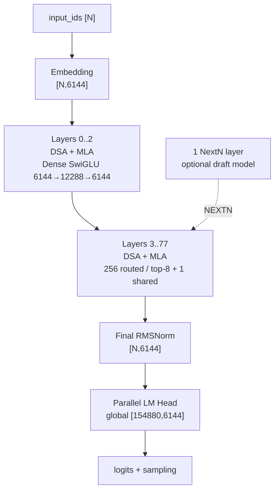
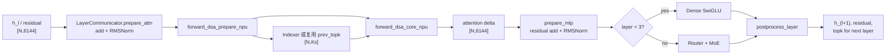
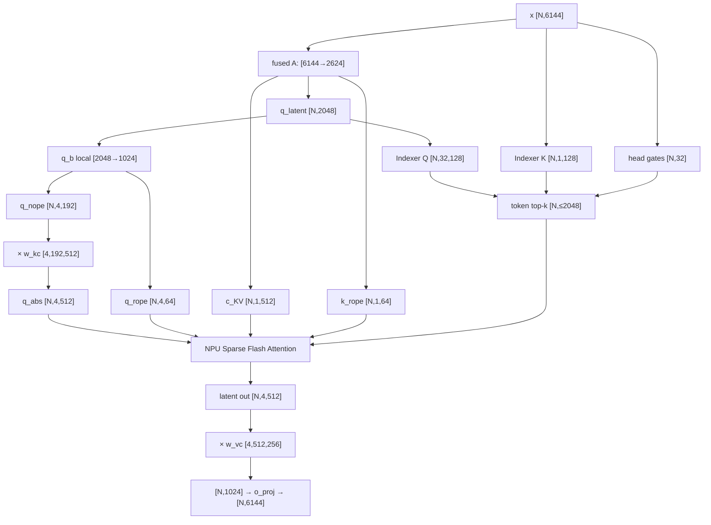
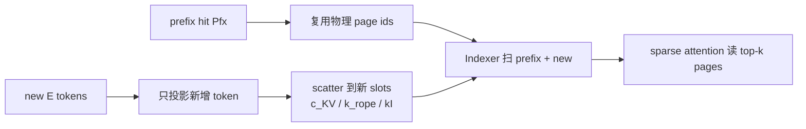
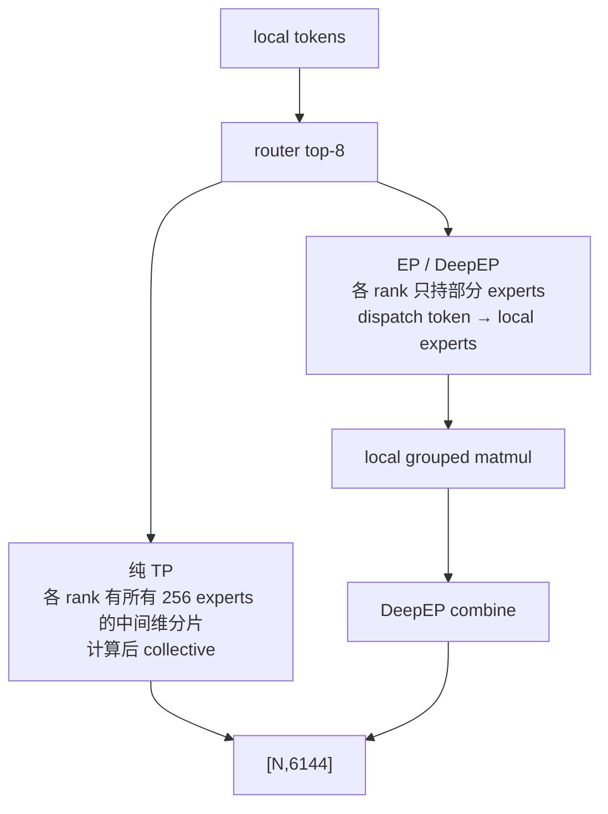
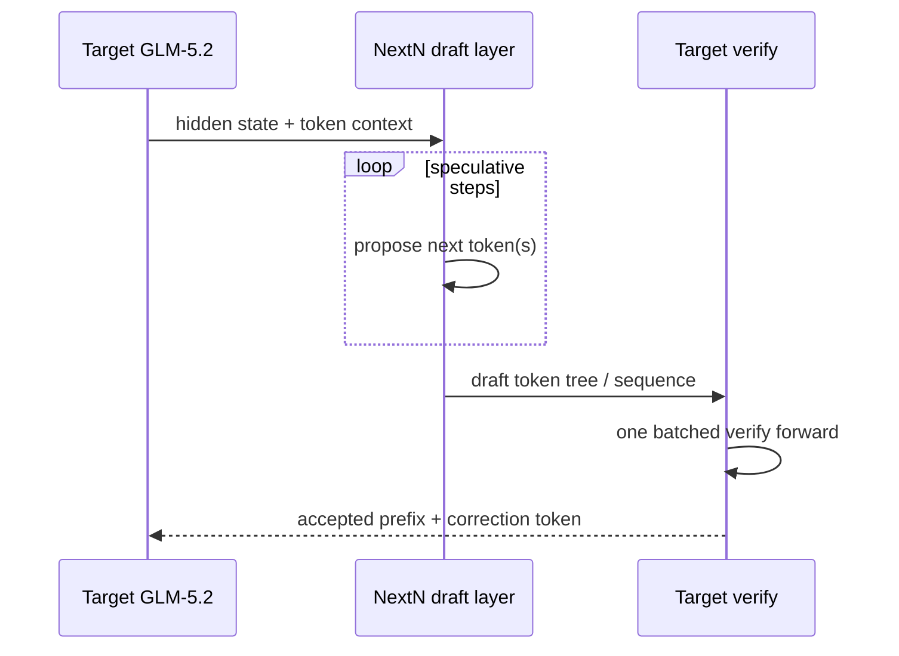
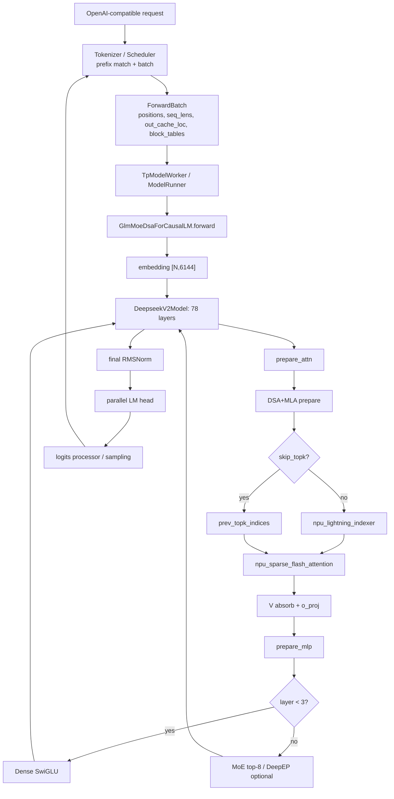

# 端到端样例：GLM-5.2 在 SGLang Ascend NPU 中的完整执行路径

**简体中文** | [English](../../../../en/sglang-ascend-npu/source-code-walkthrough/examples/02-glm-5.2-end-to-end.md)

本讲沿用 [GLM-4.7-Flash 端到端样例](./00-glm-4.7-flash-end-to-end.md) 的阅读方法，但不重复展开通用的 HTTP、Scheduler、`ModelRunner`、logits 和 sampling 框架。重点回答 GLM-5.2 新增的模型级问题：

- 753B、78 层的 `GlmMoeDsaForCausalLM` 为什么实际落到 `deepseek_v2.py`；
- MLA 怎样把每个 head 的普通 K/V 计算吸收到 512 维 latent 空间；
- DSA Indexer 怎样从整段历史中选出 top-2048 token；
- IndexShare 怎样让相邻层复用 attention top-k，而不是复用 MoE expert top-k；
- Prefill、Decode、Prefix Cache、NPU Graph 和 NextN 分别怎样携带三类 cache；
- 256 个 routed experts、top-8 路由和 1 个 shared expert 怎样在 TP/EP 上执行。

> 本讲以仓库当前源码快照为准。模型配置、SGLang 和 `torch_npu` 都在快速演进；部署前必须固定 revision。源码中的旧 shape 注释（例如 `7168`、`1536` 或 `64` 个 Indexer heads）不是 GLM-5.2 的配置真值。

---

## 1. 阅读基线、资料来源与前置索引

### 1.1 两条基线不能混在一起

为了让 shape 可以手算，本讲先使用逻辑基线：

| 项目 | 教学基线 |
|---|---|
| checkpoint | `zai-org/GLM-5.2` BF16 |
| device | Ascend NPU |
| parallel | TP=16、PP=1；先不单独启用 EP/DP |
| attention backend | `ascend` |
| execution | eager；先关闭 NPU Graph |
| request | 单请求、无 prefix 命中；先 Prefill 再逐 token Decode |
| speculative | 先关闭，后文单列 NextN |
| page size | NPU 默认 128；以实际启动参数为准 |

这不是硬件容量建议。官方部署资料给出的 BF16 权重规模约为 1.51 TB，生产环境通常使用更多设备，或使用 ModelSlim W8A8 checkpoint、DeepEP、DP/EP 等组合。教学基线只用于回答“一个 TP rank 上的矩阵是什么 shape”。

调试启动骨架如下，内存和卡数必须按实际 checkpoint 调整：

```bash
sglang serve \
  --model-path /path/to/GLM-5.2 \
  --device npu \
  --tp-size 16 \
  --attention-backend ascend \
  --sampling-backend ascend \
  --disable-cuda-graph \
  --host 0.0.0.0 \
  --port 8000
```

`--disable-cuda-graph` 是跨平台历史命名；在 NPU 上表示先不进入 `NPUGraphRunner` replay。

### 1.2 外部资料与版本记录

- [GLM-5.2 官方模型卡](https://huggingface.co/zai-org/GLM-5.2)
- [GLM-5.2 官方 config.json](https://huggingface.co/zai-org/GLM-5.2/blob/main/config.json)
- [SGLang GLM-5.2 cookbook](https://github.com/sgl-project/sglang/blob/main/docs/cookbook/autoregressive/GLM/GLM-5.2.mdx)
- [SGLang Ascend GLM-5.2 部署教程](https://github.com/sgl-project/sglang/blob/main/docs/docs/hardware-platforms/ascend-npus/model-deployment/tutorials/glm_5_2.mdx)
- [IndexCache / IndexShare 论文](https://arxiv.org/abs/2603.12201)

复现时记录：

```text
SGLang commit:
sgl-kernel-npu commit:
GLM-5.2 revision:
torch / torch_npu / CANN version:
NPU 型号、节点数与 rank 拓扑:
完整启动参数:
```

### 1.3 已有教程直接索引

下列概念不在本讲从零重写；本讲只补 GLM-5.2 的具体 shape 与源码落点：

| 概念 | 先读 |
|---|---|
| Decoder-only 与 causal mask | [Decoder-only Transformer](../../../ai-infra-basic/Model_Architecture/01-decoder-only-transformer.md) |
| MLA 的低秩压缩与吸收 | [Multi-Head Latent Attention](../../../ai-infra-basic/Model_Architecture/04-multi-head-latent-attention.md) |
| DSA 数学与复杂度 | [DeepSeek Sparse Attention](../../../ai-infra-basic/Model_Architecture/07-deepseek-sparse-attention.md) |
| Sparse MoE 路由 | [Sparse MoE Routing](../../../ai-infra-basic/Model_Architecture/03-sparse-moe-routing.md) |
| W8A8/FP8 与量化排障 | [Quantization](../../../ai-infra-basic/Quantization/README.md) |
| speculative decoding | [Speculative Decoding](../../../ai-infra-basic/Speculative_Decoding/README.md) |
| NPU Graph | [NPU Graph 与编译](../05-npu-graph-and-compilation.md) |
| TP/HCCL | [分布式 HCCL 与通信](../15-distributed-hccl-and-communication.md) |

---

## 2. GLM-5.2 的配置指纹

### 2.1 决定执行路径的字段

| 字段 | 值 | 运行时含义 |
|---|---:|---|
| `architectures` | `GlmMoeDsaForCausalLM` | SGLang 原生入口类 |
| `dtype` | `bfloat16` | 原始 checkpoint 主 dtype |
| `vocab_size` | 154880 | embedding / LM head 全局行数 |
| `hidden_size` | 6144 | 主干 hidden width |
| `num_hidden_layers` | 78 | target decoder 层数 |
| `first_k_dense_replace` | 3 | Layer 0～2 用 dense MLP |
| `intermediate_size` | 12288 | dense MLP 中间维度 |
| `n_routed_experts` | 256 | 每个 MoE 层的 routed experts |
| `n_shared_experts` | 1 | 每个 MoE 层总执行的 shared expert |
| `moe_intermediate_size` | 2048 | 单 expert 中间维度 |
| `num_experts_per_tok` | 8 | 每 token 选择 8 个 routed experts |
| `scoring_func` | `sigmoid` | router 分数非线性 |
| `topk_method` | `noaux_tc` | correction-bias grouped top-k 路径 |
| `norm_topk_prob` | `true` | 选中权重归一化 |
| `routed_scaling_factor` | 2.5 | routed expert 输出缩放 |
| `num_attention_heads` | 64 | 全局 Q heads |
| `q_lora_rank` | 2048 | Q latent 维度 |
| `kv_lora_rank` | 512 | KV latent/cache 主体宽度 |
| `qk_nope_head_dim` | 192 | 每 head 非 RoPE 维度 |
| `qk_rope_head_dim` | 64 | 每 head RoPE 维度 |
| `v_head_dim` | 256 | 每 head V 维度 |
| `index_n_heads` | 32 | DSA Indexer query heads |
| `index_head_dim` | 128 | 每个 Indexer head 的维度 |
| `index_topk` | 2048 | 主 attention 每 query 最多读取的 token 数 |
| `index_topk_freq` | 4 | 当前 SGLang 实现的跨层复用周期 |
| `max_position_embeddings` | 1048576 | 1M token 配置上限 |
| `rope_theta` | 8000000 | RoPE base |
| `num_nextn_predict_layers` | 1 | checkpoint 中的 NextN/MTP 层数 |

两组 top-k 一定不要混淆：

```text
DSA token top-k:  在序列位置维上选 2048 个历史 token
MoE expert top-k: 在专家维上选 8 / 256 个 routed experts
```

前者改变 attention 读哪些 KV，后者改变 FFN 把 token 发给哪些专家。

### 2.2 统一符号

| 符号 | 值 | 含义 |
|---|---:|---|
| `N` | 运行时变化 | 当前调用的 token 行数；Prefill 时为 `T`，普通 Decode 时为 `B` |
| `D` | 6144 | hidden size |
| `L` | 78 | decoder 层数 |
| `H` | 64 | 全局 attention heads |
| `TP` | 16 | 教学基线 TP size |
| `Htp` | 4 | 每 TP rank 的 heads，`64 / 16` |
| `Rq` | 2048 | Q LoRA rank |
| `Rkv` | 512 | KV LoRA rank |
| `Dn` | 192 | noPE head dim |
| `Dr` | 64 | RoPE head dim |
| `Dh` | 256 | `Dn + Dr` |
| `Hi` | 32 | Indexer heads；它是 replicated 的，不按 attention TP 切成 2 |
| `Di` | 128 | Indexer head dim |
| `Ks` | 2048 | DSA 选择的历史 token 数上限 |
| `E` | 256 | routed expert 数 |
| `Ke` | 8 | 每 token 的 routed experts 数 |
| `Ie` | 2048 | expert 中间维度 |
| `P` | 128 | 本讲 NPU page size |

PyTorch `Linear` 权重按 `[out_features, in_features]` 保存，故 `[N,in] @ W.T -> [N,out]`。

### 2.3 一眼看懂整体结构



每个 target layer 的主干方程都是：

$$
u_l = h_l + \operatorname{DSA\_MLA}(\operatorname{RMSNorm}(h_l))
$$

$$
h_{l+1} = u_l +
\begin{cases}
\operatorname{DenseSwiGLU}(\operatorname{RMSNorm}(u_l)), & l<3 \\
\operatorname{SparseMoE}(\operatorname{RMSNorm}(u_l)), & l\ge 3
\end{cases}
$$

输入、attention 增量、MoE 增量和层输出的主干 shape 始终是 `[N,6144]`；变化只发生在模块内部。

---

## 3. 源码入口：为什么模型名是 GLM，主体却是 DeepSeekV2

### 3.1 最短继承链

```text
config.architectures[0] = GlmMoeDsaForCausalLM
  -> model registry 找到 models/glm4_moe.py
  -> GlmMoeDsaForCausalLM(DeepseekV2ForCausalLM)
  -> DeepseekV2ForCausalLM.model = DeepseekV2Model
  -> DeepseekV2Model.layers[i] = DeepseekV2DecoderLayer
  -> DeepseekV2DecoderLayer.self_attn = DeepseekV2AttentionMLA(use_dsa=True)
```

`GlmMoeDsaForCausalLM` 自己只覆写 shared-expert fusion 的架构名判断。模型结构、forward 和权重加载均来自父类。因此搜索 `glm5.py` 找不到实现不是注册失败。

### 3.2 源码地图

| 问题 | 文件 / 关键符号 |
|---|---|
| GLM 入口 | [`models/glm4_moe.py::GlmMoeDsaForCausalLM`](../../../../../python/sglang/srt/models/glm4_moe.py) |
| target model | [`models/deepseek_v2.py::DeepseekV2ForCausalLM`](../../../../../python/sglang/srt/models/deepseek_v2.py) |
| 78 层循环 | `DeepseekV2Model.forward` |
| 单层 | `DeepseekV2DecoderLayer.forward` |
| MLA / DSA 初始化 | `DeepseekV2AttentionMLA.__init__` |
| Indexer | [`layers/attention/dsa/dsa_indexer.py::Indexer`](../../../../../python/sglang/srt/layers/attention/dsa/dsa_indexer.py) |
| NPU DSA prepare/core | [`deepseek_v2_attention_mla_npu.py`](../../../../../python/sglang/srt/hardware_backend/npu/modules/deepseek_v2_attention_mla_npu.py) |
| Ascend sparse attention | [`ascend_backend.py::forward_sparse`](../../../../../python/sglang/srt/hardware_backend/npu/attention/ascend_backend.py) |
| MLA + Index K cache | [`memory_pool_npu.py::NPUMLATokenToKVPool`](../../../../../python/sglang/srt/hardware_backend/npu/memory_pool_npu.py) |
| 权重重排 | [`deepseek_weight_loader.py`](../../../../../python/sglang/srt/models/deepseek_common/deepseek_weight_loader.py) |
| NextN 类重写 | [`configs/model_config.py::_config_draft_model`](../../../../../python/sglang/srt/configs/model_config.py) |

模型注册的通用机制已在 [模型加载与 architecture resolution](../../../tp-worker-model-runner/06-model-loading-and-architecture-resolution.md) 解释，本讲不重复 registry 的动态 import 细节。

### 3.3 顶层 forward 的额外返回值

普通 dense attention 的层间主干只有 `hidden_states` 与 lazy residual。GLM-5.2 还要携带 attention 的 `topk_indices`：

```python
topk_indices = None
for layer in self.layers:
    hidden_states, residual, topk_indices = layer(
        ...,
        prev_topk_indices=topk_indices,
    )
```

它只在 IndexShare 需要跨层复用时非空；不是 hidden state，也不参与 residual add。

---

## 4. 权重加载：checkpoint shape 怎样变成执行 shape

### 4.1 MLA 的 A 投影被融合

checkpoint 的逻辑权重：

```text
q_a_proj.weight:             [2048, 6144]
kv_a_proj_with_mqa.weight:   [512+64, 6144] = [576,6144]
```

加载器沿输出维拼成 replicated 参数：

```text
fused_qkv_a_proj_with_mqa.weight: [2624,6144]
2624 = Rq + Rkv + Dr = 2048 + 512 + 64
```

于是一次 GEMM 产生 `[N,2624]`，再 split 成 `[N,2048]` 与 `[N,576]`。这里的“fused”是权重与 GEMM 融合，不表示 q/k/v 已经是普通 multi-head 形态。

### 4.2 B 投影按 attention TP 分片

| 参数 | global shape | TP=16 local shape | 分片轴 |
|---|---:|---:|---|
| `q_b_proj.weight` | `[64×256,2048]=[16384,2048]` | `[1024,2048]` | output / heads |
| `kv_b_proj.weight` | `[64×(192+256),512]=[28672,512]` | `[1792,512]` | output / heads |
| `o_proj.weight` | `[6144,64×256]=[6144,16384]` | `[6144,1024]` | input / heads |

`q_b_proj` 直接保留用于 Q。`kv_b_proj` 则在加载完成后重排为每个本地 head 的吸收矩阵：

```text
w_kc: [Htp,Dn,Rkv] = [4,192,512]
w_vc: [Htp,Rkv,Dv] = [4,512,256]
```

它们分别把 Q-noPE 吸收到 latent 空间、把 attention latent 输出还原到 V 空间。

### 4.3 Indexer 权重是 replicated

| 参数 | shape | 作用 |
|---|---:|---|
| `indexer.wq_b.weight` | `[32×128,2048]=[4096,2048]` | Q latent → 32 个检索 heads |
| `indexer.wk.weight` | `[128,6144]` | hidden → 一个共享 Index K |
| `indexer.weights_proj.weight` | `[32,6144]` | 每个 token 的 head gate |
| `indexer.k_norm.weight/bias` | `[128]` | Index K LayerNorm |

这里 32 个 Indexer heads 不等于 64 个主 attention heads，也不应除以 TP=16。SGLang 用 `ReplicatedLinear` 保证各 attention rank 得到一致的检索候选。

### 4.4 MoE 权重先讲逻辑、再讲物理

单个 expert 的逻辑权重为：

```text
gate_proj / up_proj: [2048,6144]
down_proj:           [6144,2048]
```

加载器将 gate 与 up 打包；普通 TP=16 时，中间维切成 `2048/16=128`：

```text
packed w13 logical local: [256, 2×128, 6144]
packed w2  logical local: [256, 6144, 128]
```

NPU grouped-matmul 可能再转置成其物理布局；EP、W8A8 和 fused shared expert 又会改变本 rank 持有的 expert 数与 dtype。因此排障时先核对数学轴，再核对 `weight_loader` 和 quant method 的实际 layout，不能只凭 tensor 的最后两个维度猜矩阵方向。

---

## 5. 一个 Decoder Layer 的真实执行顺序



`LayerCommunicator` 将 residual add、RMSNorm 和 TP collective 的时机集中管理，所以源码中不一定能看到教科书式的两行 `x = x + f(x)`。语义不变，但物理上可能用 `npu_add_rms_norm` 或 collective fusion 减少 HBM 往返。

### 5.1 Layer 0～2 的 Dense SwiGLU shape

前三层没有 routed expert，但 FFN 仍包含两条上投影分支。对 $x\in\mathbb R^{N\times6144}$：

$$
g=xW_g^T,\quad u=xW_u^T,\quad
y=\left(\operatorname{SiLU}(g)\odot u\right)W_d^T.
$$

全局与 TP=16 本地 shape 为：

```text
each gate/up weight global  [12288,6144]
each gate/up weight local   [768,6144]
packed gate_up local        [1536,6144]
x                            [N,6144]
gate, up local               [N,768]
SwiGLU local                 [N,768]
down weight local            [6144,768]
down partial                 [N,6144]
TP all-reduce / fused reduce [N,6144]
```

这里的 `12288` 是 dense MLP 中间维度，不是 75 个 MoE 层中单 expert 的 `2048`。二者混用会让权重加载和 grouped matmul shape 同时出错。

---

## 6. DSA+MLA Prepare：逐张量走完 Q、KV 与 RoPE

以下 `N` 同时覆盖 packed Prefill 的 `T` 行和普通 Decode 的 `B` 行。

### 6.1 融合 A 投影与归一化

```text
x                                  [N,6144]
  @ fused_A.T [6144,2624]
fused                              [N,2624]
  split [2048,512+64]
q_latent_raw                       [N,2048]
latent_cache_raw                   [N,576]

q_latent = RMSNorm(q_latent_raw)   [N,2048]
kv_latent = RMSNorm(first 512)     [N,1,512]
k_rope_raw = last 64               [N,1,64]
```

`q_latent` 需要保留两份语义消费者：主 attention 的 `q_b_proj` 与 DSA Indexer 的 `wq_b`。源码中的 `clone()` 是为了后续重叠/生命周期安全，而不是改变数学值。

### 6.2 Q B 投影与拆 head

```text
q_latent [N,2048]
  @ q_b_local.T [2048,1024]
q_flat_local                       [N,1024]
view                               [N,4,256]
split last dim [192,64]
q_nope                             [N,4,192]
q_pe_raw                           [N,4,64]
```

RoPE 只作用在 `q_pe_raw` 和 `k_rope_raw`：

$$
q^{R}_{t,h}=R(t)q^{R,raw}_{t,h},\qquad
k^{R}_{t}=R(t)k^{R,raw}_{t}
$$

输出仍为 `[N,4,64]` 与 `[N,1,64]`。`rope_interleave=true` 决定偶/奇维的排列方式；不改变总 shape。

### 6.3 K 吸收：为什么 Q 从 192 变成 512

普通 attention 的 noPE score 为：

$$
s^{nope}_{t,s,h}=q^{nope}_{t,h}(k^{nope}_{s,h})^T
$$

MLA 将普通 K 写成 latent 与 B 投影的乘积：

$$
k^{nope}_{s,h}=c^{KV}_s (W^{K}_{h})^T,
\quad c^{KV}_s\in\mathbb{R}^{512},
\quad W^{K}_{h}\in\mathbb{R}^{192\times512}
$$

利用结合律：

$$
q^{nope}_{t,h}(k^{nope}_{s,h})^T
=\left(q^{nope}_{t,h}W^{K}_{h}\right)(c^{KV}_s)^T
$$

所以源码先执行：

```text
q_nope [N,4,192]
  bmm w_kc [4,192,512]
q_abs  [N,4,512]
```

然后直接让 `q_abs` 与历史 `kv_latent [S,1,512]` 做 attention。无需为历史 token 展开 `[S,4,192]` 的普通 K。

### 6.4 V 吸收在 attention 之后

若普通 V 满足：

$$
v_{s,h}=c^{KV}_s W^V_h,
\quad W^V_h\in\mathbb{R}^{512\times256},
$$

则：

$$
\sum_s p_{t,s,h}v_{s,h}
=\left(\sum_s p_{t,s,h}c^{KV}_s\right)W^V_h.
$$

因此 sparse attention 先返回 `[N,4,512]`，再：

```text
latent attention out [N,4,512]
  bmm w_vc           [4,512,256]
V-space out          [N,4,256]
flatten              [N,1024]
  @ o_proj_local.T   [1024,6144]
attention delta      [N,6144]
```

这就是 absorbed MLA：`W^K` 被吸收到 Q 侧，`W^V` 被吸收到输出侧，cache 永久保存 512 维 latent 和 64 维 RoPE key。

### 6.5 完整 shape 图



---

## 7. DSA Indexer：top-2048 是怎样算出来的

### 7.1 三条投影

对 query token `t`：

```text
q_latent [N,2048] @ wq_b.T [2048,4096]
  -> qI [N,32,128]

x [N,6144] @ wk.T [6144,128]
  -> kI [N,128] -> LayerNorm -> [N,128]

x [N,6144] @ weights_proj.T [6144,32]
  -> g [N,32]
```

Indexer Q 有 32 heads，而 K 在 heads 间共享。Q/K 的前 64 维做 RoPE，后 64 维保留为 noPE；随后在不同后端上可能做等价的旋转/量化以适配 kernel。

### 7.2 相关性分数

对历史位置 `s≤t`，先算每个 Indexer head 的点积：

$$
a_{t,s,j}=\langle q^I_{t,j},k^I_s\rangle,
\qquad j=1,\ldots,32.
$$

再用当前 query 的 head gate 聚合：

$$
I_{t,s}=\sum_{j=1}^{32}g_{t,j}\operatorname{ReLU}(a_{t,s,j}).
$$

最后做 causal 合法性过滤和 top-k：

$$
\mathcal S_t=\operatorname{TopK}_{s\le t}(I_{t,s},K_s),
\qquad K_s=\min(2048,t+1).
$$

概念上 `I` 在单序列 Prefill 是 `[T,S]`，Decode 是 `[B,S]`；NPU kernel 可以分块扫描，不要求把完整 `[T,S]` 分数矩阵永久写回 HBM。

### 7.3 Ascend 实现契约

`Indexer.forward_npu()` 完成投影、RoPE、写 Index K cache，然后调用：

```python
torch_npu.npu_lightning_indexer(
    query=...,             # [N,32,128]
    key=...,               # paged Index K cache
    weights=...,           # [N,32]
    actual_seq_lengths_query=...,
    actual_seq_lengths_key=...,
    block_table=...,
    layout_query="TND",
    layout_key="PA_BSND",
    sparse_count=2048,
    sparse_mode=3,
)
```

返回的是可直接交给 sparse attention 的位置索引，常见逻辑 shape 为 `[N,2048]`。短序列、padding、CP 和 speculative 模式下有效数量由 metadata 决定，不能假定每行 2048 个位置都有效。

`TND` 表示 packed token-major query；`PA_BSND` 表示 paged KV 物理布局。`block_table [B,max_pages]` 将请求的逻辑 page 映射到 cache pool 的物理 page。

---

## 8. IndexShare：跨层复用的到底是什么

### 8.1 基本思想

相邻层 Indexer 选出的 token 集合高度重叠。IndexShare 让 Full 层计算一次 `topk_indices`，后续 Shared 层直接使用这张位置表：

```mermaid
sequenceDiagram
  participant L1 as Full layer
  participant IDX as npu_lightning_indexer
  participant L2 as Shared layer
  participant L3 as Shared layer
  participant L4 as Shared layer
  L1->>IDX: qI, paged kI, gates
  IDX-->>L1: topk_indices [N,2048]
  L1-->>L2: carry topk_indices
  L2->>L2: skip Indexer; run its own sparse MLA
  L2-->>L3: carry same indices
  L3-->>L4: carry same indices
  Note over L1,L4: 每层 Q/K/V 和 attention 权重仍不同；只复用位置集合
```

共享的只有整数位置索引。Shared 层仍要：

- 计算自己的 Q、latent KV 与 RoPE；
- 写自己的 MLA cache；
- 用自己的 attention 参数读取这些位置；
- 执行自己的 MoE / dense MLP。

### 8.2 当前 SGLang 快照的控制逻辑

`DeepseekV2AttentionMLA.__init__` 优先读可选 `index_topk_pattern`；没有该字段时，根据 `index_topk_freq=4` 计算：

```python
skip_topk = max(layer_id - 1, 0) % 4 != 0
next_skip_topk = layer_id % 4 != 0
```

把公式代入前几层，会得到当前实现的真实节奏：

| layer | `skip_topk` | `next_skip_topk` | 行为 |
|---:|---:|---:|---|
| 0 | false | false | 自己计算一次，但不向 layer 1 传递 |
| 1 | false | true | Full：计算并传给下一层 |
| 2 | true | true | Shared：复用并继续传递 |
| 3 | true | true | Shared：复用并继续传递 |
| 4 | true | false | Shared：复用后结束这一组 |
| 5 | false | true | 下一组 Full；之后按 4 层周期重复 |

所以当前公式对应 `layer 0` 独立计算，随后 Full 层为 `1,5,9,...,77`，中间最多三个 Shared 层。这个结论来自本仓库执行代码，不应拿其他 revision 的示意图覆盖。

于是 layer forward 的数据协议是：

```text
skip_topk = false: topk = self.indexer(...)
skip_topk = true:  topk = prev_topk_indices

next_skip_topk = true:  return (output, topk)
next_skip_topk = false: return (output, None)
```

官方 config 还包含 `indexer_types`、`index_skip_topk_offset` 等描述字段，但本仓库快照中的主要执行分支使用上述 `index_topk_freq` / `index_topk_pattern`。读新版本时应重新搜索字段消费者，而不是把 config 注释直接当成运行代码。

### 8.3 它降低什么、不降低什么

若每 4 层只有 1 层执行 Indexer，Indexer 计算次数可近似从 `L` 降到 `L/4`。但它：

- 不把 main attention 的 top-2048 再降为 1/4；每层仍执行 sparse attention；
- 不复用每层不同的 MLA KV；
- 不复用 MoE top-8 expert ids；
- 不改变序列 cache 随上下文长度线性增长的事实。

---

## 9. Sparse MLA Core：top-k 怎样进入主 attention

`AscendAttnBackend.forward_sparse()` 先把本轮 token 的 cache 写入物理页，再调用：

```python
torch_npu.npu_sparse_flash_attention(
    query=q_abs,                 # [N,Htp,512]
    key=kv_latent_cache,         # paged [...,1,512]
    value=kv_latent_cache,       # 与 key 相同的 latent
    query_rope=q_pe,             # [N,Htp,64]
    key_rope=k_rope_cache,       # paged [...,1,64]
    sparse_indices=topk_indices, # [N,≤2048]
    block_table=block_table,
    sparse_block_size=1,
    layout_query="TND",
    layout_kv="PA_BSND",
    sparse_mode=3,
    attention_mode=2,
)
```

对 head `h`，被选中的位置 `s∈S_t` 上，score 为：

$$
z_{t,s,h}=\frac{
\langle q^{abs}_{t,h},c^{KV}_s\rangle+
\langle q^R_{t,h},k^R_s\rangle
}{\sqrt{256}}.
$$

softmax 只在合法的稀疏集合上归一化：

$$
p_{t,s,h}=\frac{e^{z_{t,s,h}}}
{\sum_{u\in\mathcal S_t}e^{z_{t,u,h}}},
\quad s\in\mathcal S_t.
$$

输出为 latent 加权和：

$$
o^{latent}_{t,h}=\sum_{s\in\mathcal S_t}p_{t,s,h}c^{KV}_s
\in\mathbb R^{512}.
$$

随后按第 6.4 节通过 `w_vc` 恢复 `[N,4,256]`。注意 scale 使用完整 Q/K head 维 `Dh=192+64=256`，而不是 `Rkv=512`。

---

## 10. Prefill：不再先做 dense MHA

GLM-4.7-Flash 在该教程快照中是“纯 Prefill 走 MHA_NPU、Decode 走 MLA_NPU”。GLM-5.2 的关键变化是 Prefill 与 Decode 都走 DSA+MLA common absorb path。

### 10.1 packed batch shape

假设 batch 有两个请求：

```text
request A: prefix=0, extend=3000
request B: prefix=1000, extend=2000

T = 3000 + 2000 = 5000
hidden_states                  [5000,6144]
positions                      [5000]
extend_seq_lens                [2] = [3000,2000]
seq_lens                       [2] = [3000,3000]
out_cache_loc                  [5000]
block_tables                   [2,max_pages]
```

张量按 token packed，不是 `[B,S,D]` 的稠密矩形。`actual_seq_lengths_query`、`actual_seq_lengths_kv` 与 block table 共同恢复请求边界。

### 10.2 单个 Full 层的 Prefill 顺序

```text
1. [T,6144] -> fused A -> q_latent / kv_latent / k_rope
2. q_latent -> q heads -> q_abs；RoPE(q_pe,k_pe)
3. [T,6144] -> Indexer K [T,128]，写 Index K paged cache
4. lightning indexer 扫描合法历史，输出 [T,≤2048]
5. 写本层 MLA latent/RoPE cache
6. sparse flash attention 只读 top-k 位置
7. V absorb + o_proj -> [T,6144]
8. residual + norm -> dense MLP 或 MoE
```

Shared 层省掉步骤 3～4 的本层检索计算并复用上一 Full 层的位置表，但自己的步骤 1～2、5～8 仍执行。

### 10.3 复杂度应该怎样读

设序列长 `S`、IndexShare 周期 `F=4`：

- dense attention 的 score 数量是 `O(H·S²)`；
- Full 层 Indexer 仍要对历史做近似 `O(Hi·Di·S²/F)` 的检索工作；
- main sparse attention 约为 `O(H·S·min(Ks,S))`；
- MLA 还把历史 K/V 的读取宽度从普通多 head 形式压到 `Rkv+Dr=576`。

因此 DSA 不是让所有 Prefill 都严格线性；它把最昂贵的主 attention 限制到 top-k，并用 IndexShare 减少跨层 Indexer 次数。

### 10.4 Prefill Context Parallel

启用 DSA Prefill CP 后，源码会 all-gather/rearrange 必要的 K 与 metadata，并把 query 拆成前/后两段做负载平衡。`npu_sparse_flash_attention` 可能调用两次后拼接输出。此时：

- 本 rank 的 query token 数与全局 KV 长度不同；
- `actual_seq_lengths_query` 可能是 tuple；
- block table 会裁到 CP 子批；
- 排障不能用单卡的 `T=S` 假设。

---

## 11. Prefix Cache：命中后哪些东西可以复用

Radix/prefix cache 命中 `Pfx` 个 token 后，本轮只投影新增 `E` 个 token，但历史 cache 必须同时对齐三条状态：

```text
MLA latent cache:  c_KV    [history,1,512]
MLA RoPE cache:    k_rope  [history,1,64]
DSA Index cache:   kI      [history,1,128]
```



与 GLM-4.7 的 prefix dense re-expansion 分支不同，GLM-5.2 主线不需要把整个 prefix 展开成普通 K/V heads。命中是否正确，不能只看 token 命中数；还要确保三类 cache 使用同一套逻辑 token 到物理 slot 映射。

---

## 12. Decode：一个新 token 的逐层路径

普通 Decode batch 为 `B` 个活跃请求，每个请求本轮一个 query：

```text
input_ids / positions       [B]
hidden_states               [B,6144]
out_cache_loc               [B]
seq_lens                    [B]
block_tables                [B,max_pages]
```

Full 层的 Decode：

```text
[B,6144]
 -> fused A [B,2624]
 -> q_abs [B,4,512], q_rope [B,4,64]
 -> new c_KV [B,1,512], new k_rope [B,1,64]
 -> Indexer qI [B,32,128], kI [B,1,128], gates [B,32]
 -> lightning indexer scans paged history
 -> topk [B,≤2048]
 -> sparse MLA reads only selected latent rows
 -> latent out [B,4,512]
 -> V absorb [B,4,256]
 -> o_proj [B,6144]
```

长上下文 Decode 的两个主要历史读取项是：

1. Full 层 Indexer 扫描长度 `S` 的 128 维 Index K；
2. 每层主 attention 读取最多 2048 个 512+64 维 latent/RoPE 行。

IndexShare 降低第 1 项的层数；DSA top-k 限制第 2 项；MLA 压缩第 2 项每个位置的宽度。三项优化作用在不同轴上。

Decode 还可能用 `NPUFusedMLAPreprocess` / MLA prolog 融合 A 投影、norm、Q B 投影与 RoPE。是否命中取决于量化配置、forward mode 和版本；没有命中时仍回退到前述等价算子序列。

---

## 13. 三类 paged cache 与显存估算

### 13.1 NPU 物理 shape

`NPUMLATokenToKVPool` 为每层分配：

```text
k_buffer:       [layer, page_count+1, P, 1, 512]
v_buffer:       [layer, page_count+1, P, 1, 64]
index_k_buffer: [layer, page_count+1, P, 1, 128]
```

这里 `v_buffer` 实际保存的是 RoPE K，不是普通 256 维 V；命名来自通用 KV pool 接口。额外 `+1` 是 padding/sentinel page。

新 token 通过 `npu_scatter_nd_update_` 按 `out_cache_loc` 写入三个 buffer。kernel 侧根据 `block_table` 和 page size 128 解释为 `PA_BSND`。

### 13.2 BF16 理论下界

每 token、每 layer 的未量化 cache 元素数：

$$
512+64+128=704.
$$

BF16 为 2 bytes：

$$
704\times2=1408\text{ bytes/token/layer}.
$$

仅主 MLA cache 是：

$$
(512+64)\times2=1152\text{ bytes/token/layer}.
$$

在 1,048,576 token 上，忽略页尾浪费与 sentinel：

```text
main MLA cache / layer  = 1.125 GiB
Index K cache / layer   = 0.250 GiB
total / layer           = 1.375 GiB
78 layers               = 107.25 GiB / sequence
```

这是全层逻辑容量估算，不等于单 rank 的最终占用：PP 会分层，cache dtype/量化会改变 bytes，allocator 还有预留和碎片，IndexShare 的 Shared 层是否能省物理 Index K 容量取决于具体版本的 pool 分配。当前快照按 `layer_num` 分配 `index_k_buffer`，即使某些层跳过 Indexer，也不能直接从估算中删除这些层。

### 13.3 为什么 page size 不改变数学结果

逻辑 token `s` 被拆成：

```text
logical_page = floor(s / P)
offset       = s mod P
physical_page = block_table[request, logical_page]
```

page size 改变内存布局和碎片，但只要 block table 正确，attention 看到的 token 顺序不变。DSA 的 top-k 输出必须能映射到同一逻辑/物理坐标系。

---

## 14. MoE：256 选 8 的数学与 shape

### 14.1 Router

对归一化后的 token `x_t∈R^6144`：

$$
r_t=x_tW_r^T\in\mathbb R^{256},\qquad
p_t=\sigma(r_t).
$$

`noaux_tc` 路径会用训练得到的 correction bias 参与 expert 选择；选择完成后使用原始概率取权重。`n_group=1`、`topk_group=1` 时 grouped filtering 退化为单组全专家候选。选中集合：

$$
\mathcal E_t=\operatorname{TopK}(p_t+\text{bias},8).
$$

若 `norm_topk_prob=true`：

$$
\hat p_{t,e}=\frac{p_{t,e}}
{\sum_{j\in\mathcal E_t}p_{t,j}},\quad e\in\mathcal E_t.
$$

最终 routed 输出还乘 `2.5`。

### 14.2 Expert SwiGLU

每个选中 expert：

$$
y_{t,e}=W^{down}_e\left(
\operatorname{SiLU}(W^{gate}_e x_t)\odot(W^{up}_e x_t)
\right)\in\mathbb R^{6144}.
$$

单 token 的 routed + shared 输出：

$$
y_t^{MoE}=2.5\sum_{e\in\mathcal E_t}\hat p_{t,e}y_{t,e}
+y_t^{shared}.
$$

### 14.3 Token 展开与 NPU 算子

对 `N` 个 token：

```text
router logits / scores        [N,256]
topk ids / weights            [N,8]
logical token-expert pairs    R = N×8
routed input                  [R,6144]
w13 grouped matmul            [R,256] local under pure TP16
SwiGLU                        [R,128] local
w2 grouped matmul             [R,6144] partial
weighted combine              [N,6144]
shared expert                 [N,6144]
final MoE delta               [N,6144]
```

Ascend 路径通常由 top-k、`npu_moe_init_routing_v2`、`npu_grouped_matmul`、`npu_swiglu`、第二次 grouped matmul 和 `npu_moe_finalize_routing` 组成。具体 fusion 和参数签名随 `torch_npu`/CANN 版本变化，应以运行环境 docstring 和源码调用为准。

### 14.4 TP 与 EP 的区别



EP 节省单 rank 的 expert 权重，但增加 dispatch/combine 通信。是否更快由 batch、token 分布、负载不均、网络与量化共同决定。详见 [Sparse MoE 教程](../../../ai-infra-basic/Model_Architecture/03-sparse-moe-routing.md) 与后续 DeepEP 组件讲。

---

## 15. NPU 算子映射与融合边界

| 数学阶段 | 当前 NPU 路径 | 输入/输出核心 shape | 状态 |
|---|---|---|---|
| residual + RMSNorm | `npu_add_rms_norm` 等 | `[N,6144] -> [N,6144]` | communicator/版本条件 |
| MLA preprocess | 普通投影序列或 `NPUFusedMLAPreprocess` | `[N,6144] -> q_abs/caches` | Decode、量化条件相关 |
| Index K 写 cache | `npu_scatter_nd_update_` | `[N,1,128] -> paged` | 当前源码 |
| DSA 检索 | `npu_lightning_indexer` | Q `[N,32,128]` -> ids `[N,≤2048]` | 当前源码 |
| MLA cache 写入 | `npu_scatter_nd_update_` | 512/64 两个 buffer | 当前源码 |
| 稀疏主 attention | `npu_sparse_flash_attention` | `[N,4,512]` + top-k -> `[N,4,512]` | 当前源码 |
| V absorb | `torch.bmm` / `batch_matmul_transpose` | 512 -> 256 | Prefill / Decode 分支 |
| MoE route/GMM | `npu_moe_*`, `npu_grouped_matmul` | `[N,6144] -> [N,6144]` | backend/量化条件相关 |

本地环境没有安装 `torch_npu` 时，只能验证 SGLang 调用点，不能验证目标 CANN 版本的运行时签名。教程因此描述“当前源码传递的参数契约”，不把某一版本的离线 API 快照当成永久接口。

---

## 16. 多流、NPU Graph 与静态 shape

### 16.1 Indexer 权重投影的多流

设置 `SGLANG_NPU_USE_MULTI_STREAM` 后，`weights_proj(x)` 可放到独立 NPU stream，与部分 Q/K 路径重叠：

```text
main stream:    q_lora -> qI; x -> kI; RoPE; cache write
weight stream:  x -> gates [N,32]
join event:     lightning indexer 等待 gates 与 Q/K 都完成
```

这不是“无依赖并行”：Indexer 前必须通过 event 建立 happens-before；否则表现可能更快但结果不稳定。是否真重叠应在 profiler 中看时间线和 overlap，而不是只看创建了两个 stream。

### 16.2 NPU Graph replay

开启 NPU Graph 后，模型数学不变，但 `B`、draft token 数和部分 buffer 被 padding 到捕获 bucket：

```text
真实 decode B=5
capture bucket Bcap=8
q buffer [8,4,512]
topk buffer [8,2048]
seq_lens/block_tables 的前 5 行有效
其余 3 行由 mask/length/padding slot 隔离
```

IndexShare 的 `topk_indices` 必须留在 graph 可复用的 tensor/buffer 生命周期内；不能在 Python 层把某次 replay 的临时 tensor 当成永久对象。Graph capture、静态缓冲区和 replay metadata 的完整机制见 [NPU Graph 与编译](../05-npu-graph-and-compilation.md)。

---

## 17. NextN / MTP speculative 路径

GLM-5.2 config 含 1 个 NextN predict layer。启用：

```bash
--speculative-algorithm NEXTN \
--speculative-num-steps 3 \
--speculative-eagle-topk 1 \
--speculative-num-draft-tokens 4
```

时，`ModelConfig._config_draft_model()` 将 draft architecture 从 `GlmMoeDsaForCausalLM` 改写为 `DeepseekV3ForCausalLMNextN`，再由 `deepseek_nextn.py` 构造 draft model。target 的 78 层没有被复制为第二个完整模型。



`index_share_for_mtp_iteration=true` 表示 MTP 迭代可复用 Indexer 结果的模型意图；实际行为仍受当前 speculative backend 和 forward mode 控制。Verify 时 `N` 常为 `B×draft_width`，所以 attention metadata、cache slots 与 `actual_seq_lengths_query` 不能套用普通 Decode 的 `[B]` 假设。

拒绝采样正确性、draft/target cache 提交与回滚已在 [Speculative Decoding](../../../ai-infra-basic/Speculative_Decoding/README.md) 说明。

---

## 18. 从请求到 token 的完整调用图



通用请求链和 logits/sampling shape 与 GLM-4.7 教程一致：LM head 全局逻辑 shape 是 `[154880,6144]`，TP=16 时通常按 vocab 分成 `[9680,6144]`，局部 logits 为 `[N,9680]`，随后由 logits/sampling 协议得到全局 token。

---

## 19. 推荐断点、日志与 shape 断言

### 19.1 最小断点顺序

1. `GlmMoeDsaForCausalLM.__init__`：确认入口类。
2. `DeepseekV2AttentionMLA.__init__`：打印 DSA/TP/head/rank 与 skip pattern。
3. `DeepseekV2Model.forward`：观察层间 `topk_indices` 何时为 `None`。
4. `forward_dsa_prepare_npu`：核对 `[N,2624]` split 与 `[N,4,512]` absorbed Q。
5. `Indexer.forward_npu`：核对 `[N,32,128]`、`[N,32]`、cache write。
6. `AscendAttnBackend.forward_sparse`：核对 top-k、block table、实际序列长度。
7. `forward_dsa_core_npu`：核对 latent out、V absorb 和 o_proj。
8. `MoEGate.forward` 与 MoE runner：区分 token top-k 和 expert top-k。
9. `NPUMLATokenToKVPool.set_*_buffer`：核对三个 cache 的 slot。

### 19.2 建议断言

```python
assert hidden_states.shape[-1] == 6144
assert q_lora.shape[-1] == 2048
assert q_nope_out.shape[-2:] == (4, 512)       # TP=16
assert q_pe.shape[-2:] == (4, 64)
assert k_nope.shape[-2:] == (1, 512)
assert k_pe.shape[-2:] == (1, 64)
assert index_query.shape[-2:] == (32, 128)
assert topk_indices.shape[-1] == 2048          # 物理 buffer；有效数另看 length
```

不要把这些 TP=16 断言直接复制到 TP=8；那时 `Htp=8`。

---

## 20. 精度与性能问题定位表

| 现象 | 第一检查点 | 常见根因 |
|---|---|---|
| 模型类找不到 | config architecture / registry | revision 不匹配；误找 `glm5.py` |
| 首 token 就错 | fused A split、RoPE interleave、weight loader | 用旧模型 shape；q/kv A 顺序错；RoPE 排列错 |
| 长上下文才错 | Index K cache、block table、top-k 坐标 | 三类 cache slot 不一致；prefix/页映射错误 |
| Shared 层结果异常 | `prev_topk_indices` 生命周期 | Full 层未返回；Graph buffer 被覆盖；pattern 与 config 不一致 |
| Prefill OOM | Indexer logits workspace、chunk size、cache pool | 把 DSA 误认为完全线性；chunk/CP 未启用 |
| Decode 随上下文变慢 | Full 层 Indexer 扫描 | IndexShare 未命中；Index K 带宽；错误地每层重算 top-k |
| attention 慢 | `Ks`、page layout、head padding、kernel fallback | top-k 实际无效；layout 不满足 kernel；版本不支持融合 |
| MoE 慢 | route 分布、DeepEP timeline、GMM shape | expert 负载不均；dispatch/combine 占比高；小 batch |
| 多流无收益 | profiler 的 stream overlap | 两条流被立即 event 串行；内存带宽竞争 |
| Graph replay 错 | padded rows 的 lengths/slots | 静态 buffer 有旧值；有效 batch metadata 未刷新 |
| NEXTN 接受率低 | draft 权重、位置、verify cache | draft architecture/量化不匹配；cache 提交错误 |

NPU profiling 需要同时观察 host 调度、kernel timeline、Pipe Utilization 和 HCCL/DeepEP；只比较单个算子耗时无法判断跨流与通信是否真正重叠。

---

## 21. 应能独立回答的检查题

1. 为什么 `[N,4,192]` 的 Q-noPE 会变成 `[N,4,512]`，却没有改变 attention 的数学结果？
2. 为什么 sparse attention 的 key 和 value 都能指向 512 维 latent cache？
3. DSA top-2048 与 MoE top-8 分别在哪个轴上选择？
4. IndexShare 复用位置表后，Shared 层还必须做哪些计算？
5. 为什么 Full 层 Indexer 在 Decode 仍可能随上下文长度线性变慢？
6. TP=8 时 `q_b_proj`、`w_kc`、`w_vc` 的 local shape 各是什么？
7. Prefix 命中后，为什么只复用 MLA cache 不够？
8. 为什么 `v_buffer` 的最后一维是 64，而不是 `v_head_dim=256`？
9. Pure TP 与 EP 下 expert 权重和 token movement 的差异是什么？
10. 如何用 `skip_topk`、`next_skip_topk` 和层间返回值证明 IndexShare 实际生效？

如果这十题都能从配置、公式、shape 和源码逐一回答，就已经能够独立追踪 GLM-5.2 的主要 Ascend 推理路径。

---

## 22. 总结：用三张表记住 GLM-5.2

### Attention 主线

```text
[N,6144]
 -> q_latent [N,2048] + cKV [N,1,512] + kR [N,1,64]
 -> q heads [N,4,256]
 -> q_abs [N,4,512] + qR [N,4,64]
 -> DSA token ids [N,≤2048]
 -> sparse latent attention [N,4,512]
 -> V absorb [N,4,256]
 -> o_proj [N,6144]
```

### 跨层主线

```text
Full layer:   compute Indexer top-k -> sparse MLA -> pass ids when next layer shares
Shared layer: reuse prev ids        -> sparse MLA -> keep passing until group ends
Every layer:  own Q/KV, own attention, own residual, own FFN/MoE
```

### 性能主线

```text
MLA:        压缩每个历史位置的 KV 宽度
DSA:        将每层主 attention 的历史位置限制到 top-2048
IndexShare: 减少沿网络深度重复执行 Indexer 的次数
MoE:        每 token 只激活 8/256 routed experts，但 shared expert 总执行
NextN:      用额外预测层减少 target model 串行调用次数
```

这五种机制互补，而不是同一项优化的不同名字。端到端调优时应分别测量它们对算力、HBM、通信和调度开销的影响。
