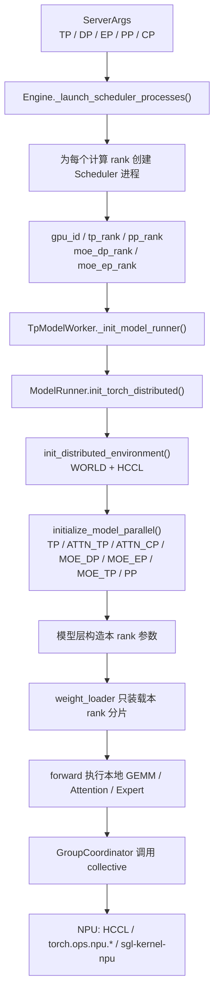
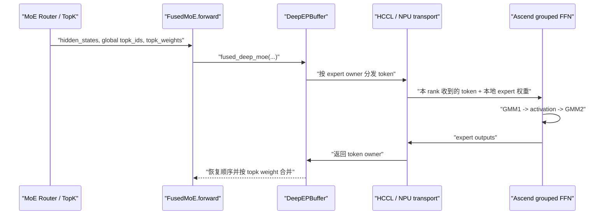
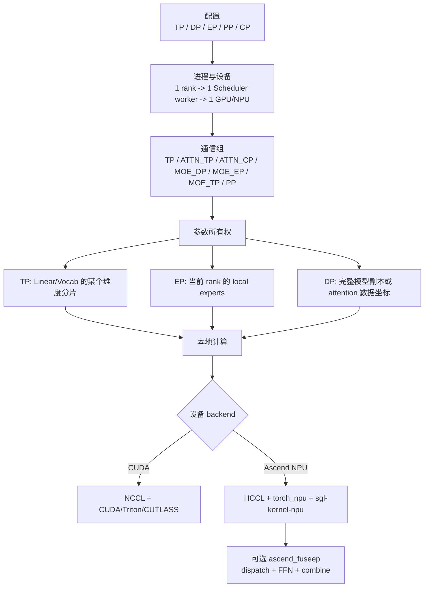

# TP、DP、EP 如何真正完成切分：从 rank 拓扑到 Ascend NPU 执行

[English](../../../en/sglang-source-reading/05-layer-communication/02-tp-dp-ep-sharding-and-ascend-npu.md) | **简体中文**

这一讲回答一个容易被“并行策略”四个字掩盖的问题：

> 启动参数里的 `--tp-size`、`--dp-size`、`--ep-size`，究竟怎样变成进程、rank、NPU、权重分片和跨卡通信？

先给结论：

- **切分语义大部分是通用的。** 进程启动、rank 编号、通信组构造、Column/Row Parallel 权重切片、global expert 到 local expert 的映射，都位于通用 Python 层。
- **设备执行不是完全通用的。** CUDA、ROCm、Ascend NPU 等后端会替换 collective backend、权重布局、GEMM、Attention、MoE dispatch/combine 和图执行。
- **Ascend 并没有重新定义 TP/DP/EP。** 它复用相同的 rank 拓扑和层接口，再把通信落到 HCCL，把部分 Linear/MoE 计算落到 `torch.ops.npu.*`、`torch_npu` 或 `sgl-kernel-npu`。
- **`ascend_fuseep` 是明显的 NPU 专用分支。** 它要求 `ep_size == tp_size`，并融合 MoE 的 dispatch、expert FFN 和 combine。

本讲按当前仓库源码做静态走读。当前工作区没有 Ascend NPU、CANN 和 HCCL 运行环境，因此可以验证调用关系、rank 公式、参数形状和 Markdown，但不把这些检查表述为真实多机 NPU 性能或运行验证。

## 1. 先区分四种“切分”

| 切分对象 | SGLang 中的主要含义 | 是否复制模型 | 典型通信 |
|---|---|---:|---|
| 普通 DP | 把请求发给不同完整模型副本 | 是 | 副本间推理热路径通常不通信 |
| DP Attention | 在一个模型并行 world 内，把 attention 的 token/batch 工作分给多个 attention-DP rank | 不是简单的完整副本 | gather/scatter、all-reduce、idle rank 同步 |
| TP | 把 Linear、QKV、词表以及 expert 内部矩阵按维度切开 | 否 | all-reduce / all-gather / reduce-scatter |
| EP | 把不同 routed experts 分给不同 rank | Router 通常复制，expert 权重分片 | 本地部分结果 all-reduce，或 token all-to-all dispatch/combine |

这里最重要的警告是：

> SGLang 的 `dp_size` 有“普通 DP”和“DP Attention”两种运行形态。看到 `dp_size=2`，不能立刻推断进程组结构，必须继续看 `enable_dp_attention`。

## 2. 参数关系：不要把 `tp_size` 只理解成矩阵切分度

源码入口是 `python/sglang/srt/server_args.py` 的 `ServerArgs`、`ServerArgs._handle_context_parallelism()`、`ServerArgs._handle_data_parallelism()` 和 `ServerArgs._handle_a2a_moe()`。

常用参数：

```text
--tensor-parallel-size / --tp-size
--data-parallel-size / --dp-size
--expert-parallel-size / --ep-size / --ep
--moe-data-parallel-size / --moe-dp-size
--attention-context-parallel-size / --attn-cp-size
--enable-dp-attention
--moe-a2a-backend
--moe-dense-tp-size
```

在 `initialize_model_parallel()` 使用的一个 TP world 内，Attention 和 MoE 会再次把 `tp_size` 分解成多个维度：

```text
attn_dp_size = dp_size if enable_dp_attention else 1
attn_tp_size = tp_size / attn_dp_size / attn_cp_size

moe_tp_size = tp_size / moe_dp_size / ep_size
```

因此，启用 DP Attention 或 MoE 多维并行后，`tp_size` 更接近：

> 当前模型并行 world 包含多少 device ranks。

而真正用于某一层矩阵的切分度，可能是 `attn_tp_size`、`moe_tp_size` 或 `moe_dense_tp_size`。

`ServerArgs` 会提前检查这些关系：

```python
# python/sglang/srt/server_args.py
# ServerArgs._handle_context_parallelism()

assert self.tp_size % self.attn_cp_size == 0
assert self.tp_size % (self.dp_size * self.attn_cp_size) == 0

assert self.tp_size % self.moe_dp_size == 0
assert self.ep_size * self.moe_dp_size <= self.tp_size
```

这不是格式检查，而是在保证后续 rank 网格可以整除。

## 3. 全局调用链：参数怎样到达每一张 NPU



可以把它拆成三层：

1. **拓扑层**：进程、global rank、local rank、device id、process group。
2. **参数层**：当前 rank 应保存哪一段 Linear 权重、哪几个 experts。
3. **执行层**：本地算子用什么 kernel，跨 rank 用什么 collective。

前两层主要通用，第三层最容易出现厂商差异。

## 4. 第一步：Engine 把 rank 映射到进程和设备

源码定位：

- `python/sglang/srt/entrypoints/engine.py`
  - `Engine._launch_scheduler_processes()`
  - `_calculate_rank_ranges()`
  - `_compute_parallelism_ranks()`
- `python/sglang/srt/managers/data_parallel_controller.py`
  - `DataParallelController.launch_dp_schedulers()`
  - `DataParallelController.launch_dp_attention_schedulers()`
  - `DataParallelController.launch_tensor_parallel_group()`

### 4.1 一个计算 rank 通常对应一个 Scheduler 进程

`Engine._launch_scheduler_processes()` 遍历 PP rank 和 TP rank：

```python
for pp_rank in pp_rank_range:
    for tp_rank in tp_rank_range:
        gpu_id = (
            server_args.base_gpu_id
            + ((pp_rank % pp_size_per_node) * tp_size_per_node)
            + (tp_rank % tp_size_per_node) * server_args.gpu_id_step
        )
        attn_cp_rank, moe_dp_rank, moe_ep_rank = _compute_parallelism_ranks(
            server_args, tp_rank
        )
        proc = mp.Process(
            target=run_scheduler_process_func,
            args=(
                server_args,
                port_args,
                gpu_id,
                tp_rank,
                attn_cp_rank,
                moe_dp_rank,
                moe_ep_rank,
                pp_rank,
                None,
                writer,
            ),
        )
```

这段代码完成的是**进程切分**，还没有切任何权重。

单机、`base_gpu_id=0`、`gpu_id_step=1` 时，通常有：

```text
tp_rank 0 -> Scheduler process 0 -> npu:0
tp_rank 1 -> Scheduler process 1 -> npu:1
...
```

多机时，`tp_rank` 可以是跨节点的全局模型 rank，而 `gpu_id` 是当前节点上的本地设备编号。不同节点都可能有 `gpu_id=0`，但它们的 global rank 不同。

### 4.2 global rank、local rank、group rank 不是同一个概念

| 名称 | 作用 | 例子 |
|---|---|---|
| global rank | WORLD 内唯一编号 | 6 |
| local rank / `gpu_id` | 当前节点绑定哪张设备 | `npu:2` |
| TP rank | 当前 TP world 中的位置 | 6 |
| rank in group | 当前进程在某个子 group 中的位置 | 在 `[4,5,6,7]` 中为 2 |
| DP/EP rank | 对 rank 网格按对应维度解码后的坐标 | `attn_dp_rank=1`、`moe_ep_rank=2` |

源码里同一个整数有时恰好相等，但含义不能混用。

### 4.3 普通 DP 会创建多个独立 TP 副本

当 `dp_size > 1` 且没有启用 DP Attention 时，`DataParallelController.launch_dp_schedulers()` 为每个 DP rank 启动一个完整 TP/PP worker group：

```python
base_gpu_id = 0
for dp_rank in range(server_args.dp_size):
    thread = threading.Thread(
        target=self.launch_tensor_parallel_group_thread,
        args=(server_args, tmp_port_args, base_gpu_id, dp_rank, ready_event),
    )
    base_gpu_id += (
        server_args.tp_size * server_args.pp_size * server_args.gpu_id_step
    )
```

例如 `dp_size=2, tp_size=4`：

```text
DP replica 0: NPU 0..3，内部 TP rank 0..3
DP replica 1: NPU 4..7，内部 TP rank 0..3
```

两个副本都保存一份完整模型，只是每份模型内部仍按 TP=4 切分。请求由 `DataParallelController` 的 round-robin、shortest-queue 或用户指定的 `routed_dp_rank` 分发。

### 4.4 DP Attention 只创建一个联合 world

`launch_dp_attention_schedulers()` 不会为每个 DP rank 重复启动一套 TP group，而是只调用一次：

```python
self.launch_tensor_parallel_group(
    server_args, port_args, 0, None, broadcasted_ports
)
```

随后 `compute_dp_attention_world_info()` 从 `tp_rank` 解码 DP 坐标：

```python
attn_tp_size = tp_size // attn_dp_size // attn_cp_size
attn_tp_rank = tp_rank % attn_tp_size
attn_dp_rank = tp_rank // (attn_tp_size * attn_cp_size)
```

所以普通 DP 的 `dp_rank` 是“模型副本编号”，DP Attention 的 `attn_dp_rank` 是“同一模型并行 world 里的 attention 数据坐标”。

## 5. 第二步：ModelRunner 初始化 WORLD 和所有子 group

源码定位：

- `python/sglang/srt/model_executor/model_runner.py`
  - `ModelRunner.init_torch_distributed()`
- `python/sglang/srt/distributed/parallel_state.py`
  - `get_default_distributed_backend()`
  - `init_distributed_environment()`
  - `initialize_model_parallel()`
  - `GroupCoordinator`
- `python/sglang/srt/layers/dp_attention.py`
  - `initialize_dp_attention()`
  - `compute_dp_attention_world_info()`

`ModelRunner.init_torch_distributed()` 是拓扑落地的中心：

```python
torch.get_device_module(self.device).set_device(self.gpu_id)
backend = get_default_distributed_backend(self.device)

init_distributed_environment(
    backend=backend,
    world_size=self.tp_size * self.pp_size,
    rank=self.tp_size * self.pp_rank + self.tp_rank,
    local_rank=self.gpu_id,
    distributed_init_method=dist_init_method,
)

initialize_model_parallel(
    tensor_model_parallel_size=self.tp_size,
    attention_data_parallel_size=self.dp_size,
    pipeline_model_parallel_size=self.pp_size,
    expert_model_parallel_size=self.moe_ep_size,
    attention_context_model_parallel_size=self.attn_cp_size,
    moe_data_model_parallel_size=self.moe_dp_size,
)

initialize_dp_attention(
    server_args=self.server_args,
    model_config=self.model_config,
)
```

在 NPU 上：

```python
_DEVICE_TO_DISTRIBUTED_BACKEND = {
    "cuda": "nccl",
    "cpu": "gloo",
    "npu": "hccl" if not envs.SGLANG_ZBAL_LOCAL_MEM_SIZE.get() > 0 else "zbal",
}
```

因此相同的 `init_distributed_environment()` 会调用 PyTorch distributed，但 NPU 的 device process group backend 是 HCCL。

## 6. `initialize_model_parallel()` 如何构造多维 rank 网格

`python/sglang/srt/distributed/parallel_state.py` 的 `initialize_model_parallel()` 依次创建：

```text
_TP
_ATTN_CP
_ATTN_TP
_MOE_DP
_MOE_EP
_MOE_TP
_PP
```

每个变量都是一个 `GroupCoordinator`，内部保存当前进程所属 group 的：

```text
ranks
world_size
rank_in_group
device_group
cpu_group
device
```

### 6.1 TP group

TP rank 连续排列：

```python
for tp_group_idx in range(num_tensor_model_parallel_groups):
    ranks = list(
        range(
            tp_group_idx * tensor_model_parallel_size,
            (tp_group_idx + 1) * tensor_model_parallel_size,
        )
    )
```

若 `world_size=8, tp_size=4, pp_size=2`：

```text
TP groups: [0,1,2,3], [4,5,6,7]
PP groups: [0,4], [1,5], [2,6], [3,7]
```

### 6.2 Attention group

Attention rank 的布局顺序是：

```text
(attention DP, attention CP, attention TP)
```

其中 TP 是变化最快的维度：

```text
tp_rank =
    (attn_dp_rank * attn_cp_size + attn_cp_rank)
    * attn_tp_size
    + attn_tp_rank
```

### 6.3 MoE group

MoE rank 的布局顺序是：

```text
(MoE DP, EP, MoE TP)
```

其中 MoE TP 是变化最快的维度：

```text
tp_rank =
    (moe_dp_rank * ep_size + moe_ep_rank)
    * moe_tp_size
    + moe_tp_rank
```

这两个公式是理解 SGLang 多维并行最有效的工具。

## 7. 一个完整的 8-rank 示例

设：

```text
tp_size      = 8
dp_size      = 2
enable_dp_attention = True
attn_cp_size = 1
ep_size      = 4
moe_dp_size  = 2
pp_size      = 1
```

那么：

```text
attn_tp_size = 8 / 2 / 1 = 4
moe_tp_size  = 8 / 2 / 4 = 1
```

通信组如下：

```text
TP:       [0,1,2,3,4,5,6,7]

ATTN_TP:  [0,1,2,3], [4,5,6,7]
ATTN_CP:  [0], [1], [2], [3], [4], [5], [6], [7]

MOE_EP:   [0,1,2,3], [4,5,6,7]
MOE_DP:   [0,4], [1,5], [2,6], [3,7]
MOE_TP:   [0], [1], [2], [3], [4], [5], [6], [7]
```

如果模型有 16 个 routed experts，且没有冗余 expert：

| global rank | 单机设备 | attn DP | attn TP | MoE DP | EP | MoE TP | 本地 routed experts |
|---:|---|---:|---:|---:|---:|---:|---|
| 0 | `npu:0` | 0 | 0 | 0 | 0 | 0 | 0..3 |
| 1 | `npu:1` | 0 | 1 | 0 | 1 | 0 | 4..7 |
| 2 | `npu:2` | 0 | 2 | 0 | 2 | 0 | 8..11 |
| 3 | `npu:3` | 0 | 3 | 0 | 3 | 0 | 12..15 |
| 4 | `npu:4` | 1 | 0 | 1 | 0 | 0 | 0..3 |
| 5 | `npu:5` | 1 | 1 | 1 | 1 | 0 | 4..7 |
| 6 | `npu:6` | 1 | 2 | 1 | 2 | 0 | 8..11 |
| 7 | `npu:7` | 1 | 3 | 1 | 3 | 0 | 12..15 |

观察 rank 2 和 rank 6：

- 两者位于不同 MoE-DP 副本。
- 两者都是 `moe_ep_rank=2`，因此保存同一组逻辑 expert 权重。
- 两者处理不同 token 数据，形成 MoE data parallel。

这也说明 EP 和 MoE DP 可以同时存在：EP 决定“哪组 expert 在哪里”，MoE DP 决定“这组 expert 有几份数据副本”。

## 8. TP 参数切分：切分发生在 layer 构造和 weight loader

源码定位：

- `python/sglang/srt/layers/linear.py`
  - `ColumnParallelLinear.__init__()`
  - `ColumnParallelLinear.weight_loader()`
  - `ColumnParallelLinear.forward()`
  - `RowParallelLinear.__init__()`
  - `RowParallelLinear.weight_loader()`
  - `RowParallelLinear.forward()`
- `python/sglang/srt/layers/vocab_parallel_embedding.py`
  - `VocabParallelEmbedding.__init__()`
  - `VocabParallelEmbedding._get_indices()`
  - `VocabParallelEmbedding.weight_loader()`
  - `VocabParallelEmbedding.forward()`

### 8.1 Column Parallel：切输出维

对 `Y = XW`，Column Parallel 把 `W` 的输出维切开：

```text
W = [W0, W1, ..., Wp-1]
rank r 保存 Wr
rank r 计算 Yr = XWr
```

构造时先计算本地参数形状：

```python
self.output_size_per_partition = divide(self.output_size, tp_size)
```

加载 checkpoint 时再取当前 rank 的连续片段：

```python
shard_size = param_data.shape[output_dim]
start_idx = self.tp_rank * shard_size
loaded_weight = loaded_weight.narrow(
    output_dim, start_idx, shard_size
)
param_data.copy_(loaded_weight)
```

forward 只算本地输出；只有 `gather_output=True` 才 all-gather：

```python
output_parallel = self.quant_method.apply(self, input_, bias)
if self.gather_output:
    output = tensor_model_parallel_all_gather(output_parallel)
```

### 8.2 Row Parallel：切输入维

Row Parallel 把 `W` 的输入维切开：

```text
X = [X0, X1, ..., Xp-1]
W = vertical_stack(W0, W1, ..., Wp-1)
rank r 计算 partial_r = Xr Wr
Y = sum(partial_r)
```

加载时按 `input_dim` 截取：

```python
shard_size = param_data.shape[input_dim]
start_idx = self.tp_rank * shard_size
loaded_weight = loaded_weight.narrow(
    input_dim, start_idx, shard_size
)
```

forward 最后通常 all-reduce：

```python
output_parallel = self.quant_method.apply(self, input_parallel, bias=bias_)
if self.reduce_results and self.tp_size > 1 and not skip_all_reduce:
    output = tensor_model_parallel_all_reduce(output_parallel)
```

### 8.3 GLM 如何使用这些通用层

`python/sglang/srt/models/glm4_moe.py` 的 `Glm4MoeAttention.__init__()` 没有编写一套 NPU 专用 TP：

```python
attn_tp_rank = get_attention_tp_rank()
attn_tp_size = get_attention_tp_size()

self.num_heads = self.total_num_heads // attn_tp_size

self.qkv_proj = QKVParallelLinear(
    hidden_size,
    self.head_dim,
    self.total_num_heads,
    self.total_num_kv_heads,
    tp_rank=attn_tp_rank,
    tp_size=attn_tp_size,
)

self.o_proj = RowParallelLinear(
    self.total_num_heads * self.head_dim,
    hidden_size,
    tp_rank=attn_tp_rank,
    tp_size=attn_tp_size,
    reduce_results=False,
)
```

模型类负责说明 Q/K/V head 数和层结构，公共 Linear 层负责真正的参数分片。

### 8.4 checkpoint 分文件不等于 TP 切分

需要区分：

- checkpoint 本身可能有多个 safetensors 文件；
- TP rank 在内存里只保存某个参数的一段；
- `use_presharded_weights=True` 时，checkpoint 可能已经按目标 rank 预切；
- 普通加载时，一个 rank 可能先读取完整参数 tensor，再由 `weight_loader()` 用 `narrow()` 取本地部分。

所以“文件有 8 份”不等于“TP=8”，“只有一个文件”也不等于“每张卡保存完整参数”。

## 9. EP 参数切分：global expert 如何变成 local expert

源码定位：

- `python/sglang/srt/models/glm4_moe.py`
  - `Glm4MoeSparseMoeBlock.__init__()`
  - `Glm4MoeForCausalLM.load_weights()`
- `python/sglang/srt/layers/moe/fused_moe_triton/layer.py`
  - `FusedMoE.__init__()`
  - `FusedMoE._map_global_expert_id_to_local_expert_id()`
  - `FusedMoE.weight_loader()`
  - `FusedMoE.forward_impl()`
  - `create_moe_dispatcher()`
- `python/sglang/srt/layers/moe/token_dispatcher/standard.py`
  - `StandardDispatcher.dispatch()`

### 9.1 模型先创建通用 FusedMoE

`Glm4MoeSparseMoeBlock.__init__()` 创建 gate、TopK 和通用 MoE 实现：

```python
self.gate = Glm4MoeGate(config=config, ...)

self.experts = get_moe_impl_class(quant_config)(
    num_experts=config.n_routed_experts + self.num_fused_shared_experts,
    num_fused_shared_experts=self.num_fused_shared_experts,
    top_k=self.top_k + self.num_fused_shared_experts,
    hidden_size=config.hidden_size,
    intermediate_size=config.moe_intermediate_size,
    ...
)
```

Router/gate 仍能产生全局 expert id。真正的 expert 所有权由 `FusedMoE` 决定。

### 9.2 `FusedMoE.__init__()` 计算本地 expert 数

```python
self.moe_ep_size = get_moe_expert_parallel_world_size()
self.moe_ep_rank = get_moe_expert_parallel_rank()
self.moe_tp_size = get_moe_tensor_parallel_world_size()
self.moe_tp_rank = get_moe_tensor_parallel_rank()

self._num_global_routed = num_experts - num_shared_slots
self._num_local_routed = self._num_global_routed // self.moe_ep_size
self.num_local_experts = (
    self._num_local_routed + num_fused_shared_experts
)

self.intermediate_size_per_partition = (
    intermediate_size // self.moe_tp_size
)
```

这里同时做了两件不同的事：

- EP 按 expert 编号切：每个 rank 只拥有一部分 experts。
- MoE TP 按 expert 内部 intermediate 维切：同一个 expert 还可以由多个 rank 协作。

### 9.3 weight loader 丢弃不属于当前 rank 的 expert

```python
def _map_global_expert_id_to_local_expert_id(self, expert_id):
    start_idx = self.moe_ep_rank * self._num_local_routed
    end_idx = start_idx + self._num_local_routed
    if start_idx <= expert_id < end_idx:
        return expert_id - start_idx
    return -1
```

`FusedMoE.weight_loader()` 收到 checkpoint 中的 global expert id 后：

```python
expert_id = self._map_global_expert_id_to_local_expert_id(expert_id)
if expert_id == -1:
    return
```

这就是 EP 的**参数切分落点**：不属于当前 rank 的 expert 权重根本不会复制进本地参数。

对本地 expert 的 `w1/w3` 和 `w2`，loader 还会按 `moe_tp_rank` 再切 intermediate 维。因此 EP 和 expert 内 TP 是正交的两层切分。

## 10. EP 运行时有两种主要通信形态

`FusedMoE.forward_impl()` 给出了统一骨架：

```python
dispatch_output = self.dispatcher.dispatch(
    hidden_states=hidden_states,
    topk_output=topk_output,
)

combine_input = self.run_moe_core(
    dispatch_output=dispatch_output,
)

final_hidden_states = self.dispatcher.combine(
    combine_input=combine_input
)
```

### 10.1 没有 A2A backend：复制 token，计算局部 expert，再归约

`StandardDispatcher` 把 global expert id 映射为 local expert id；非本地 expert 映射为 `-1`：

```python
self.local_expert_mapping = torch.full(
    (self.num_experts,), -1, dtype=torch.int32, device=device
)
self.local_expert_mapping[start:end] = torch.arange(
    0, self.num_local_routed_experts, ...
)
```

每个 rank 只计算本地 expert 对输入 token 的贡献，随后视配置通过 all-reduce 合并部分结果。

这种路径的直觉是：

```text
token/hidden 在 EP ranks 上可见
  -> 每个 rank 只保留发给本地 experts 的项
  -> 本地 expert GEMM
  -> 对部分输出做归约
```

### 10.2 使用 A2A backend：token 去找 expert

`create_moe_dispatcher()` 会根据 `moe_a2a_backend` 选择 dispatcher：

```python
if (
    a2a_backend.is_none()
    or a2a_backend.is_megamoe()
    or a2a_backend.is_ascend_fuseep()
):
    return StandardDispatcher(...)
elif (
    a2a_backend.is_deepep()
    or a2a_backend.is_mooncake()
    or a2a_backend.is_mori()
    or a2a_backend.is_nixl()
):
    return MaybeTboDeepEPDispatcher(...)
```

这时流程变为：

```text
TopK global expert ids
  -> 统计每个目标 rank 的 token
  -> dispatch：token 跨 rank 发到 expert owner
  -> owner rank 本地 expert GEMM
  -> combine：结果发回 token owner
  -> 按 TopK weight 加权恢复原 token 顺序
```

EP 的“专家归属”是通用层概念，但 token transport backend 可以因硬件和部署方式而变化。

## 11. Ascend NPU 到底替换了哪些部分

### 11.1 设备和 collective backend：NPU + HCCL

`GroupCoordinator.__init__()` 在 NPU 上设置：

```python
self.device = torch.device(f"npu:{local_rank}")
```

创建 process group 时，`get_torch_distributed_pg_options()` 会为默认组和 MoE 相关组创建 HCCL options，并读取：

```text
DEEPEP_HCCL_BUFFSIZE
HCCL_BUFFSIZE
```

`GroupCoordinator.all_reduce()` 优先进入 `NpuCommunicator`：

```python
if self.npu_communicator is not None and not self.npu_communicator.disabled:
    return self.npu_communicator.all_reduce(input_)
```

`python/sglang/srt/distributed/device_communicators/npu_communicator.py` 的 `NpuCommunicator.all_reduce()` 最终调用：

```python
dist.all_reduce(x, group=self.group)
```

这里的 `self.group` 是 HCCL device group。上层看到的仍是 `get_tp_group().all_reduce()`，底层已经从 NCCL 变成 HCCL。

NPU 还提供量化通信：

```python
x_q, scale = npu_dynamic_quant(x, dst_type=torch.int8)
dist.all_gather_into_tensor(output_tensor, x_q, group=self.group)
dist.all_gather_into_tensor(output_scale, scale, group=self.group)
output_tensor = dequantize(...)
return output_tensor.sum(dim=0)
```

它用低精度 all-gather 加全精度求和来近似 quantized all-reduce。

### 11.2 TP 的分片规则不变，本地 Linear kernel 可以变化

`ColumnParallelLinear` 和 `RowParallelLinear` 仍负责形状和 checkpoint 分片；`quant_method.apply()` 决定本地 GEMM。

例如 `python/sglang/srt/hardware_backend/npu/quantization/linear_method_npu.py` 的 `NPUW8A8Int8DynamicLinearMethod.apply()`：

```python
quant_out, dynamic_scale = torch.ops.npu.npu_dynamic_quant(x)
return torch.ops.npu.npu_quant_matmul(
    quant_out,
    layer.weight,
    layer.weight_scale,
    pertoken_scale=dynamic_scale.flatten(),
    bias=bias,
    output_dtype=original_dtype,
)
```

因此：

```text
“W 沿哪一维切、rank r 取哪一段” -> 通用 Linear 层
“本地这一段 W 怎样高效相乘”      -> NPU quant method / torch_npu
“各 rank 的 partial 怎样合并”    -> GroupCoordinator -> HCCL
```

### 11.3 通用算子通过 `MultiPlatformOp` 分发到 NPU

`python/sglang/srt/layers/utils/multi_platform.py` 的 `MultiPlatformOp.dispatch_forward()`：

```python
if _is_cuda:
    return self.forward_cuda
elif _is_hip:
    return self.forward_hip
elif _is_npu:
    return self.forward_npu
```

所以同一个 `FusedMoE` 和 quantization method 可以保留统一接口，同时为 NPU 实现 `forward_npu()`。

## 12. NPU MoE 的三条执行路径

### 12.1 NPU 本地标准路径

无 A2A backend 时，`UnquantizedFusedMoEMethod.forward_npu()` 使用：

```text
torch.ops.npu.npu_moe_init_routing_v2
torch.ops.npu.npu_grouped_matmul       # gate/up
torch.ops.npu.npu_swiglu
torch.ops.npu.npu_grouped_matmul       # down
torch.ops.npu.npu_moe_finalize_routing
```

流程：


这里是**本地 expert 计算**；跨 rank 结果如何同步仍由外层 EP/TP 通信决定。

### 12.2 通用 DeepEP dispatcher + NPU expert compute

当 `moe_a2a_backend=deepep` 时：

1. 通用 `MaybeTboDeepEPDispatcher.dispatch()` 把 token 发到目标 EP rank。
2. NPU 的 `_forward_npu_deepep()` 或 `maybe_apply_deepep_npu()` 读取 dispatch 后的 token 和 `group_list`。
3. `npu_fused_moe_without_routing_weights_bf16()` 或量化对应实现执行本地 grouped matmul。
4. 通用 dispatcher `combine()` 把结果发回原 token owner。

这条路径说明“通信 backend”和“expert compute backend”可以组合，而不是必须写在同一个类里。

### 12.3 Ascend FuseEP：融合 dispatch + FFN + combine

`ServerArgs._handle_a2a_moe()` 对 `ascend_fuseep` 做专门处理：

```python
if self.moe_a2a_backend == "ascend_fuseep":
    self.ep_size = self.tp_size
    fuse_mode = envs.SGLANG_NPU_FUSED_MOE_MODE.get()
    if fuse_mode not in [1, 2]:
        raise ValueError(...)
```

因此当前实现中：

```text
ascend_fuseep group == TP group
ep_size == tp_size
```

`FusedMoE.forward()` 会绕过普通 dispatcher：

```python
if self._use_ascend_fuseep:
    from sglang.srt.hardware_backend.npu.moe.fuseep import forward_fuseep
    return forward_fuseep(self, hidden_states, topk_output)
```

`forward_fuseep()` 调用：

```python
hidden_states, _ = buf.fused_deep_moe(
    hidden_states,
    topk_idx=topk_output.topk_ids,
    topk_weights=topk_output.topk_weights,
    gmm1_permuted_weight=layer.w13_weight,
    gmm2_weight=layer.w2_weight,
    num_experts=layer.num_experts,
    fuse_mode=envs.SGLANG_NPU_FUSED_MOE_MODE.get(),
)
```

端到端流程：



`process_fuseep_weights()` 还会在加载后把 `w13_weight`、`w2_weight` 和 scale 转成 fused op 需要的 Ascend 布局。这里改变的是**本地物理布局**，不是 expert 的逻辑 owner。

## 13. 一次 GLM MoE 请求在 8 张 NPU 上怎样执行

以一个简化配置为例：

```text
--device npu
--tp-size 8
--ep-size 8
--moe-a2a-backend ascend_fuseep
```

启动阶段：

1. `Engine._launch_scheduler_processes()` 创建 8 个 Scheduler/worker 进程。
2. 每个进程绑定一张 NPU，并拥有不同 `tp_rank`。
3. `ModelRunner.init_torch_distributed()` 建立 HCCL WORLD 和 TP/EP groups。
4. `Glm4MoeAttention` 按 attention TP 切 QKV heads 和 projection 权重。
5. `FusedMoE` 把 routed experts 按 8 个 EP ranks 分配。
6. `Glm4MoeForCausalLM.load_weights()` 把 expert checkpoint 名称交给 `FusedMoE.weight_loader()`；每个 rank 跳过不属于自己的 experts。
7. NPU quant method / `process_fuseep_weights()` 把本地权重转成 Ascend kernel 需要的布局。

forward 阶段：

1. 所有相关 ranks 处理同一个调度 batch。
2. QKV Column Parallel 在每张 NPU 上计算本地 heads。
3. Attention backend 用本 rank 的 heads 和 KV cache 执行 attention。
4. Row Parallel output projection 产生 partial output；需要时通过 HCCL 合并。
5. MoE gate 产生 global expert ids 和 TopK weights。
6. `ascend_fuseep` 把 token 发送到持有目标 expert 的 NPU。
7. owner NPU 运行本地 grouped FFN。
8. expert 输出返回 token owner，并按 TopK weights 合并。
9. 下一层继续使用相同的 rank 拓扑。

## 14. 哪些逻辑通用，哪些需要按厂商阅读

| 模块 / 行为 | 通用还是厂商相关 | Ascend NPU 落点 |
|---|---|---|
| Scheduler 进程数和 rank 参数 | 通用 | 复用 `Engine` / `DataParallelController` |
| global/local/group rank | 通用 | `gpu_id` 绑定为 `npu:{local_rank}` |
| TP/EP/DP/PP/CP group 公式 | 通用 | group 的 device backend 为 HCCL |
| Column/Row/Vocab 参数切片 | 通用 | 复用 `linear.py`、`vocab_parallel_embedding.py` |
| global expert 到 local expert | 通用 | 复用 `FusedMoE.weight_loader()` |
| collective API | 通用抽象 | `NpuCommunicator` / HCCL |
| 本地量化 Linear | 厂商相关 | `hardware_backend/npu/quantization/linear_method_npu.py` |
| 本地 MoE grouped GEMM | 厂商相关 | `UnquantizedFusedMoEMethod.forward_npu()`、NPU quant methods |
| MoE A2A transport | backend 相关 | DeepEP/HCCL 或 `ascend_fuseep` |
| FuseEP 权重布局 | NPU 专用 | `hardware_backend/npu/moe/fuseep.py::process_fuseep_weights()` |
| Attention kernel 和 graph | 厂商相关 | `hardware_backend/npu/attention/`、`graph_runner/` |

所以回答“切分逻辑是不是通用的”时，更准确的表达是：

> **逻辑拓扑和参数所有权是通用的，通信实现、张量物理布局和本地 kernel 是平台相关的。**

## 15. 常见误区

### 15.1 `tp_size=8` 就表示每个矩阵都切 8 份

不一定。启用 DP Attention、CP、EP 或 MoE DP 后，需要继续计算 `attn_tp_size` 和 `moe_tp_size`。

### 15.2 EP 只是在加载时少装几个 expert

不完整。加载时确实决定 expert owner；运行时还必须让 token 的 expert 选择与 owner 对齐，可以通过局部计算后归约，也可以通过 A2A dispatch/combine。

### 15.3 DP 一定没有通信

普通独立副本 DP 在推理热路径通常没有副本间 collective；DP Attention 则明确需要 rank 间 gather/scatter 和同步。

### 15.4 NPU 有一套完全不同的 TP 实现

当前源码不是这样。NPU 复用通用 Linear 和 rank group；它主要替换 HCCL、权重后处理和本地算子。

### 15.5 `ascend_fuseep` 只是换了一个 GEMM kernel

不是。它把 token dispatch、expert FFN 和 combine 作为融合路径处理，并要求当前实现中的 `ep_size == tp_size`。

## 16. 建议的源码走读顺序

| 顺序 | 文件 | 函数 / 代码段 | 要回答的问题 |
|---:|---|---|---|
| 1 | `python/sglang/srt/server_args.py` | `ServerArgs._handle_context_parallelism()`、`_handle_data_parallelism()`、`_handle_a2a_moe()` | 参数之间有哪些整除关系和 backend 限制？ |
| 2 | `python/sglang/srt/entrypoints/engine.py` | `Engine._launch_scheduler_processes()`、`_calculate_rank_ranges()`、`_compute_parallelism_ranks()` | 一个 rank 如何变成一个进程和 device id？ |
| 3 | `python/sglang/srt/managers/data_parallel_controller.py` | `launch_dp_schedulers()`、`launch_dp_attention_schedulers()`、`launch_tensor_parallel_group()` | 普通 DP 与 DP Attention 怎样启动不同进程拓扑？ |
| 4 | `python/sglang/srt/model_executor/model_runner.py` | `ModelRunner.init_torch_distributed()` | 哪个函数把配置交给 distributed runtime？ |
| 5 | `python/sglang/srt/distributed/parallel_state.py` | `init_distributed_environment()`、`initialize_model_parallel()` | TP/ATTN/EP/MoE-DP/PP groups 的 ranks 怎样生成？ |
| 6 | `python/sglang/srt/layers/dp_attention.py` | `compute_dp_attention_world_info()`、`initialize_dp_attention()`、`dp_gather_*()`、`dp_scatter()` | Attention-DP rank 怎样解码，token 怎样 gather/scatter？ |
| 7 | `python/sglang/srt/layers/linear.py` | `ColumnParallelLinear`、`RowParallelLinear` 的构造、loader、forward | 参数在哪一维切，结果怎样合并？ |
| 8 | `python/sglang/srt/models/glm4_moe.py` | `Glm4MoeAttention.__init__()`、`Glm4MoeSparseMoeBlock.__init__()`、`load_weights()` | 模型类怎样复用公共 TP/EP layers？ |
| 9 | `python/sglang/srt/layers/moe/fused_moe_triton/layer.py` | `FusedMoE.__init__()`、`_map_global_expert_id_to_local_expert_id()`、`forward_impl()` | expert owner、MoE-TP 和运行时 dispatcher 如何连接？ |
| 10 | `python/sglang/srt/distributed/device_communicators/npu_communicator.py` | `NpuCommunicator.all_reduce()`、`quant_all_reduce()`、`all_gather()` | 通用 collective 怎样落到 NPU？ |
| 11 | `python/sglang/srt/layers/quantization/unquant.py` | `UnquantizedFusedMoEMethod.forward_npu()`、`_forward_npu_deepep()` | NPU 本地 expert compute 如何执行？ |
| 12 | `python/sglang/srt/hardware_backend/npu/moe/fuseep.py` | `forward_fuseep()`、`process_fuseep_weights()` | Ascend 融合 EP 如何同时处理通信、计算和权重布局？ |

## 17. 最终心智模型



记住这一句话：

> SGLang 先用通用 rank 网格决定“谁保存什么、谁和谁通信”，再由设备 backend 决定“这次通信和本地计算具体调用什么实现”；Ascend NPU 改变的是执行机制，不改变 TP、DP、EP 的基本语义。

## 18. 与其他章节的衔接

- 进程启动、ZMQ 和 Scheduler rank leader：见 [06-multiprocess-distributed.md](../02-scheduler-runtime/06-multiprocess-distributed.md)。
- `DecoderLayer` 在什么位置触发 collective：见 [01-layer-communicator-and-common-layers.md](./01-layer-communicator-and-common-layers.md)。
- `ModelRunner` 如何加载模型类和 checkpoint：见 [TP Worker / ModelRunner 第 6 讲](../../tp-worker-model-runner/06-model-loading-and-architecture-resolution.md)。
- Ascend MoE kernel、DeepEP 与 HCCL 的更底层实现：见 [Ascend Kernel Infra](../../ascend-kernel-infra/README.md)。
