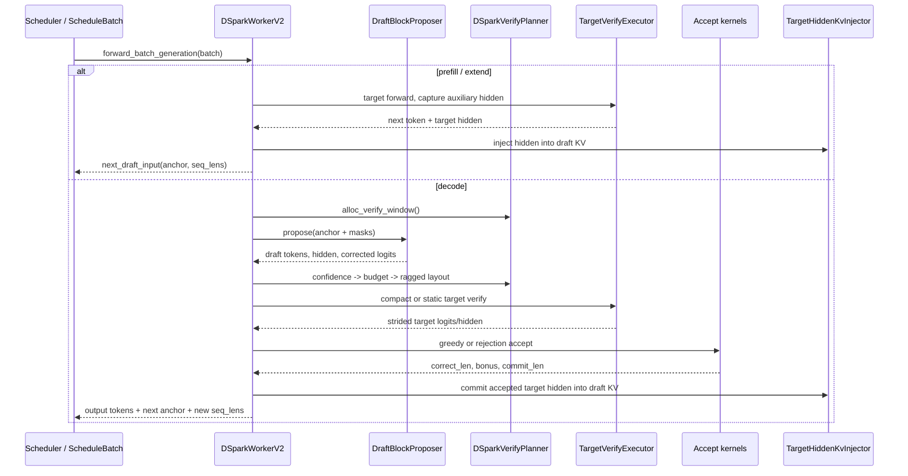
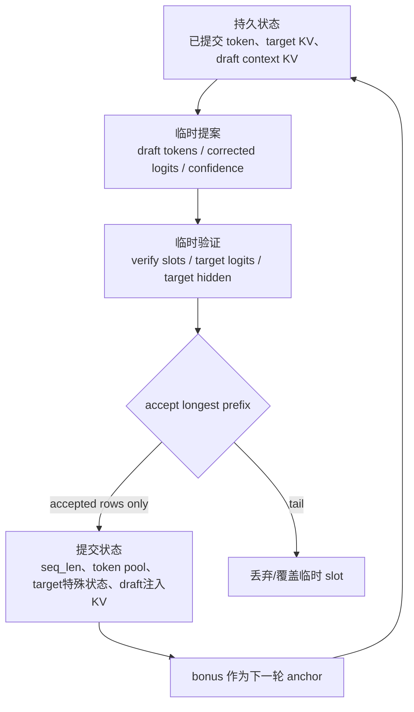
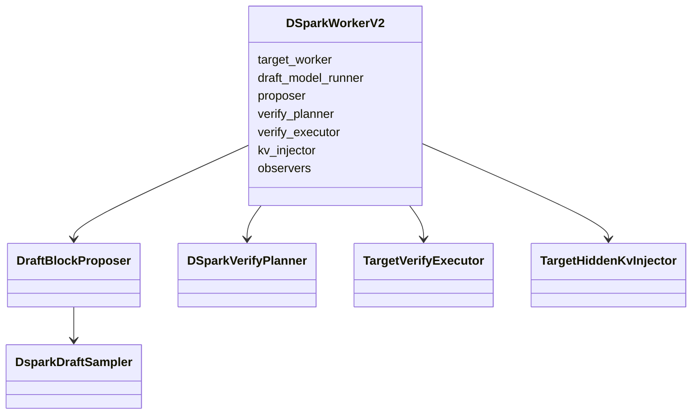
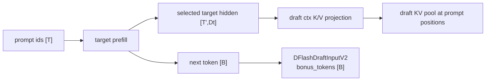
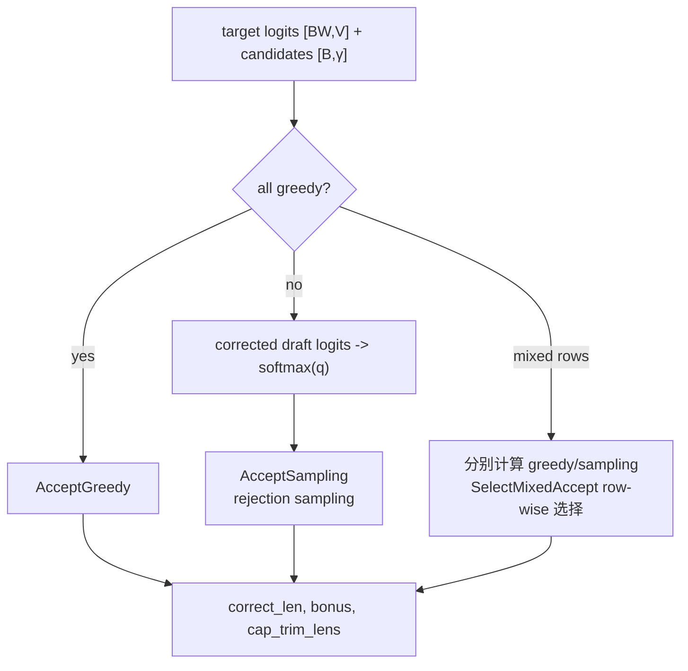
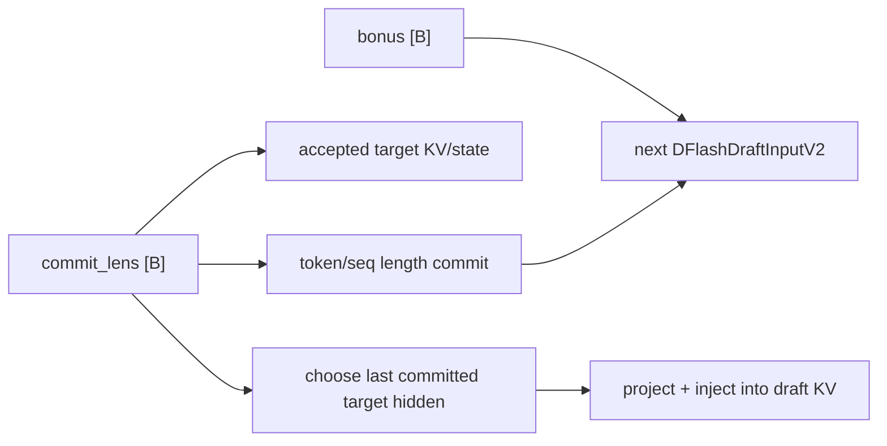

# SGLang DSpark 端到端源码走读

**简体中文** | [English](../../../en/sglang-source-reading/06-advanced-features/09-dspark-code-walkthrough.md)

本讲从启动参数开始，沿 SGLang 的真实 DSpark 执行链追踪一次 prefill 和多轮 decode，直到 accepted token、target/draft KV 与下一轮 anchor 全部就位。重点不是罗列类名，而是回答四个问题：

1. 一轮中的每个 tensor 是谁创建的、shape 如何变化；
2. confidence 如何变成每请求不同的 verify length；
3. compact target verify 如何仍复用统一的 accept/commit 接口；
4. 哪些状态只是临时候选，哪些状态真正成为下一轮的历史。

算法数学请先读 [DSpark 原理](../../ai-infra-basic/Speculative_Decoding/05-dspark-principles.md)；拒绝采样证明见 [投机采样拒绝数学](../../ai-infra-basic/Speculative_Decoding/02-rejection-sampling-math.md)。

## 0. 阅读基线、版本边界与源码地图

### 0.1 固定到可复查的上游 commit

本仓库内置的 SGLang 源码快照早于 DSpark 合入，因此本讲不伪造本地不存在的行号，而是以 2026-09-22 的 SGLang 上游 `main` 为基线：

```text
commit: 367e3700cfb6a0b03b2fa41a4524febf18ec1f15
subject: avoid host sync in DSpark prefill slot expansion (#40111)
```

文中的源码链接全部固定到该 commit。未来上游目录或接口变化时，教程仍可复现；使用新版本时应先对照 diff。

### 0.2 逻辑角色与文件

| 角色 | 核心文件 / 类 | 职责 |
|---|---|---|
| 算法接入 | `spec_info.py::SpeculativeAlgorithm` | 识别 `DSPARK`，创建 worker，声明 ragged verify 能力 |
| 参数归一化 | `arg_groups/speculative_hook.py::_handle_dspark` | 校验设备/并行组合，解析 `γ`，设置 `γ+1` verify width |
| checkpoint 配置 | `dspark_config.py` | 解析 mask id、Markov rank/head type、block size |
| 总编排 | `DSparkWorkerV2` | prefill、decode、target/draft 状态交接 |
| draft 提案 | `DraftBlockProposer` | 构造 anchor+mask block，运行 draft backbone，采样 block |
| 模型头 | `models/dspark.py` | 共享 embedding/LM head、Markov/Gated/RNN、confidence、KV 写入 |
| 预算与布局 | `DSparkVerifyPlanner` | confidence、SPS 预算、`verify_lens`、ragged layout |
| target 验证 | `TargetVerifyExecutor` | static/compact forward、scatter、accept、hidden commit |
| fused epilogue | `DsparkVerifyEpilogue` | 图内 scatter、greedy accept、可选 KV injection |
| ragged kernels | `kernels/.../dspark_verify_window.py` | 构造/映射 compact verify window |
| accept kernels | `kernels/.../dspark_accept.py` | greedy 接受、commit length 与新长度计算 |

固定源码入口：

- [`spec_info.py`](https://github.com/sgl-project/sglang/blob/367e3700cfb6a0b03b2fa41a4524febf18ec1f15/python/sglang/srt/speculative/spec_info.py)
- [`speculative_hook.py`](https://github.com/sgl-project/sglang/blob/367e3700cfb6a0b03b2fa41a4524febf18ec1f15/python/sglang/srt/arg_groups/speculative_hook.py)
- [`dspark_worker_v2.py`](https://github.com/sgl-project/sglang/blob/367e3700cfb6a0b03b2fa41a4524febf18ec1f15/python/sglang/srt/speculative/dspark_components/dspark_worker_v2.py)
- [`dspark_draft.py`](https://github.com/sgl-project/sglang/blob/367e3700cfb6a0b03b2fa41a4524febf18ec1f15/python/sglang/srt/speculative/dspark_components/dspark_draft.py)
- [`dspark_planner.py`](https://github.com/sgl-project/sglang/blob/367e3700cfb6a0b03b2fa41a4524febf18ec1f15/python/sglang/srt/speculative/dspark_components/dspark_planner.py)
- [`dspark_verify.py`](https://github.com/sgl-project/sglang/blob/367e3700cfb6a0b03b2fa41a4524febf18ec1f15/python/sglang/srt/speculative/dspark_components/dspark_verify.py)
- [`models/dspark.py`](https://github.com/sgl-project/sglang/blob/367e3700cfb6a0b03b2fa41a4524febf18ec1f15/python/sglang/srt/models/dspark.py)

## 1. 先看整条调用链



从状态角度看，一轮不是简单的 `draft -> target`：



## 2. 启动与参数归一化

实际参数名会随版本演进。基线版本的概念启动方式如下，checkpoint 路径与模型卡应以你使用的 DSpark 模型为准：

```bash
python -m sglang.launch_server \
  --model-path /path/to/target \
  --speculative-algorithm DSPARK \
  --speculative-draft-model-path /path/to/dspark-draft \
  --speculative-dspark-block-size 7
```

`_handle_dspark()` 做的不是普通参数透传，而是建立后续所有 memory/shape 计算依赖的不变量：

```text
speculative_num_steps = 1
speculative_eagle_topk = 1
gamma = checkpoint block_size 或 --speculative-dspark-block-size
speculative_num_draft_tokens = gamma + 1
```

其中 `topk=1` 表示线性链而不是 EAGLE 候选树；`num_steps=1` 是复用 generic speculative accounting 字段，并不表示 DSpark 只提一个 token。

`resolve_runtime_config()` 再执行 checkpoint 级校验：

```python
gamma = dspark_gamma_from_num_draft_tokens(speculative_num_draft_tokens)
return DSparkRuntimeConfig(
    gamma=gamma,
    verify_num_draft_tokens=gamma + 1,
    mask_token_id=mask_token_id,
)
```

还会要求：

- `markov_rank > 0`；
- `mask_token_id` 存在且小于 target vocabulary size；
- 显式 `γ` 与 checkpoint block size 不一致时给出警告或错误；
- 不受支持的 PP/DP-attention/CP 组合在模型加载前失败。

为什么要尽早失败？若 worker 已按错误的 `W` 分配 KV slot、CUDA graph buffer 和 `[B,W]` accept buffer，之后再纠正 `γ` 已经太晚。

## 3. Worker 初始化：对象图而不是一个模型

`SpeculativeAlgorithm.DSPARK.create_worker()` 最终构造 `DSparkWorkerV2`。它组合了 target worker 与五类 DSpark 组件：



### 3.1 Draft 模型共享 target 模块

`DSparkDraftMixin.attach_shared_modules()` 把 target embedding 与 target LM head 接到 draft：

```python
def attach_shared_modules(self, *, embed_tokens, lm_head):
    if not self.is_nemotron_35_draft:
        self.embed_tokens = embed_tokens
    self.lm_head = lm_head
```

因此 checkpoint loader 会跳过重复 embedding/LM-head 权重。`compute_base_logits()` 的核心是：

```python
local_logits = project_through_lm_head(hidden, self.lm_head)
base_logits = gather_and_crop_vocab(local_logits, self.lm_head)
```

TP 下 `lm_head` 的词表维可能分片：

```text
hidden                 [Bγ,D]
local lm-head weight   [V_tp,D]
local_logits           [Bγ,V_tp]
all-gather + crop      [Bγ,V]
reshape                [B,γ,V]
```

Markov head 与 exact sampling 都需要完整 vocabulary distribution，所以 gather/crop 的位置不能随意删除。

### 3.2 初始化阶段的三类内存

| 内存 | 生命周期 | 典型内容 |
|---|---|---|
| target 持久 cache | 跨轮 | target attention KV、请求 token mapping、KDA/Mamba state |
| draft 持久 cache | 跨轮 | 注入的 target context K/V、draft attention cache |
| per-step workspace | 一轮 | `[B,W]` verify slot、draft block、confidence、compact mapping、accept buffers |

CUDA/NPU graph 还需要按 capture tier 预分配稳定地址。后文的 folded proposal/epilogue 正是为了把 sampling、scatter 与 commit 融进这些稳定图中。

## 4. Prefill 路径：先为 draft 建立 context

`forward_batch_generation()` 首先区分 extend/prefill 与 decode。prefill 走 `_forward_prefill()`：

1. target 正常处理 prompt，并要求 `CaptureHiddenMode.FULL`；
2. 得到 target `next_token_ids` 和选定层的 auxiliary hidden；
3. 把 target hidden 投影并写进 draft 每一层的 context KV；
4. 将 target 的 next token 作为第一轮 draft anchor。



### 4.1 为什么必须在 prefill 返回前注入

源码注释明确指出：scheduler 可能在 prefill 返回后更新 radix cache，使 `batch.out_cache_loc` 失效。因此顺序必须是：

```text
target forward -> 用仍有效的 out_cache_loc 注入 -> 返回 scheduler
```

而不能异步拖到下一轮 decode。

### 4.2 Prefill shape

设本批实际 extend token 总数为 `T=Σ extend_len_r`，被 capture 的 target feature 宽度为 `D_t`：

| Tensor | Shape | 说明 |
|---|---:|---|
| `batch.out_cache_loc` | `[T]` | target prompt token 的 cache slot |
| captured hidden | `[T',D_t]` | `T'` 可因选层/裁剪策略与 `T` 对齐后再索引 |
| absolute positions | `[T']` | 根据 prefix/extend length 构造 |
| projected draft context K/V | 模型相关 | 每层写入 draft KV pool |
| `next_token_ids` | `[B]` | 下一轮 anchor/bonus |
| `new_seq_lens` | `[B]` | prefill 后的正式 target 长度 |

`TargetHiddenKvInjector` 对普通 attention、MLA 与 unified KV/SWA 有不同写入分支。unified KV 额外携带 request state slot 与 final position，只保留滑窗中最终有效的写入，避免多个旧 prompt token 竞争同一 ring slot。

## 5. Decode 总控：`DSparkWorkerV2._forward_decode()`

下面是源码流程的压缩版，保留真实对象边界：

```python
verify_window = alloc_verify_window(...)
proposal = self._proposer.propose(...)
confidence = proposal.confidence
if confidence is None:
    confidence = planner.compute_confidence_tensor(...)
budget = planner.resolve_verify_token_budget(...)
layout = planner.schedule_layout(..., confidence=confidence, budget=budget)

verify_ids_2d = torch.cat(
    [draft_block_ids[:, :1], draft_tokens], dim=1
)

if planner.should_run_compact(layout=layout):
    target_verify, hidden = executor.run_compact(...)
else:
    target_verify = executor.run_non_compact(...)

accept = executor.accept_and_finalize(...)
executor.commit_hidden(..., commit_lens=accept.commit_lens)
next_draft_input = make_next_draft_input(
    bonus_tokens=accept.bonus,
    new_seq_lens=accept.new_seq_lens,
)
```

### 5.1 一轮 shape ledger

| 时刻 | Tensor | Shape |
|---|---|---:|
| 进入 decode | `prefix_lens` | `[B]` |
| 临时 slot | `positions_2d`、`verify_cache_loc_2d` | `[B,W]` |
| draft 输入 | `draft_block_ids` | 常见为 `[B,γ]` |
| draft hidden | `draft_hidden` | `[B,γ,D]` |
| draft candidates | `draft_tokens` | `[B,γ]` |
| confidence | `confidence` | `[B,γ]` 或 `None` |
| 每请求验证长度 | `verify_lens` | `[B]` |
| target 逻辑输入 | `verify_ids_2d` | `[B,W]`，`W=γ+1` |
| target compact 输入 | compact ids | `[T_v]` |
| 统一 accept logits | strided logits | `[B·W,V]` |
| 提交长度 | `commit_lens` | `[B]` |
| 下一轮 anchor | `bonus` | `[B]` |

## 6. 分配 verify window：候选 slot 还不是正式历史

`alloc_verify_window()` 为每个请求预留最多 `W` 个逻辑位置：

```text
positions_2d[r]        = [S_r, S_r+1, ..., S_r+W-1]
verify_cache_loc_2d[r] = 对应的临时 KV slot
```

返回的 `VerifyWindow` 包含：

```python
class VerifyWindow(msgspec.Struct, frozen=True):
    positions_2d: torch.Tensor
    verify_cache_loc: torch.Tensor
    verify_cache_loc_2d: torch.Tensor
```

这些 slot 允许 draft/target forward 写候选状态，但只有 `commit_lens[r]` 覆盖的前缀会成为正式序列。把“已写 cache”误认为“已接受 token”是阅读 speculative code 最常见的错误。

## 7. Draft 提案：anchor + mask 一次通过 backbone

`DraftBlockProposer._run_forward()` 复用持久 `[capacity,query_token_num]` buffer：

```python
draft_block_ids[:, 0].copy_(draft_input.bonus_tokens.view(-1))
# 其余列保持 mask_token_id
```

然后 flatten 并构造 `ForwardBatch`：

```python
ForwardBatch(
    forward_mode=ForwardMode.TARGET_VERIFY,
    input_ids=draft_block_ids.flatten(),
    positions=draft_positions,
    out_cache_loc=draft_cache_loc,
    spec_algorithm=SpeculativeAlgorithm.DSPARK,
    ...
)
```

这里使用 `TARGET_VERIFY` mode 是为了复用多 token attention/graph 路径，并不表示现在运行的是 target model。

### 7.1 两种 hidden 布局

常见 `sample_from_anchor=True`：

```text
draft input rows    [B,γ]
raw hidden          [Bγ,D]
reshape             [B,γ,D]
```

另一种 checkpoint 会返回 `γ+1` query rows。`select_draft_hidden_without_anchor()` 明确验证：

```python
hidden_by_query = hidden_states.view(B, gamma + 1, ...)
selected = hidden_by_query[:, 1:]
```

得到的采样 hidden 仍统一为 `[B,γ,D]`。教程或 profile 中看到 `B(γ+1)` 的 draft hidden 时，应先检查 `sample_from_anchor`，不要马上判定 off-by-one。

### 7.2 Base logits 与 semi-AR sampling

非 folded 路径：

```text
raw hidden [Bγ,D]
 -> target LM head
 -> base logits [Bγ,V]
 -> reshape [B,γ,V]
 -> Markov head serial steps
 -> draft_tokens [B,γ]
```

`VanillaMarkov` 与数学一一对应：

```python
self.markov_w1 = nn.Embedding(V, r)
self.markov_w2 = nn.Linear(r, V, bias=False)

prev_embeds = self.markov_w1(prev_tokens)   # [B,r]
bias = self.markov_w2(prev_embeds)          # [B,V]
step_logits = base_logits[:, k, :] + bias   # [B,V]
```

greedy CUDA 快路径用 `MarkovGreedyStep` 融合 bias dot、add 与 argmax，避免分别物化完整 `[B,V]` bias 与中间 logits。sampling 路径必须保留 corrected logits 或概率，因为 rejection sampling 需要 `q_k(x)`。

### 7.3 Folded proposal

若 graph runner 可用，`DsparkDraftSampler` 可作为 graph hook：

```text
draft backbone -> base LM head -> Markov sampling -> confidence
```

全部留在图内，并把结果写入预分配 buffer。`proposal.folded=True` 只表示提案已融合；若 batch 中有随机采样，target accept 仍可能必须走 eager rejection path，因为只比较 argmax 的图内 accept 不够。

## 8. Confidence：与采样 token 对齐 previous-token embedding

若 checkpoint 有 confidence head，planner 调用 `compute_confidence()`。先构造每个位置的 previous token：

```text
position 0 previous = anchor
position 1 previous = draft_token[0]
...
position γ-1 previous = draft_token[γ-2]
```

所以 previous-token ids 与 embedding 的 shape 是 `[B,γ]` 和 `[B,γ,r]`，再与 `[B,γ,D]` hidden 拼接。

`DSparkConfidenceHead.apply_sts()` 的运行时语义是：

$$
c_{r,k}=\sigma(z_{r,k}/T_k),
$$

输出 `[B,γ]` 并由 invariant 检查在 `[0,1]` 内。没有 confidence head 时：

- `static` / verify-all 仍可工作；
- 依赖 confidence 的 dynamic scheduling 会在初始化阶段拒绝，而不是静默使用随机预算。

## 9. 从 confidence 到 budget，再到 `RaggedVerifyLayout`

这一步分成两个层级，不能混为一谈：

1. `HostConfidenceBudgetPlanner` 决定本轮总共值得验证多少额外 token；
2. device scheduler 在这个总预算内决定每个请求的 `verify_lens[r]`。

### 9.1 总预算：两步滞后与 generation 防串槽

overlap schedule 下，`prepare_verify_budget()` 从 `FutureMap` 解析 CPU confidence，预算写进 `draft_input.verify_token_budget`，当前 decode 直接读取。`HostConfidenceBudgetPlanner` 保存 carry ring：

```text
confidence ring slot t-2 -> 当前预算
current confidence       -> 写入 ring，供未来轮次使用
```

同时比较 `req_generation`。若 request pool slot 已被新请求复用，旧 confidence 被视为无效，防止跨请求污染。

关闭 overlap 时，`resolve_verify_token_budget()` 可以同步把当前 confidence 拷到 CPU 计算预算；这是易理解但更可能引入 host sync 的路径。

### 9.2 每请求长度

device kernel 先计算：

```python
sort_survival = torch.cumprod(confidence.float(), dim=1)  # [B,γ]
```

再由 `ScheduleVerifyLensTopk` 在预算下产生 `[B]`：

```text
min_verify_len <= verify_lens[r] <= W
Σ(verify_lens[r] - floor) <= budget
```

`verify_lens` 含 anchor。比如 `γ=4,W=5`，`verify_lens=3` 表示计算：

```text
[anchor, draft_1, draft_2]
```

而不是 3 个 draft 加 anchor。

### 9.3 Layout 中有什么

`RaggedVerifyLayout` 把逻辑 `[B,W]` 与 compact `[T_v]` 联系起来。概念字段包括：

```text
verify_lens [B]
request offsets / cu_seqlens [B+1]
compact token/request indices [T_v]
graph tier token count
scatter/gather 映射
```

`T_v=Σ verify_lens`，但图 replay token 数可能是 `round_up_grid(T_v)`。若超过已捕获 grid，planner 会回退或选择其他布局，不能强行 replay 错误 shape。

## 10. 构造 target verify 输入

worker 直接把 anchor 与采样 token 拼成：

```python
verify_ids_2d = torch.cat(
    [draft_block_ids[:, :1], draft_tokens], dim=1
).contiguous()
```

shape 是 `[B,W]`。例如：

```text
B=2, γ=3, W=4
anchor       [[10],       [20]]          [2,1]
draft_tokens [[11,12,13], [21,22,23]]   [2,3]
verify_ids   [[10,11,12,13],
              [20,21,22,23]]            [2,4]
```

若有 grammar，`GrammarTree.from_linear_chain(verify_ids_2d)` 先建立逻辑链。grammar mask 在 target logits 返回后应用；因为 compact 结果会 scatter 回 `[B,W,V]`，同一套 mask 对 static/compact 都成立。

## 11. Compact target verify：pack、forward、scatter

`TargetVerifyExecutor.run_compact()` 的结构非常清楚：

```python
ragged_window = BuildRaggedVerifyWindow.execute(
    layout=layout,
    draft_block_ids=draft_block_ids,
    draft_tokens=draft_tokens,
    ...
)
target_verify = self._run_ragged(..., ragged_window=ragged_window)
strided_logits = ScatterCompactToStrided.execute(
    compact=target_verify.logits_output.next_token_logits,
    layout=layout,
    verify_num_draft_tokens=W,
)
```

### 11.1 Shape 变化

设 `verify_lens=[3,1,4]`：

```text
logical ids          [3,4]
valid rows           3+1+4 = 8
compact ids          [8]
target logits        [8,V]
target hidden        [8,D_t]
scatter logits       [3*4,V]
scatter hidden       [3*4,D_t]
```

未计算的逻辑尾部用 fill value 填充，但 `cutoff_verify_lens` 会阻止 acceptor 读取/提交这些行。

### 11.2 为什么又 scatter 回去

这样下游只需理解固定 stride：

```text
row = request_id * W + position_in_chain
```

greedy accept、rejection sampling、grammar、logprob、observer 和 hidden commit 可以共用接口。compact 是物理执行布局，`[B,W]` 是逻辑协议。

### 11.3 Graph epilogue

若 target verify 运行在图中，`DsparkVerifyEpilogue` 可在图内完成：

```text
compact scatter -> greedy accept -> commit length gate -> target hidden KV injection
```

worker 用 `fold_eligible` 严格限制它：全 greedy、无额外 logits adjustment、无 grammar、proposal 已 folded 等。任何条件不满足都回到 eager accept，正确性优先于融合。

## 12. Accept：greedy、sampling 与混合 batch

`accept_draft_tokens()` 按 sampling mode 分派：



### 12.1 Greedy

对每个请求，从前往后比较：

$$
x_k \stackrel{?}{=} \arg\max_v p_k(v).
$$

第一个不相等位置停止。`correct_len` 是匹配的 draft 数，`bonus` 是 target 在停止位置的 argmax；全 draft 都匹配时，最后一行 target logits 给出额外 bonus。

### 12.2 Sampling

sampling 需要 `draft_block.corrected_logits`，经请求温度得到 `q_k`。对候选执行：

$$
\alpha_k=\min(1,p_k(x_k)/q_k(x_k)).
$$

拒绝时从归一化的 `max(p_k-q_k,0)` 采 correction token。TP ranks 还要同步 draft/target sampling 结果，避免每个 rank 进入不同链路。

### 12.3 `correct_len`、`commit_lens` 与 `cap_trim_lens`

```text
correct_len     接受的 draft token 数
commit_lens     correct_len + 1 个 target bonus/correction
cap_trim_lens   完整验证本可接受、但被 scheduler cap 截掉的长度
block_accept    commit_lens + cap_trim_lens（用于观测潜在上限）
```

最终：

$$
new\_seq\_lens=prefix\_lens+commit\_lens.
$$

`compact` 中没有计算的尾部不可能贡献 commit；`cap-accept` 虽计算了完整窗口，也用 `min(commit_lens,verify_lens)` 限制正式提交。

## 13. Commit：真正困难的是状态，不是 token list

接受结果出来后至少更新五处：

1. 请求 token pool / ngram embedding manager；
2. target attention KV 中 accepted prefix 的逻辑可见范围；
3. KDA/Mamba 等非普通 attention 状态；
4. draft context KV：把 target 已验证 hidden 注入，供下一轮使用；
5. `next_draft_input`：bonus 与新序列长度。



### 13.1 Hidden commit 到 draft KV

`commit_hidden()` 从 fixed-stride 或 compact-scattered hidden 中，只选 `commit_lens` 指定的有效前缀，再调用 `TargetHiddenKvInjector`。它不能写入未接受尾部，否则下一轮 draft 会把错误候选当正式上下文。

`models/dspark.py::write_target_hidden_kv()` 对各 draft layer 把 target context feature 投影为该层所需 K/V，并尽量使用 fused/stacked 写入；不满足布局条件时回退到逐层写入。

### 13.2 KDA/Mamba 状态

普通 Transformer 的每个 token 状态可按 KV slot 独立保留；KDA/Mamba 有递推 state。worker 用：

```python
last_correct_step_indices = commit_lens.to(torch.int64) - 1
```

选择每个请求最后正式提交的 verify step，将对应 state 写回持久 cache。若错误地选择固定最后一行，就会把被拒绝尾部的递推状态带入下一轮。

### 13.3 下一轮 anchor

```python
next_draft_input = make_next_draft_input(
    bonus_tokens=accept.bonus,
    new_seq_lens=accept.new_seq_lens,
)
```

bonus 恰好是 target 认可、且位于本轮已提交末端的 token，所以它既输出给用户，也成为下一轮 draft block 的第 0 列。

## 14. 一个完整数值追踪：`B=2, γ=3`

设：

```text
prefix_lens = [100, 40]
anchor      = [10, 20]
draft       = [[11,12,13],
               [21,22,23]]
confidence  = [[0.90,0.70,0.20],
               [0.95,0.90,0.80]]
```

### 14.1 Scheduler

prefix survival：

```text
R0 [0.90, 0.63, 0.126]
R1 [0.95, 0.855, 0.684]
```

假设预算选择：

```text
verify_lens = [2,4]      # 含 anchor
```

于是 compact 输入为：

```text
R0: [10,11]
R1: [20,21,22,23]
T_v = 6，而固定窗口 B*W = 8
```

### 14.2 Target 与 accept

假设：

```text
R0: draft 11 与 target 一致，随后 target 给 bonus 99
R1: 21、22 一致，23 不一致，target correction 为 88
```

得到：

```text
correct_len = [1,2]
bonus       = [99,88]
commit_lens = [2,3]
out tokens  = [[11,99], [21,22,88]]（物理上可 flatten）
new_seq_lens= [102,43]
```

R0 的第 2、3 个候选未验证，绝不能出现在 logits、hidden commit 或 cache 可见长度里。R1 的候选 23 虽经过 target forward，但被 correction 88 替换；下一轮 anchor 是 `[99,88]`。

## 15. Static、compact、cap-accept 的真实分支

| 分支 | `layout` | target forward | accept cutoff | hidden commit |
|---|---|---|---|---|
| static | `None` | `[B·W]` | 无动态 cap | 按 `commit_lens` |
| compact | `RaggedVerifyLayout` | `[T_v]` 后 scatter | `verify_lens` | 只提交已算前缀 |
| cap-accept | 有 layout 但 full verify | `[B·W]` | `verify_lens` | 按 gated commit |

调试推荐先比较 static 与 compact 在相同 seed、greedy 请求下输出是否一致，再打开 sampling、grammar、DP attention 与 graph folding。一次同时打开所有优化，会让错误难以定位。

## 16. 并行、设备与图执行注意事项

### 16.1 TP

- base LM head logits 先在词表分片上产生，再 gather/crop；
- draft sampling、planner length 与 target sampling 在规定同步点广播/同步；
- 任一 rank 选出不同 token 或 `verify_lens` 都会导致 collective/shape 分叉。

### 16.2 DP attention

不同 DP rank 的本地 `T_v` 可不同，但共享模型计算/collective 需要统一 graph tier。planner 会收集或传播 `global_spec_verify_tier_num_tokens`，取足够大的 tier，同时保留每 rank 的有效 metadata。

### 16.3 CUDA 与 Ascend NPU

基线 `_handle_dspark` 允许 CUDA 与 NPU，但 fused kernel、graph runner 与 attention backend 的覆盖度依设备和版本而异。阅读时区分：

```text
算法语义：γ/W、Markov、confidence、layout、accept、commit
设备快路径：Triton/CUDA kernel、NPU kernel、graph capture、fused KV write
```

设备缺少某个 fused 快路径时应回退到语义等价实现，而不是改变接受规则。部署前以所用 SGLang、torch/torch_npu、CANN 与模型 checkpoint 的兼容矩阵为准。

### 16.4 Grammar 与 logits processor

grammar 或额外 logits adjustment 会改变 target 分布。源码只在这些调整为 no-op 时允许最激进的 folded accept；否则先恢复 logical strided logits，再应用 mask/adjustment，然后 accept。

## 17. 如何 profile 与诊断

建议按下面的顺序记录指标：

| 层级 | 必看指标 | 典型问题 |
|---|---|---|
| draft | backbone time、Markov time、folded 命中率 | 串行 head/词表投影过重，graph 未命中 |
| confidence | 分位置校准误差、predicted vs observed survival | STS 表不匹配 checkpoint |
| scheduler | budget、`verify_lens` 直方图、有效 `T_v` | 预算总在最小/最大值 |
| graph | requested tier、captured tier、padding ratio | ragged 后仍大量 padding |
| target | compact verify time、attention/kernel 时间 | SPS 表过期或 batch regime 改变 |
| accept | correct length、commit length、cap trim | confidence 高但接受率低 |
| state | cache loc、new seq len、next anchor | 尾部误提交、off-by-one |

### 17.1 快速 invariant

每轮都应满足：

```text
draft_tokens.shape             == [B,γ]
verify_ids_2d.shape            == [B,γ+1]
1 <= verify_lens[r]            <= γ+1
commit_lens[r]                 <= verify_lens[r]
new_seq_lens[r]                == prefix_lens[r] + commit_lens[r]
next_anchor[r]                 == bonus[r]
compact valid rows             == sum(verify_lens)
```

sampling 模式还应检查 draft corrected probability 与生成候选时的温度、top-k/top-p 等处理完全一致；若 `q` 不一致，rejection sampling 的 exactness 会被破坏。

### 17.2 常见故障定位

| 现象 | 优先检查 |
|---|---|
| `γ` 与 buffer shape 差 1 | 是否把 proposal length 与 verify width 混淆 |
| compact 输出与 static 不同 | scatter index、cutoff、未计算行 fill、commit gate |
| 新请求首轮异常 | request slot generation、滞后 confidence 污染 |
| greedy 正确、sampling 错 | corrected logits 是否保存，draft temperature/processors 是否一致 |
| 第二轮开始发散 | bonus anchor、accepted hidden KV injection、Mamba/KDA state commit |
| 图模式错、eager 正常 | folded hook 的 buffer/tier、捕获时是否包含 epilogue |
| DP rank 卡死 | global tier、有效 token count、sampling/plan 同步点 |

## 18. 按函数设置断点的阅读路线

建议第一次只用 greedy、关闭 overlap 与 graph，依次断点：

```text
_handle_dspark
  -> DSparkWorkerV2.__init__
  -> DSparkWorkerV2._forward_prefill
  -> TargetHiddenKvInjector.inject_target_hidden
  -> DSparkWorkerV2._forward_decode
  -> DraftBlockProposer._run_forward
  -> DSparkDraftMixin.compute_base_logits
  -> VanillaMarkov.sample_block
  -> DSparkVerifyPlanner.compute_confidence_tensor
  -> DSparkVerifyPlanner.schedule_layout
  -> TargetVerifyExecutor.run_compact
  -> accept_draft_tokens
  -> TargetVerifyExecutor.commit_hidden
  -> make_next_draft_input
```

每个断点只打印：dtype、device、shape、前两个 request 的长度/少量 token id，不要打印完整 `[B,γ,V]` logits。

第二轮再依次打开：

1. overlap schedule，观察 lagged confidence；
2. CUDA/NPU graph，确认 capture tier 与 folded proposal；
3. sampling，确认 corrected draft distribution；
4. grammar/logits processor；
5. TP/DP attention；
6. KDA/Mamba target。

## 19. 关键源码索引

| 问题 | 入口 |
|---|---|
| `γ+1` 在哪里确定 | [`dspark_config.py::resolve_runtime_config`](https://github.com/sgl-project/sglang/blob/367e3700cfb6a0b03b2fa41a4524febf18ec1f15/python/sglang/srt/speculative/dspark_components/dspark_config.py) |
| draft block 如何构造 | [`dspark_draft.py::DraftBlockProposer._run_forward`](https://github.com/sgl-project/sglang/blob/367e3700cfb6a0b03b2fa41a4524febf18ec1f15/python/sglang/srt/speculative/dspark_components/dspark_draft.py) |
| Markov 数学如何落地 | [`models/dspark.py::VanillaMarkov`](https://github.com/sgl-project/sglang/blob/367e3700cfb6a0b03b2fa41a4524febf18ec1f15/python/sglang/srt/models/dspark.py) |
| confidence 如何计算 | [`dspark_planner.py::compute_confidence`](https://github.com/sgl-project/sglang/blob/367e3700cfb6a0b03b2fa41a4524febf18ec1f15/python/sglang/srt/speculative/dspark_components/dspark_planner.py) |
| budget 如何滞后 | [`dspark_planner.py::HostConfidenceBudgetPlanner`](https://github.com/sgl-project/sglang/blob/367e3700cfb6a0b03b2fa41a4524febf18ec1f15/python/sglang/srt/speculative/dspark_components/dspark_planner.py) |
| ragged window 如何 pack | [`dspark_verify_window.py`](https://github.com/sgl-project/sglang/blob/367e3700cfb6a0b03b2fa41a4524febf18ec1f15/python/sglang/kernels/ops/speculative/dspark/dspark_verify_window.py) |
| compact 结果如何 scatter | [`dspark_verify.py::TargetVerifyExecutor.run_compact`](https://github.com/sgl-project/sglang/blob/367e3700cfb6a0b03b2fa41a4524febf18ec1f15/python/sglang/srt/speculative/dspark_components/dspark_verify.py) |
| greedy/rejection 如何选择 | [`dspark_verify.py::accept_draft_tokens`](https://github.com/sgl-project/sglang/blob/367e3700cfb6a0b03b2fa41a4524febf18ec1f15/python/sglang/srt/speculative/dspark_components/dspark_verify.py) |
| 整轮编排 | [`dspark_worker_v2.py::_forward_decode`](https://github.com/sgl-project/sglang/blob/367e3700cfb6a0b03b2fa41a4524febf18ec1f15/python/sglang/srt/speculative/dspark_components/dspark_worker_v2.py) |

## 20. 阅读完成检查

读完后应能不看图回答：

1. 为什么 DSpark 的 `speculative_num_draft_tokens` 等于 `γ+1`？
2. `draft_block_ids`、`draft_tokens`、`verify_ids_2d` 分别包含什么？
3. 为什么 sampling 路径必须保留 corrected draft logits，而 greedy 可以只保留 token？
4. 为什么 current confidence 不一定用于 current verify budget？
5. compact target 只算 `[T_v]` 行，为什么 acceptor 仍看到 `[B·W,V]`？
6. `correct_len` 与 `commit_lens` 为什么总差一个 token？
7. rejected tail 已经写过临时 KV，为什么不能成为下一轮状态？
8. KDA/Mamba 为什么要用 `commit_lens-1` 选择递推 state？

能回答这八题，就已经把 DSpark 从“论文中的三个模块”还原成了 SGLang 中可运行、可图捕获、可并行且保持 target 语义的完整 serving 流程。
