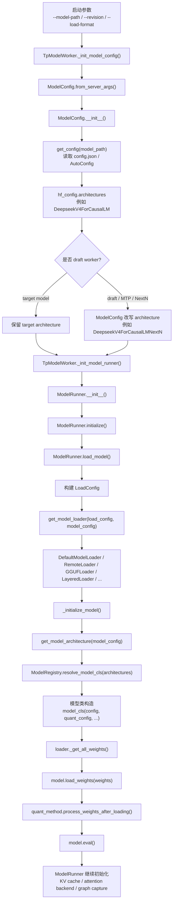

# 第 6 讲：ModelRunner 如何识别并加载不同模型

**简体中文** | [English](../../en/tp-worker-model-runner/06-model-loading-and-architecture-resolution.md)

这一讲回答一个非常实际的问题：当你启动 SGLang 并传入一个模型路径或模型名时，`ModelRunner` 到底怎么知道应该实例化 `DeepseekV4ForCausalLM`、`Glm4MoeForCausalLM`、`GlmMoeDsaForCausalLM`，还是退回到 Transformers 包装类？

先给结论：

> `ModelRunner` 并不是直接根据人类看到的模型名字符串做 `if/else`。SGLang 的稳定入口是 HuggingFace 配置里的 `architectures` 字段；`model_path` 负责定位 checkpoint，`ModelConfig` 负责读取和规范化配置，`ModelRegistry` 负责把 architecture 名字解析成 Python 模型类，`ModelLoader` 负责实例化模型并加载权重。

---

## 0. 端到端总图



这张图里要抓住三个边界：

| 边界 | 输入 | 输出 | 核心文件与函数 |
|---|---|---|---|
| 参数到配置 | `server_args.model_path`、`revision`、`json_model_override_args` | `ModelConfig`、`hf_config.architectures` | `python/sglang/srt/managers/tp_worker.py` / `TpModelWorker._init_model_config()`；`python/sglang/srt/configs/model_config.py` / `ModelConfig.from_server_args()`、`ModelConfig.__init__()` |
| 配置到模型类 | `hf_config.architectures` | Python 模型类 | `python/sglang/srt/model_loader/utils.py` / `get_model_architecture()`；`python/sglang/srt/models/registry.py` / `ModelRegistry.resolve_model_cls()` |
| 模型类到可运行模型 | 模型类、`LoadConfig`、checkpoint 权重 | `self.model` | `python/sglang/srt/model_executor/model_runner.py` / `ModelRunner.load_model()`；`python/sglang/srt/model_loader/loader.py` / `get_model_loader()`、`DefaultModelLoader.load_model()`、`_initialize_model()` |

---

## 1. “模型名”不是最终判断依据

很多时候我们会口头说“加载 DeepSeek V4”“加载 GLM-4.7-Flash”“加载 GLM 5.2”。但在 SGLang 的执行层里，模型识别不是从这些展示名开始的。

真正的关键字段通常在 checkpoint 的 `config.json`：

```json
{
  "architectures": ["DeepseekV4ForCausalLM"],
  "model_type": "...",
  "hidden_size": 7168,
  "num_hidden_layers": 61
}
```

`model_path` 的作用是让 `ModelConfig` 找到这个配置。它可能是本地路径，也可能是 HuggingFace repo id，也可能配合远端加载器使用。`ModelRunner` 拿到的是已经解析好的 `ModelConfig`，而不是自己重新读取模型目录。

源码定位：

```text
python/sglang/srt/managers/tp_worker.py
  TpModelWorker._init_model_config()
    -> ModelConfig.from_server_args(...)

python/sglang/srt/configs/model_config.py
  ModelConfig.from_server_args(...)
    -> ModelConfig(...)

  ModelConfig.__init__(...)
    -> get_config(model_path, trust_remote_code, revision, model_override_args, ...)
    -> self.hf_config
    -> self.hf_text_config
    -> self.hf_generation_config
```

这一层的心智模型是：

```text
用户传入的 model_path
  -> 找到 config.json
  -> 读出 hf_config.architectures
  -> 后续所有模型类选择都围绕 architectures 展开
```

---

## 2. TpModelWorker 先决定 target 还是 draft

`TpModelWorker` 是 `Scheduler` 和 `ModelRunner` 之间的 worker 适配层。它在初始化阶段先创建 `ModelConfig`，再创建 `ModelRunner`。

关键代码段定位：

```text
python/sglang/srt/managers/tp_worker.py
  TpModelWorker.__init__()
    -> self._init_model_config()
    -> self._init_model_runner()

  TpModelWorker._init_model_config()
    target worker:
      model_path = server_args.model_path
      revision = server_args.revision

    draft worker:
      model_path = server_args.speculative_draft_model_path
      revision = server_args.speculative_draft_model_revision

    -> ModelConfig.from_server_args(..., is_draft_model=self.is_draft_worker)

  TpModelWorker._init_model_runner()
    -> ModelRunner(model_config=self.model_config, ...)
```

为什么要区分 target / draft？

- 普通生成只需要 target model。
- Speculative Decoding 会多出 draft model。
- Multi-layer EAGLE / MTP / NextN 场景中，一个 worker 甚至可能持有多个 draft `ModelRunner`。
- draft model 的 `architectures` 可能会被 `ModelConfig` 改写成专门的 NextN/MTP 类。

因此，`TpModelWorker` 在进入 `ModelRunner` 之前，已经决定了“这个 runner 是 target 还是 draft”。

---

## 3. ModelConfig 读取并规范化 config

`ModelConfig.__init__()` 是模型身份解析的第一站。它做的事情不只是读 `config.json`，还会根据 SGLang 的运行模式补充很多派生字段。

关键代码段定位：

```text
python/sglang/srt/configs/model_config.py
  ModelConfig.__init__()
    -> self.hf_config = get_config(...)
    -> self.hf_text_config = get_hf_text_config(self.hf_config)
    -> self.hf_generation_config = get_generation_config(...)
    -> self.is_generation = is_generation_model(self.hf_config.architectures, ...)
    -> self.is_multimodal = is_multimodal_model(self.hf_config.architectures)
    -> self.is_encoder_decoder = is_encoder_decoder_model(self.hf_config.architectures)
    -> self._config_draft_model()
```

### 3.1 `json_model_override_args` 可以改写 config

如果启动参数里传了 `--json-model-override-args`，它会在 `get_config(...)` 阶段影响 `hf_config`。这意味着调试或适配新模型时，可以临时覆盖 `architectures` 等字段。

典型用途：

```text
--json-model-override-args '{"architectures": ["TorchNativeLlamaForCausalLM"]}'
```

这样后续 `ModelRegistry` 看到的就不是 checkpoint 原始 architecture，而是覆盖后的 architecture。

### 3.2 draft model 会在这里改写 architecture

Speculative Decoding 的 draft worker 会走 `ModelConfig._config_draft_model()`。这段逻辑把普通模型 architecture 改成专门的 draft/MTP/NextN architecture。

关键代码段定位：

```text
python/sglang/srt/configs/model_config.py
  ModelConfig._config_draft_model()
    DeepseekV4ForCausalLM -> DeepseekV4ForCausalLMNextN
    Glm4MoeForCausalLM -> Glm4MoeForCausalLMNextN
    Glm4MoeLiteForCausalLM -> Glm4MoeLiteForCausalLMNextN
    GlmOcrForConditionalGeneration -> GlmOcrForConditionalGenerationNextN
    MiMoForCausalLM -> MiMoMTP
    Qwen3MoeForCausalLM -> Qwen3MoeForCausalLMMTP
```

这解释了一个容易误解的现象：你传入的是同一个模型家族，但 target runner 和 draft runner 最终实例化的 Python 类可能不同。

---

## 4. ModelRegistry：从 architecture 字符串到 Python 类

`ModelRegistry` 是 SGLang 模型类发现机制的中心。它不是手写一个巨大映射表，而是在导入 `sglang.srt.models` 包时扫描各个模型模块的 `EntryClass`。

关键代码段定位：

```text
python/sglang/srt/models/registry.py
  ModelRegistry = _ModelRegistry()
  ModelRegistry.register("sglang.srt.models")

  _ModelRegistry.register(package_name)
    -> import_model_classes(package_name)

  _ModelRegistry.import_model_classes(package_name)
    -> 遍历 package 下的模型模块
    -> importlib.import_module(module_name)
    -> 如果模块中存在 EntryClass:
         self.models[EntryClass.__name__] = EntryClass

  _ModelRegistry.resolve_model_cls(architectures)
    -> _normalize_archs(architectures)
    -> 返回第一个已注册的模型类
```

模型文件的典型写法是：

```python
class DeepseekV4ForCausalLM(nn.Module):
    ...

EntryClass = [DeepseekV4ForCausalLM]
```

或者一个文件注册多个 architecture：

```python
class Glm4MoeForCausalLM(nn.Module):
    ...

class GlmMoeDsaForCausalLM(DeepseekV2ForCausalLM):
    ...

EntryClass = [Glm4MoeForCausalLM, GlmMoeDsaForCausalLM]
```

这里有两个重要细节：

- `EntryClass.__name__` 必须和 `hf_config.architectures` 中的字符串匹配，才能被 native SGLang 路径解析到。
- `EntryClass` 可以是单个类，也可以是列表，所以一个源码文件可以服务多个模型 architecture。

---

## 5. get_model_architecture：native、Transformers fallback 与外部模型

真正把 `ModelConfig` 交给 registry 的函数是 `get_model_architecture()`。

关键代码段定位：

```text
python/sglang/srt/model_loader/utils.py
  get_model_architecture(model_config)
    -> architectures = model_config.hf_config.architectures
    -> supported_archs = ModelRegistry.get_supported_archs()
    -> 判断是否有 native SGLang 实现
    -> 必要时 resolve_transformers_arch(...)
    -> ModelRegistry.resolve_model_cls(architectures)
    -> model_config._resolved_model_arch = resolved_arch
    -> model_config._resolved_model_impl = model_impl
```

这段逻辑会处理三类情况：

| 情况 | 处理方式 | 结果 |
|---|---|---|
| SGLang native 已支持 | 直接用 `ModelRegistry.resolve_model_cls()` | 返回 native 模型类，例如 `DeepseekV4ForCausalLM` |
| 用户指定 `model_impl=transformers` 或 native 不支持但 Transformers 支持 | `resolve_transformers_arch()` 后走 `TransformersForCausalLM` 等包装类 | 牺牲部分 SGLang 专用优化，换取兼容性 |
| 完全不支持 | `ModelRegistry` 抛出 unsupported architecture 错误 | 启动失败，需要添加模型实现或修正 config |

外部模型还有一个扩展口：

```text
环境变量 SGLANG_EXTERNAL_MODEL_PACKAGE
  -> ModelRegistry.register(external_package, overwrite=True)
```

这允许你在不改 SGLang 主包的情况下注册自己的模型模块。

---

## 6. ModelRunner.load_model：准备 loader 并触发权重加载

`ModelRunner.initialize()` 中会调用 `self.load_model()`。从这一刻开始，模型对象和权重真正进入当前 rank 的设备上下文。

关键代码段定位：

```text
python/sglang/srt/model_executor/model_runner.py
  ModelRunner.__init__()
    -> self.initialize(...)

  ModelRunner.initialize()
    -> self.sampler = create_sampler()
    -> self.load_model()
    -> self._prepare_moe_topk()
    -> self.configure_kv_cache_dtype()
    -> self.init_memory_pool(...)
    -> self.init_attention_backend()
    -> self.kernel_warmup()
    -> self.init_device_graphs()
    -> self.init_piecewise_cuda_graphs()

  ModelRunner.load_model()
    -> self.load_config = LoadConfig(...)
    -> monkey_patch_vllm_parallel_state()
    -> self.loader = get_model_loader(self.load_config, self.model_config)
    -> self.model = self.loader.load_model(model_config, device_config)
    -> get_offloader().post_init()
    -> 处理 kv cache scales、sliding window、dtype 等后续状态
```

这里的 `LoadConfig` 负责描述“怎么加载权重”，包括：

- `load_format`：自动、safetensors、pt、gguf、dummy、remote、remote instance、layered 等。
- `download_dir`：模型下载或缓存目录。
- `model_loader_extra_config`：loader 专用额外参数。
- `tp_rank`：当前 tensor parallel rank，用于加载当前 rank 对应的权重分片。
- `modelopt_config`：和 ModelOpt / 量化相关的配置。
- `draft_model_idx`：multi-layer draft runner 场景下标识当前 draft 模型。

所以 `ModelRunner.load_model()` 自己并不解析所有 checkpoint 格式。它先把上下文整理成 `LoadConfig`，再交给不同 loader。

---

## 7. get_model_loader：按 load_format 选择权重加载器

`get_model_loader()` 是加载格式的分派表。

关键代码段定位：

```text
python/sglang/srt/model_loader/loader.py
  get_model_loader(load_config, model_config)
    LoadFormat.DUMMY -> DummyModelLoader
    LoadFormat.SHARDED_STATE -> ShardedStateLoader
    LoadFormat.BITSANDBYTES -> BitsAndBytesModelLoader
    LoadFormat.GGUF -> GGUFModelLoader
    LoadFormat.LAYERED -> LayeredModelLoader
    LoadFormat.FLASH_RL -> QuantizedRLModelLoader
    LoadFormat.REMOTE -> RemoteModelLoader
    LoadFormat.REMOTE_INSTANCE -> RemoteInstanceModelLoader
    LoadFormat.PRIVATE -> 私有 loader
    LoadFormat.RUNAI_STREAMER -> RunaiModelStreamerLoader
    其他常规格式 -> DefaultModelLoader
```

常见的本地 HuggingFace / safetensors 路径一般会落到 `DefaultModelLoader`。远端权重服务、分层加载、GGUF、bitsandbytes 等路径会落到各自专用 loader。

加载器选择和模型类选择是两件不同的事：

```text
architecture 决定“实例化哪个 nn.Module 类”
load_format 决定“怎么找到、切分、读取、转移权重”
```

---

## 8. DefaultModelLoader：实例化模型，再调用 load_weights

`DefaultModelLoader.load_model()` 是最值得先读的 loader，因为它展示了普通路径的完整骨架。

关键代码段定位：

```text
python/sglang/srt/model_loader/loader.py
  DefaultModelLoader.load_model(model_config, device_config)
    -> quant_config = _get_quantization_config(...)
    -> with set_default_torch_dtype(model_config.dtype)
    -> with target_device:
         model = _initialize_model(model_config, load_config, quant_config)
    -> self.load_weights_and_postprocess(
         model,
         self._get_all_weights(model_config, model),
         target_device,
       )
    -> return model.eval()

  _initialize_model(model_config, load_config, quant_config)
    -> model_class, resolved_arch = get_model_architecture(model_config)
    -> kwargs = {"config": model_config.hf_config, "quant_config": quant_config}
    -> 追加 sparse head / draft_model_idx 等特殊参数
    -> return model_class(**kwargs)

  DefaultModelLoader.load_weights_and_postprocess(model, weights, target_device)
    -> model.load_weights(weights)
    -> 遍历 module:
         quant_method.process_weights_after_loading(module)
```

这段流程有一个非常重要的分层：

| 步骤 | 谁负责 | 说明 |
|---|---|---|
| 创建空模型结构 | `_initialize_model()` | 根据 `architecture -> model_cls` 创建 `nn.Module` |
| 找权重文件并迭代权重 | `DefaultModelLoader._get_all_weights()` | 处理 safetensors/bin/pt 等实际文件 |
| 把权重放到模块参数上 | `model.load_weights(weights)` | 每个模型类自己知道权重名如何映射到模块 |
| 量化后处理 | `quant_method.process_weights_after_loading()` | 某些量化方法需要加载后重排、打包或校准 |

因此，不同模型最核心的差异通常体现在两个地方：

- 模型类的 `__init__()` / `forward()` 定义了网络结构和前向逻辑。
- 模型类的 `load_weights()` 定义了 checkpoint 权重名到模块参数的映射。

---

## 9. 三个例子：DeepSeek V4、GLM-4.7-Flash、GLM 5/5.2

### 9.1 DeepSeek V4

如果 checkpoint 的 `config.json` 中是：

```json
{
  "architectures": ["DeepseekV4ForCausalLM"]
}
```

主链路会是：

```text
ModelConfig.hf_config.architectures = ["DeepseekV4ForCausalLM"]
  -> get_model_architecture()
  -> ModelRegistry.resolve_model_cls(["DeepseekV4ForCausalLM"])
  -> python/sglang/srt/models/deepseek_v4.py
       EntryClass = [DeepseekV4ForCausalLM]
  -> DefaultModelLoader._initialize_model()
       model = DeepseekV4ForCausalLM(config=hf_config, quant_config=...)
  -> model.load_weights(...)
```

DeepSeek V4 还有一些专门适配逻辑：

```text
python/sglang/srt/configs/model_config.py
  is_deepseek_v4(self.hf_config)
    -> 设置 DeepSeek V4 相关派生字段
    -> 处理 FP4 experts、hybrid SWA、MLA/KV cache 等后续初始化所需信息

  ModelConfig._config_draft_model()
    draft worker:
      DeepseekV4ForCausalLM -> DeepseekV4ForCausalLMNextN
```

也就是说，target runner 通常加载 `DeepseekV4ForCausalLM`，draft runner 在特定 speculative/MTP 场景下可能加载 `DeepseekV4ForCausalLMNextN`。

### 9.2 GLM-4.7-Flash

当前源码里，GLM-4.5 / GLM-4.6 / GLM-4.7 的 MoE 路径集中在 `glm4_moe.py` 和 `glm4_moe_nextn.py`。

关键代码段定位：

```text
python/sglang/srt/models/glm4_moe.py
  Glm4MoeForCausalLM
  GlmMoeDsaForCausalLM
  EntryClass = [Glm4MoeForCausalLM, GlmMoeDsaForCausalLM]

python/sglang/srt/models/glm4_moe_nextn.py
  Glm4MoeForCausalLMNextN
  EntryClass = [Glm4MoeForCausalLMNextN]
```

如果 GLM-4.7-Flash checkpoint 的 `architectures` 是 `Glm4MoeForCausalLM`，链路就是：

```text
config.json architectures = ["Glm4MoeForCausalLM"]
  -> ModelRegistry
  -> Glm4MoeForCausalLM
  -> Glm4MoeForCausalLM.__init__()
  -> Glm4MoeModel / Glm4MoeDecoderLayer / Glm4MoeAttention / Glm4MoeSparseMoeBlock
  -> Glm4MoeForCausalLM.load_weights(...)
```

如果它被作为 draft/MTP 模型使用，`ModelConfig._config_draft_model()` 可能把它改写为：

```text
Glm4MoeForCausalLM -> Glm4MoeForCausalLMNextN
```

这时会进入 `glm4_moe_nextn.py`。

### 9.3 GLM 5 / GLM 5.2

在当前仓库源码里，没有单独命名为 `glm5.py` 或 `Glm5ForCausalLM` 的模型文件。与 GLM 5 DSA 相关的判断更多通过 architecture 名字出现，例如 `GlmMoeDsaForCausalLM`。

关键源码信号：

```text
python/sglang/srt/server_args.py
  多处根据 hf_config.architectures[0] 判断 GlmMoeDsaForCausalLM

python/sglang/srt/configs/model_config.py
  多处根据 self.hf_config.architectures 判断 GlmMoeDsaForCausalLM

python/sglang/srt/models/glm4_moe.py
  class GlmMoeDsaForCausalLM(DeepseekV2ForCausalLM)
  EntryClass = [Glm4MoeForCausalLM, GlmMoeDsaForCausalLM]
```

所以阅读 GLM 5 / 5.2 时不要先找“GLM5 文件名”，而应该先看对应 checkpoint 的 `config.json.architectures`：

```text
如果 architectures = ["GlmMoeDsaForCausalLM"]
  -> registry 会在 glm4_moe.py 中找到 GlmMoeDsaForCausalLM

如果 architectures 是 SGLang 未注册但 Transformers 支持的类
  -> 可能走 Transformers fallback

如果 architectures 完全无法解析
  -> 启动时报 unsupported architecture
```

换句话说，GLM 5/5.2 的源码入口取决于 checkpoint 声明的 architecture，而不是市场名称。

---

## 10. 模型加载后，ModelRunner 还要继续初始化运行时

模型类和权重加载完成后，并不代表 `ModelRunner` 初始化完成。`ModelRunner.initialize()` 后半段会继续准备推理时需要的运行时结构。

关键代码段定位：

```text
python/sglang/srt/model_executor/model_runner.py
  ModelRunner.initialize()
    -> self._prepare_moe_topk()
    -> self.configure_kv_cache_dtype()
    -> self.init_memory_pool(pre_model_load_memory)
    -> self.init_attention_backend()
    -> self.kernel_warmup()
    -> self.init_device_graphs()
    -> self.init_piecewise_cuda_graphs()
```

这些步骤分别对应：

| 初始化步骤 | 作用 |
|---|---|
| `_prepare_moe_topk()` | 准备 MoE routing/top-k 相关状态 |
| `configure_kv_cache_dtype()` | 决定 KV cache 用 FP8、BF16、FP4 还是自动推导 |
| `init_memory_pool()` | 建立 request pool 和 token-to-KV pool |
| `init_attention_backend()` | 根据模型和启动参数选择 attention backend |
| `kernel_warmup()` | 预热 kernel，避免首次请求承担全部 autotune 成本 |
| `init_device_graphs()` | 捕获 decode CUDA graph / NPU graph 等设备图 |
| `init_piecewise_cuda_graphs()` | 对局部模块做更细粒度 graph capture |

所以完整流程应该理解成两段：

```text
加载模型:
  architecture -> model class -> checkpoint weights -> self.model

准备推理运行时:
  self.model -> KV cache -> attention backend -> graph -> forward/sampling
```

---

## 11. 如果要新增一个 SGLang native 模型

从上面的流程可以反推：新增模型不是改 `ModelRunner`，而是让 `ModelRegistry` 能找到新的模型类，并让 loader 能正确把权重放进去。

推荐检查清单：

| 步骤 | 要做什么 | 对应位置 |
|---|---|---|
| 1 | 新建或修改模型实现文件 | `python/sglang/srt/models/<new_model>.py` |
| 2 | 定义模型类 | `class NewModelForCausalLM(nn.Module)` |
| 3 | 暴露 `EntryClass` | `EntryClass = [NewModelForCausalLM]` |
| 4 | 确认 config architecture 名称匹配 | checkpoint `config.json` / `architectures` |
| 5 | 实现构造函数 | `__init__(self, config, quant_config, ...)` |
| 6 | 实现前向 | `forward(self, input_ids, positions, forward_batch, ...)` |
| 7 | 实现权重映射 | `load_weights(self, weights)` |
| 8 | 需要时补充 draft/MTP 改写 | `ModelConfig._config_draft_model()` |
| 9 | 需要时补充 server args 自动策略 | `python/sglang/srt/server_args.py` |

一个最小心智模型：

```text
不要把新模型入口塞进 ModelRunner。
ModelRunner 只关心“我已经拿到了一个可执行的 nn.Module”。
真正的模型差异应该留在 sglang.srt.models.<model_file> 和 ModelRegistry 中。
```

---

## 12. 本讲阅读任务

建议按这个顺序回到源码中读：

| 顺序 | 文件 | 函数/代码段 | 你要确认的问题 |
|---:|---|---|---|
| 1 | `python/sglang/srt/managers/tp_worker.py` | `TpModelWorker._init_model_config()` | target worker 和 draft worker 的 `model_path` 从哪里来？ |
| 2 | `python/sglang/srt/configs/model_config.py` | `ModelConfig.from_server_args()`、`ModelConfig.__init__()` | `hf_config` 和 `architectures` 在哪里产生？ |
| 3 | `python/sglang/srt/configs/model_config.py` | `ModelConfig._config_draft_model()` | speculative/MTP 场景如何改写 architecture？ |
| 4 | `python/sglang/srt/models/registry.py` | `ModelRegistry.register()`、`import_model_classes()`、`resolve_model_cls()` | `EntryClass` 如何变成 architecture 到类的映射？ |
| 5 | `python/sglang/srt/model_loader/utils.py` | `get_model_architecture()` | native、Transformers fallback、MindSpore 分支如何选择？ |
| 6 | `python/sglang/srt/model_executor/model_runner.py` | `ModelRunner.load_model()` | `LoadConfig` 如何创建，loader 如何被调用？ |
| 7 | `python/sglang/srt/model_loader/loader.py` | `get_model_loader()`、`DefaultModelLoader.load_model()`、`_initialize_model()` | loader 如何实例化模型并加载权重？ |
| 8 | `python/sglang/srt/models/deepseek_v4.py` | `EntryClass`、`DeepseekV4ForCausalLM.__init__()`、`load_weights()` | DeepSeek V4 的模型结构和权重映射在哪里？ |
| 9 | `python/sglang/srt/models/glm4_moe.py` | `Glm4MoeForCausalLM`、`GlmMoeDsaForCausalLM`、`EntryClass` | GLM MoE / DSA 路径如何注册？ |

---

## 13. 最终心智模型

```mermaid
flowchart LR
  A["模型展示名<br/>DeepSeek V4 / GLM-4.7 / GLM 5.2"] --> B["model_path"]
  B --> C["config.json"]
  C --> D["architectures"]
  D --> E["ModelConfig<br/>规范化和特殊改写"]
  E --> F["ModelRegistry<br/>architecture -> Python class"]
  F --> G["ModelLoader<br/>load_format -> 权重读取方式"]
  G --> H["model_cls(config, quant_config)"]
  H --> I["model.load_weights"]
  I --> J["ModelRunner.self.model"]
  J --> K["KV cache / attention backend / graph"]
  K --> L["forward_decode / forward_extend"]
```



一句话带走：

> `ModelRunner` 加载不同模型的关键不是“看模型名字”，而是“读 config 的 architecture，找 registry 里的模型类，再用 loader 把对应 checkpoint 权重装进这个类”。模型家族名只是入口线索，真正决定源码路径的是 `hf_config.architectures`。
